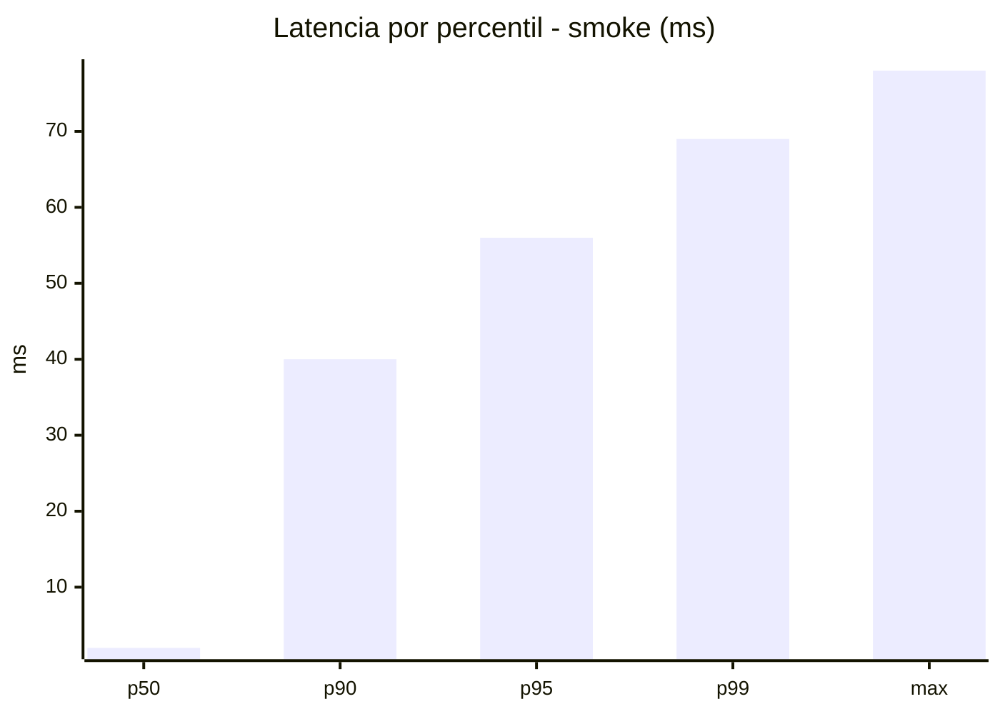
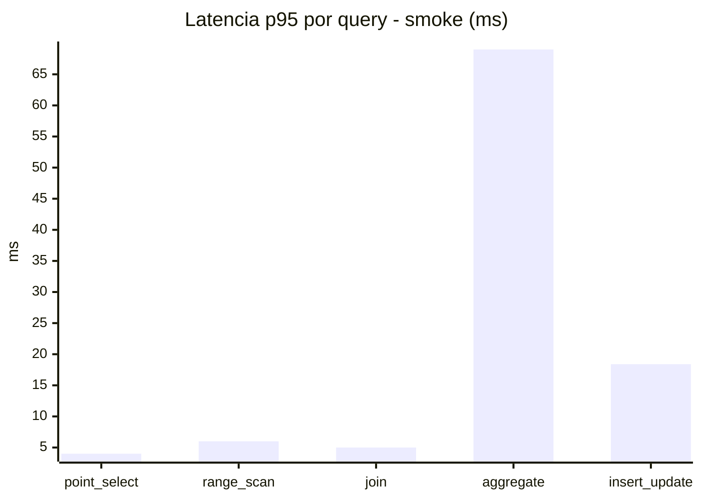
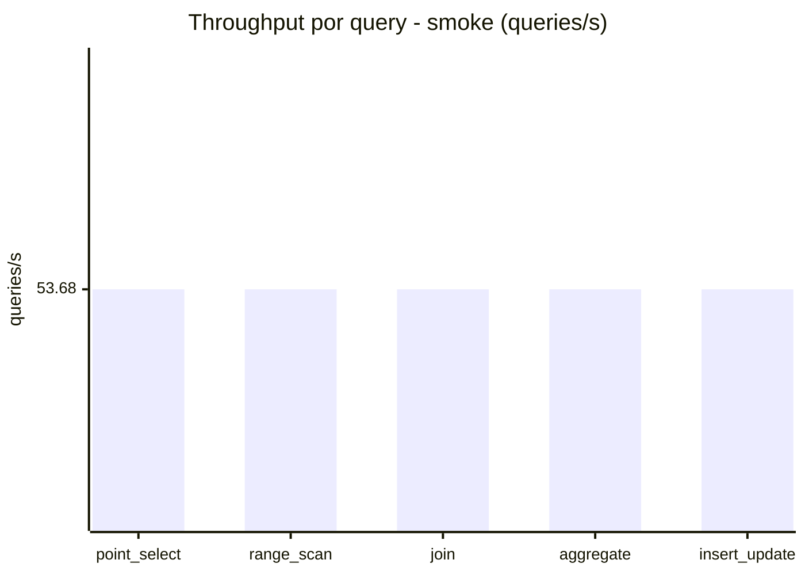
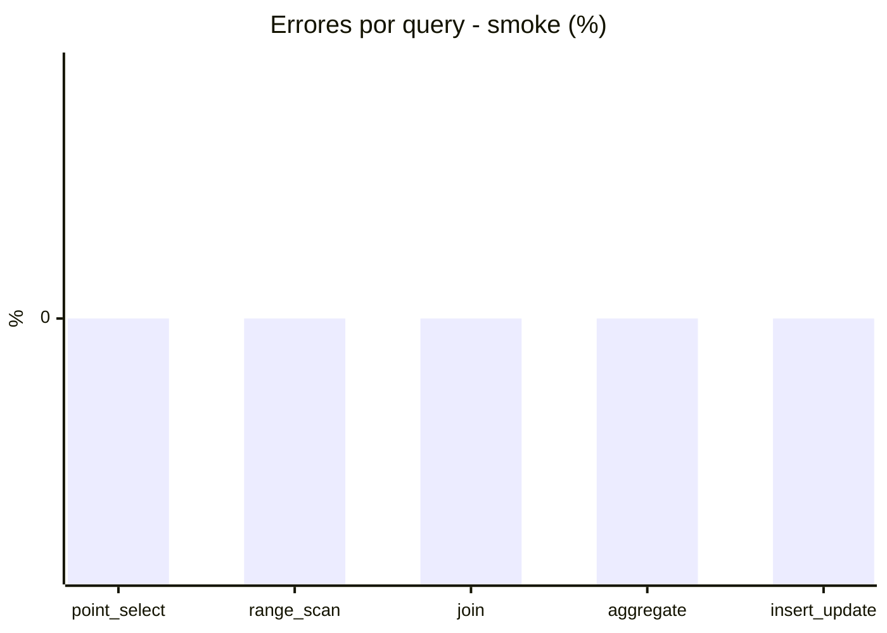

# Reporte de performance - SQL Server (k6)

**Fecha:** 2026-07-22 03:47 UTC  
**Veredicto del agente:** `FAIL`  
**Corrida:** [ver en GitHub Actions](https://github.com/lrbg/k6-sqlserver-lab/actions/runs/29889220523)  

## Validacion del agente de IA

FAIL

1. Cuello de botella: La operación de `aggregate` muestra un tiempo de respuesta promedio de 44.9 ms, con un p95 de 69 ms, acercándose al límite establecido de 200 ms. Esto indica que es la consulta más costosa y lenta.

2. Recomendación de índices: Verifica la posibilidad de crear índices adecuados sobre las columnas utilizadas en las funciones de agregación para acelerar el rendimiento de estas consultas.

3. Optimización del plan: Analiza los planes de ejecución para identificar si existen escaneos completos de tabla innecesarios o si se pueden utilizar índices existentes de manera más efectiva.

4. Contención: Revisa posibles bloqueos o contenciones en el acceso a recursos que puedan estar afectando el desempeño de las consultas, especialmente durante operaciones de `insert_update` y `aggregate`.

## Resultados

### Escenario: `smoke`

| Metrica | Valor |
| --- | --- |
| Queries ejecutadas | 8060 |
| Errores | 0 (0%) |
| Latencia media | 11.2 ms |
| p50 / p90 / p95 / p99 | 2 / 40 / 56 / 69 ms |
| Min / Max | 0 / 78 ms |
| Throughput | 268.39 queries/s |
| Duracion | 30 s |

Detalle por query

| Query | Ejecuciones | Error % | avg | p95 | p99 | q/s |
| --- | --- | --- | --- | --- | --- | --- |
| point_select | 1612 | 0% | 0.8 | 4 | 5 | 53.68 |
| range_scan | 1612 | 0% | 3 | 6 | 10 | 53.68 |
| join | 1612 | 0% | 1.6 | 5 | 5 | 53.68 |
| aggregate | 1612 | 0% | 44.9 | 69 | 74 | 53.68 |
| insert_update | 1612 | 0% | 5.3 | 18.4 | 24 | 53.68 |

