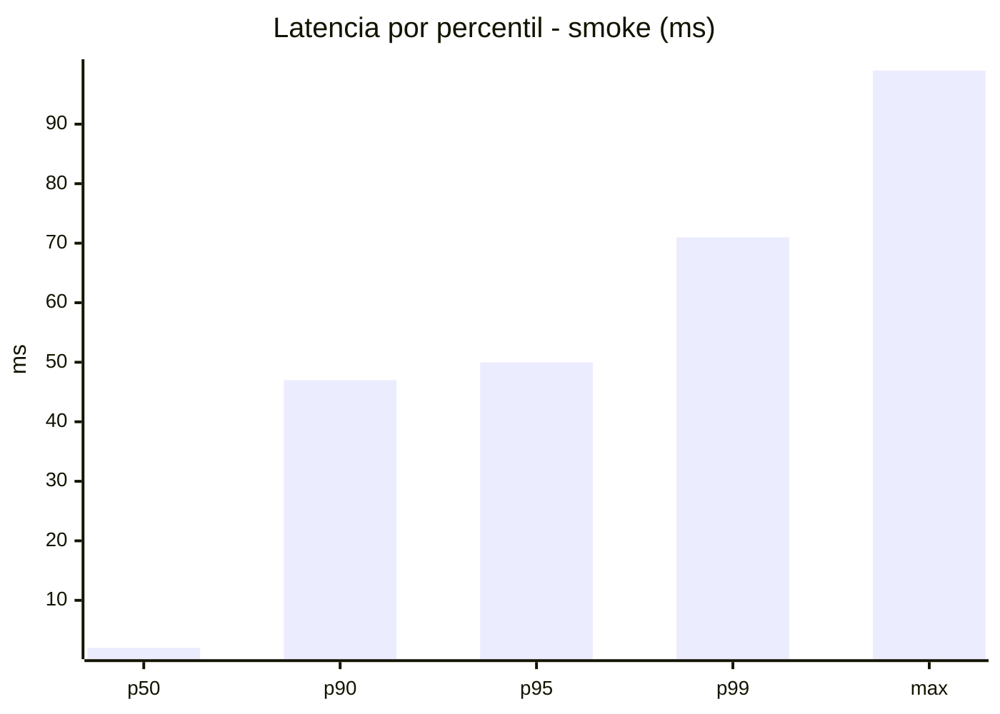
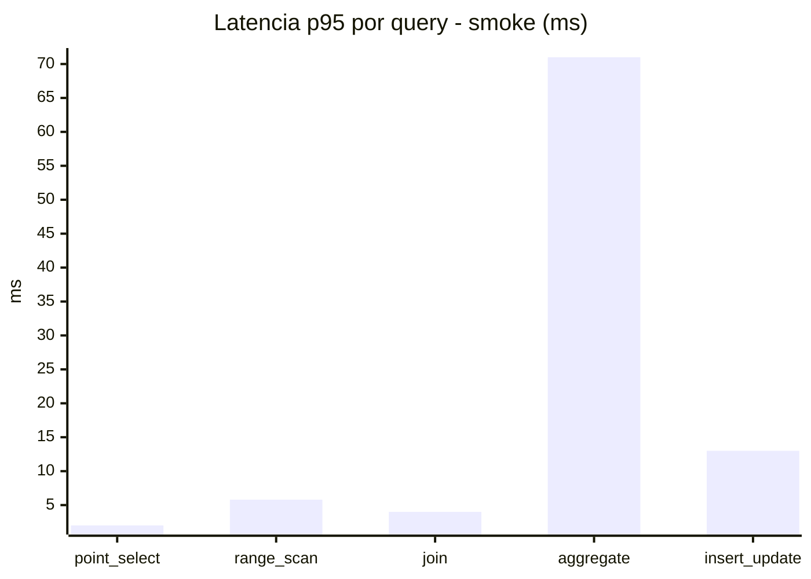
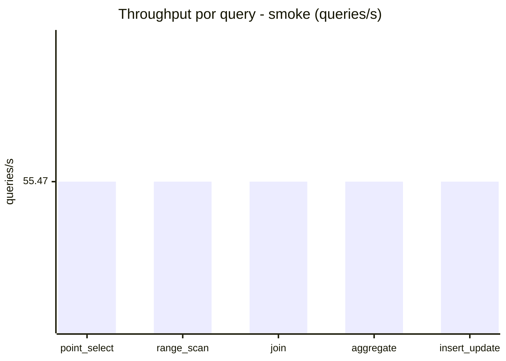
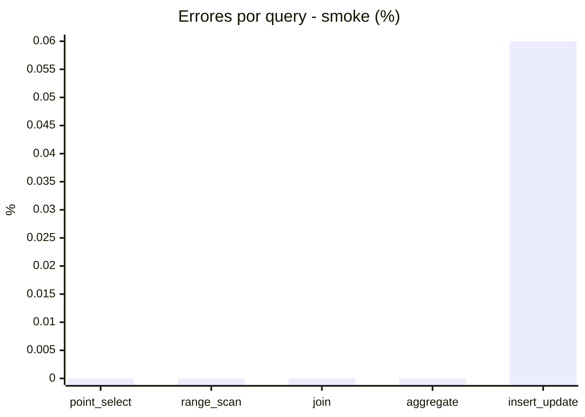

# Reporte de performance - SQL Server (k6)

**Fecha:** 2026-07-22 04:22 UTC  
**Veredicto (SLO):** `PASS`  
**Corrida:** [ver en GitHub Actions](https://github.com/lrbg/k6-sqlserver-lab/actions/runs/29890831407)  

## Analisis del agente de IA

1. **Cuello de botella identificado**: La consulta de `aggregate` es claramente el cuello de botella con un p95 de 71 ms, en comparación con otras consultas que están por debajo de 8 ms. Este tiempo es significativo considerando que el SLO establecido es de 200 ms.

2. **Recomendaciones sobre índices**: Verificar si se pueden crear índices adecuados sobre las columnas utilizadas en las operaciones de agregación. Asegurarse de que los índices cubran las columnas involucradas en los filtros y cálculos de la consulta `aggregate`, lo que puede mejorar el rendimiento.

3. **Optimizar el plan de ejecución**: Analizar el plan de ejecución de la consulta `aggregate`. Buscar posibles escaneos de tablas que puedan ser reemplazados por búsquedas indexadas. Considerar el uso de `WITH (NOLOCK)` si es apropiado para reducir bloqueos en un contexto de read-heavy.

4. **Monitorear contención/bloqueos**: Dado que hay un leve porcentaje de errores en `insert_update`, es recomendable revisar la configuración de aislamiento de las transacciones. Implementar un monitoreo más estricto en tiempo real para detectar bloqueos y contenciones, permitiendo una resolución rápida si se presentan.

## Resultados

### Escenario: `smoke`

| Metrica | Valor |
| --- | --- |
| Queries ejecutadas | 8325 |
| Errores | 1 (0.01%) |
| Latencia media | 10.8 ms |
| p50 / p90 / p95 / p99 | 2 / 47 / 50 / 71 ms |
| Min / Max | 0 / 99 ms |
| Throughput | 277.36 queries/s |
| Duracion | 30 s |

Detalle por query

| Query | Ejecuciones | Error % | avg | p95 | p99 | q/s |
| --- | --- | --- | --- | --- | --- | --- |
| point_select | 1665 | 0% | 0.7 | 2 | 4 | 55.47 |
| range_scan | 1665 | 0% | 2.9 | 5.8 | 10 | 55.47 |
| join | 1665 | 0% | 1.3 | 4 | 5 | 55.47 |
| aggregate | 1665 | 0% | 45 | 71 | 77 | 55.47 |
| insert_update | 1665 | 0.06% | 4 | 13 | 21 | 55.47 |

