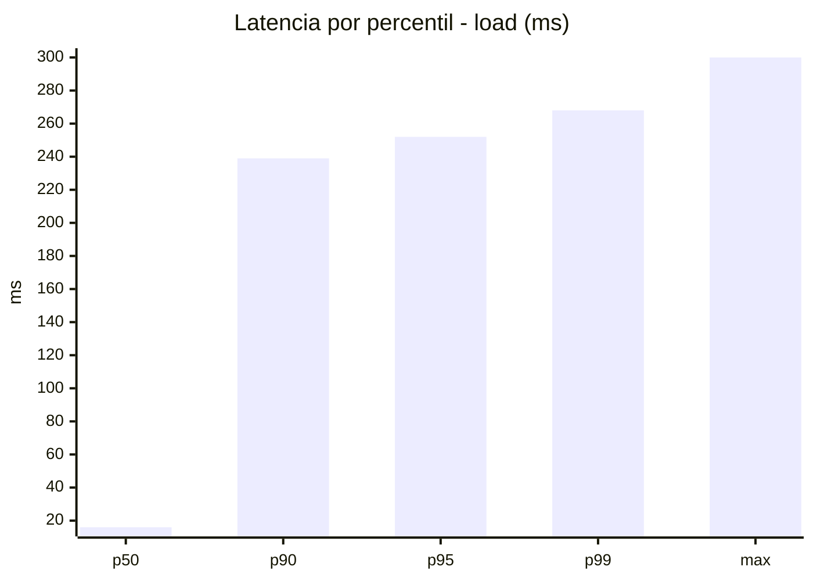
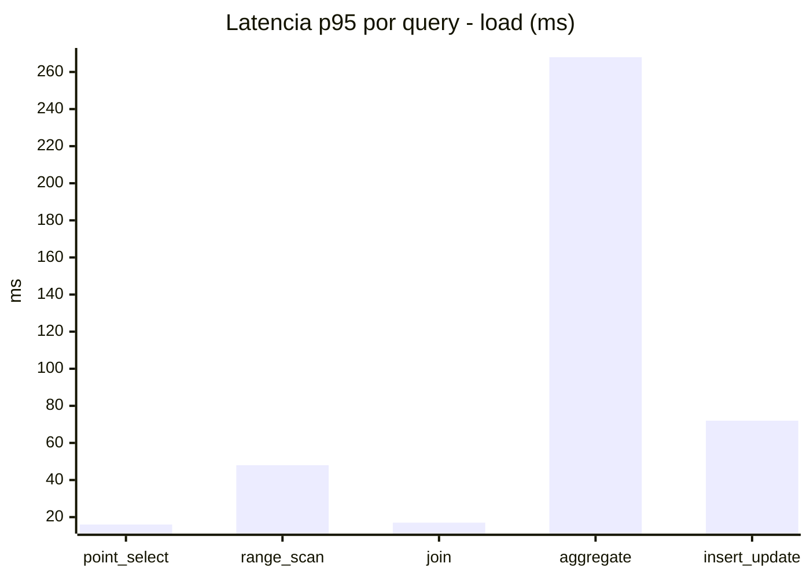
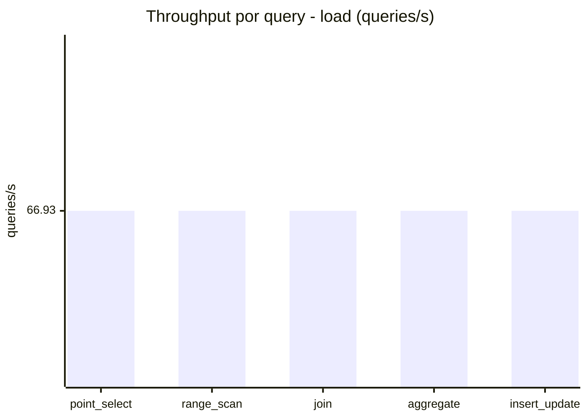
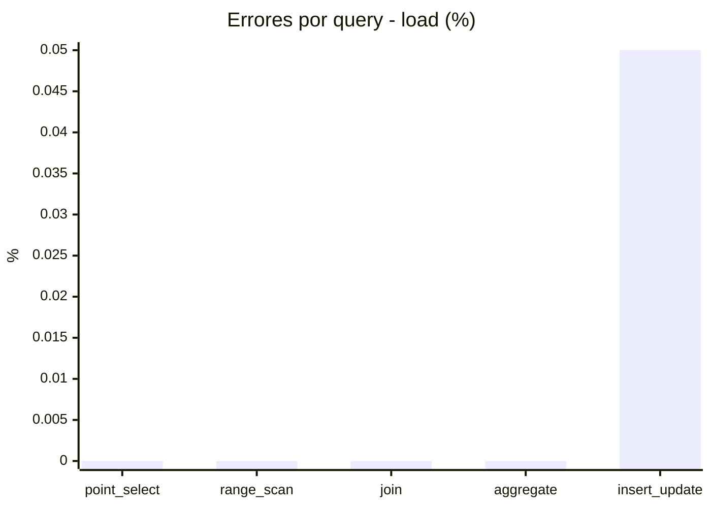
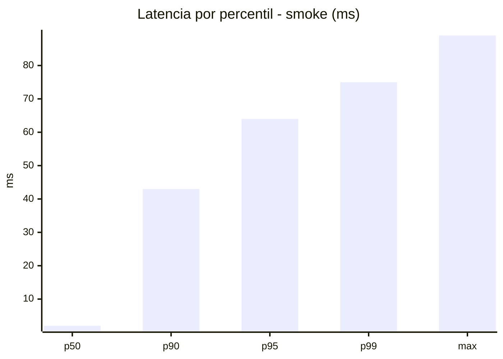
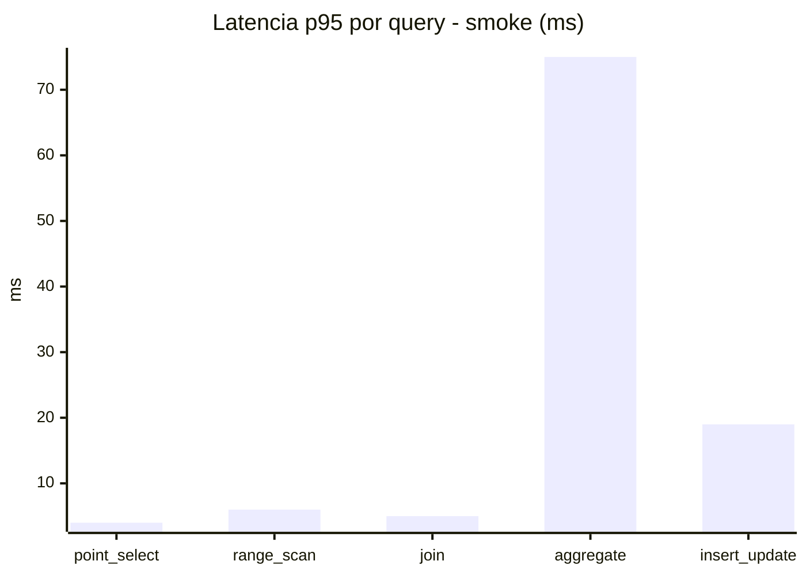
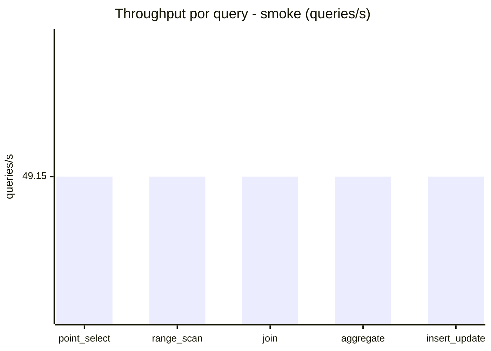
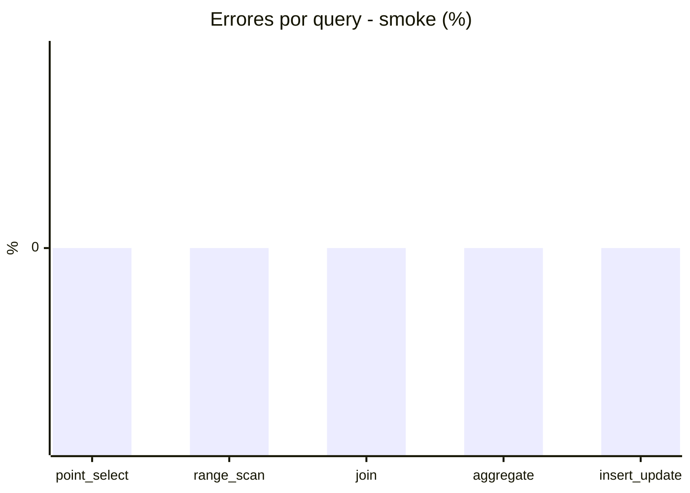

# Reporte de performance - SQL Server (k6)

**Fecha:** 2026-07-22 15:20 UTC  
**Veredicto (SLO):** `WARN`  
**Corrida:** [ver en GitHub Actions](https://github.com/lrbg/k6-sqlserver-lab/actions/runs/29932758889)  

## Analisis del agente de IA

1. **Cuello de botella**: La consulta de **aggregate** presenta el p95 más alto con 268 ms en comparación con otras consultas, lo que indica que es el principal cuello de botella en el rendimiento.

2. **Optimización de índice**: Evalúa la posibilidad de crear índices específicos para las columnas utilizadas en las agregaciones y filtros. Esto podría mejorar significativamente el tiempo de respuesta de la consulta de aggregate al facilitar la búsqueda de datos.

3. **Análisis de plan de ejecución**: Revisa el plan de ejecución de la consulta de aggregate para identificar posibles operaciones costosas, como escaneos de tabla o uniones inapropiadas. Apunta a optimizar la consulta usando un diseño más eficiente.

4. **Contención/Bloqueos**: Asegúrate de que la consulta de insert_update no esté causando bloqueos en las operaciones de aggregate y evalúa la necesidad de ajustar la forma en que se manejan las transacciones para reducir la contención en la base de datos.

## Resultados

### Escenario: `load`

| Metrica | Valor |
| --- | --- |
| Queries ejecutadas | 20120 |
| Errores | 2 (0.01%) |
| Latencia media | 59.7 ms |
| p50 / p90 / p95 / p99 | 16 / 239 / 252 / 268 ms |
| Min / Max | 0 / 300 ms |
| Throughput | 334.67 queries/s |
| Duracion | 60.1 s |

Detalle por query

| Query | Ejecuciones | Error % | avg | p95 | p99 | q/s |
| --- | --- | --- | --- | --- | --- | --- |
| point_select | 4024 | 0% | 5.2 | 16 | 17 | 66.93 |
| range_scan | 4024 | 0% | 22.1 | 48 | 67 | 66.93 |
| join | 4024 | 0% | 8.3 | 17 | 19 | 66.93 |
| aggregate | 4024 | 0% | 231.4 | 268 | 277 | 66.93 |
| insert_update | 4024 | 0.05% | 31.4 | 72 | 83 | 66.93 |

### Escenario: `smoke`

| Metrica | Valor |
| --- | --- |
| Queries ejecutadas | 7385 |
| Errores | 0 (0%) |
| Latencia media | 12.2 ms |
| p50 / p90 / p95 / p99 | 2 / 43 / 64 / 75 ms |
| Min / Max | 0 / 89 ms |
| Throughput | 245.75 queries/s |
| Duracion | 30.1 s |

Detalle por query

| Query | Ejecuciones | Error % | avg | p95 | p99 | q/s |
| --- | --- | --- | --- | --- | --- | --- |
| point_select | 1477 | 0% | 0.9 | 4 | 5 | 49.15 |
| range_scan | 1477 | 0% | 3.2 | 6 | 10 | 49.15 |
| join | 1477 | 0% | 1.7 | 5 | 5 | 49.15 |
| aggregate | 1477 | 0% | 49.7 | 75 | 80 | 49.15 |
| insert_update | 1477 | 0% | 5.3 | 19 | 25 | 49.15 |

