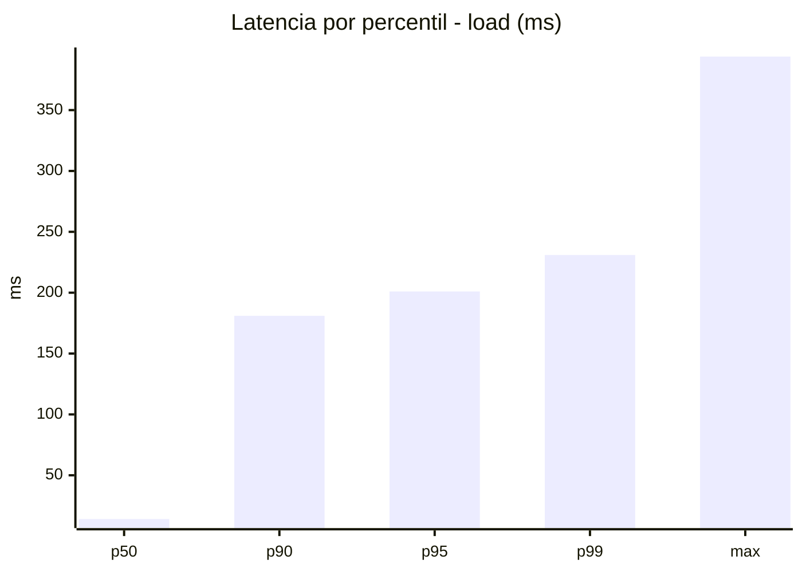
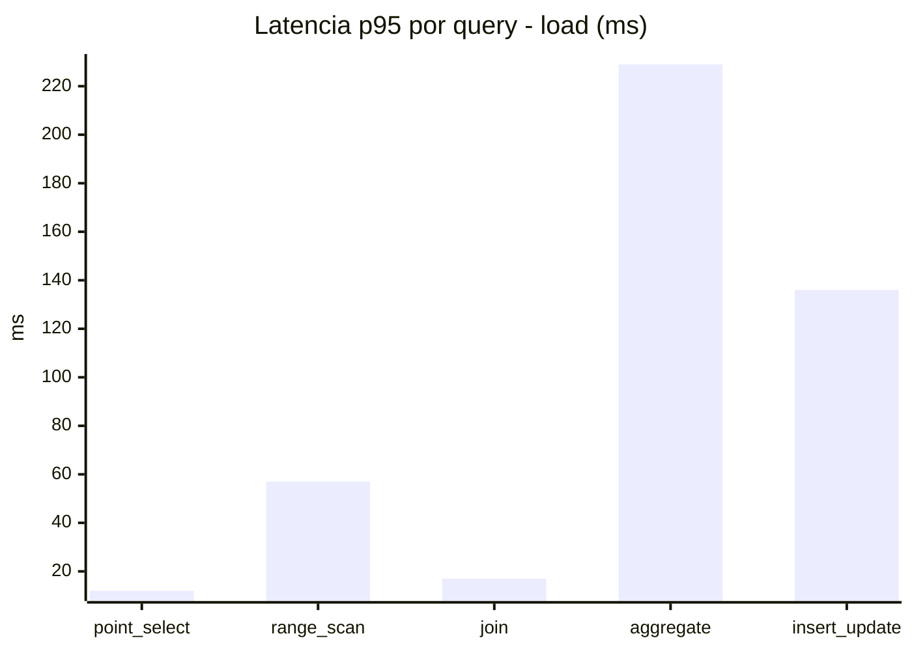
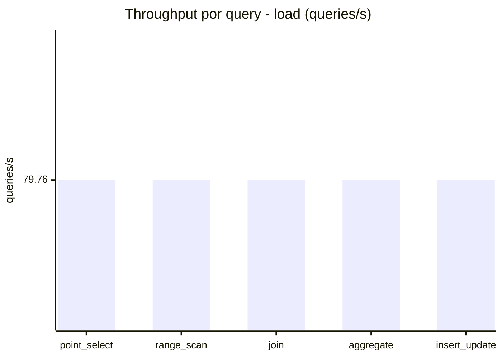
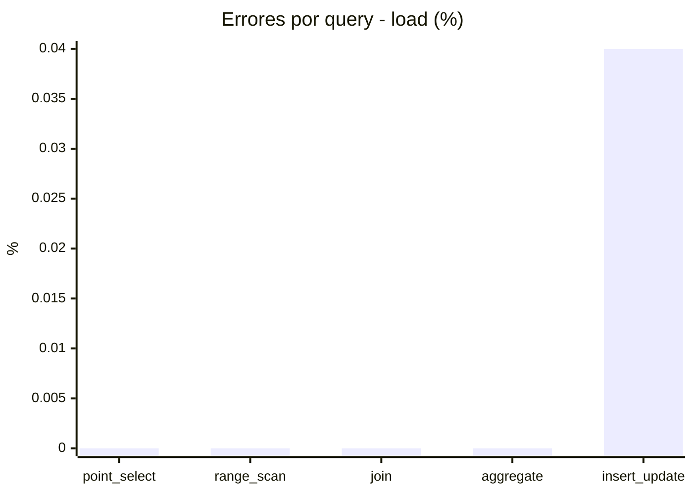
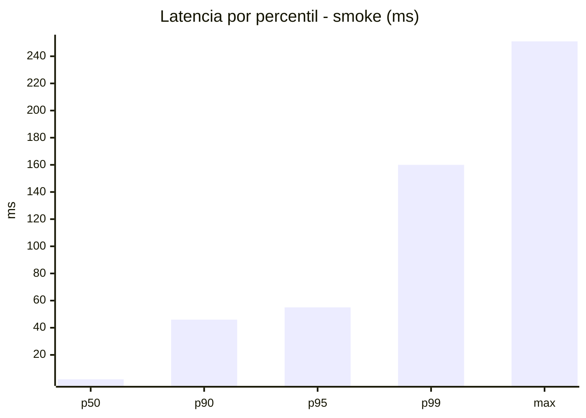
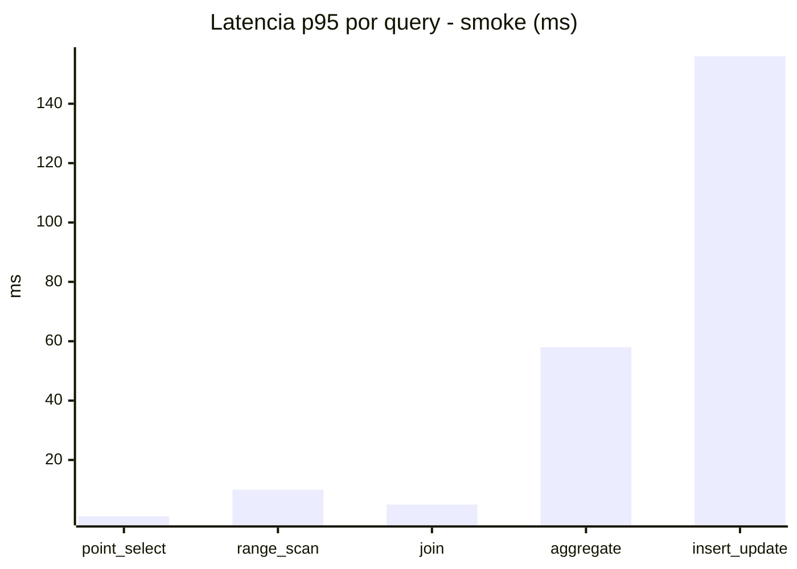
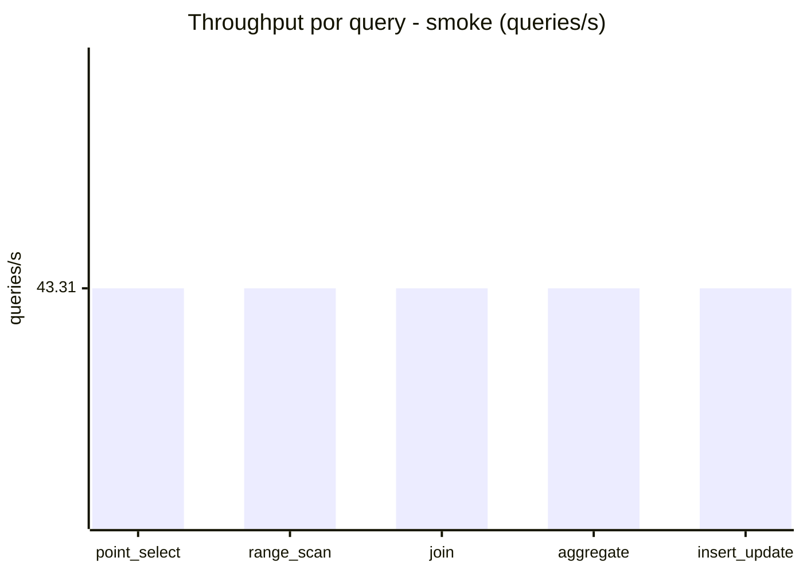
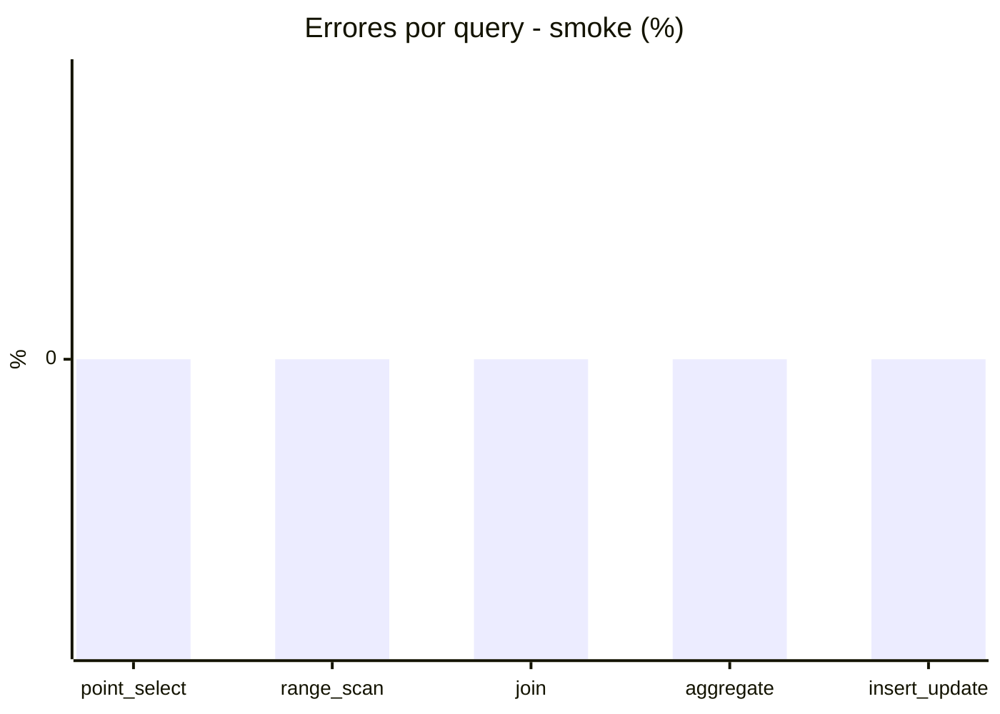

# Reporte de performance - SQL Server (k6)

**Fecha:** 2026-07-23 15:31 UTC  
**Veredicto (SLO):** `WARN`  
**Corrida:** [ver en GitHub Actions](https://github.com/lrbg/k6-sqlserver-lab/actions/runs/30020791648)  

## Analisis del agente de IA

1. **Cuello de botella identificado**: La consulta de tipo **aggregate** presenta el mayor tiempo de respuesta con un p95 de **229 ms**, que excede el umbral de 200 ms establecido por los SLOs. Comparativamente, las demás consultas tienen un p95 considerablemente inferior (ej. point_select: 12 ms, join: 17 ms).

2. **Optimización de índices**: Se recomienda revisar y crear índices adecuados para las columnas utilizadas en las cláusulas `GROUP BY` o `JOIN` dentro de las consultas de agregación. Esto puede reducir el tiempo que toma a SQL Server realizar los cálculos necesarios para las agregaciones.

3. **Análisis de planes de ejecución**: Revisar el plan de ejecución de la consulta agregada para identificar operaciones costosas, como `TABLE SCAN` o `HASH MATCH`, que podrían ser optimizadas. Ajustes en la estructura de la consulta o la adición de índices pueden mejorar su rendimiento.

4. **Verificación de contención/bloqueos**: Dada la naturaleza del workload OLTP, es esencial asegurar que no haya contenciones significativas en las tablas relacionadas con la consulta agregada. Monitorear bloqueos y utilizar la opción de **READ_COMMITTED_SNAPSHOT** podría ayudar a reducir problemas de concurrencia que impacten los tiempos de respuesta.

## Resultados

### Escenario: `load`

| Metrica | Valor |
| --- | --- |
| Queries ejecutadas | 23970 |
| Errores | 2 (0.01%) |
| Latencia media | 50.1 ms |
| p50 / p90 / p95 / p99 | 14 / 181 / 201 / 231 ms |
| Min / Max | 0 / 394 ms |
| Throughput | 398.8 queries/s |
| Duracion | 60.1 s |

Detalle por query

| Query | Ejecuciones | Error % | avg | p95 | p99 | q/s |
| --- | --- | --- | --- | --- | --- | --- |
| point_select | 4794 | 0% | 3.5 | 12 | 17 | 79.76 |
| range_scan | 4794 | 0% | 22.3 | 57 | 194.1 | 79.76 |
| join | 4794 | 0% | 6.9 | 17 | 20 | 79.76 |
| aggregate | 4794 | 0% | 170.9 | 229 | 244 | 79.76 |
| insert_update | 4794 | 0.04% | 46.7 | 136 | 220.1 | 79.76 |

### Escenario: `smoke`

| Metrica | Valor |
| --- | --- |
| Queries ejecutadas | 6510 |
| Errores | 0 (0%) |
| Latencia media | 13.8 ms |
| p50 / p90 / p95 / p99 | 2 / 46 / 55 / 160 ms |
| Min / Max | 0 / 251 ms |
| Throughput | 216.56 queries/s |
| Duracion | 30.1 s |

Detalle por query

| Query | Ejecuciones | Error % | avg | p95 | p99 | q/s |
| --- | --- | --- | --- | --- | --- | --- |
| point_select | 1302 | 0% | 0.6 | 1 | 4 | 43.31 |
| range_scan | 1302 | 0% | 4.5 | 10 | 62 | 43.31 |
| join | 1302 | 0% | 1.4 | 5 | 5 | 43.31 |
| aggregate | 1302 | 0% | 38.6 | 58 | 62 | 43.31 |
| insert_update | 1302 | 0% | 24.1 | 156 | 197 | 43.31 |

