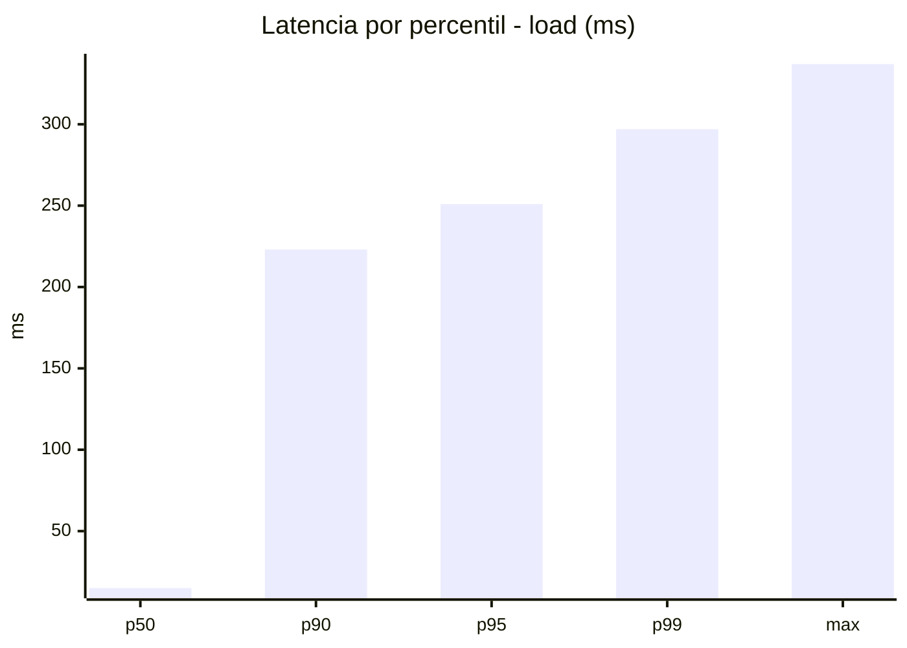
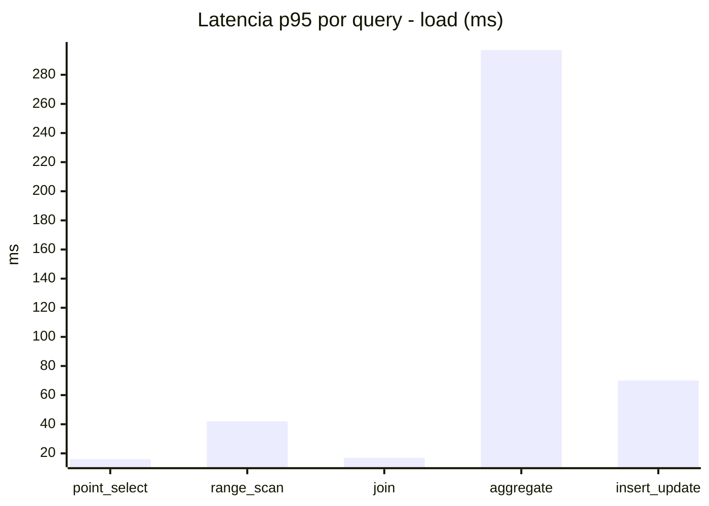
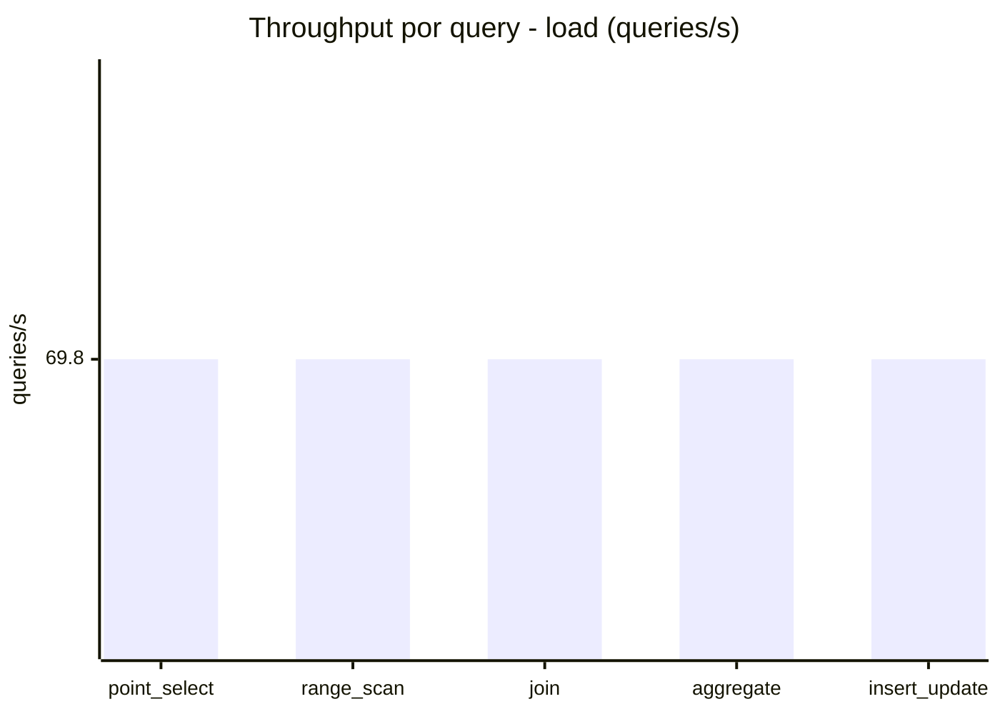
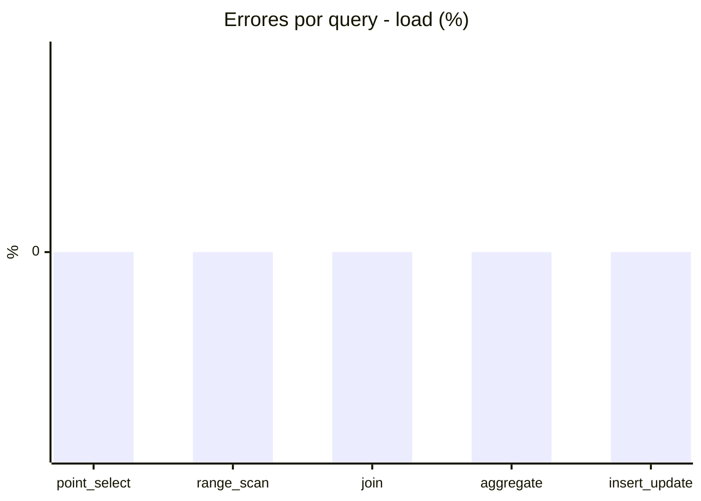
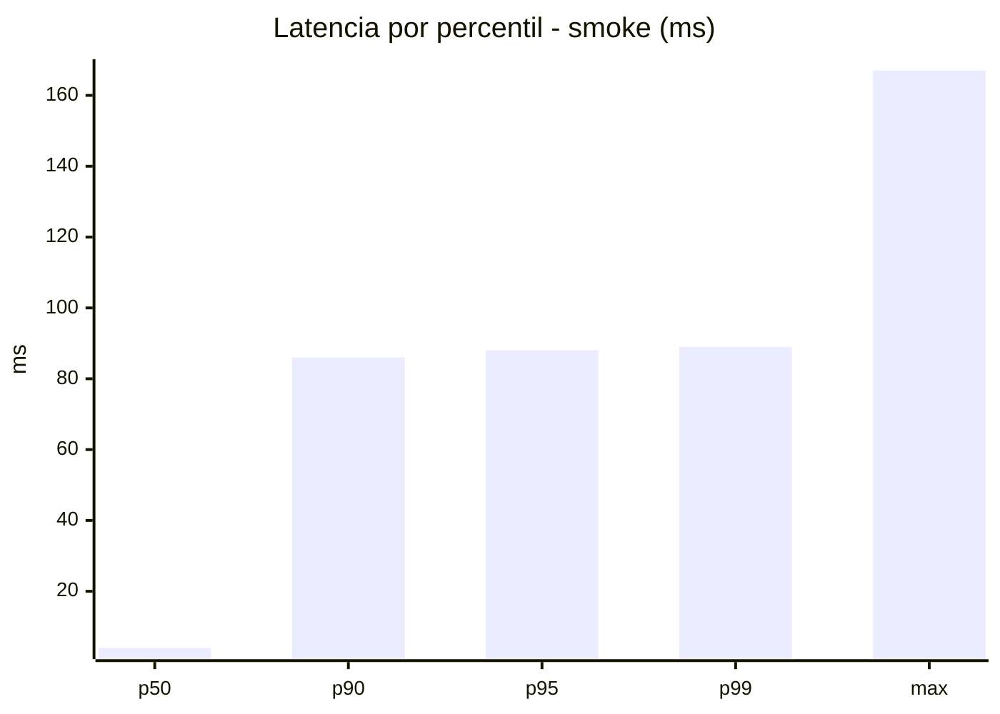
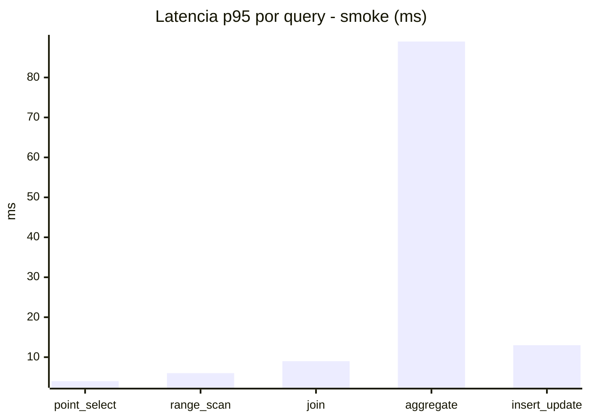
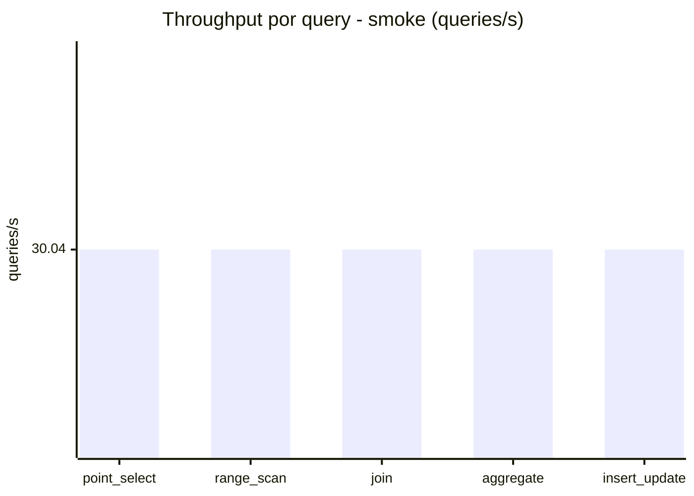
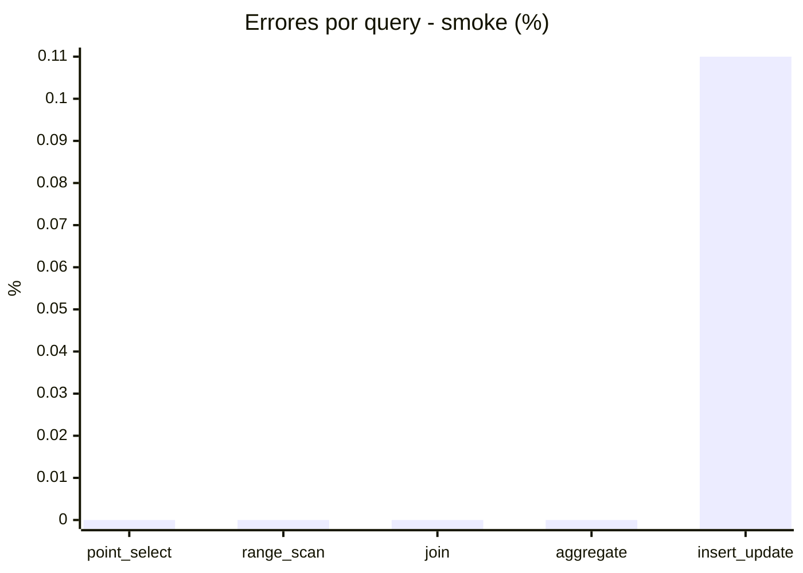

# Reporte de performance - SQL Server (k6)

**Fecha:** 2026-07-24 15:13 UTC  
**Veredicto (SLO):** `WARN`  
**Corrida:** [ver en GitHub Actions](https://github.com/lrbg/k6-sqlserver-lab/actions/runs/30104190326)  

## Analisis del agente de IA

1. **Identificación del Cuello de Botella**: La consulta de tipo "aggregate" es el cuello de botella, con un p95 de 297 ms en comparación con otras operaciones, como "point_select" (p95 de 16 ms) y "join" (p95 de 17 ms). 

2. **Recomendaciones de Índices**: Considera la creación de índices específicos para las columnas utilizadas en las operaciones de agregación. Esto podría incluir índices no clustered sobre las columnas más frecuentemente agrupadas o filtradas en la consulta. 

3. **Análisis del Plan de Ejecución**: Examina el plan de ejecución de las consultas de agregación para identificar potenciales tablas de alto costo, scans excesivos, o si se están utilizando índices ineficientes. Asegúrate de que el optimizador esté usando los índices apropiados.

4. **Contención y Bloqueos**: Verifica si hay contención en las tablas que frecuentemente son accedidas por las inserciones/actualizaciones. Implementar técnicas de particionado o aumentar el nivel de aislamiento puede ayudar a mitigar esta contención si es un problema observado.

## Resultados

### Escenario: `load`

| Metrica | Valor |
| --- | --- |
| Queries ejecutadas | 21005 |
| Errores | 0 (0%) |
| Latencia media | 57.2 ms |
| p50 / p90 / p95 / p99 | 15 / 223 / 251 / 297 ms |
| Min / Max | 0 / 337 ms |
| Throughput | 348.98 queries/s |
| Duracion | 60.2 s |

Detalle por query

| Query | Ejecuciones | Error % | avg | p95 | p99 | q/s |
| --- | --- | --- | --- | --- | --- | --- |
| point_select | 4201 | 0% | 5.9 | 16 | 20 | 69.8 |
| range_scan | 4201 | 0% | 18.9 | 42 | 59 | 69.8 |
| join | 4201 | 0% | 8.8 | 17 | 21 | 69.8 |
| aggregate | 4201 | 0% | 221.2 | 297 | 315 | 69.8 |
| insert_update | 4201 | 0% | 31.2 | 70 | 87 | 69.8 |

### Escenario: `smoke`

| Metrica | Valor |
| --- | --- |
| Queries ejecutadas | 4520 |
| Errores | 1 (0.02%) |
| Latencia media | 19.9 ms |
| p50 / p90 / p95 / p99 | 4 / 86 / 88 / 89 ms |
| Min / Max | 0 / 167 ms |
| Throughput | 150.19 queries/s |
| Duracion | 30.1 s |

Detalle por query

| Query | Ejecuciones | Error % | avg | p95 | p99 | q/s |
| --- | --- | --- | --- | --- | --- | --- |
| point_select | 904 | 0% | 1.2 | 4 | 8 | 30.04 |
| range_scan | 904 | 0% | 3.7 | 6 | 10 | 30.04 |
| join | 904 | 0% | 3.5 | 9 | 9 | 30.04 |
| aggregate | 904 | 0% | 85.3 | 89 | 91 | 30.04 |
| insert_update | 904 | 0.11% | 6.1 | 13 | 29 | 30.04 |

