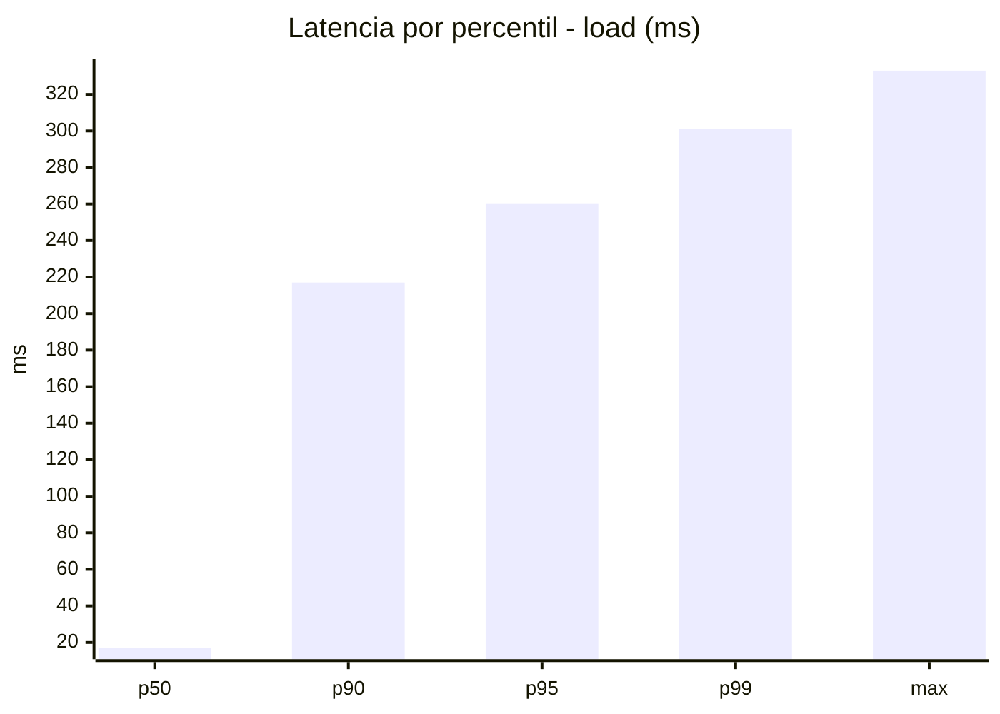
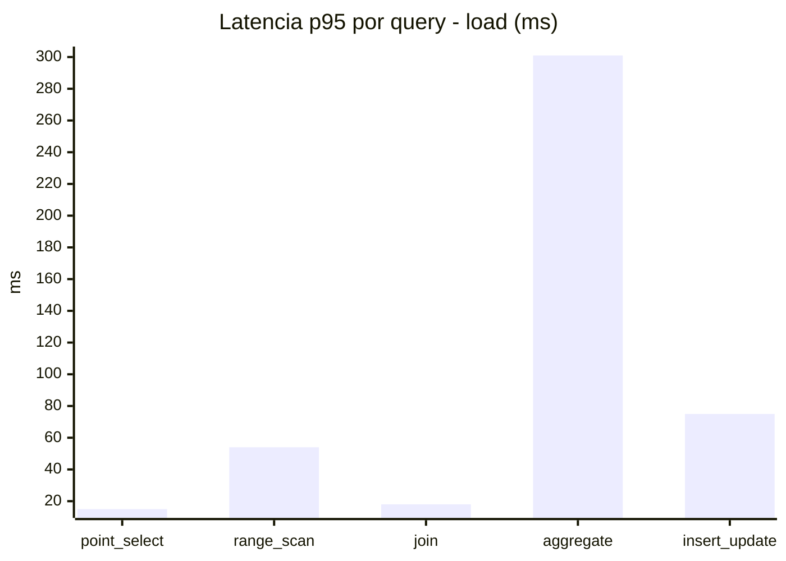
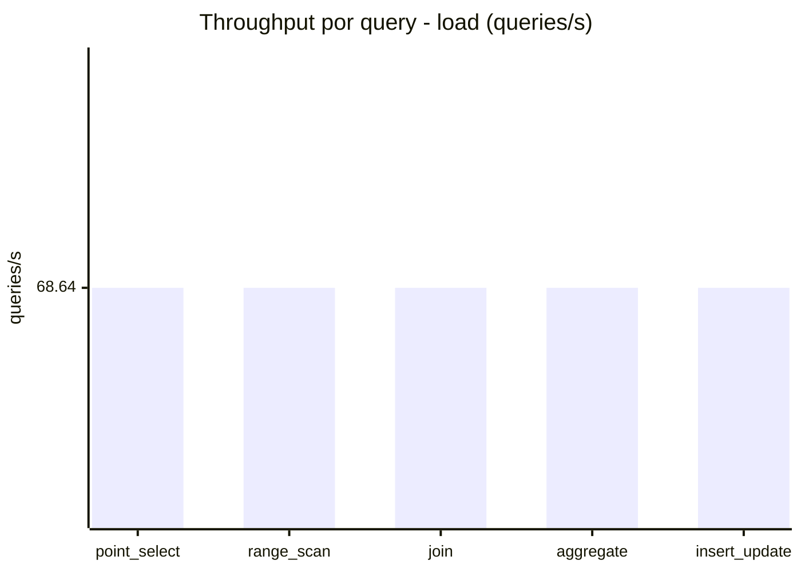
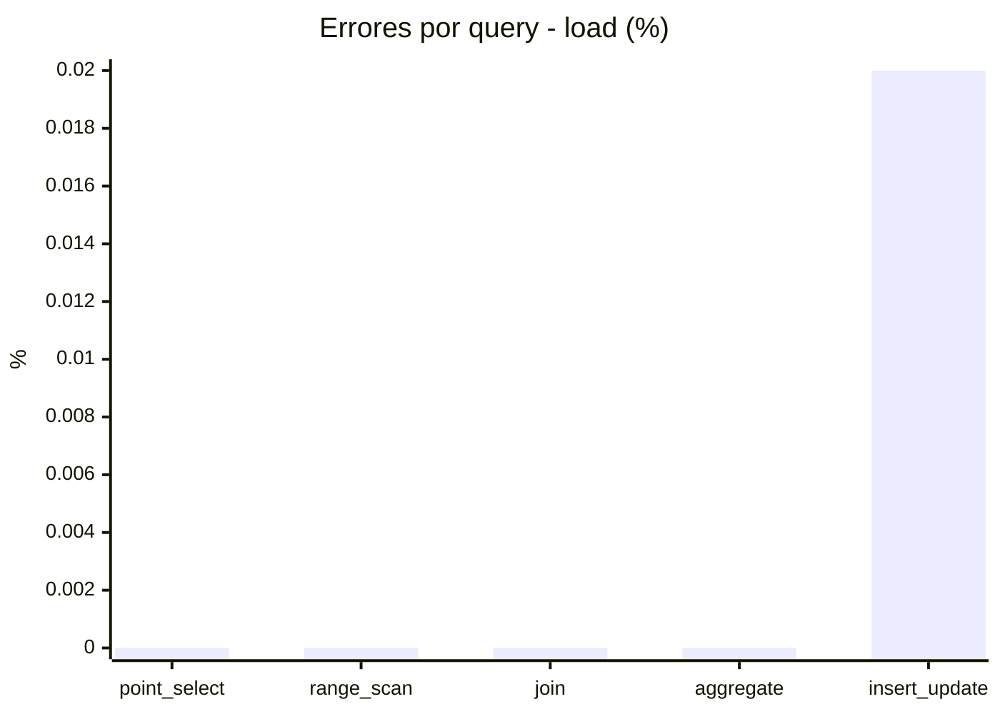
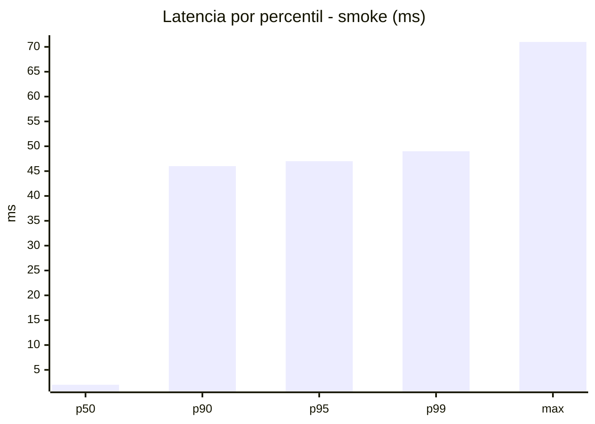
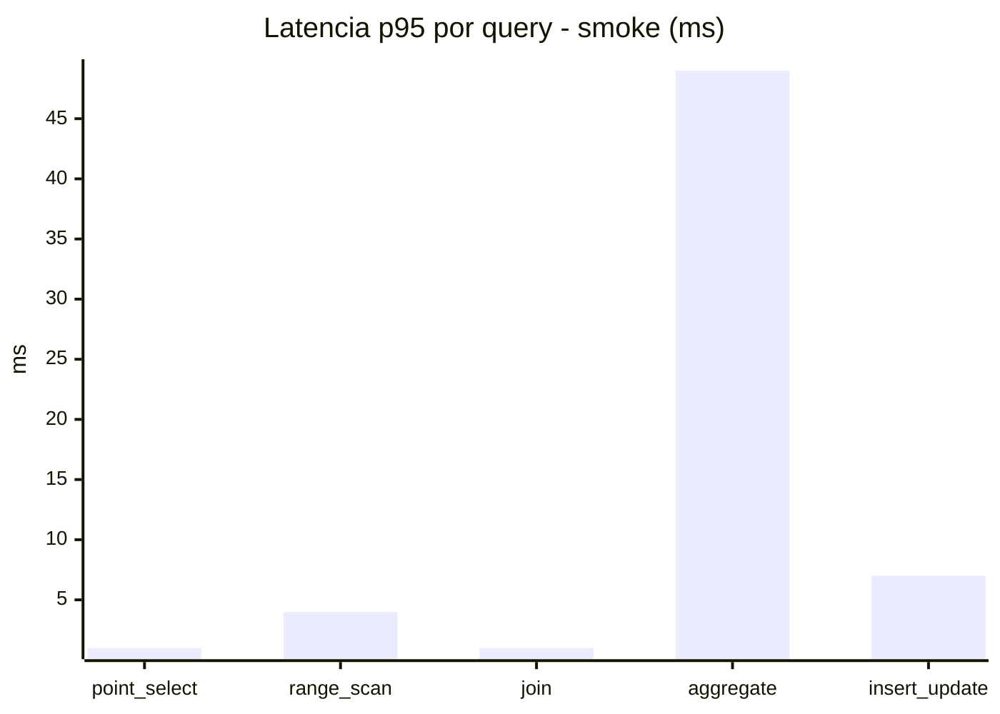
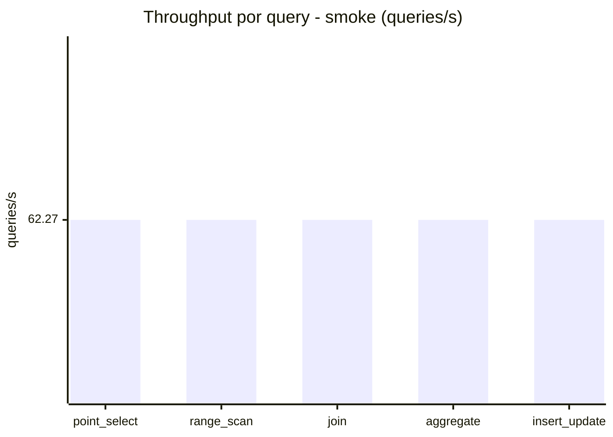
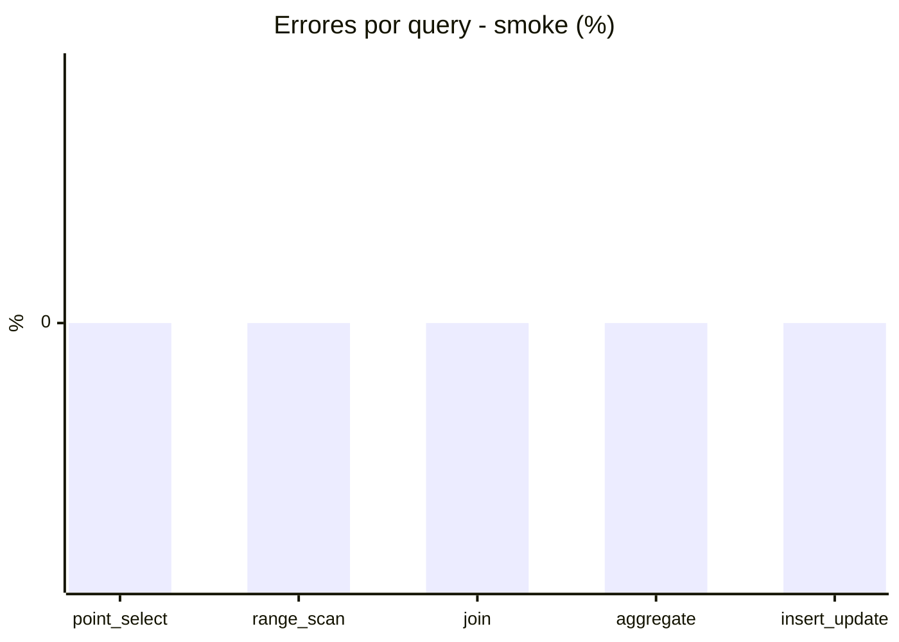

# Reporte de performance - SQL Server (k6)

**Fecha:** 2026-07-25 14:45 UTC  
**Veredicto (SLO):** `WARN`  
**Corrida:** [ver en GitHub Actions](https://github.com/lrbg/k6-sqlserver-lab/actions/runs/30162199513)  

## Analisis del agente de IA

1. **Identificación del cuello de botella**: La consulta más problemática en términos de rendimiento es la de **aggregate**, que tiene un p95 de 301 ms, superando significativamente los umbrales establecidos (200 ms). Las otras consultas, como **point_select** (p95 = 15 ms), **range_scan** (p95 = 54 ms) y **join** (p95 = 18 ms), tienen un p95 mucho más bajo.

2. **Recomendaciones de optimización**:
   - **Índices**: Considera la creación de índices adicionales que incluyan las columnas utilizadas en las agregaciones, especialmente en la tabla o tablas sobre las que se ejecuta la consulta de aggregate. Un índice compuesto que incluya las columnas más utilizadas en el SELECT y WHERE puede mejorar el rendimiento de las agregaciones.
   - **Optimización del plan de ejecución**: Analiza el plan de ejecución actual de la consulta de aggregate utilizando SQL Server Management Studio (SSMS) para identificar posibles puntos de mejora. Presta atención a los operadores que consumen más tiempo (p.ej., table scans) y considera reescribir la consulta si es necesario.
   - **Contención y bloqueos**: Revisa si hay contenciones en los recursos, especialmente bloqueos en las tablas utilizadas en la consulta de aggregate. Puedes utilizar el sistema de vistas dinámicas de SQL Server (DMVs) para investigar las transacciones activas y bloqueos.

3. **Revisión de métricas de errores**: Aunque se registra un error en la consulta de **insert_update** (0.02%), es bajo y no debe ser una prioridad inmediata. Sin embargo, asegúrate de que se investigue para evitar problemas futuros a medida que la carga aumente.

4. **Monitorización continua**: Implementa un sistema de monitorización para rastrear el rendimiento de las consultas a lo largo del tiempo, especialmente las que presentan picos en su p95, y ajusta las estrategias de indexación y optimización según sea necesario.

## Resultados

### Escenario: `load`

| Metrica | Valor |
| --- | --- |
| Queries ejecutadas | 20660 |
| Errores | 1 (0%) |
| Latencia media | 58.1 ms |
| p50 / p90 / p95 / p99 | 17 / 217 / 260 / 301 ms |
| Min / Max | 0 / 333 ms |
| Throughput | 343.21 queries/s |
| Duracion | 60.2 s |

Detalle por query

| Query | Ejecuciones | Error % | avg | p95 | p99 | q/s |
| --- | --- | --- | --- | --- | --- | --- |
| point_select | 4132 | 0% | 5.1 | 15 | 21 | 68.64 |
| range_scan | 4132 | 0% | 24.4 | 54 | 78 | 68.64 |
| join | 4132 | 0% | 8.3 | 18 | 22 | 68.64 |
| aggregate | 4132 | 0% | 217.9 | 301 | 315 | 68.64 |
| insert_update | 4132 | 0.02% | 35 | 75 | 99 | 68.64 |

### Escenario: `smoke`

| Metrica | Valor |
| --- | --- |
| Queries ejecutadas | 9350 |
| Errores | 0 (0%) |
| Latencia media | 9.6 ms |
| p50 / p90 / p95 / p99 | 2 / 46 / 47 / 49 ms |
| Min / Max | 0 / 71 ms |
| Throughput | 311.35 queries/s |
| Duracion | 30 s |

Detalle por query

| Query | Ejecuciones | Error % | avg | p95 | p99 | q/s |
| --- | --- | --- | --- | --- | --- | --- |
| point_select | 1870 | 0% | 0.6 | 1 | 1 | 62.27 |
| range_scan | 1870 | 0% | 2.8 | 4 | 10 | 62.27 |
| join | 1870 | 0% | 0.8 | 1 | 3 | 62.27 |
| aggregate | 1870 | 0% | 40.2 | 49 | 51 | 62.27 |
| insert_update | 1870 | 0% | 3.7 | 7 | 13 | 62.27 |

