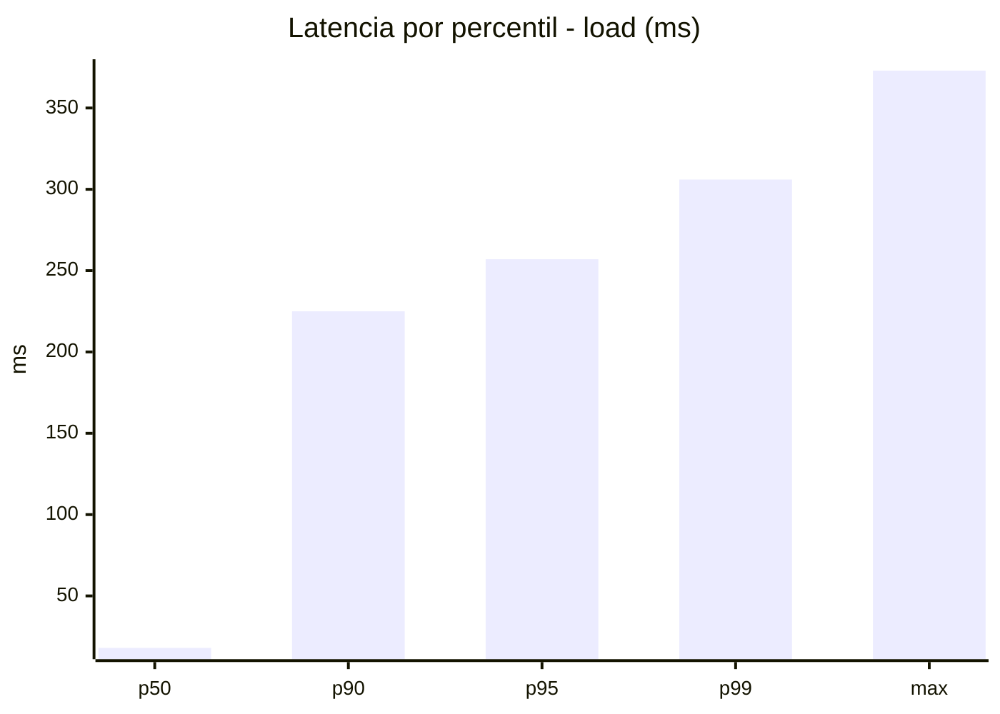
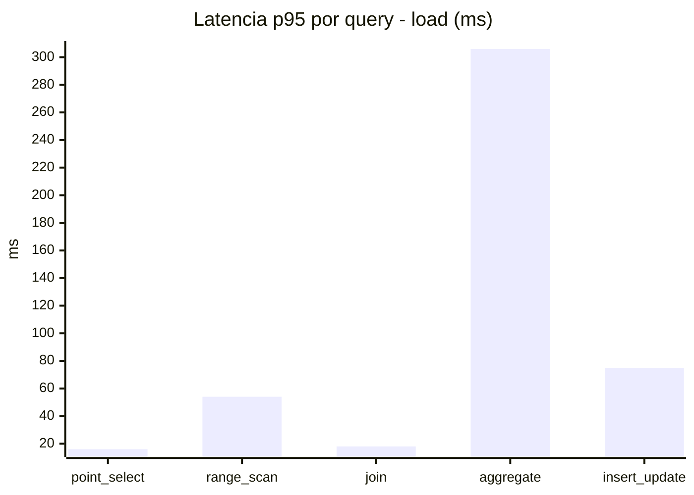
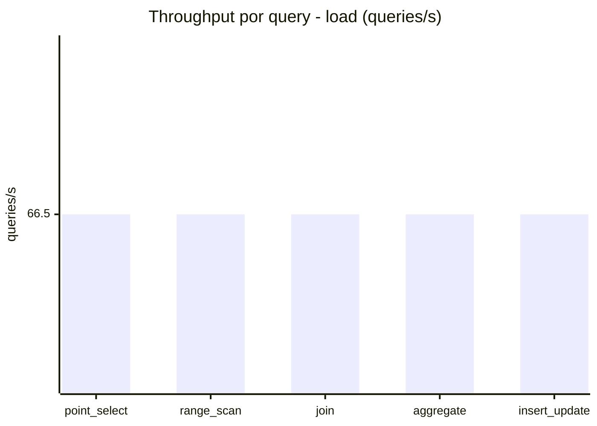
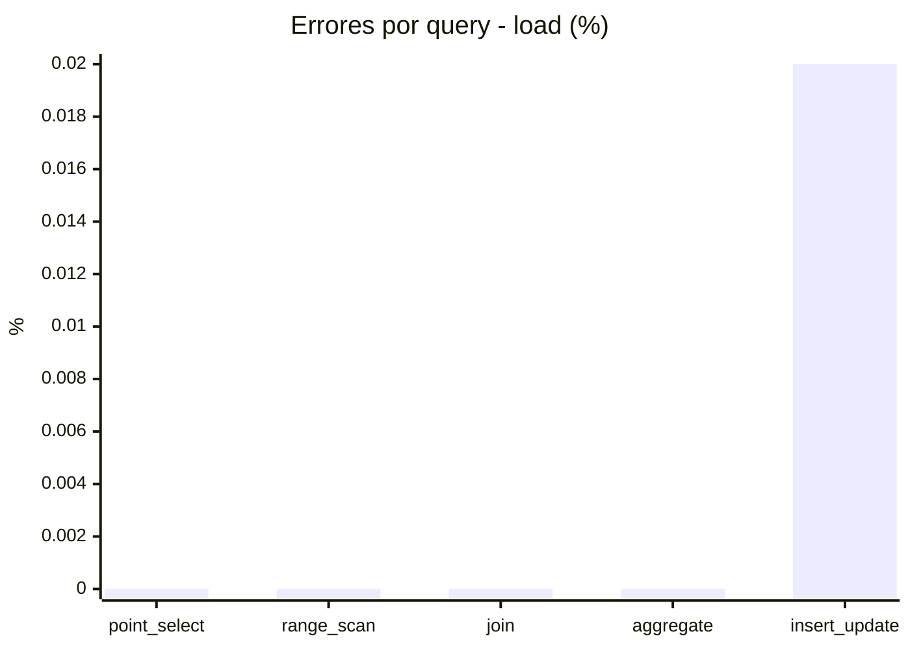
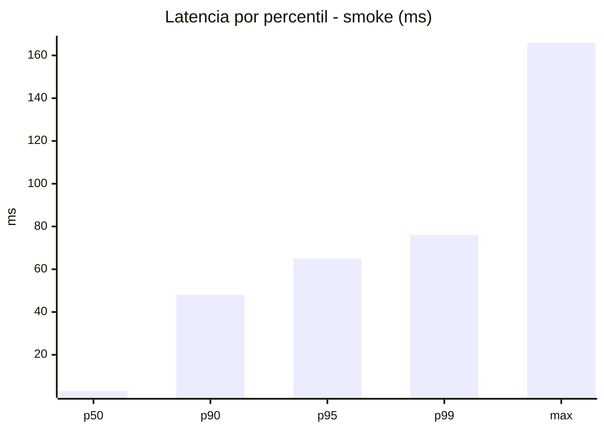
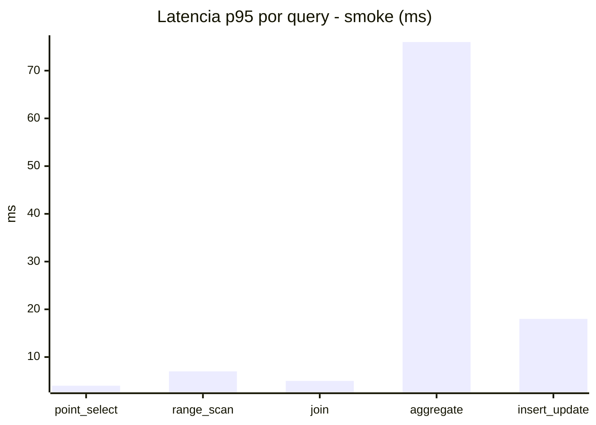
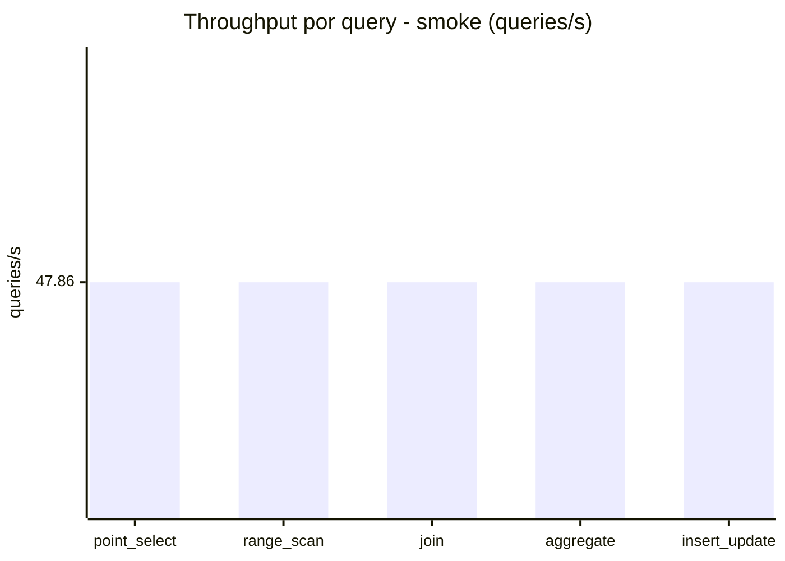

# Reporte de performance - SQL Server (k6)

**Fecha:** 2026-07-26 14:49 UTC  
**Veredicto (SLO):** `WARN`  
**Corrida:** [ver en GitHub Actions](https://github.com/lrbg/k6-sqlserver-lab/actions/runs/30206801212)  

## Analisis del agente de IA

1. **Identificación del cuello de botella**: La operación que presenta el mayor tiempo de respuesta es el **aggregate**, con un p95 de 306 ms, mucho más alto que los demás endpoints. Esto indica que esta consulta es la más crítica y necesita optimización.

2. **Recomendaciones de índices**: Evalúa la posibilidad de crear índices que optimicen específicamente las consultas de agregación que se utilizan con más frecuencia. Considera índices cubrientes que incluyan las columnas utilizadas en las cláusulas `GROUP BY` y `WHERE`, así como en las funciones de agregación. 

3. **Análisis del plan de ejecución**: Revisa el plan de ejecución de la consulta de agregación para identificar posibles problemas, como operaciones de escaneo de tabla ineficientes. Asegúrate de que el motor de SQL esté utilizando los índices adecuados y considera reescribir la consulta si es posible para mejorar la eficiencia.

4. **Monitoreo de contención y bloqueos**: Monitorea la contención en la tabla utilizada por las operaciones de inserciones y actualizaciones (insert_update) para asegurarte de que no esté afectando el rendimiento. Establece un control sobre las transacciones largas que puedan estar causando bloqueos, especialmente si afectan a la tabla utilizada por las consultas de agregación.

## Resultados

### Escenario: `load`

| Metrica | Valor |
| --- | --- |
| Queries ejecutadas | 20015 |
| Errores | 1 (0%) |
| Latencia media | 60.1 ms |
| p50 / p90 / p95 / p99 | 18 / 225 / 257 / 306 ms |
| Min / Max | 0 / 373 ms |
| Throughput | 332.5 queries/s |
| Duracion | 60.2 s |

Detalle por query

| Query | Ejecuciones | Error % | avg | p95 | p99 | q/s |
| --- | --- | --- | --- | --- | --- | --- |
| point_select | 4003 | 0% | 6.2 | 16 | 20 | 66.5 |
| range_scan | 4003 | 0% | 25.1 | 54 | 73 | 66.5 |
| join | 4003 | 0% | 8.7 | 18 | 21 | 66.5 |
| aggregate | 4003 | 0% | 223.2 | 306 | 322 | 66.5 |
| insert_update | 4003 | 0.02% | 37.3 | 75 | 95 | 66.5 |

### Escenario: `smoke`

| Metrica | Valor |
| --- | --- |
| Queries ejecutadas | 7190 |
| Errores | 1 (0.01%) |
| Latencia media | 12.5 ms |
| p50 / p90 / p95 / p99 | 3 / 48 / 65 / 76 ms |
| Min / Max | 0 / 166 ms |
| Throughput | 239.3 queries/s |
| Duracion | 30 s |

Detalle por query

| Query | Ejecuciones | Error % | avg | p95 | p99 | q/s |
| --- | --- | --- | --- | --- | --- | --- |
| point_select | 1438 | 0% | 0.9 | 4 | 5 | 47.86 |
| range_scan | 1438 | 0% | 3.3 | 7 | 11 | 47.86 |
| join | 1438 | 0% | 1.8 | 5 | 5 | 47.86 |
| aggregate | 1438 | 0% | 50.7 | 76 | 81 | 47.86 |
| insert_update | 1438 | 0.07% | 5.9 | 18 | 23.6 | 47.86 |

