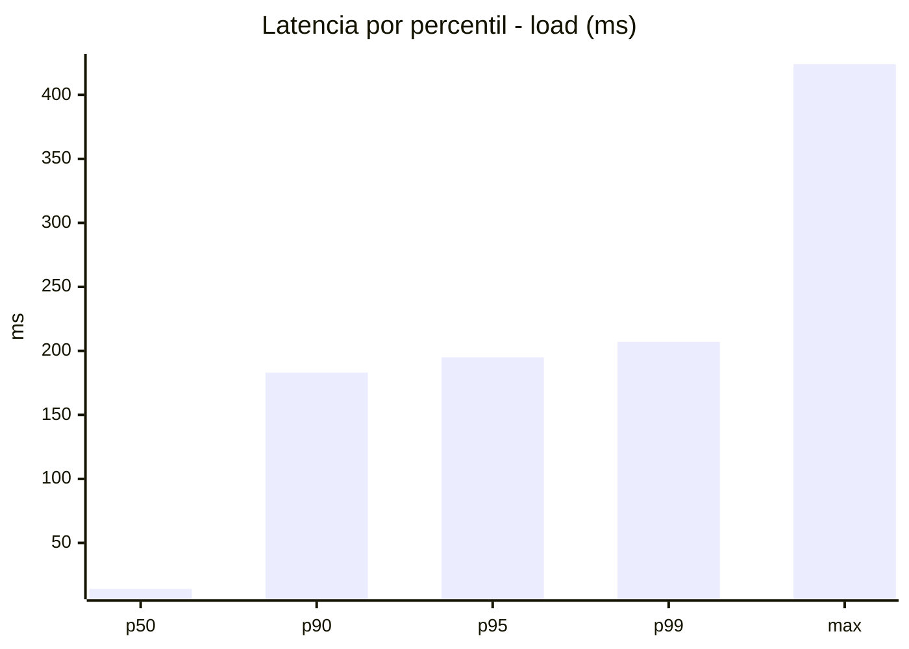
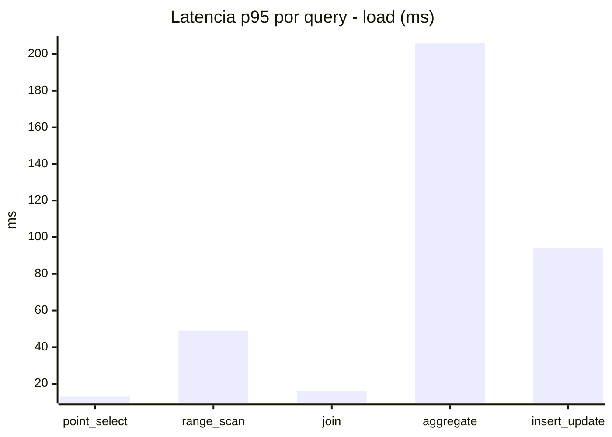
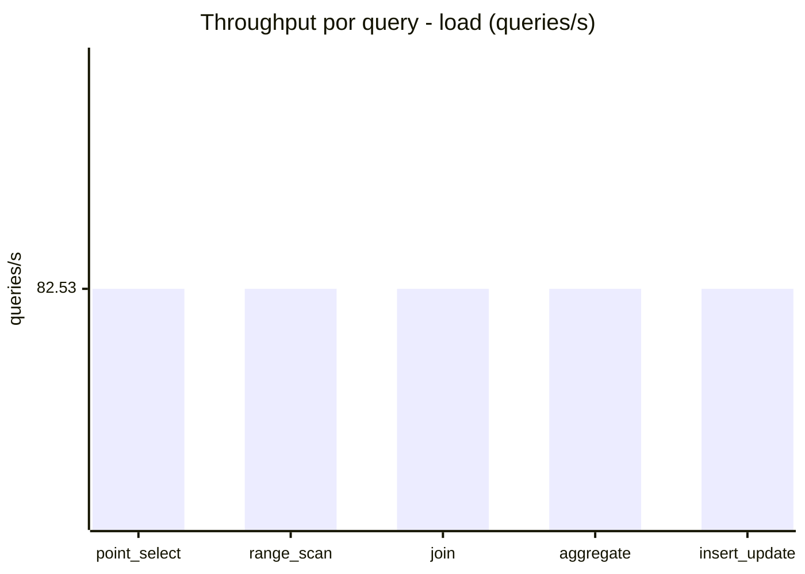
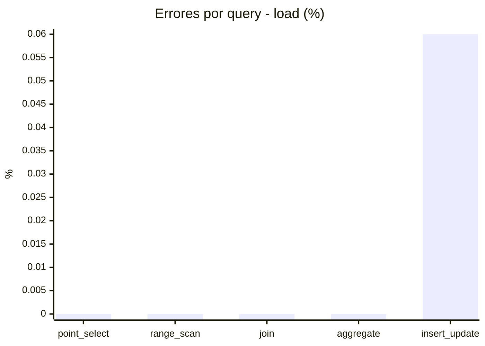
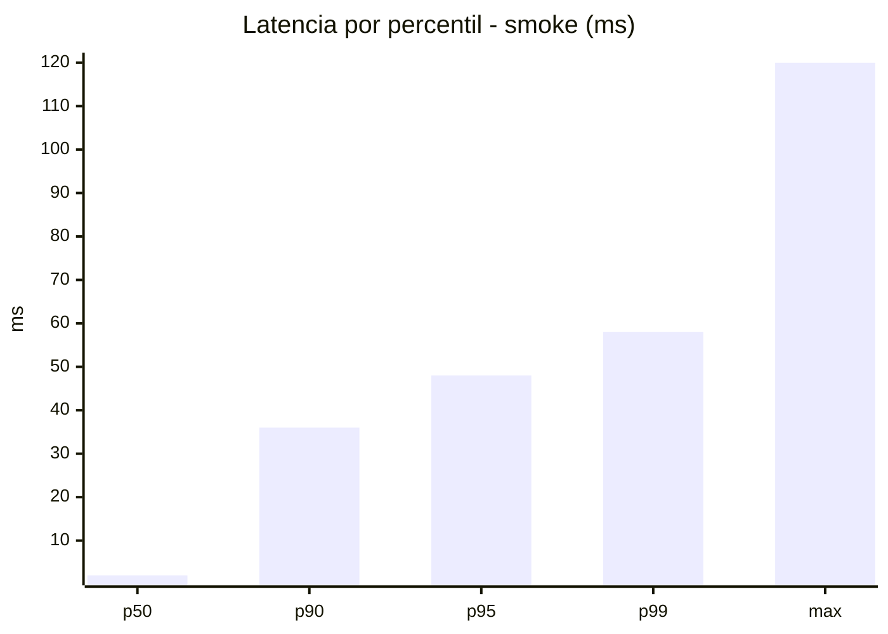
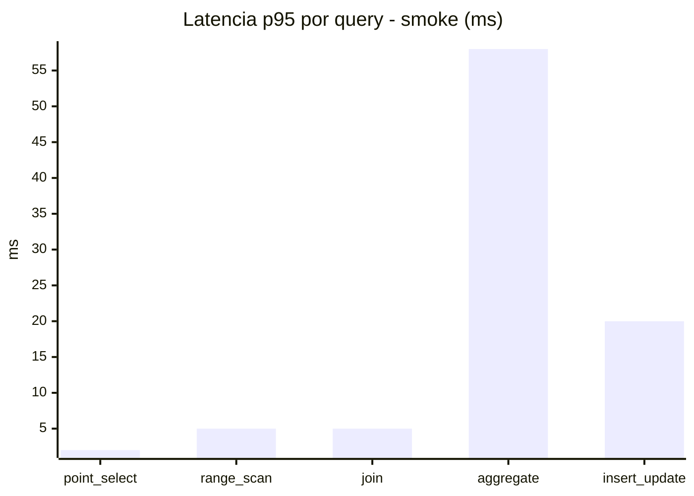
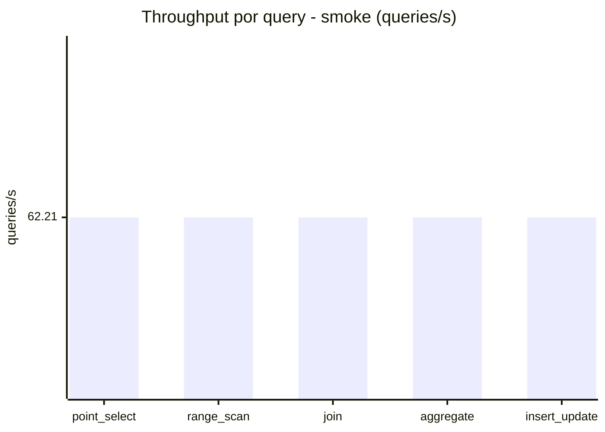
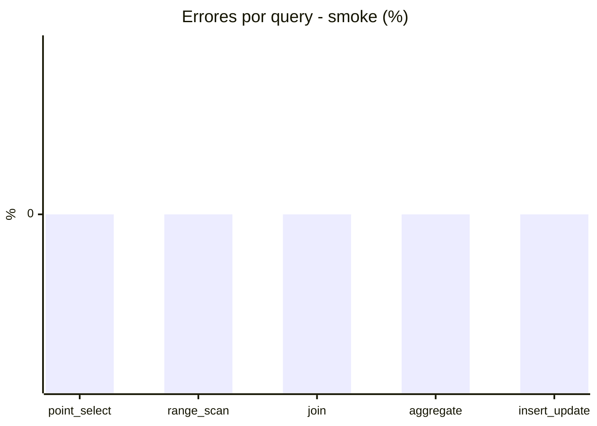

# Reporte de performance - SQL Server (k6)

**Fecha:** 2026-07-27 15:59 UTC  
**Veredicto (SLO):** `PASS`  
**Corrida:** [ver en GitHub Actions](https://github.com/lrbg/k6-sqlserver-lab/actions/runs/30282416928)  

## Analisis del agente de IA

1. **Cuello de botella identificado**: La consulta de tipo **aggregate** presenta el mayor tiempo de respuesta, con un **p95_ms de 206 ms**, lo que está en el límite del SLO de 200 ms, lo que indica que es el principal cuello de botella en el rendimiento.

2. **Recomendaciones de índices**: Para optimizar la consulta de tipo aggregate, considera crear índices adicionales sobre las columnas utilizadas en las cláusulas de agregación y cualquier condición de filtro. Esto puede reducir el tiempo de escaneo de tablas y mejorar la eficiencia de la consulta.

3. **Análisis del plan de ejecución**: Revisa el plan de ejecución de la consulta aggregate. Asegúrate de que SQL Server esté utilizando los índices creados. Si se observan operaciones costosas como escaneos de tabla o uniones ineficientes, considera la posibilidad de reescribir la consulta o realizar optimizaciones en los índices disponibles.

4. **Contención/Bloqueos**: Verifica si hay contención o bloqueos que podrían afectar el rendimiento de las transacciones, particularmente en la consulta de tipo insert_update, que pese a no ser el cuello de botella principal, tiene un **p95_ms de 94 ms**. Asegúrate de que las transacciones sean lo más cortas posible y evalúa la posibilidad de usar transacciones optimistas o niveles de aislamiento que puedan reducir la contención.

## Resultados

### Escenario: `load`

| Metrica | Valor |
| --- | --- |
| Queries ejecutadas | 24885 |
| Errores | 3 (0.01%) |
| Latencia media | 48.3 ms |
| p50 / p90 / p95 / p99 | 14 / 183 / 195 / 207 ms |
| Min / Max | 0 / 424 ms |
| Throughput | 412.66 queries/s |
| Duracion | 60.3 s |

Detalle por query

| Query | Ejecuciones | Error % | avg | p95 | p99 | q/s |
| --- | --- | --- | --- | --- | --- | --- |
| point_select | 4977 | 0% | 3.9 | 13 | 17 | 82.53 |
| range_scan | 4977 | 0% | 21.5 | 49 | 107.2 | 82.53 |
| join | 4977 | 0% | 7.1 | 16 | 18 | 82.53 |
| aggregate | 4977 | 0% | 173.8 | 206 | 216 | 82.53 |
| insert_update | 4977 | 0.06% | 35.3 | 94 | 206.2 | 82.53 |

### Escenario: `smoke`

| Metrica | Valor |
| --- | --- |
| Queries ejecutadas | 9340 |
| Errores | 0 (0%) |
| Latencia media | 9.6 ms |
| p50 / p90 / p95 / p99 | 2 / 36 / 48 / 58 ms |
| Min / Max | 0 / 120 ms |
| Throughput | 311.04 queries/s |
| Duracion | 30 s |

Detalle por query

| Query | Ejecuciones | Error % | avg | p95 | p99 | q/s |
| --- | --- | --- | --- | --- | --- | --- |
| point_select | 1868 | 0% | 0.7 | 2 | 4 | 62.21 |
| range_scan | 1868 | 0% | 2.5 | 5 | 10 | 62.21 |
| join | 1868 | 0% | 1.3 | 5 | 5 | 62.21 |
| aggregate | 1868 | 0% | 37.7 | 58 | 62 | 62.21 |
| insert_update | 1868 | 0% | 5.8 | 20 | 33.3 | 62.21 |

