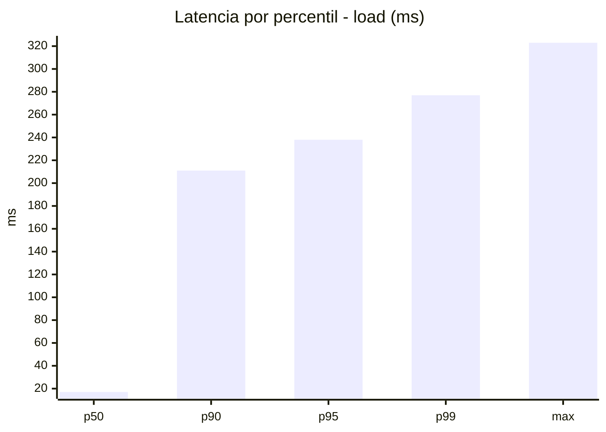
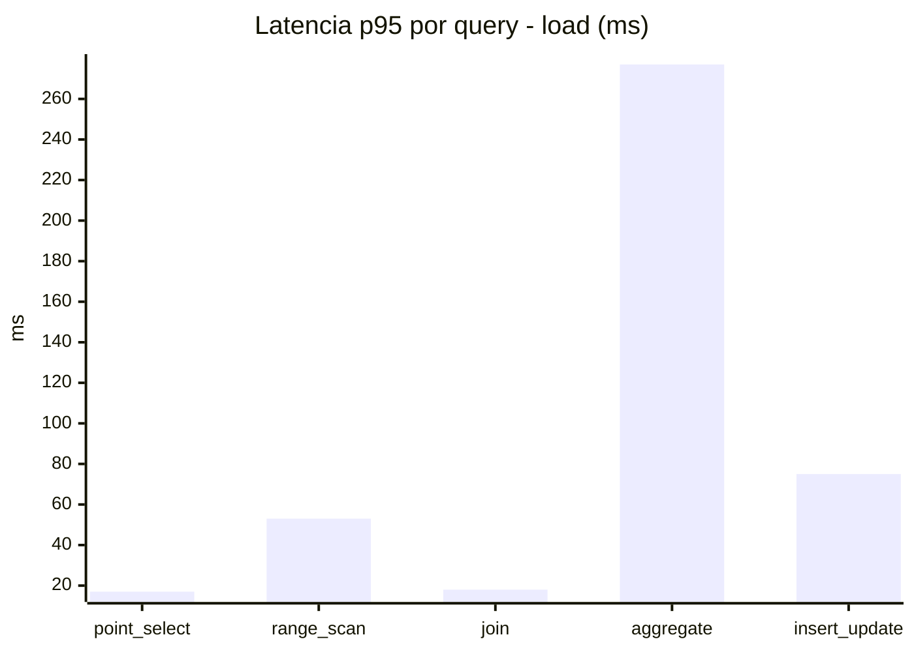
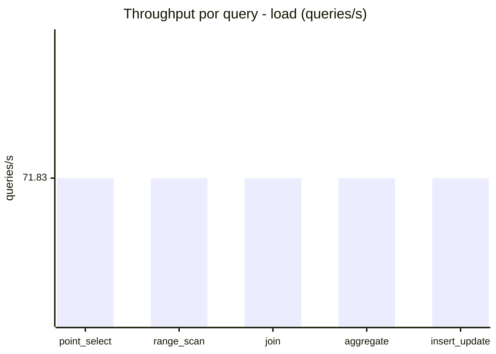
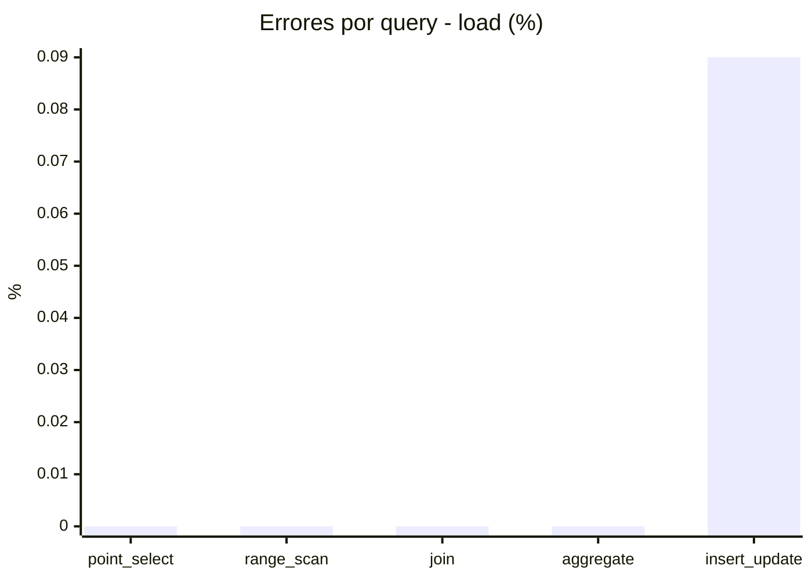
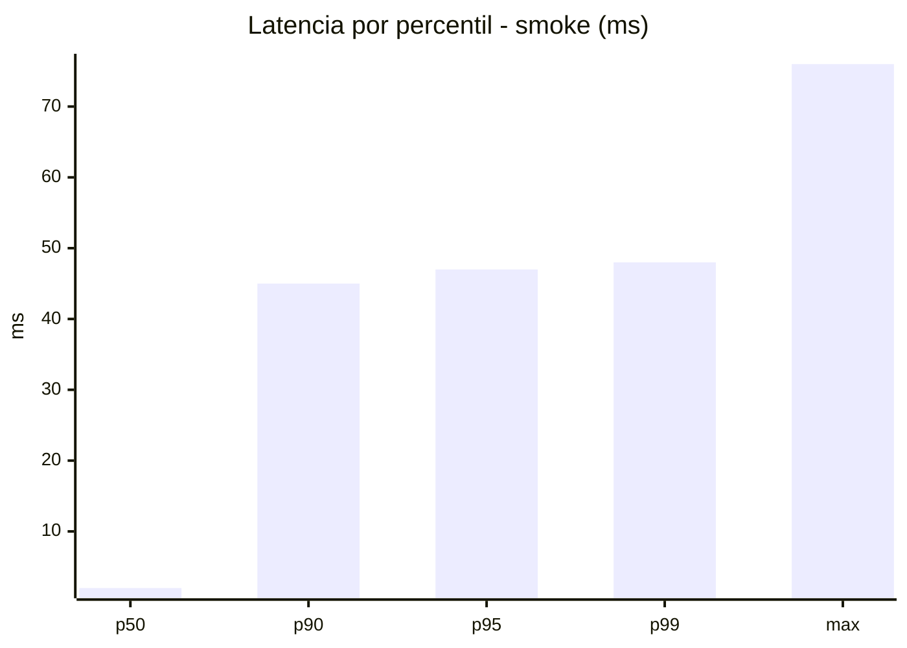
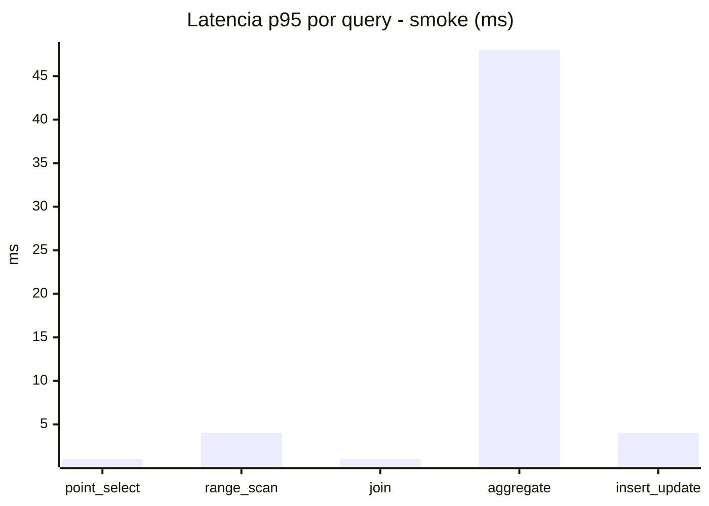
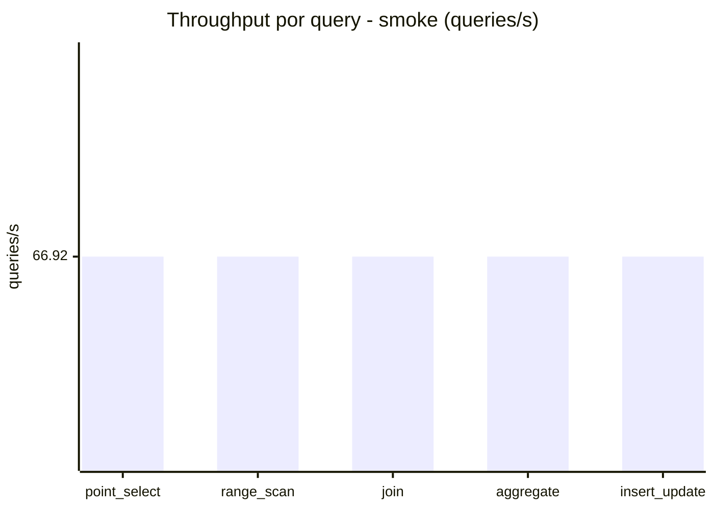
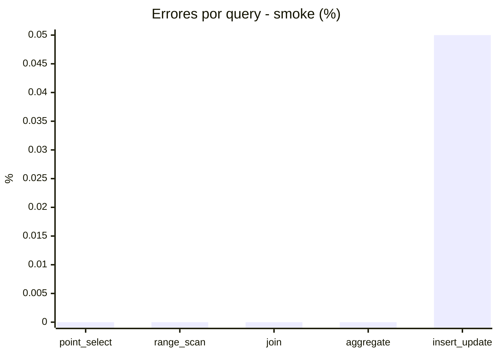

# Reporte de performance - SQL Server (k6)

**Fecha:** 2026-07-28 15:42 UTC  
**Veredicto (SLO):** `WARN`  
**Corrida:** [ver en GitHub Actions](https://github.com/lrbg/k6-sqlserver-lab/actions/runs/30374509612)  

## Analisis del agente de IA

1. **Identificación del cuello de botella**: La consulta más problemática es la de **aggregate**, que tiene el p95 más alto (277 ms) en comparación con las otras consultas, mostrando un rendimiento significativamente inferior en el contexto de carga (supera el límite establecido en los SLOs).

2. **Recomendaciones de índices**: Considerar la creación de índices apropiados en las columnas utilizadas en las cláusulas `GROUP BY`, `JOIN` y `WHERE` de la consulta de agregación. Esto puede reducir el tiempo de ejecución al facilitar búsquedas y evitar escaneos de tabla completos.

3. **Análisis del plan de ejecución**: Realizar un análisis exhaustivo del plan de ejecución de la consulta de agregación. Esto puede revelar cualquier operación costosa (como un `HASH JOIN` ineficiente o una combinación de operadores no óptima) que pueda ser optimizada.

4. **Contención y bloqueos**: Revisar la configuración de aislamiento de transacciones y monitorear los bloqueos durante las operaciones de `insert_update`. Aunque los tiempos de las inserciones son aceptables, verificar la contención en tablas afectadas puede ayudar a mejorar el rendimiento en condiciones de alta concurrencia.

## Resultados

### Escenario: `load`

| Metrica | Valor |
| --- | --- |
| Queries ejecutadas | 21610 |
| Errores | 4 (0.02%) |
| Latencia media | 55.6 ms |
| p50 / p90 / p95 / p99 | 17 / 211 / 238 / 277 ms |
| Min / Max | 0 / 323 ms |
| Throughput | 359.16 queries/s |
| Duracion | 60.2 s |

Detalle por query

| Query | Ejecuciones | Error % | avg | p95 | p99 | q/s |
| --- | --- | --- | --- | --- | --- | --- |
| point_select | 4322 | 0% | 5.7 | 17 | 21 | 71.83 |
| range_scan | 4322 | 0% | 23.6 | 53 | 74.8 | 71.83 |
| join | 4322 | 0% | 8.5 | 18 | 22 | 71.83 |
| aggregate | 4322 | 0% | 204.7 | 277 | 297 | 71.83 |
| insert_update | 4322 | 0.09% | 35.3 | 75 | 92 | 71.83 |

### Escenario: `smoke`

| Metrica | Valor |
| --- | --- |
| Queries ejecutadas | 10055 |
| Errores | 1 (0.01%) |
| Latencia media | 8.9 ms |
| p50 / p90 / p95 / p99 | 2 / 45 / 47 / 48 ms |
| Min / Max | 0 / 76 ms |
| Throughput | 334.62 queries/s |
| Duracion | 30 s |

Detalle por query

| Query | Ejecuciones | Error % | avg | p95 | p99 | q/s |
| --- | --- | --- | --- | --- | --- | --- |
| point_select | 2011 | 0% | 0.5 | 1 | 2 | 66.92 |
| range_scan | 2011 | 0% | 2.6 | 4 | 4 | 66.92 |
| join | 2011 | 0% | 0.8 | 1 | 2 | 66.92 |
| aggregate | 2011 | 0% | 38.4 | 48 | 49 | 66.92 |
| insert_update | 2011 | 0.05% | 2.4 | 4 | 7 | 66.92 |

