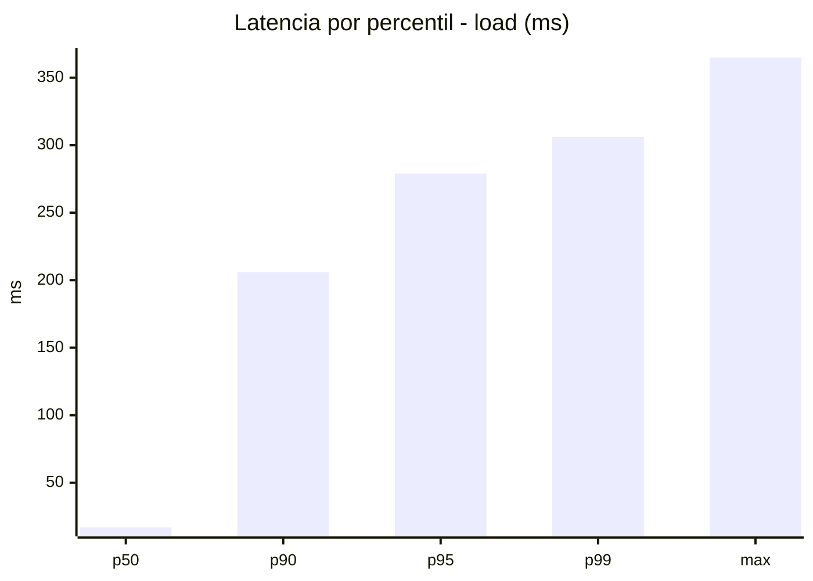
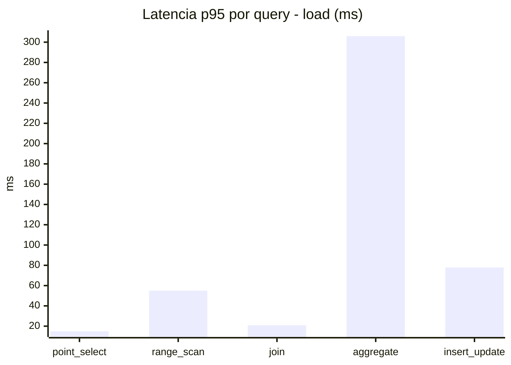
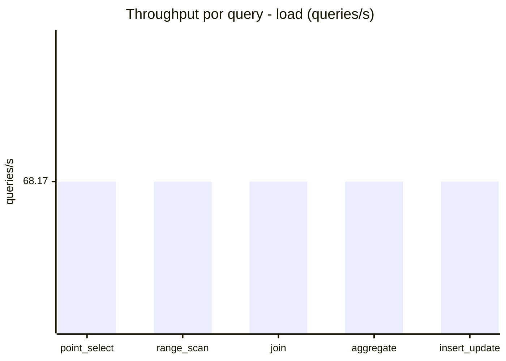
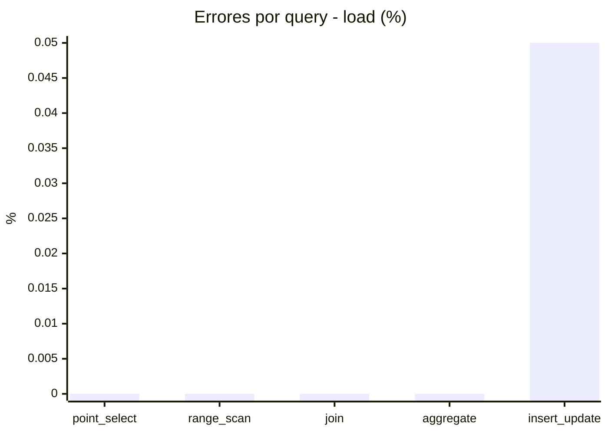
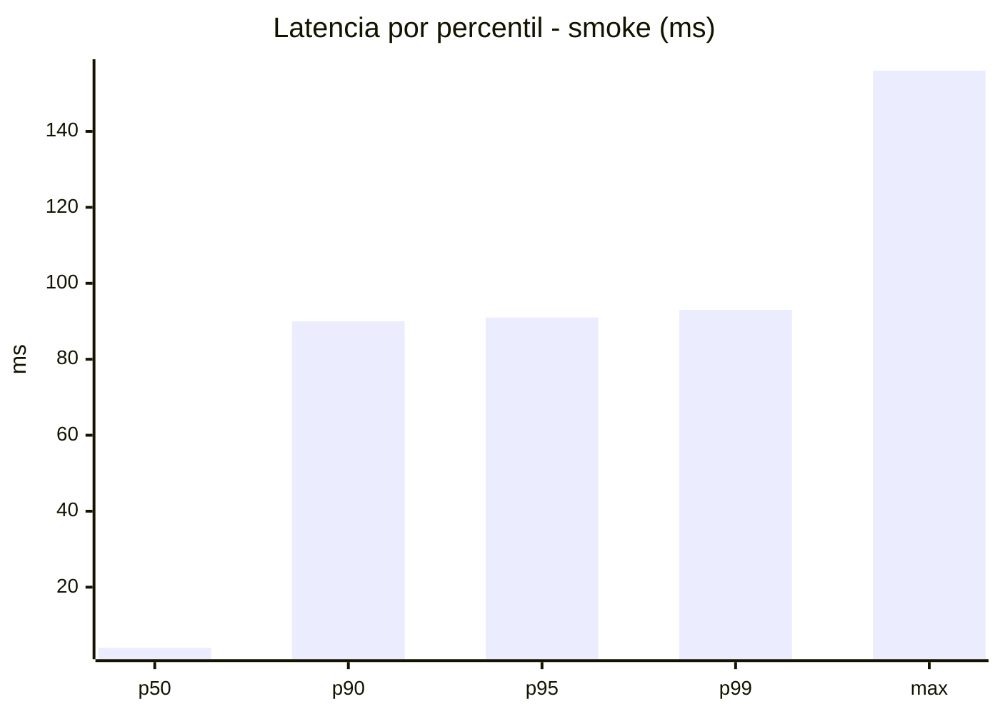
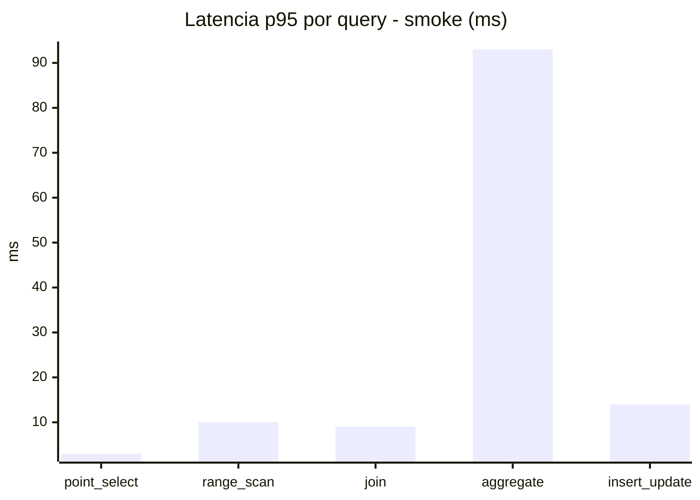
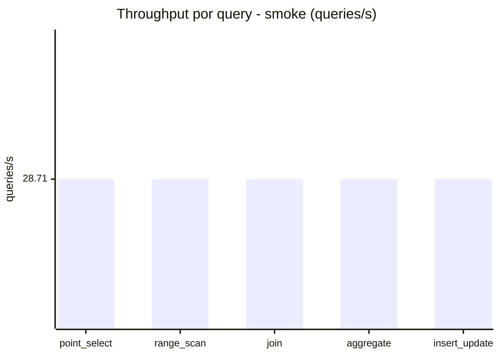
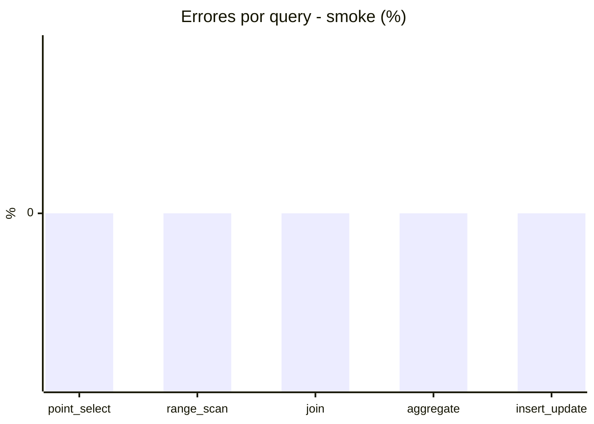

# Reporte de performance - SQL Server (k6)

**Fecha:** 2026-07-29 15:26 UTC  
**Veredicto (SLO):** `WARN`  
**Corrida:** [ver en GitHub Actions](https://github.com/lrbg/k6-sqlserver-lab/actions/runs/30465690036)  

## Analisis del agente de IA

1. **Cuello de botella**: La consulta de tipo "aggregate" presenta el mayor tiempo de respuesta, con un p95 de 306 ms, lo que supera el límite de 200 ms establecido en los SLOs. Comparado con las demás consultas (point_select, range_scan, join, insert_update), que tienen p95 bastante inferiores, es evidente que "aggregate" es el cuello de botella en este caso.

2. **Recomendaciones de optimización**:
   - **Índices**: Revisa los índices en las tablas utilizadas para la consulta de agregación. Asegúrate de que existan índices que cubran las columnas involucradas en las agregaciones y en las condiciones de filtrado. Considera el uso de índices filtrados si existen condiciones específicas que se usan frecuentemente.
   - **Plan de ejecución**: Analiza el plan de ejecución de la consulta de agregación para identificar si hay operaciones costosas, como scans de tabla o joins innecesarios. Optimiza la consulta para reducir la complejidad, dividiendo la consulta en partes más pequeñas si es necesario.
   - **Bloqueos y contención**: Monitorea la contención en las tablas relacionadas con la consulta de agregación. Utilizar niveles de aislamiento adecuados puede ayudar a minimizar bloqueos. Considera implementar particionamiento si es posible, para mejorar el rendimiento en las operaciones de lectura y escritura.

3. **Pruebas adicionales**: Realiza pruebas de rendimiento después de aplicar las optimizaciones para validar que los cambios hayan contribuido a mejorar los tiempos de respuesta de la consulta de agregación y así cumplir los SLOs establecidos.

## Resultados

### Escenario: `load`

| Metrica | Valor |
| --- | --- |
| Queries ejecutadas | 20510 |
| Errores | 2 (0.01%) |
| Latencia media | 58.6 ms |
| p50 / p90 / p95 / p99 | 17 / 206 / 279 / 306 ms |
| Min / Max | 0 / 365 ms |
| Throughput | 340.83 queries/s |
| Duracion | 60.2 s |

Detalle por query

| Query | Ejecuciones | Error % | avg | p95 | p99 | q/s |
| --- | --- | --- | --- | --- | --- | --- |
| point_select | 4102 | 0% | 5.6 | 15 | 22 | 68.17 |
| range_scan | 4102 | 0% | 23.2 | 55 | 77 | 68.17 |
| join | 4102 | 0% | 8.6 | 21 | 23 | 68.17 |
| aggregate | 4102 | 0% | 220 | 306 | 322 | 68.17 |
| insert_update | 4102 | 0.05% | 35.6 | 77.9 | 100 | 68.17 |

### Escenario: `smoke`

| Metrica | Valor |
| --- | --- |
| Queries ejecutadas | 4310 |
| Errores | 0 (0%) |
| Latencia media | 20.9 ms |
| p50 / p90 / p95 / p99 | 4 / 90 / 91 / 93 ms |
| Min / Max | 0 / 156 ms |
| Throughput | 143.53 queries/s |
| Duracion | 30 s |

Detalle por query

| Query | Ejecuciones | Error % | avg | p95 | p99 | q/s |
| --- | --- | --- | --- | --- | --- | --- |
| point_select | 862 | 0% | 1.2 | 3 | 6.8 | 28.71 |
| range_scan | 862 | 0% | 4.1 | 10 | 11 | 28.71 |
| join | 862 | 0% | 3.6 | 9 | 9 | 28.71 |
| aggregate | 862 | 0% | 88.7 | 93 | 97 | 28.71 |
| insert_update | 862 | 0% | 6.9 | 14 | 30 | 28.71 |

