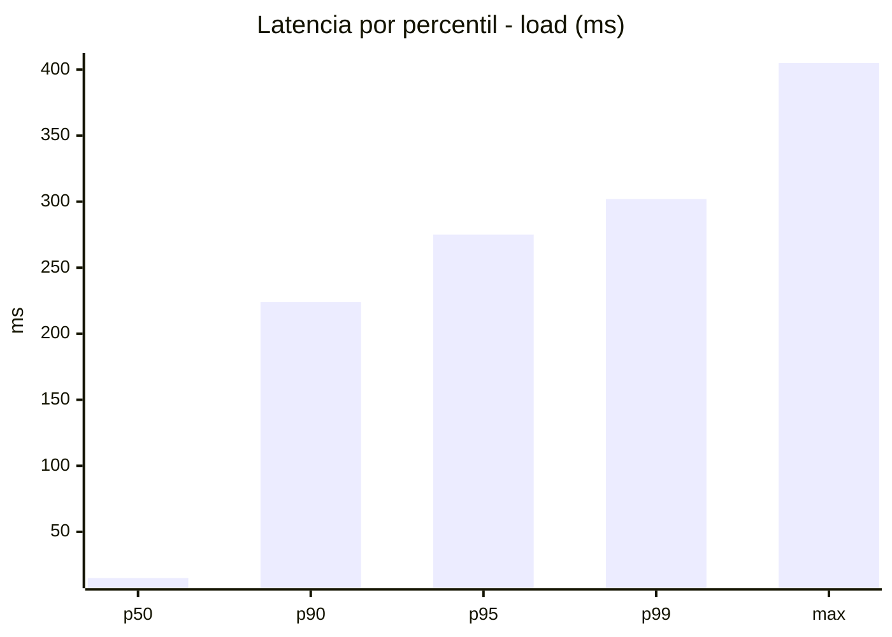
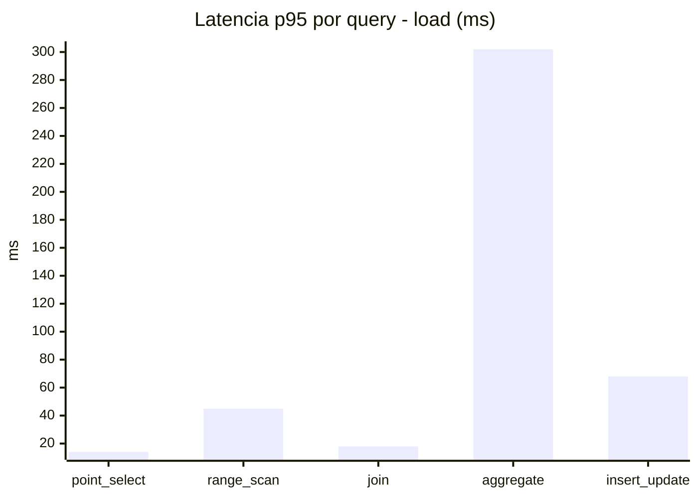
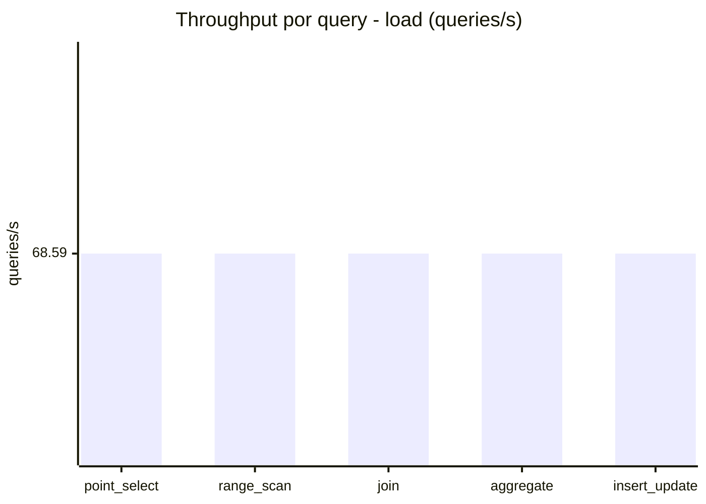
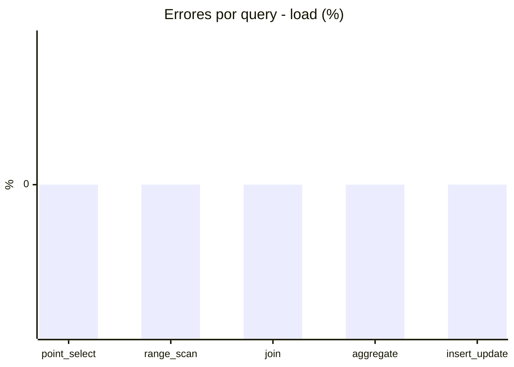
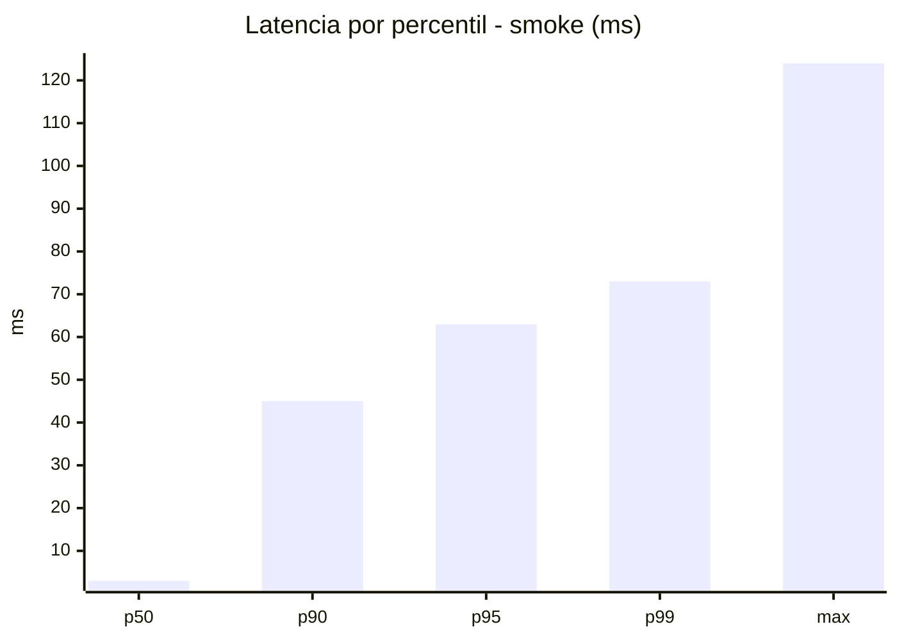
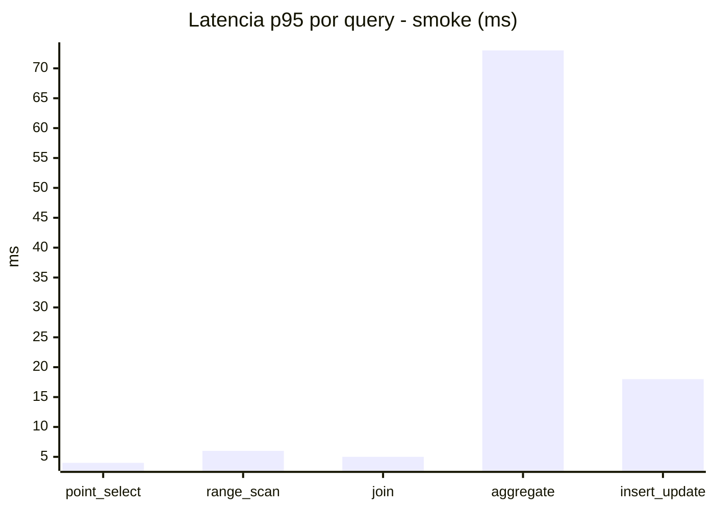
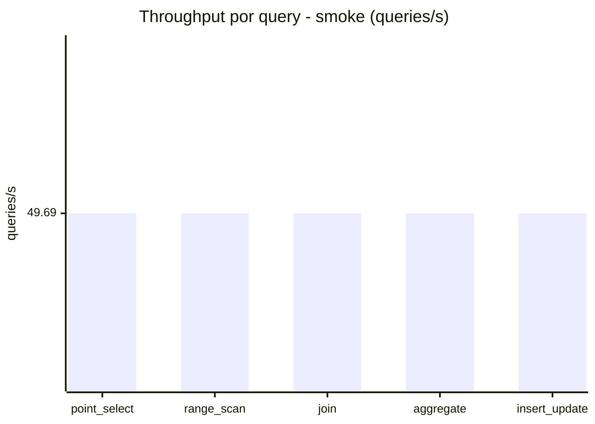
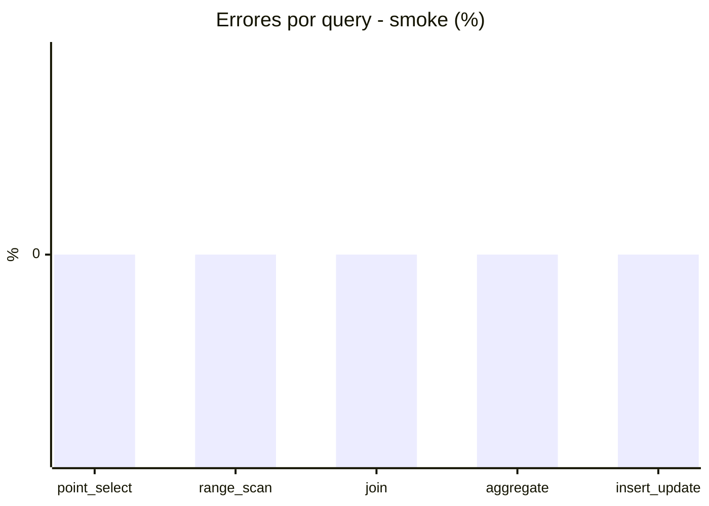

# Reporte de performance - SQL Server (k6)

**Fecha:** 2026-07-30 15:30 UTC  
**Veredicto (SLO):** `WARN`  
**Corrida:** [ver en GitHub Actions](https://github.com/lrbg/k6-sqlserver-lab/actions/runs/30556825797)  

## Analisis del agente de IA

1. **Cuello de botella identificado**: La consulta de tipo **aggregate** muestra el tiempo de respuesta más alto con un p95 de 302 ms, superando el umbral de 200 ms que has establecido. Esto indica que es la operación más lenta y probablemente el cuello de botella en la carga de trabajo actual.

2. **Recomendaciones para mejorar el rendimiento**:
   - **Índices**: Evalúa la creación de índices adecuados para las columnas más utilizadas en las cláusulas `GROUP BY`, `JOIN` o `WHERE` de las consultas de agregación. Un índice compuesto que incluya las columnas clave puede reducir significativamente el tiempo de las consultas.
   
   - **Análisis del plan de ejecución**: Revisa el plan de ejecución de las consultas de tipo aggregate para identificar si se están realizando operaciones costosas, como escaneos de tabla o uniones innecesarias. Considera la posibilidad de optimizar las consultas mediante la reescritura de las mismas o utilizando vistas materializadas si se permiten.

3. **Contención y Bloqueos**: Verifica si hay contención de recursos (bloqueos) durante la ejecución de estas consultas, especialmente en situaciones de alta concurrencia. Utiliza herramientas como `sp_who2`, DMVs (Dynamic Management Views) o el Monitor de Actividad para identificar y resolver estos problemas.

4. **Pruebas continuas**: Una vez implementadas las mejoras, realiza pruebas de rendimiento adicionales para validar que las consultas optimizadas están dentro de los límites de aceptación definidos (p95 < 200 ms) y asegúrate de que no se han introducido nuevos problemas en otras áreas.

## Resultados

### Escenario: `load`

| Metrica | Valor |
| --- | --- |
| Queries ejecutadas | 20610 |
| Errores | 0 (0%) |
| Latencia media | 58.3 ms |
| p50 / p90 / p95 / p99 | 15 / 224 / 275 / 302 ms |
| Min / Max | 0 / 405 ms |
| Throughput | 342.95 queries/s |
| Duracion | 60.1 s |

Detalle por query

| Query | Ejecuciones | Error % | avg | p95 | p99 | q/s |
| --- | --- | --- | --- | --- | --- | --- |
| point_select | 4122 | 0% | 5.1 | 14 | 20 | 68.59 |
| range_scan | 4122 | 0% | 20.1 | 45 | 62 | 68.59 |
| join | 4122 | 0% | 8.4 | 18 | 22 | 68.59 |
| aggregate | 4122 | 0% | 227.1 | 302 | 319 | 68.59 |
| insert_update | 4122 | 0% | 30.5 | 68 | 88.8 | 68.59 |

### Escenario: `smoke`

| Metrica | Valor |
| --- | --- |
| Queries ejecutadas | 7460 |
| Errores | 0 (0%) |
| Latencia media | 12 ms |
| p50 / p90 / p95 / p99 | 3 / 45 / 63 / 73 ms |
| Min / Max | 0 / 124 ms |
| Throughput | 248.45 queries/s |
| Duracion | 30 s |

Detalle por query

| Query | Ejecuciones | Error % | avg | p95 | p99 | q/s |
| --- | --- | --- | --- | --- | --- | --- |
| point_select | 1492 | 0% | 0.9 | 4 | 5 | 49.69 |
| range_scan | 1492 | 0% | 3.1 | 6 | 10 | 49.69 |
| join | 1492 | 0% | 1.7 | 5 | 5 | 49.69 |
| aggregate | 1492 | 0% | 49.1 | 73 | 79 | 49.69 |
| insert_update | 1492 | 0% | 5.5 | 18 | 25 | 49.69 |

