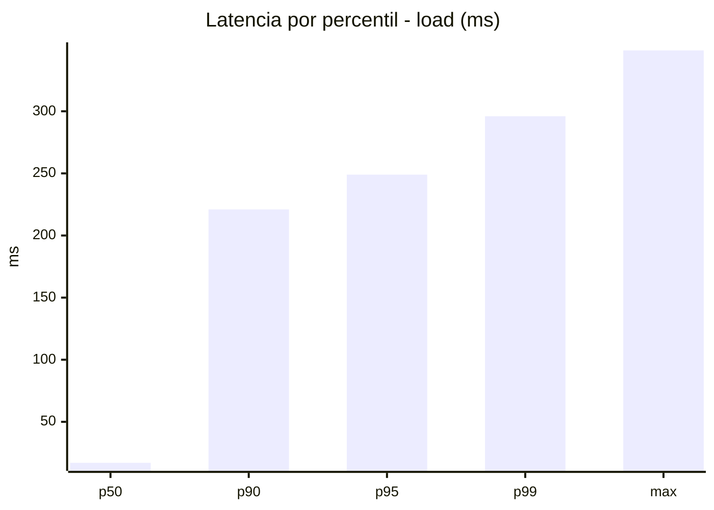
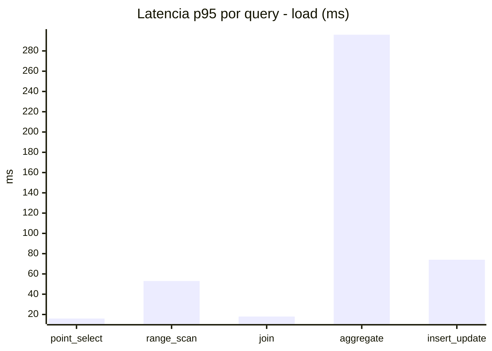
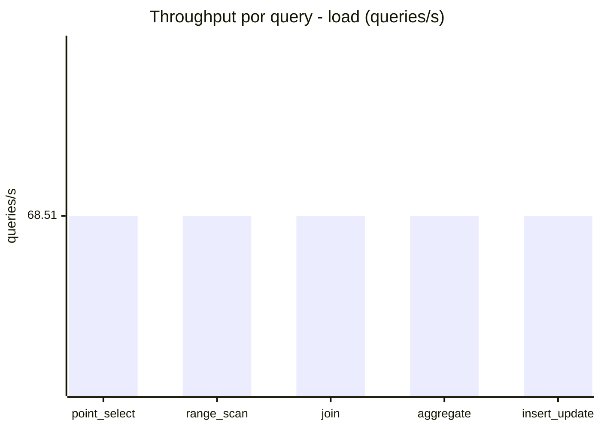
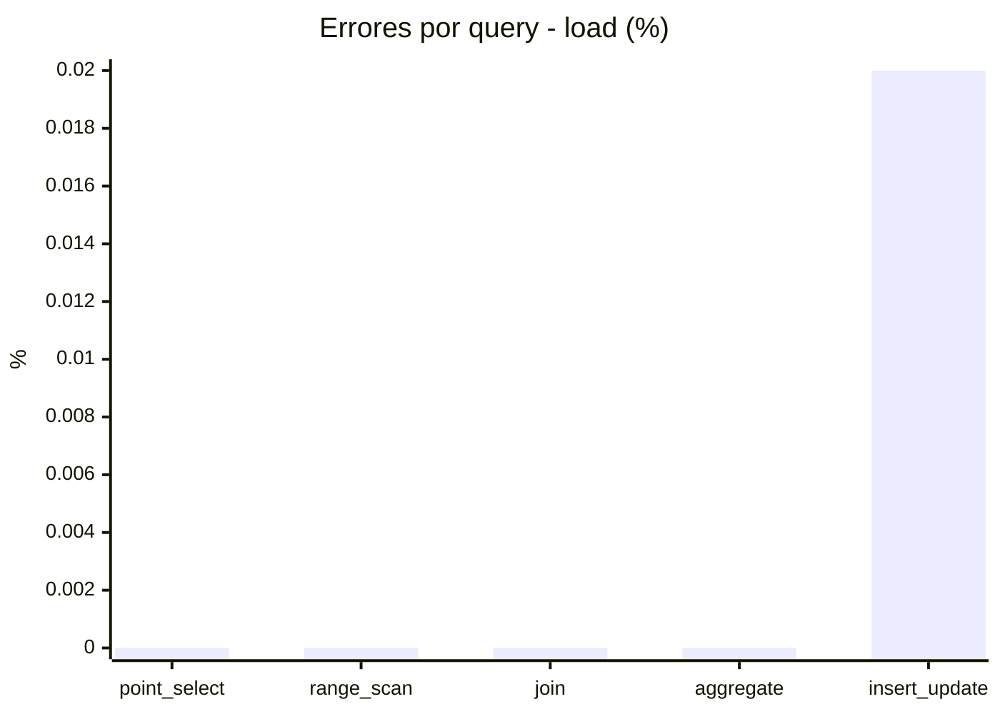
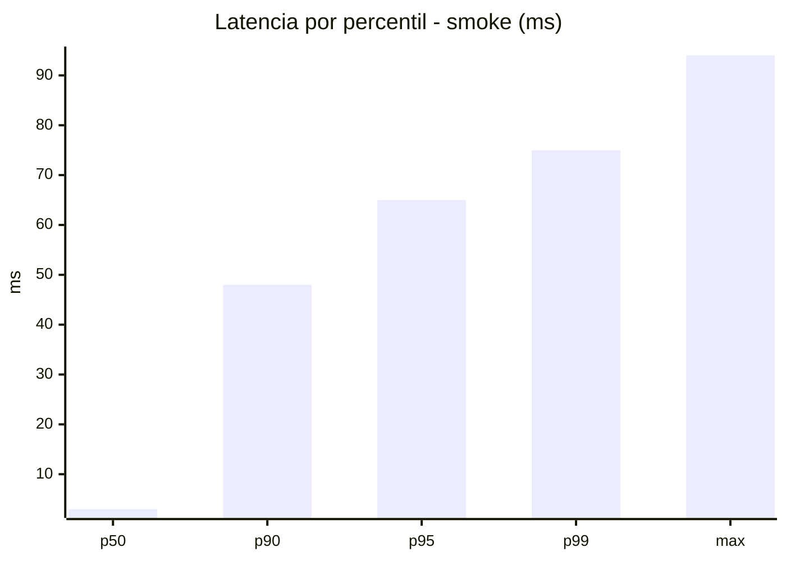
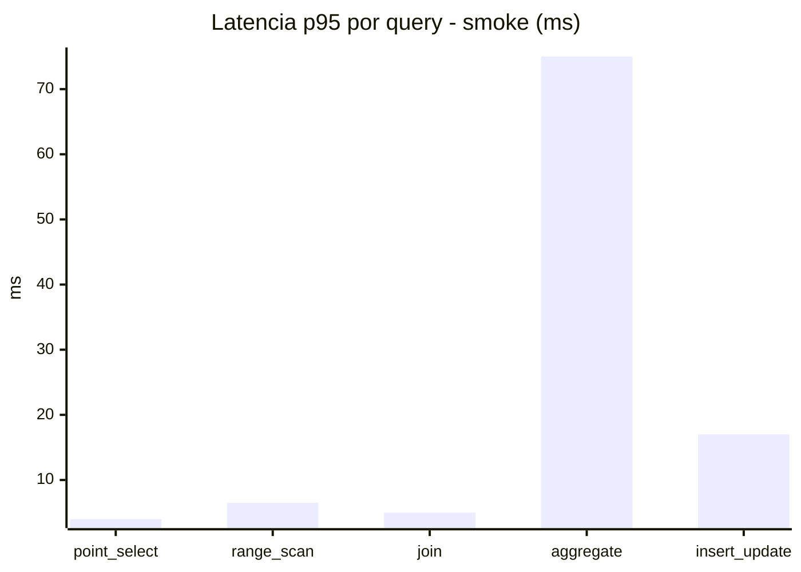
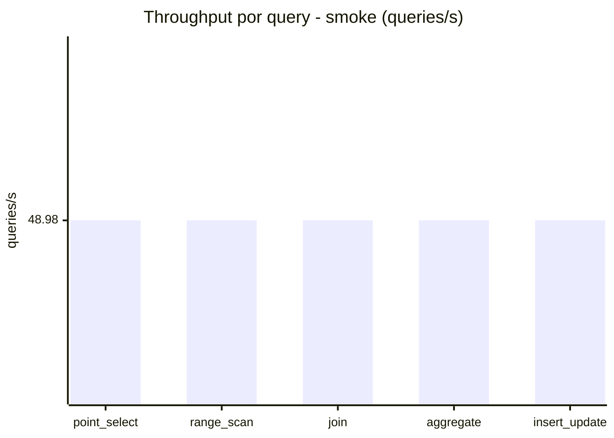
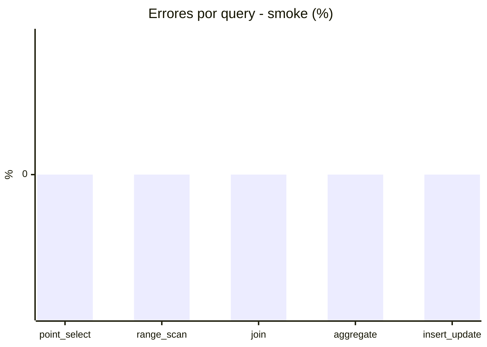

# Reporte de performance - SQL Server (k6)

**Fecha:** 2026-07-31 15:35 UTC  
**Veredicto (SLO):** `WARN`  
**Corrida:** [ver en GitHub Actions](https://github.com/lrbg/k6-sqlserver-lab/actions/runs/30643416728)  

## Analisis del agente de IA

WARN (fallback por umbrales)

- Error maximo: 0%
- p95 maximo: 249 ms

## Resultados

### Escenario: `load`

| Metrica | Valor |
| --- | --- |
| Queries ejecutadas | 20630 |
| Errores | 1 (0%) |
| Latencia media | 58.2 ms |
| p50 / p90 / p95 / p99 | 17 / 221 / 249 / 296 ms |
| Min / Max | 0 / 349 ms |
| Throughput | 342.53 queries/s |
| Duracion | 60.2 s |

Detalle por query

| Query | Ejecuciones | Error % | avg | p95 | p99 | q/s |
| --- | --- | --- | --- | --- | --- | --- |
| point_select | 4126 | 0% | 6 | 16 | 20 | 68.51 |
| range_scan | 4126 | 0% | 23.5 | 53 | 77 | 68.51 |
| join | 4126 | 0% | 8.7 | 18 | 21 | 68.51 |
| aggregate | 4126 | 0% | 218.2 | 296 | 315 | 68.51 |
| insert_update | 4126 | 0.02% | 34.8 | 74 | 93.8 | 68.51 |

### Escenario: `smoke`

| Metrica | Valor |
| --- | --- |
| Queries ejecutadas | 7350 |
| Errores | 0 (0%) |
| Latencia media | 12.2 ms |
| p50 / p90 / p95 / p99 | 3 / 48 / 65 / 75 ms |
| Min / Max | 0 / 94 ms |
| Throughput | 244.92 queries/s |
| Duracion | 30 s |

Detalle por query

| Query | Ejecuciones | Error % | avg | p95 | p99 | q/s |
| --- | --- | --- | --- | --- | --- | --- |
| point_select | 1470 | 0% | 0.8 | 4 | 5 | 48.98 |
| range_scan | 1470 | 0% | 3.1 | 6.5 | 11 | 48.98 |
| join | 1470 | 0% | 1.7 | 5 | 5 | 48.98 |
| aggregate | 1470 | 0% | 50 | 75 | 81 | 48.98 |
| insert_update | 1470 | 0% | 5.4 | 17 | 24 | 48.98 |

