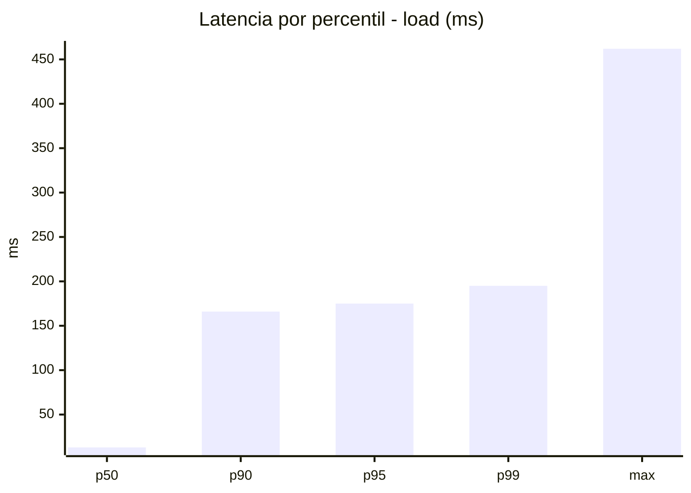
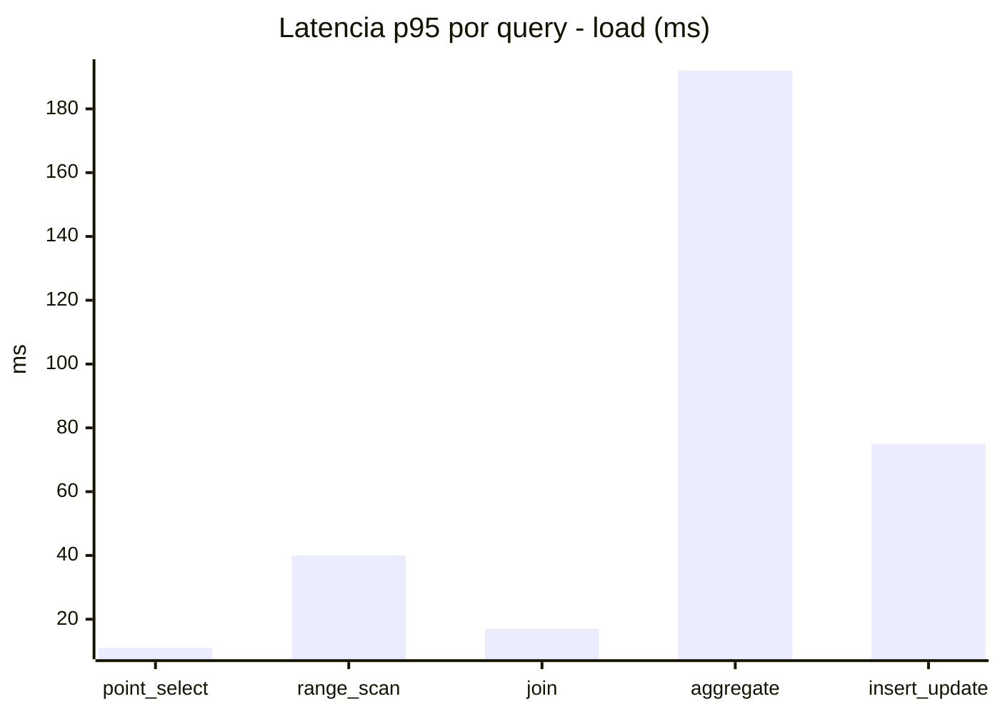
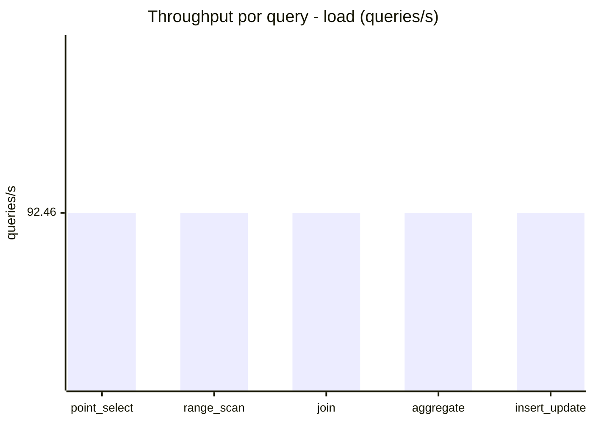
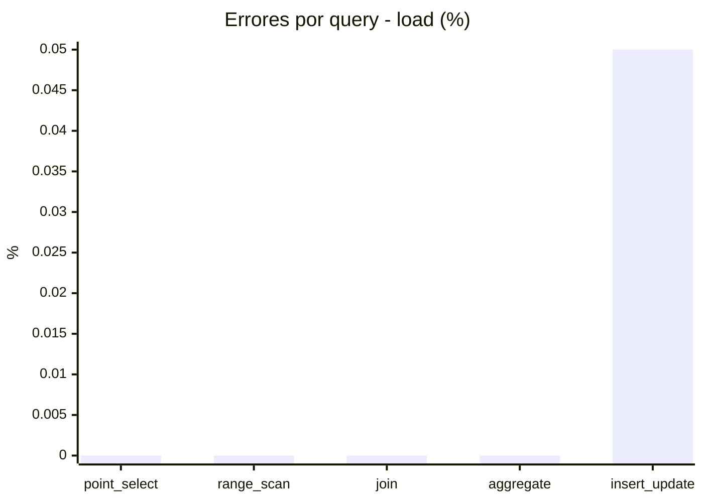
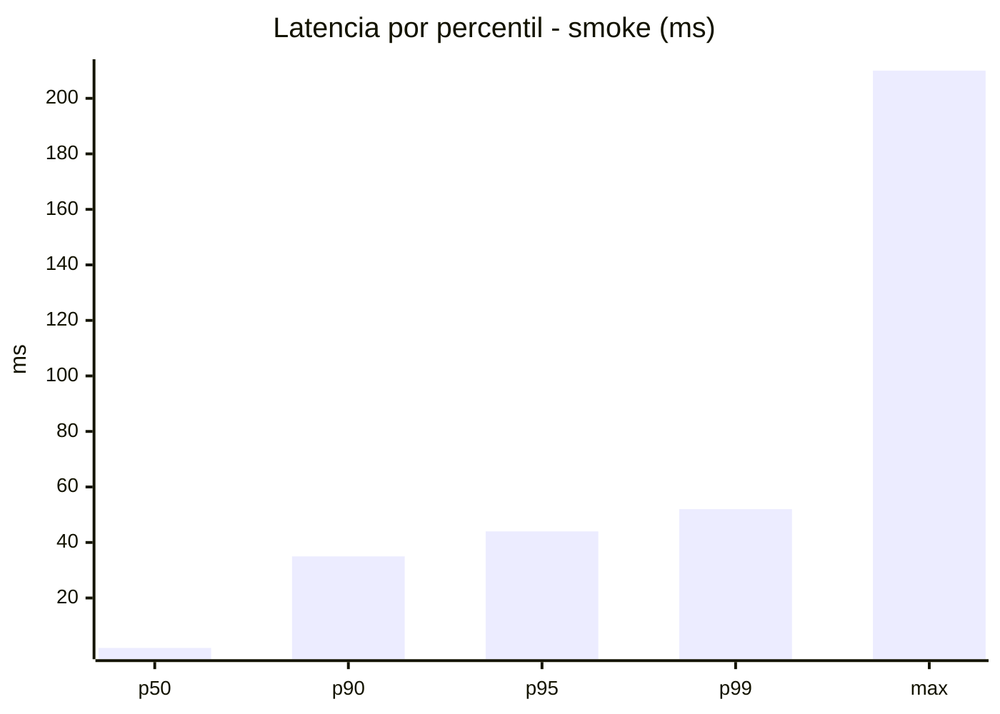
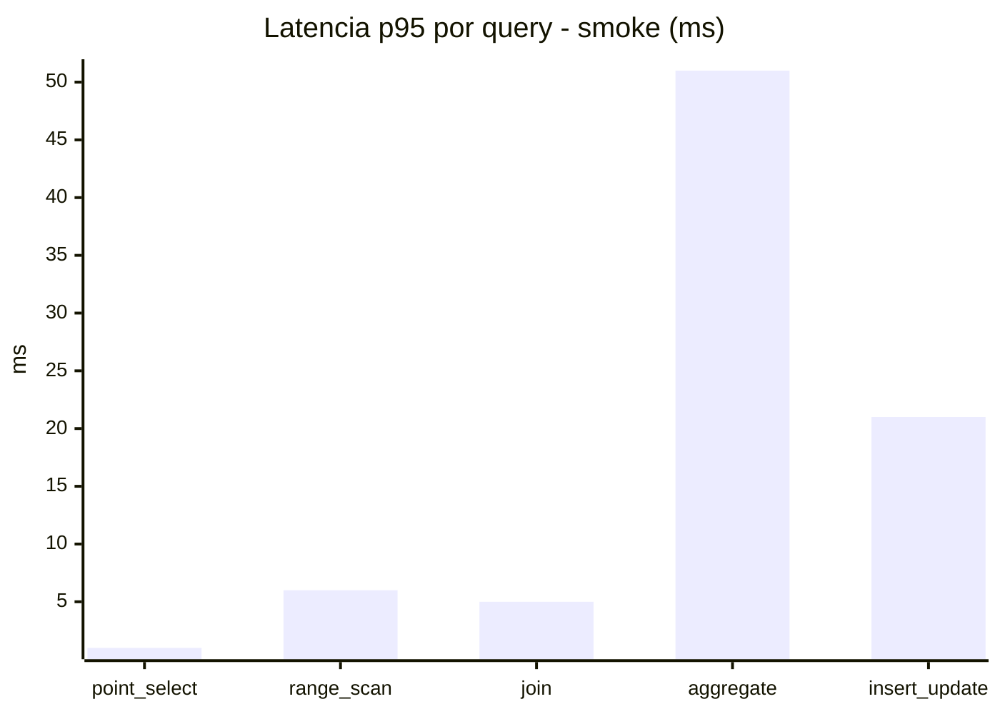
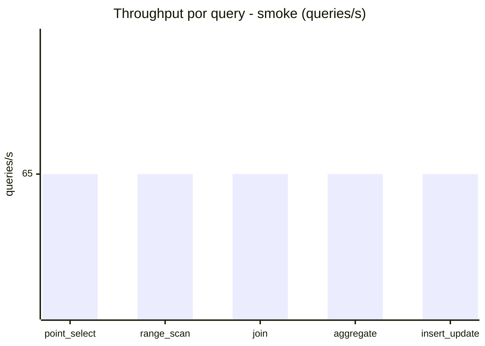
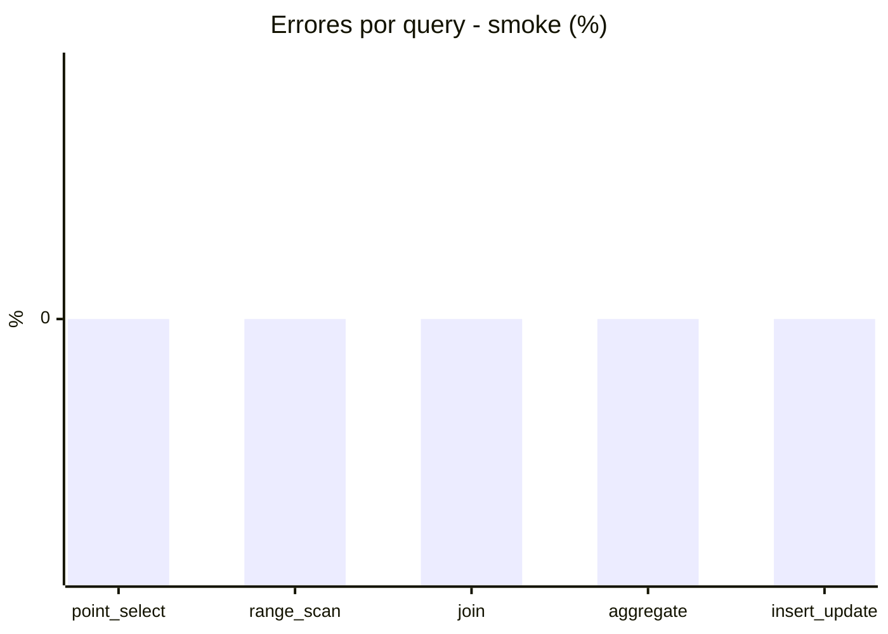

# Reporte de performance - SQL Server (k6)

**Fecha:** 2026-08-01 14:44 UTC  
**Veredicto (SLO):** `PASS`  
**Corrida:** [ver en GitHub Actions](https://github.com/lrbg/k6-sqlserver-lab/actions/runs/30704327437)  

## Analisis del agente de IA

PASS (fallback por umbrales)

- Error maximo: 0.01%
- p95 maximo: 175 ms

## Resultados

### Escenario: `load`

| Metrica | Valor |
| --- | --- |
| Queries ejecutadas | 27800 |
| Errores | 3 (0.01%) |
| Latencia media | 43.2 ms |
| p50 / p90 / p95 / p99 | 13 / 166 / 175 / 195 ms |
| Min / Max | 0 / 462 ms |
| Throughput | 462.32 queries/s |
| Duracion | 60.1 s |

Detalle por query

| Query | Ejecuciones | Error % | avg | p95 | p99 | q/s |
| --- | --- | --- | --- | --- | --- | --- |
| point_select | 5560 | 0% | 3.3 | 11 | 17 | 92.46 |
| range_scan | 5560 | 0% | 16.8 | 40 | 71.4 | 92.46 |
| join | 5560 | 0% | 6.6 | 17 | 19 | 92.46 |
| aggregate | 5560 | 0% | 157.3 | 192 | 211 | 92.46 |
| insert_update | 5560 | 0.05% | 32.1 | 75 | 184.8 | 92.46 |

### Escenario: `smoke`

| Metrica | Valor |
| --- | --- |
| Queries ejecutadas | 9775 |
| Errores | 0 (0%) |
| Latencia media | 9.2 ms |
| p50 / p90 / p95 / p99 | 2 / 35 / 44 / 52 ms |
| Min / Max | 0 / 210 ms |
| Throughput | 325.01 queries/s |
| Duracion | 30.1 s |

Detalle por query

| Query | Ejecuciones | Error % | avg | p95 | p99 | q/s |
| --- | --- | --- | --- | --- | --- | --- |
| point_select | 1955 | 0% | 0.6 | 1 | 4 | 65 |
| range_scan | 1955 | 0% | 2.6 | 6 | 11 | 65 |
| join | 1955 | 0% | 1.4 | 5 | 5 | 65 |
| aggregate | 1955 | 0% | 34.3 | 51 | 55.5 | 65 |
| insert_update | 1955 | 0% | 7.2 | 21 | 56.2 | 65 |

