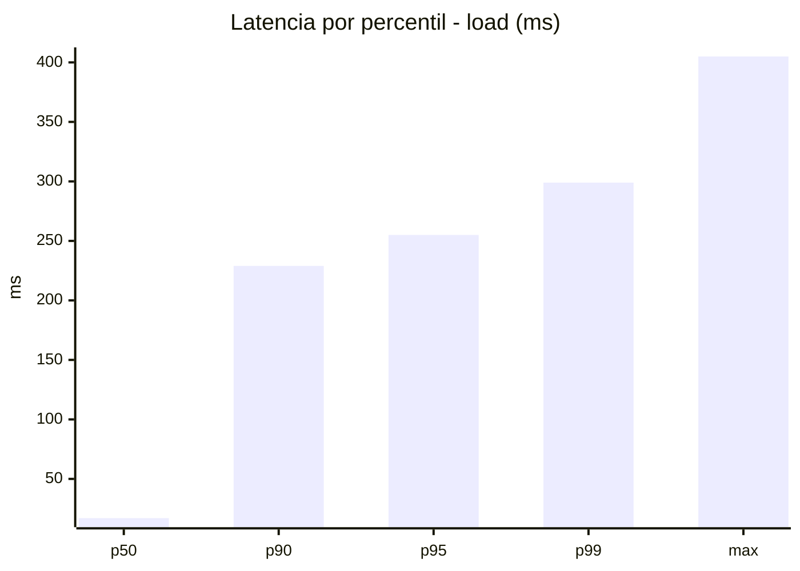
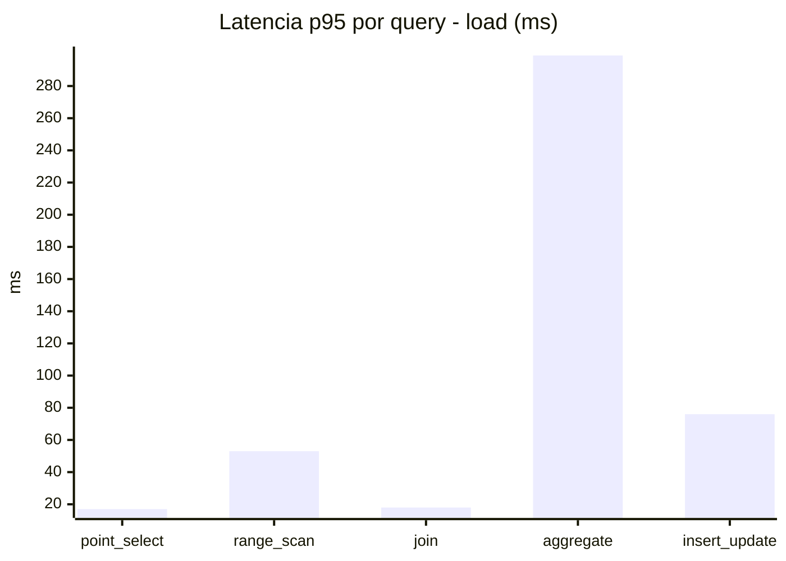
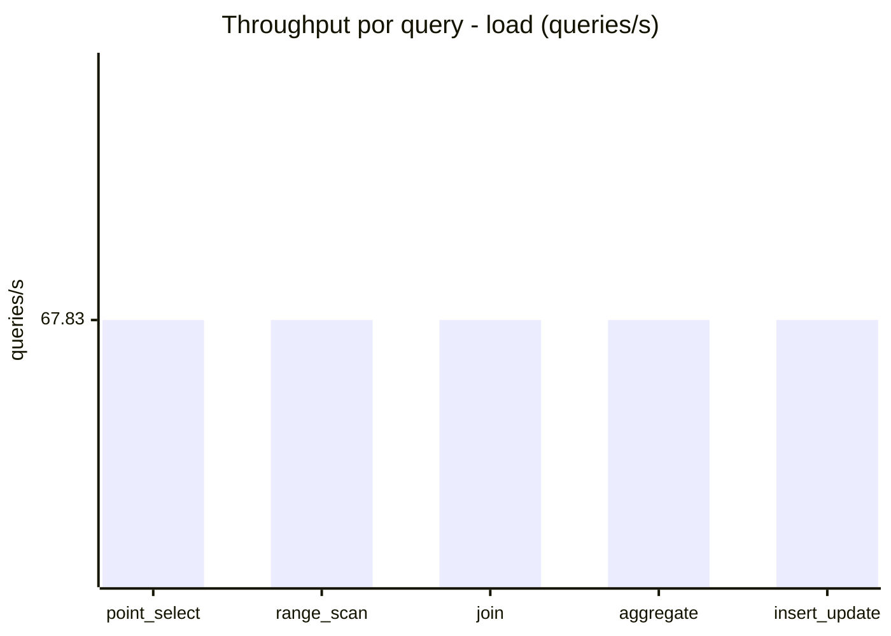
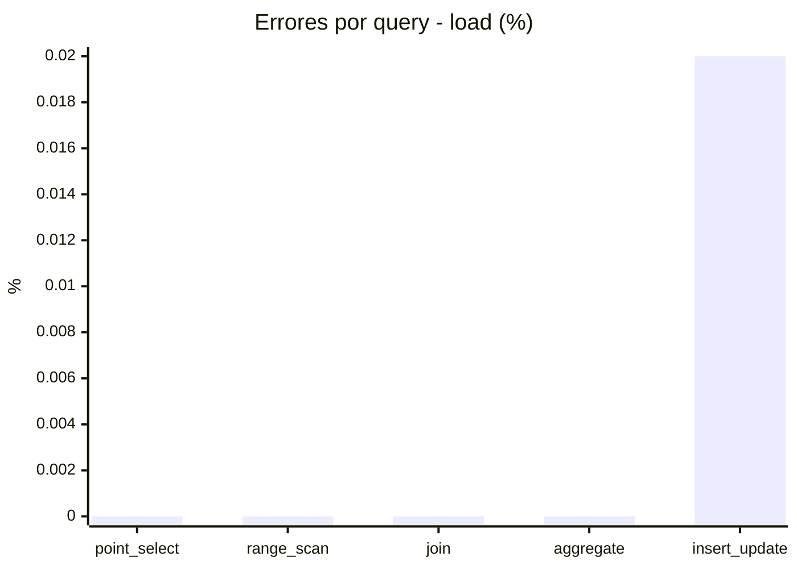
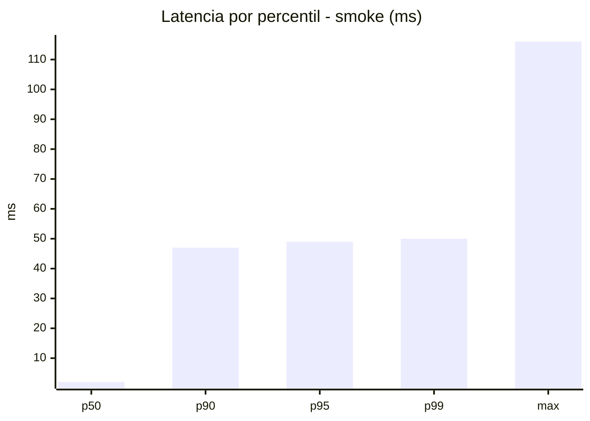
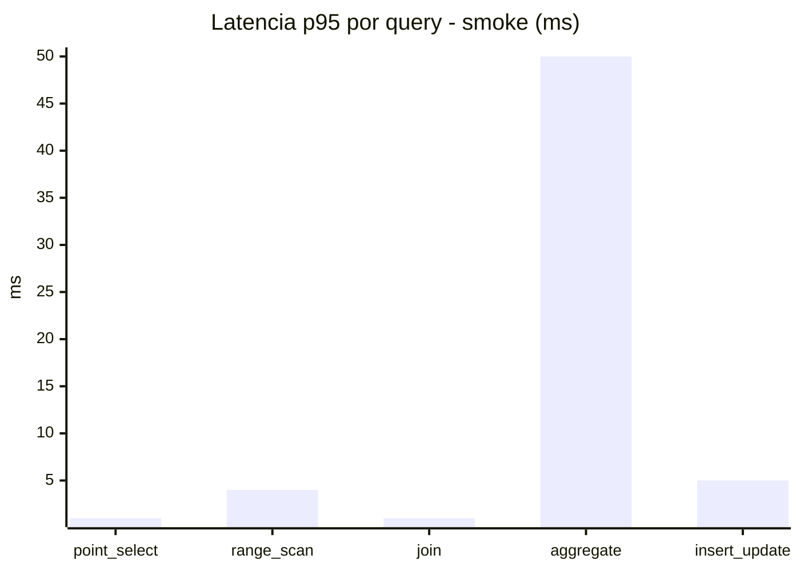
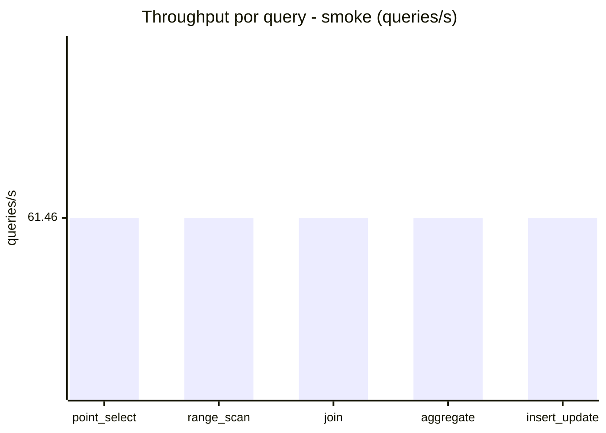
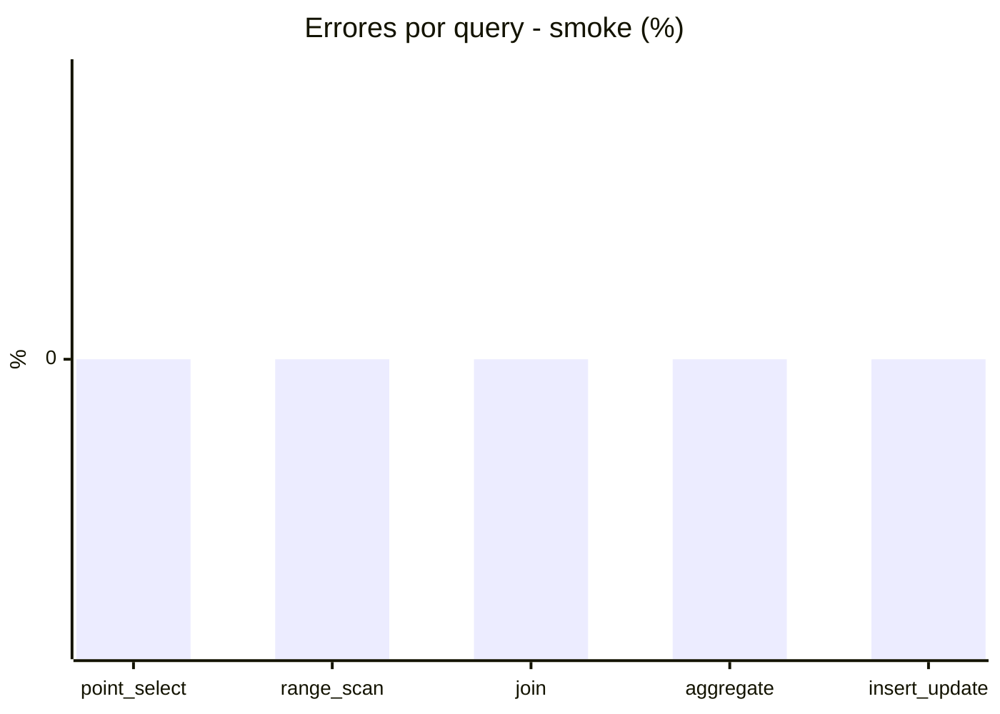

# Reporte de performance - SQL Server (k6)

**Fecha:** 2026-08-02 14:47 UTC  
**Veredicto (SLO):** `WARN`  
**Corrida:** [ver en GitHub Actions](https://github.com/lrbg/k6-sqlserver-lab/actions/runs/30752789210)  

## Analisis del agente de IA

WARN (fallback por umbrales)

- Error maximo: 0%
- p95 maximo: 255 ms

## Resultados

### Escenario: `load`

| Metrica | Valor |
| --- | --- |
| Queries ejecutadas | 20410 |
| Errores | 1 (0%) |
| Latencia media | 58.9 ms |
| p50 / p90 / p95 / p99 | 17 / 229 / 255 / 299 ms |
| Min / Max | 0 / 405 ms |
| Throughput | 339.17 queries/s |
| Duracion | 60.2 s |

Detalle por query

| Query | Ejecuciones | Error % | avg | p95 | p99 | q/s |
| --- | --- | --- | --- | --- | --- | --- |
| point_select | 4082 | 0% | 5.8 | 17 | 21 | 67.83 |
| range_scan | 4082 | 0% | 23 | 53 | 69.2 | 67.83 |
| join | 4082 | 0% | 8.5 | 18 | 22 | 67.83 |
| aggregate | 4082 | 0% | 223.2 | 299 | 320 | 67.83 |
| insert_update | 4082 | 0.02% | 33.9 | 76 | 94 | 67.83 |

### Escenario: `smoke`

| Metrica | Valor |
| --- | --- |
| Queries ejecutadas | 9230 |
| Errores | 0 (0%) |
| Latencia media | 9.7 ms |
| p50 / p90 / p95 / p99 | 2 / 47 / 49 / 50 ms |
| Min / Max | 0 / 116 ms |
| Throughput | 307.29 queries/s |
| Duracion | 30 s |

Detalle por query

| Query | Ejecuciones | Error % | avg | p95 | p99 | q/s |
| --- | --- | --- | --- | --- | --- | --- |
| point_select | 1846 | 0% | 0.5 | 1 | 2 | 61.46 |
| range_scan | 1846 | 0% | 2.8 | 4 | 9.1 | 61.46 |
| join | 1846 | 0% | 0.9 | 1 | 3 | 61.46 |
| aggregate | 1846 | 0% | 41.3 | 50 | 52 | 61.46 |
| insert_update | 1846 | 0% | 3.1 | 5 | 9.5 | 61.46 |

