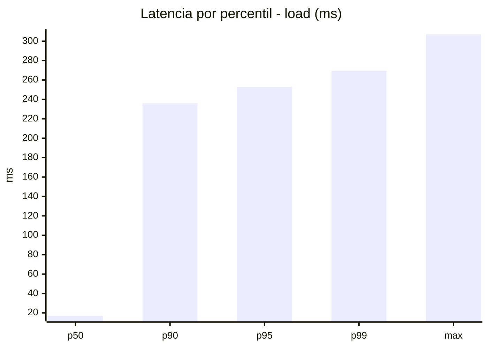
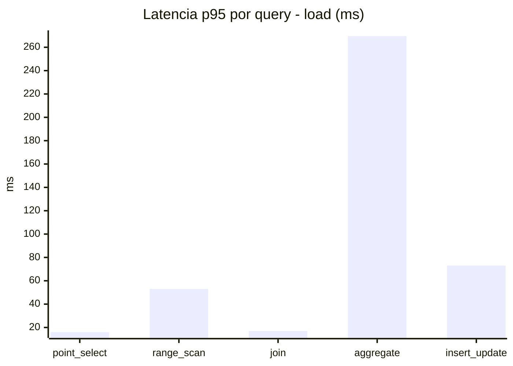
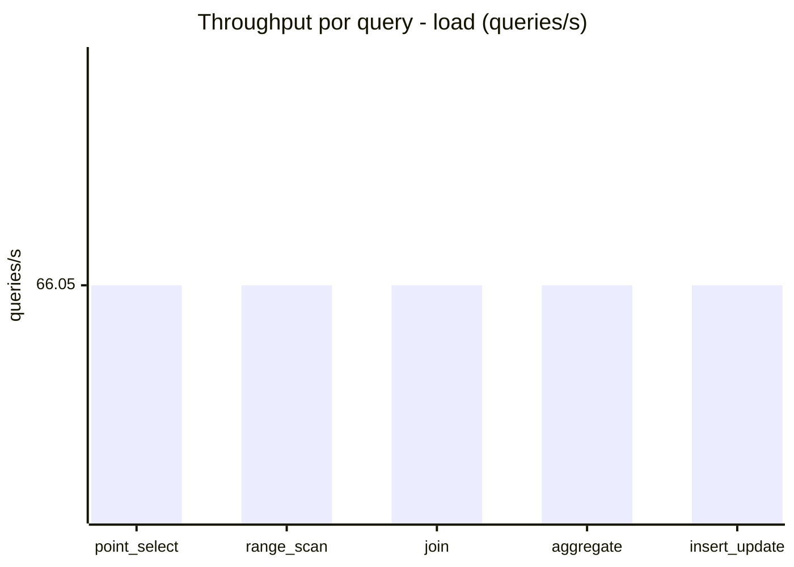
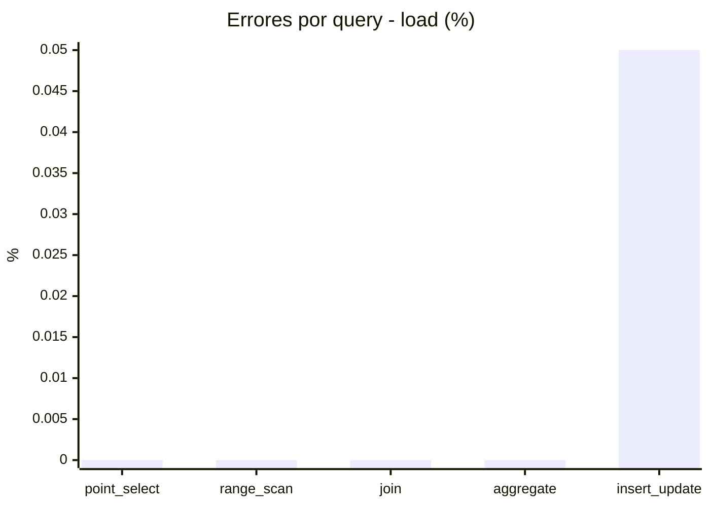
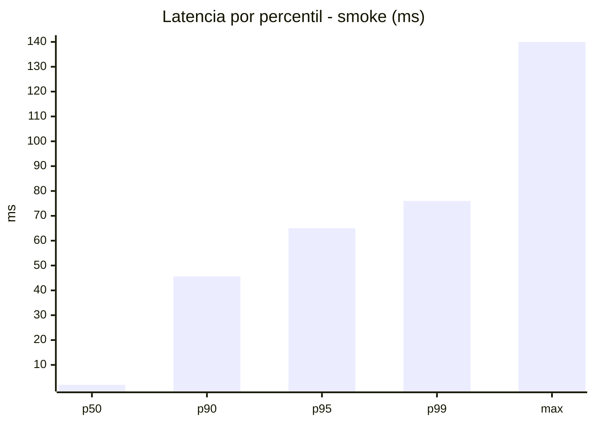
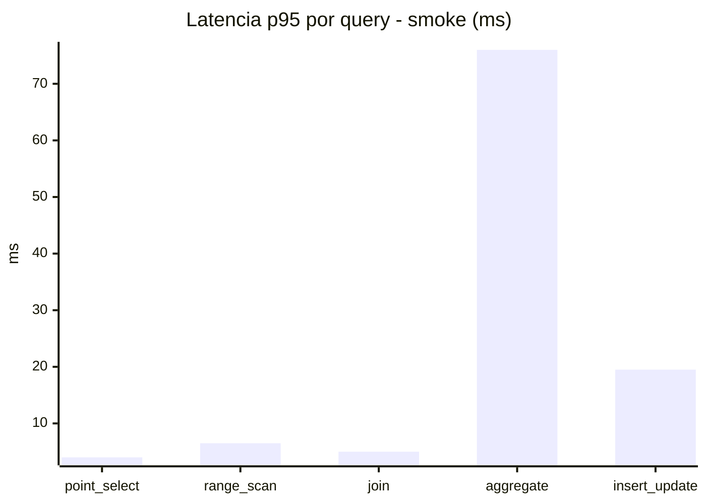
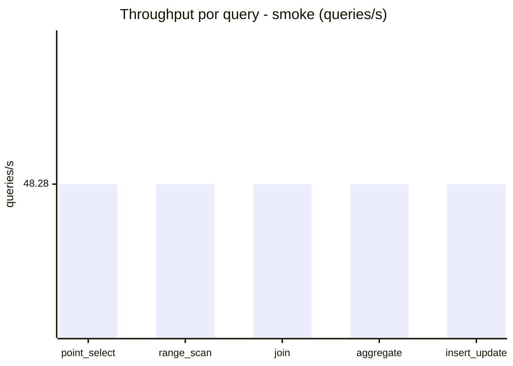
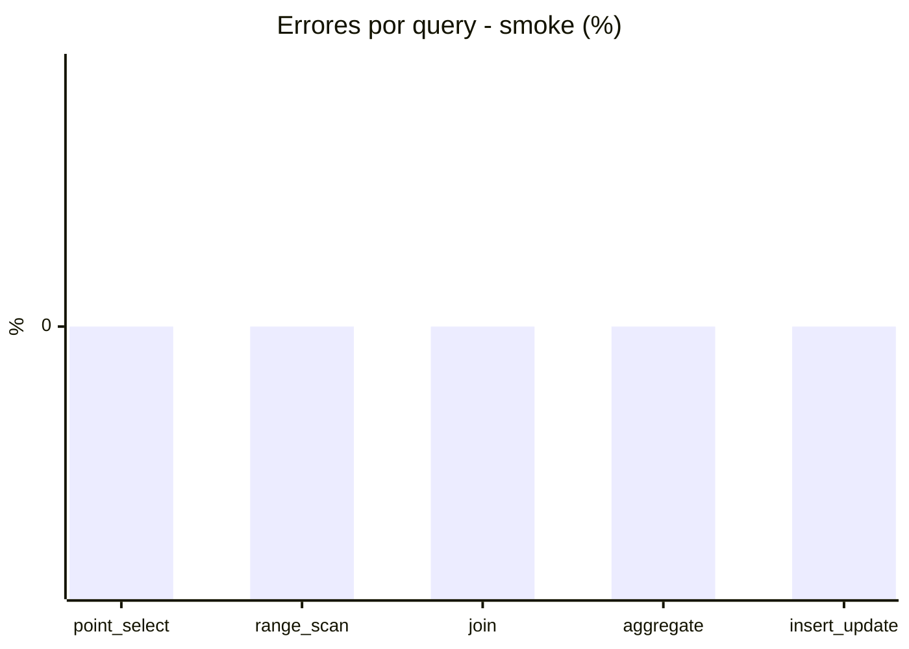

# Reporte de performance - SQL Server (k6)

**Fecha:** 2026-08-03 16:01 UTC  
**Veredicto (SLO):** `WARN`  
**Corrida:** [ver en GitHub Actions](https://github.com/lrbg/k6-sqlserver-lab/actions/runs/30830067936)  

## Analisis del agente de IA

WARN (fallback por umbrales)

- Error maximo: 0.01%
- p95 maximo: 253 ms

## Resultados

### Escenario: `load`

| Metrica | Valor |
| --- | --- |
| Queries ejecutadas | 19855 |
| Errores | 2 (0.01%) |
| Latencia media | 60.5 ms |
| p50 / p90 / p95 / p99 | 17 / 236 / 253 / 269.5 ms |
| Min / Max | 0 / 307 ms |
| Throughput | 330.25 queries/s |
| Duracion | 60.1 s |

Detalle por query

| Query | Ejecuciones | Error % | avg | p95 | p99 | q/s |
| --- | --- | --- | --- | --- | --- | --- |
| point_select | 3971 | 0% | 5.9 | 16 | 18 | 66.05 |
| range_scan | 3971 | 0% | 25.4 | 53 | 77 | 66.05 |
| join | 3971 | 0% | 8.5 | 17 | 19 | 66.05 |
| aggregate | 3971 | 0% | 227.8 | 269.5 | 281.3 | 66.05 |
| insert_update | 3971 | 0.05% | 34.8 | 73 | 96 | 66.05 |

### Escenario: `smoke`

| Metrica | Valor |
| --- | --- |
| Queries ejecutadas | 7255 |
| Errores | 0 (0%) |
| Latencia media | 12.4 ms |
| p50 / p90 / p95 / p99 | 2 / 45.6 / 65 / 76 ms |
| Min / Max | 0 / 140 ms |
| Throughput | 241.4 queries/s |
| Duracion | 30.1 s |

Detalle por query

| Query | Ejecuciones | Error % | avg | p95 | p99 | q/s |
| --- | --- | --- | --- | --- | --- | --- |
| point_select | 1451 | 0% | 0.9 | 4 | 5 | 48.28 |
| range_scan | 1451 | 0% | 3.2 | 6.5 | 10 | 48.28 |
| join | 1451 | 0% | 1.7 | 5 | 5 | 48.28 |
| aggregate | 1451 | 0% | 50.5 | 76 | 82 | 48.28 |
| insert_update | 1451 | 0% | 5.5 | 19.5 | 25 | 48.28 |

