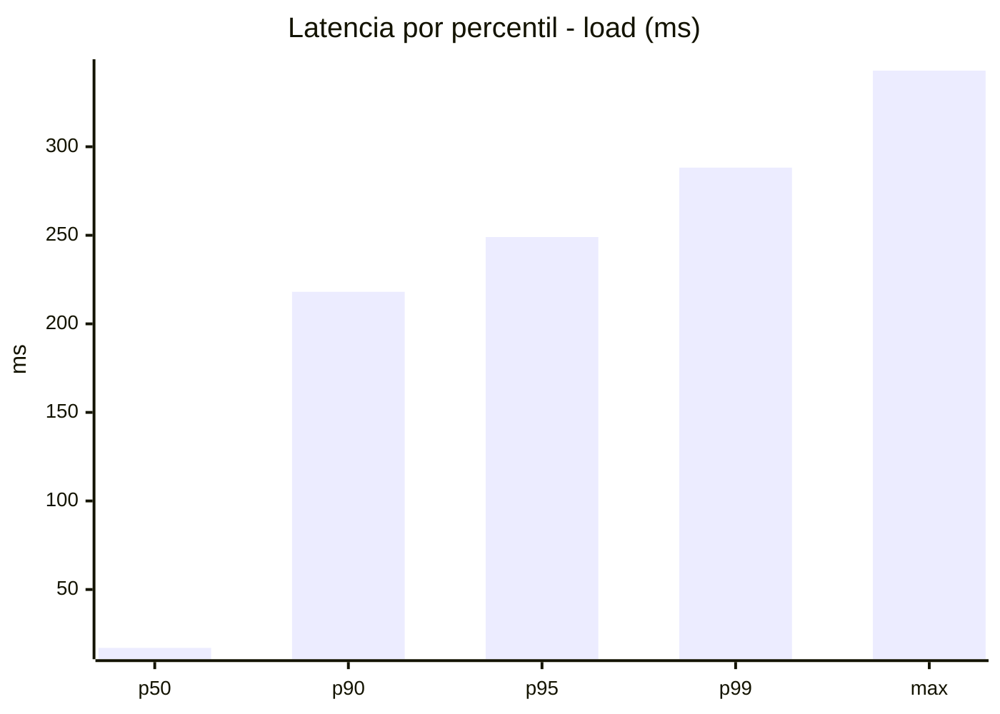
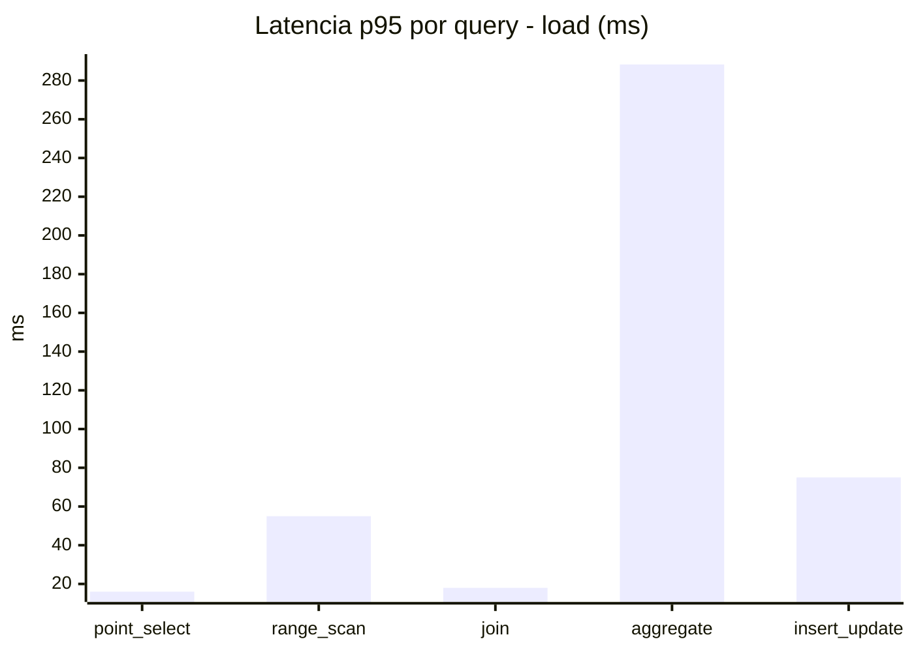
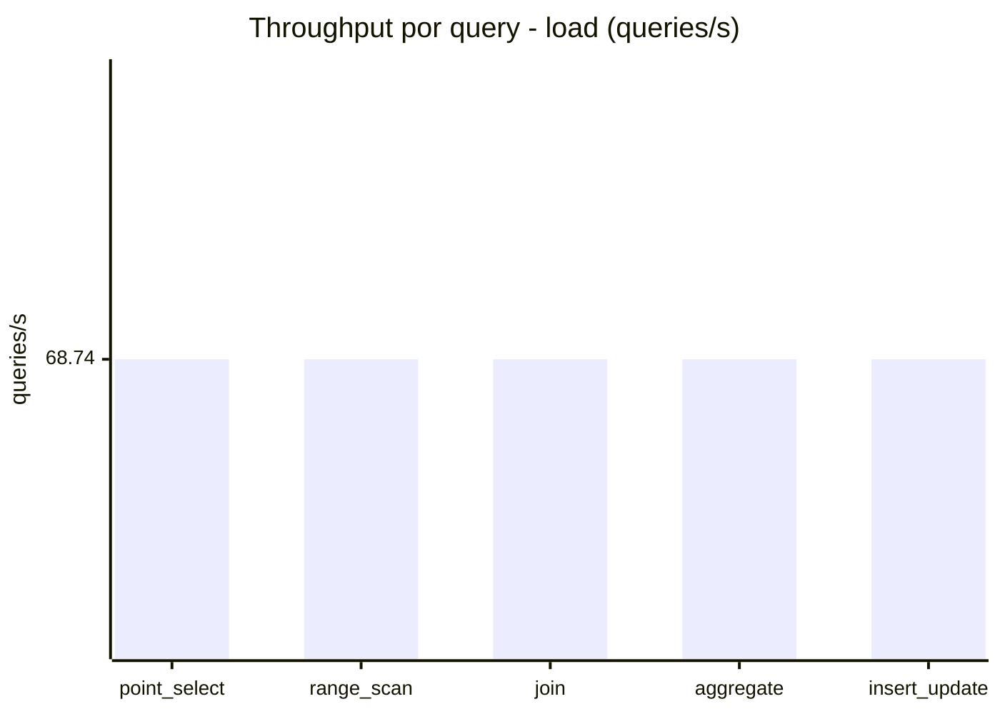
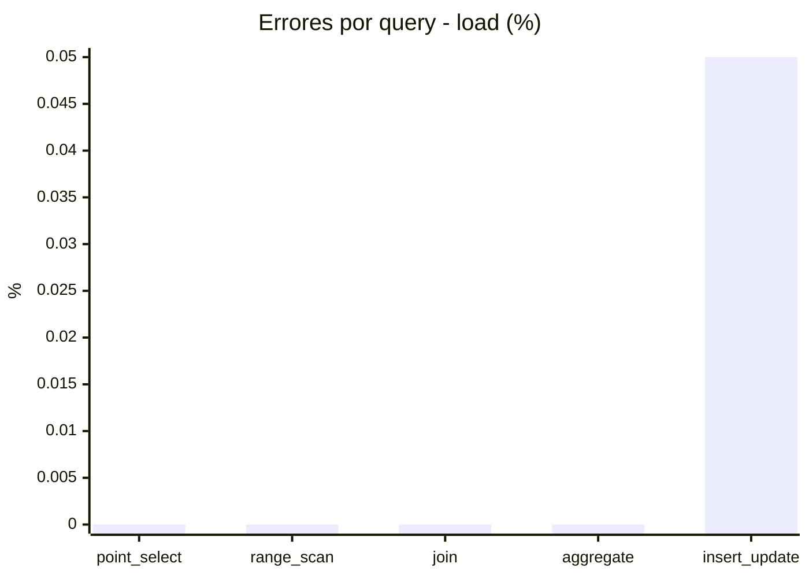
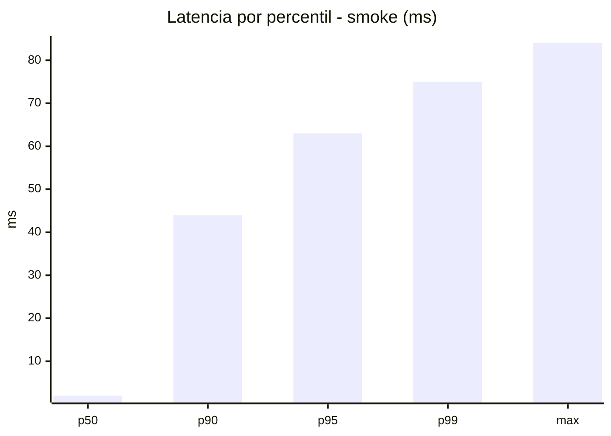
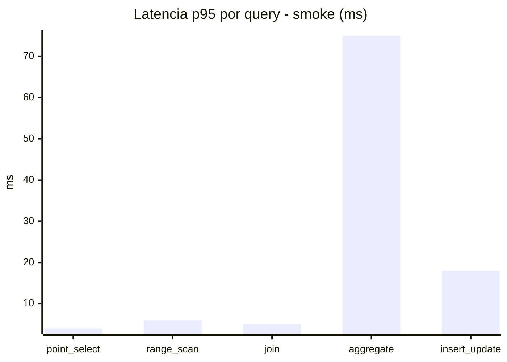
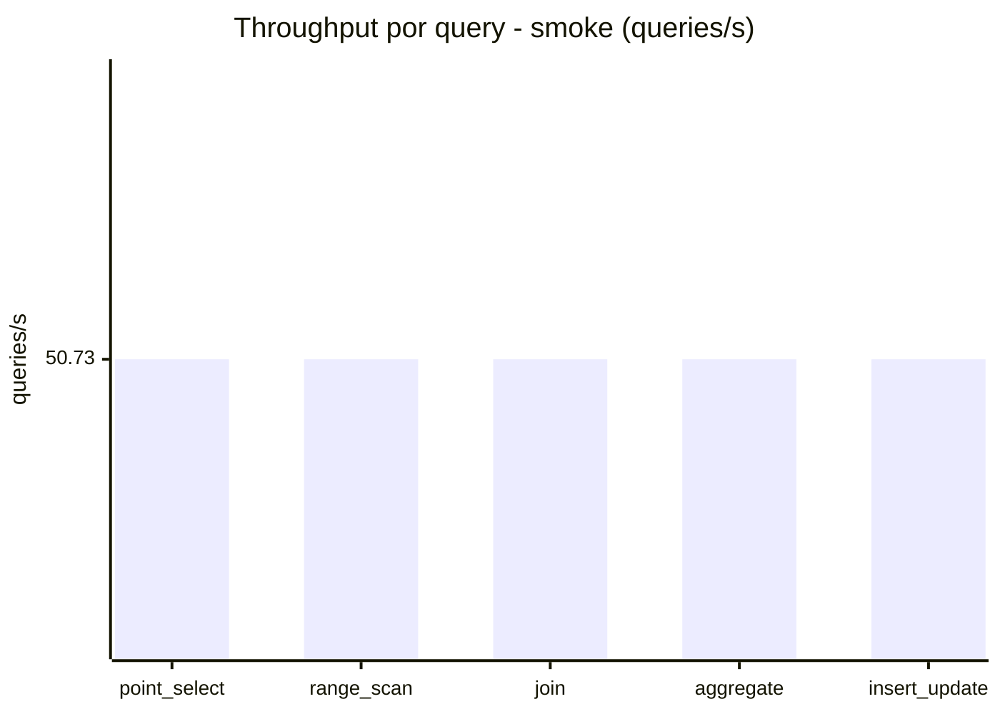
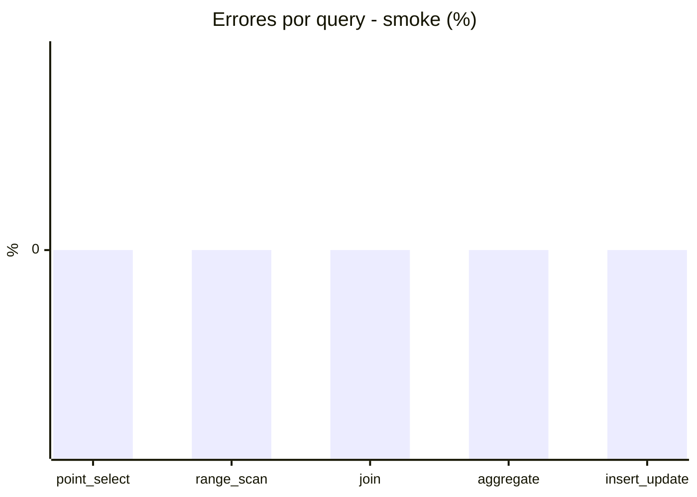

# Reporte de performance - SQL Server (k6)

**Fecha:** 2026-08-04 15:43 UTC  
**Veredicto (SLO):** `WARN`  
**Corrida:** [ver en GitHub Actions](https://github.com/lrbg/k6-sqlserver-lab/actions/runs/30925441937)  

## Analisis del agente de IA

WARN (fallback por umbrales)

- Error maximo: 0.01%
- p95 maximo: 249 ms

## Resultados

### Escenario: `load`

| Metrica | Valor |
| --- | --- |
| Queries ejecutadas | 20680 |
| Errores | 2 (0.01%) |
| Latencia media | 58.1 ms |
| p50 / p90 / p95 / p99 | 17 / 218.1 / 249 / 288.2 ms |
| Min / Max | 0 / 343 ms |
| Throughput | 343.7 queries/s |
| Duracion | 60.2 s |

Detalle por query

| Query | Ejecuciones | Error % | avg | p95 | p99 | q/s |
| --- | --- | --- | --- | --- | --- | --- |
| point_select | 4136 | 0% | 6 | 16 | 20 | 68.74 |
| range_scan | 4136 | 0% | 24.8 | 55 | 72 | 68.74 |
| join | 4136 | 0% | 8.6 | 18 | 21 | 68.74 |
| aggregate | 4136 | 0% | 214.5 | 288.3 | 307 | 68.74 |
| insert_update | 4136 | 0.05% | 36.7 | 75 | 92.7 | 68.74 |

### Escenario: `smoke`

| Metrica | Valor |
| --- | --- |
| Queries ejecutadas | 7625 |
| Errores | 0 (0%) |
| Latencia media | 11.8 ms |
| p50 / p90 / p95 / p99 | 2 / 44 / 63 / 75 ms |
| Min / Max | 0 / 84 ms |
| Throughput | 253.65 queries/s |
| Duracion | 30.1 s |

Detalle por query

| Query | Ejecuciones | Error % | avg | p95 | p99 | q/s |
| --- | --- | --- | --- | --- | --- | --- |
| point_select | 1525 | 0% | 0.8 | 4 | 5 | 50.73 |
| range_scan | 1525 | 0% | 3 | 6 | 10 | 50.73 |
| join | 1525 | 0% | 1.6 | 5 | 5 | 50.73 |
| aggregate | 1525 | 0% | 48.5 | 75 | 79 | 50.73 |
| insert_update | 1525 | 0% | 5.1 | 18 | 24.8 | 50.73 |

