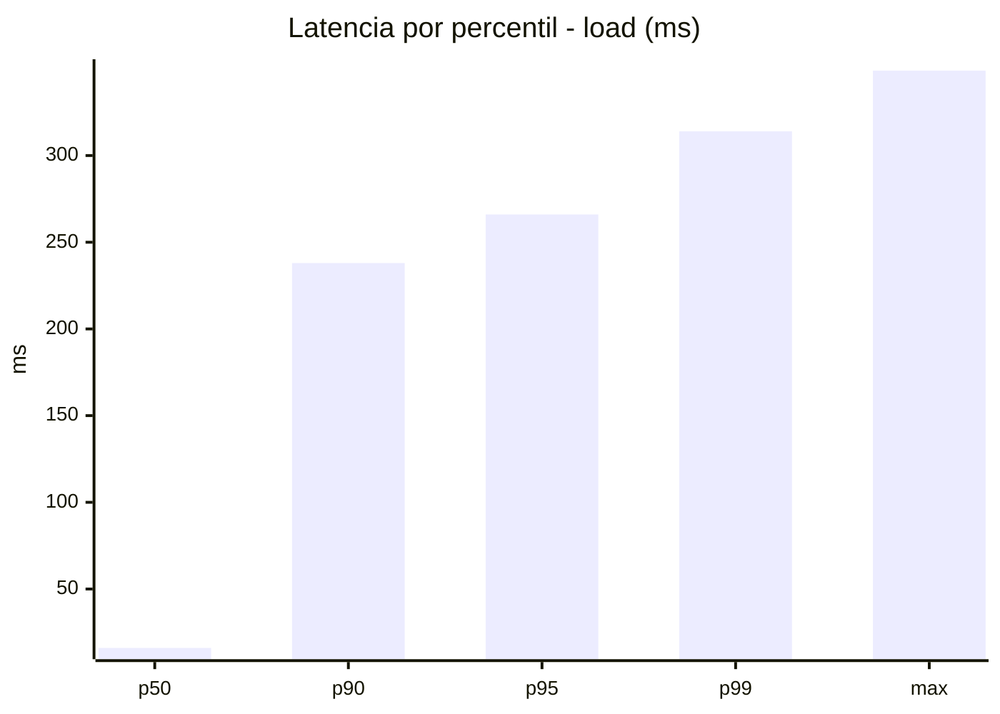
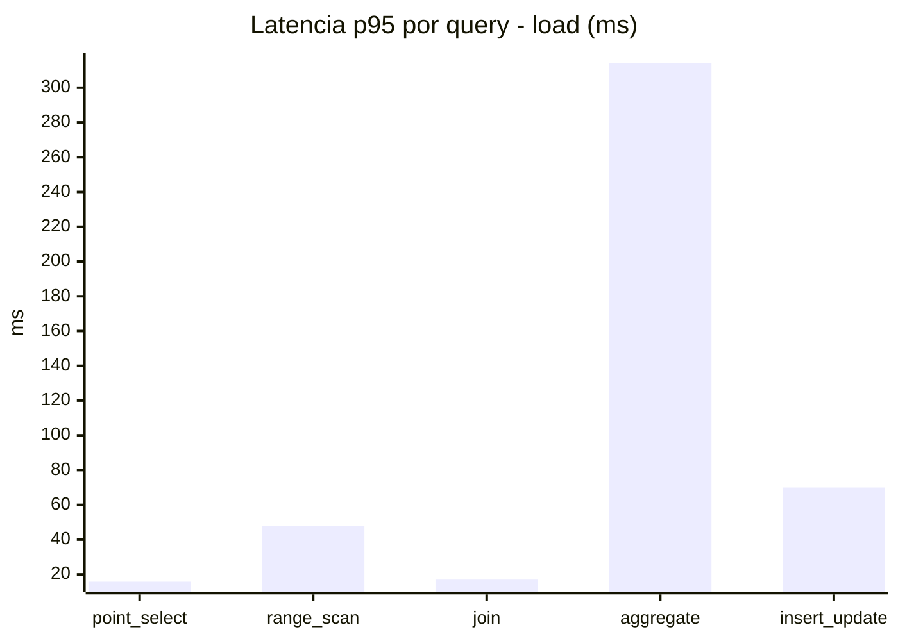
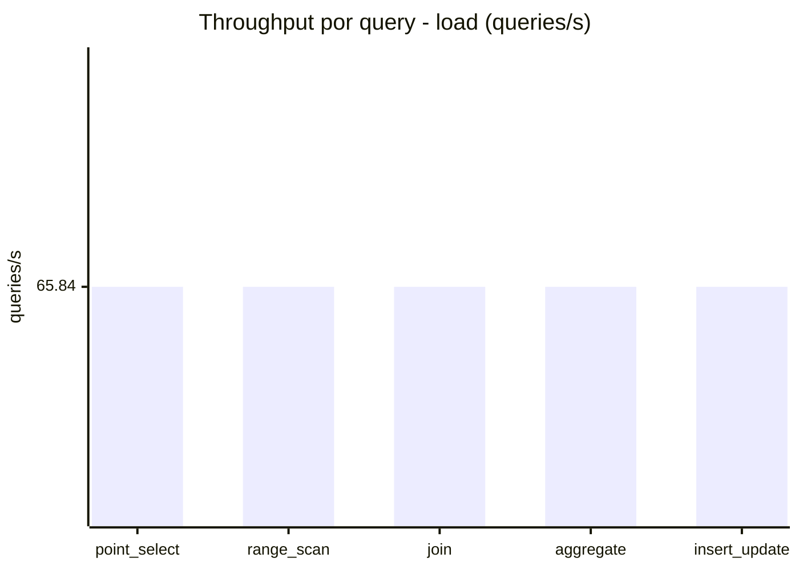
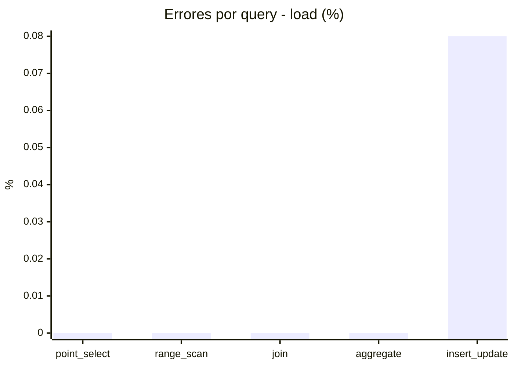
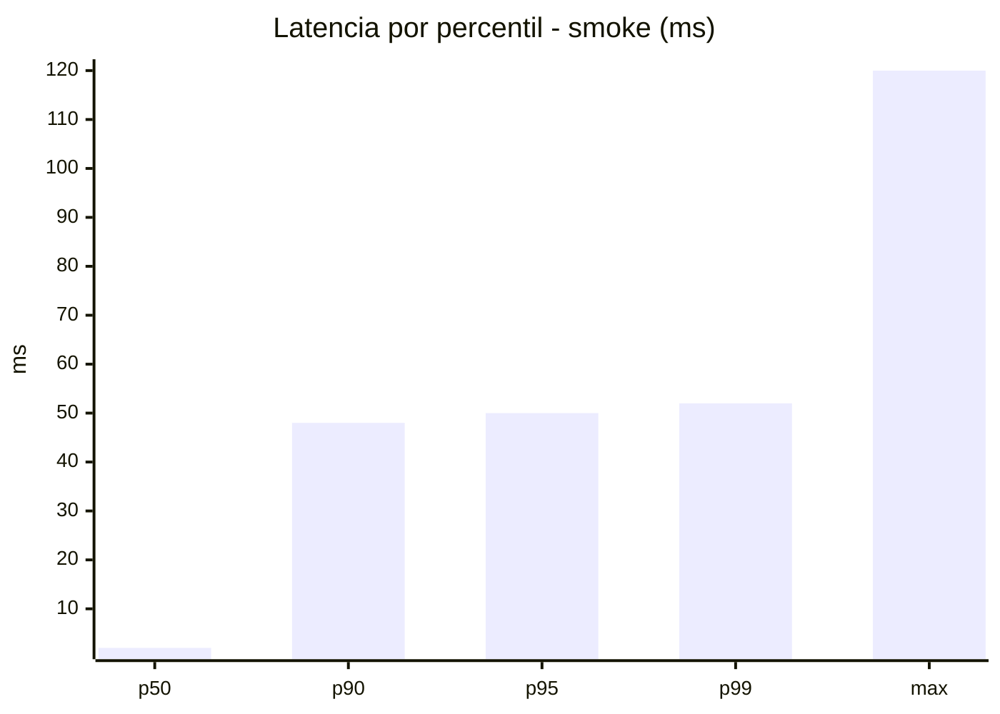
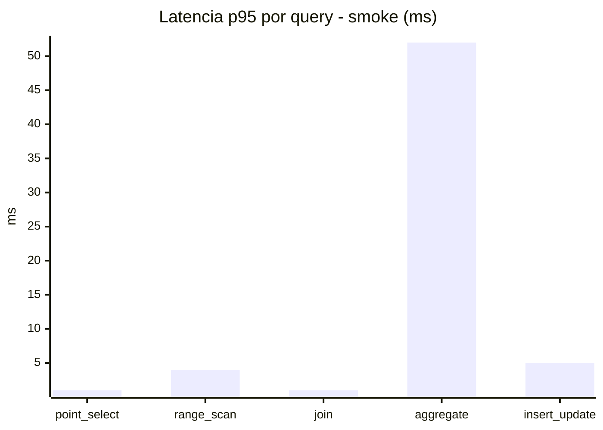
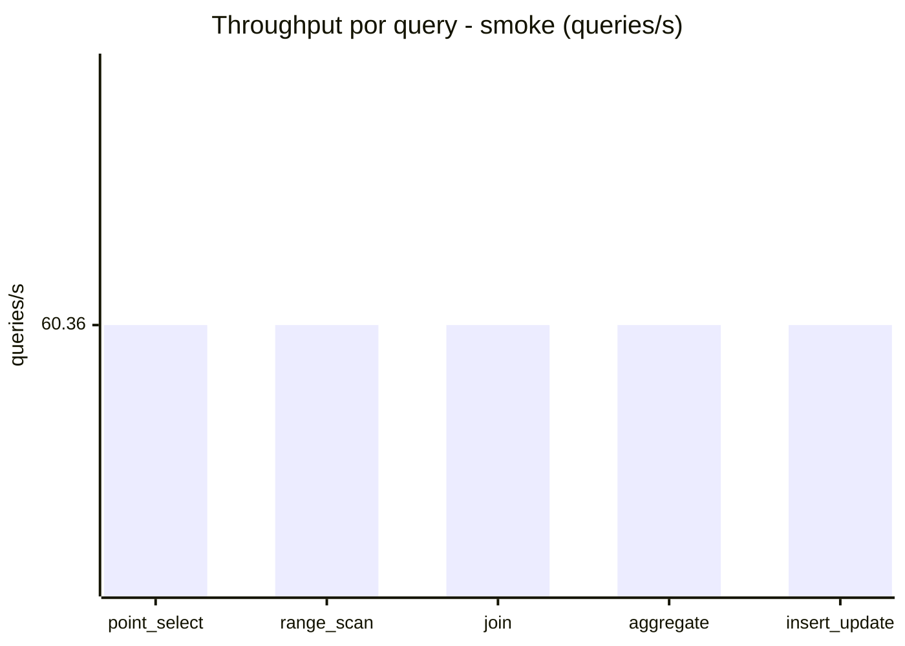
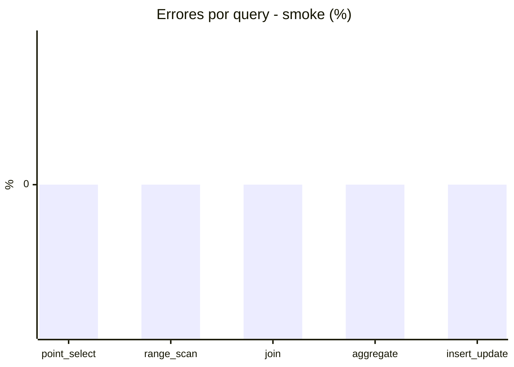

# Reporte de performance - SQL Server (k6)

**Fecha:** 2026-08-05 15:36 UTC  
**Veredicto (SLO):** `WARN`  
**Corrida:** [ver en GitHub Actions](https://github.com/lrbg/k6-sqlserver-lab/actions/runs/31020947160)  

## Analisis del agente de IA

WARN (fallback por umbrales)

- Error maximo: 0.02%
- p95 maximo: 266 ms

## Resultados

### Escenario: `load`

| Metrica | Valor |
| --- | --- |
| Queries ejecutadas | 19820 |
| Errores | 3 (0.02%) |
| Latencia media | 60.6 ms |
| p50 / p90 / p95 / p99 | 16 / 238 / 266 / 314 ms |
| Min / Max | 0 / 349 ms |
| Throughput | 329.22 queries/s |
| Duracion | 60.2 s |

Detalle por query

| Query | Ejecuciones | Error % | avg | p95 | p99 | q/s |
| --- | --- | --- | --- | --- | --- | --- |
| point_select | 3964 | 0% | 5.6 | 15.8 | 20 | 65.84 |
| range_scan | 3964 | 0% | 21.3 | 48 | 68 | 65.84 |
| join | 3964 | 0% | 8.8 | 17 | 21 | 65.84 |
| aggregate | 3964 | 0% | 234.6 | 314 | 328 | 65.84 |
| insert_update | 3964 | 0.08% | 32.7 | 70 | 86 | 65.84 |

### Escenario: `smoke`

| Metrica | Valor |
| --- | --- |
| Queries ejecutadas | 9065 |
| Errores | 0 (0%) |
| Latencia media | 9.9 ms |
| p50 / p90 / p95 / p99 | 2 / 48 / 50 / 52 ms |
| Min / Max | 0 / 120 ms |
| Throughput | 301.81 queries/s |
| Duracion | 30 s |

Detalle por query

| Query | Ejecuciones | Error % | avg | p95 | p99 | q/s |
| --- | --- | --- | --- | --- | --- | --- |
| point_select | 1813 | 0% | 0.6 | 1 | 2 | 60.36 |
| range_scan | 1813 | 0% | 2.9 | 4 | 9 | 60.36 |
| join | 1813 | 0% | 0.9 | 1 | 3 | 60.36 |
| aggregate | 1813 | 0% | 42.1 | 52 | 53 | 60.36 |
| insert_update | 1813 | 0% | 3 | 5 | 12 | 60.36 |

