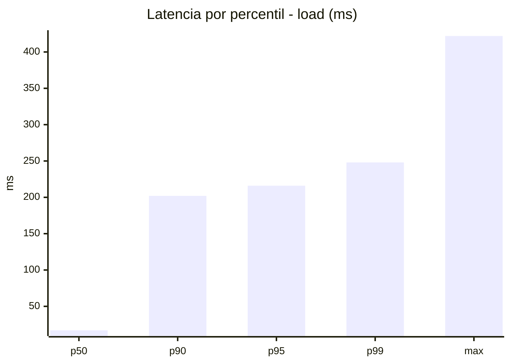
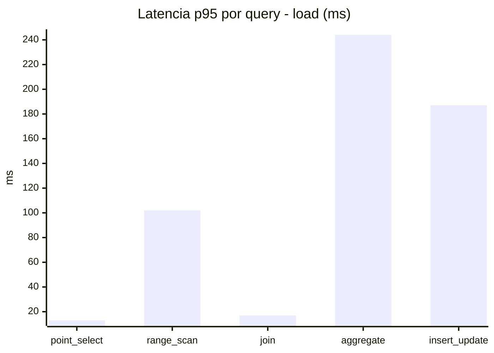
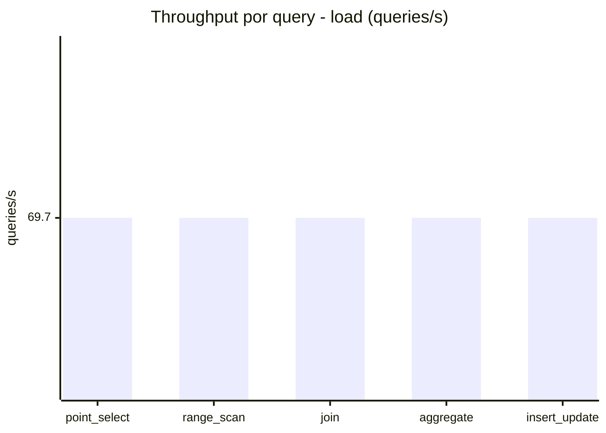
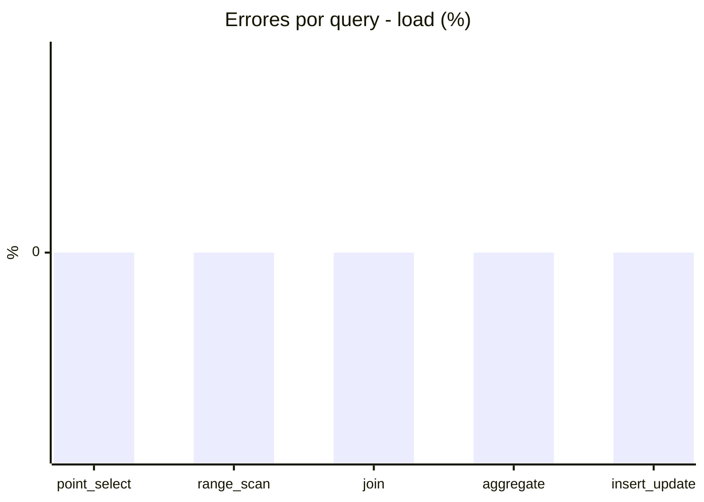
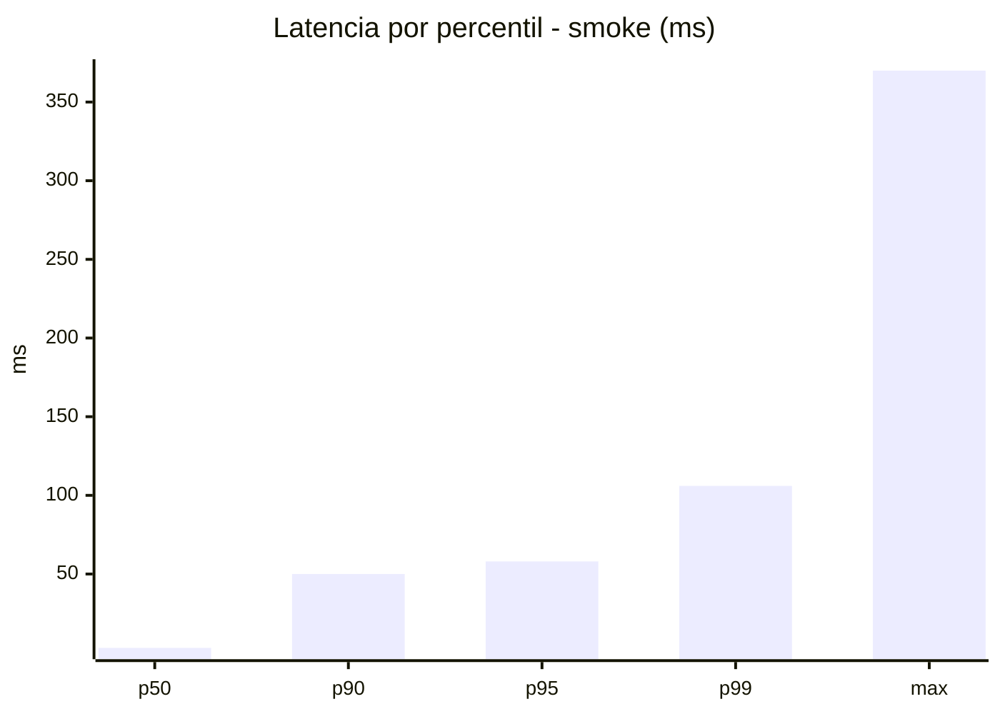
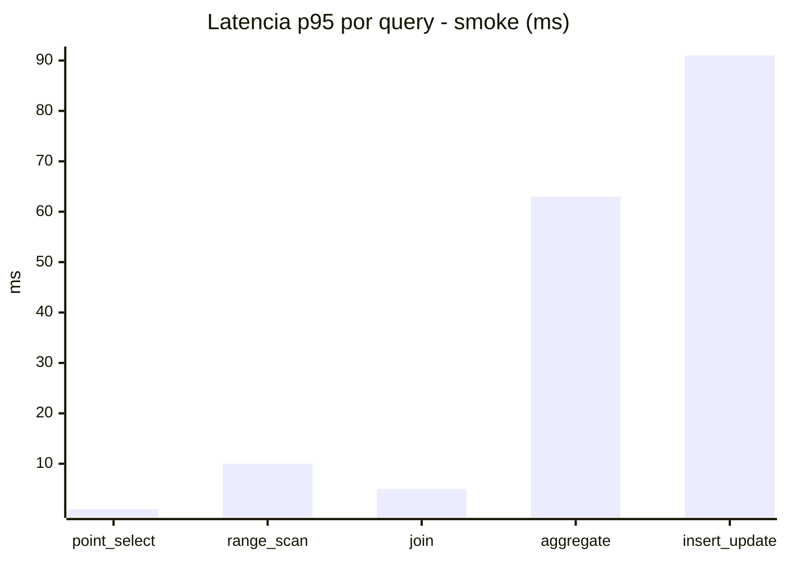
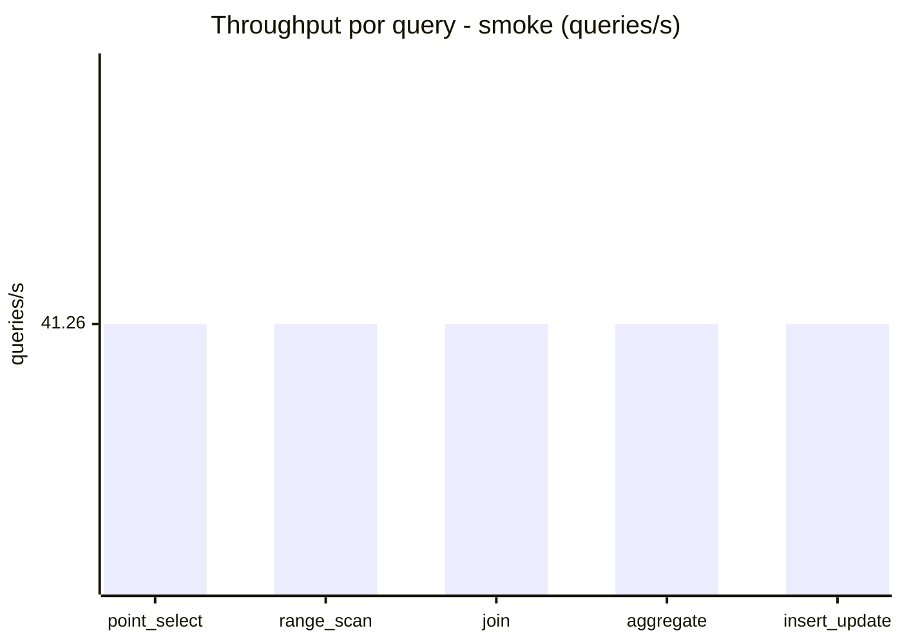
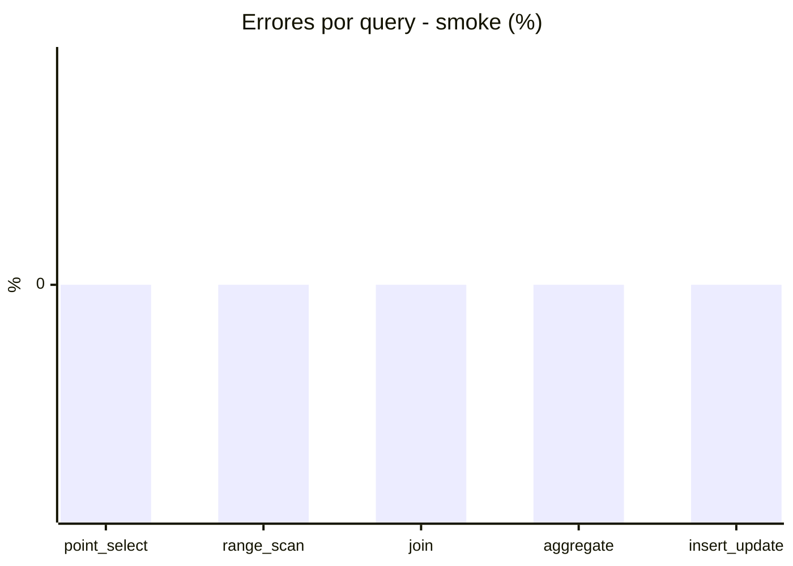

# Reporte de performance - SQL Server (k6)

**Fecha:** 2026-08-07 14:31 UTC  
**Veredicto (SLO):** `WARN`  
**Corrida:** [ver en GitHub Actions](https://github.com/lrbg/k6-sqlserver-lab/actions/runs/31187825132)  

## Analisis del agente de IA

WARN (fallback por umbrales)

- Error maximo: 0%
- p95 maximo: 216 ms

## Resultados

### Escenario: `load`

| Metrica | Valor |
| --- | --- |
| Queries ejecutadas | 20915 |
| Errores | 0 (0%) |
| Latencia media | 57.3 ms |
| p50 / p90 / p95 / p99 | 17 / 202 / 216 / 248 ms |
| Min / Max | 0 / 422 ms |
| Throughput | 348.49 queries/s |
| Duracion | 60 s |

Detalle por query

| Query | Ejecuciones | Error % | avg | p95 | p99 | q/s |
| --- | --- | --- | --- | --- | --- | --- |
| point_select | 4183 | 0% | 3.9 | 13 | 17 | 69.7 |
| range_scan | 4183 | 0% | 29.7 | 102 | 177.2 | 69.7 |
| join | 4183 | 0% | 7.3 | 17 | 21 | 69.7 |
| aggregate | 4183 | 0% | 188.5 | 244 | 263 | 69.7 |
| insert_update | 4183 | 0% | 57.3 | 187 | 248 | 69.7 |

### Escenario: `smoke`

| Metrica | Valor |
| --- | --- |
| Queries ejecutadas | 6200 |
| Errores | 0 (0%) |
| Latencia media | 14.5 ms |
| p50 / p90 / p95 / p99 | 3 / 50 / 58 / 106 ms |
| Min / Max | 0 / 370 ms |
| Throughput | 206.28 queries/s |
| Duracion | 30.1 s |

Detalle por query

| Query | Ejecuciones | Error % | avg | p95 | p99 | q/s |
| --- | --- | --- | --- | --- | --- | --- |
| point_select | 1240 | 0% | 0.8 | 1 | 4.6 | 41.26 |
| range_scan | 1240 | 0% | 4.4 | 10 | 51.8 | 41.26 |
| join | 1240 | 0% | 1.7 | 5 | 5 | 41.26 |
| aggregate | 1240 | 0% | 42.4 | 63 | 68 | 41.26 |
| insert_update | 1240 | 0% | 23.3 | 91 | 208.6 | 41.26 |

