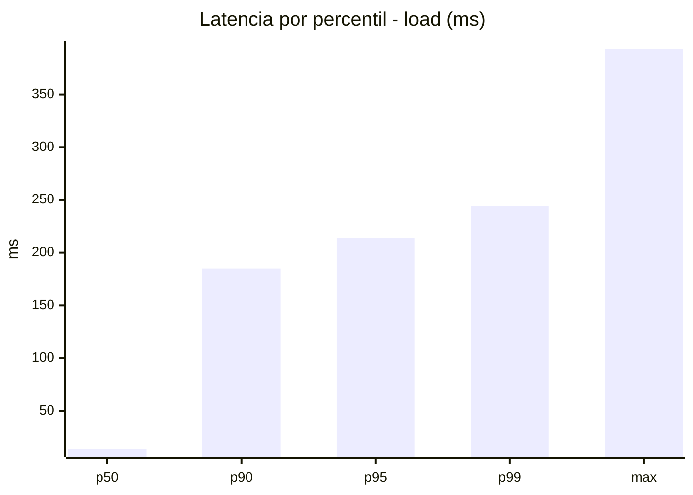
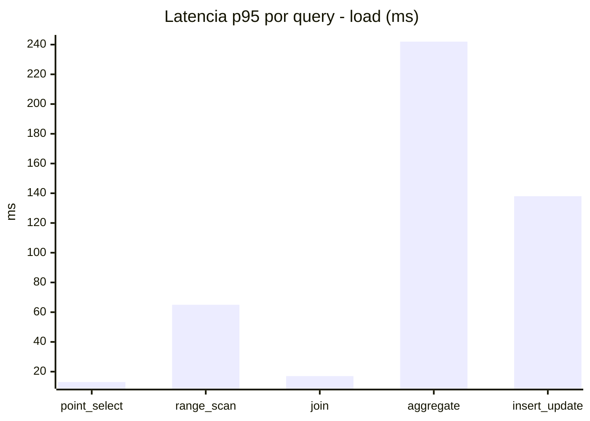
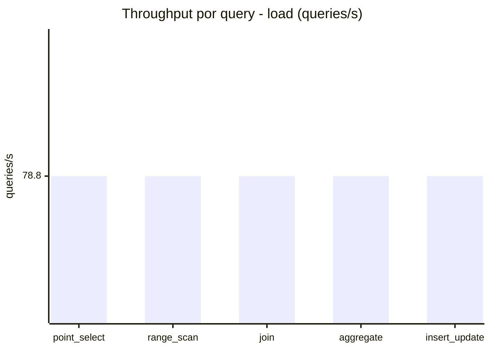
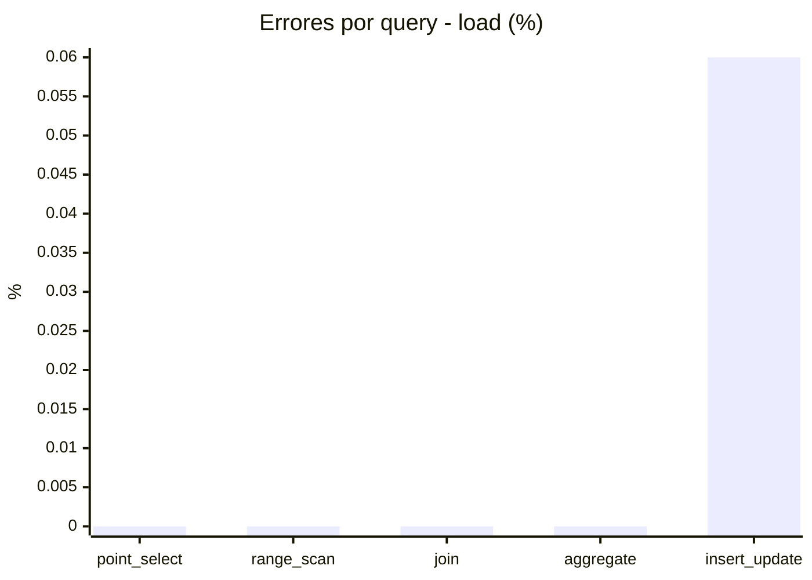
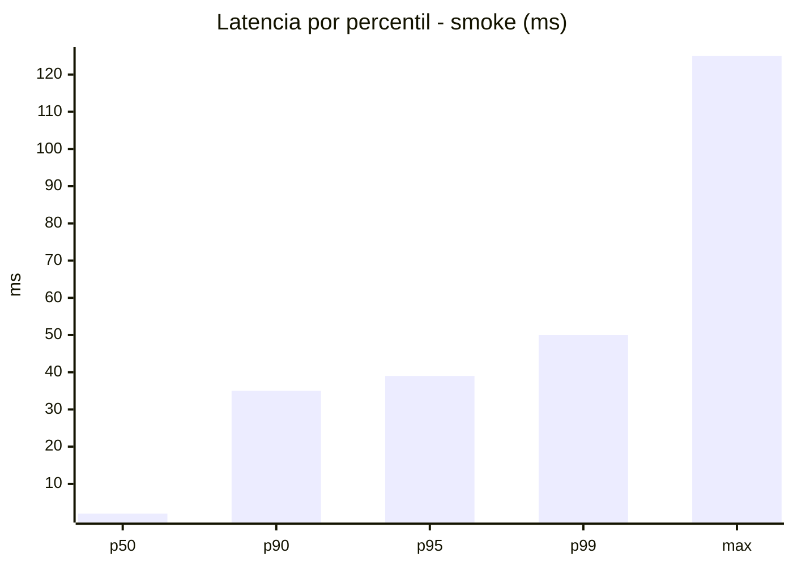
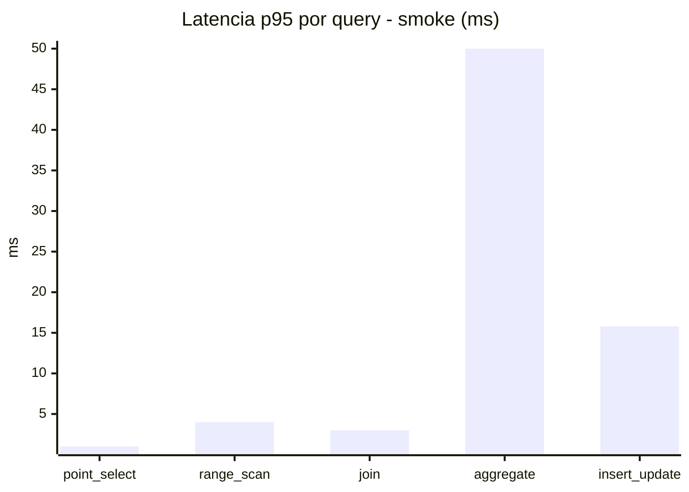
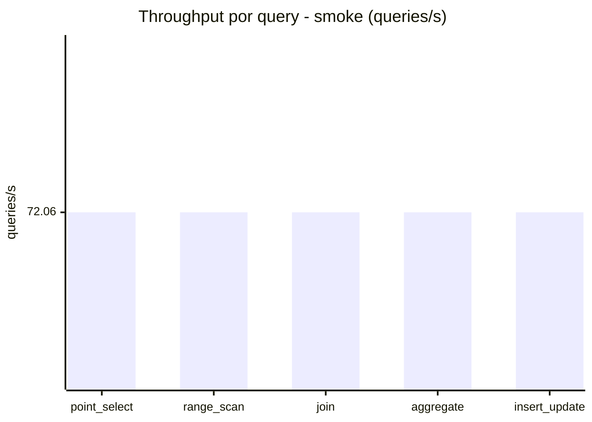
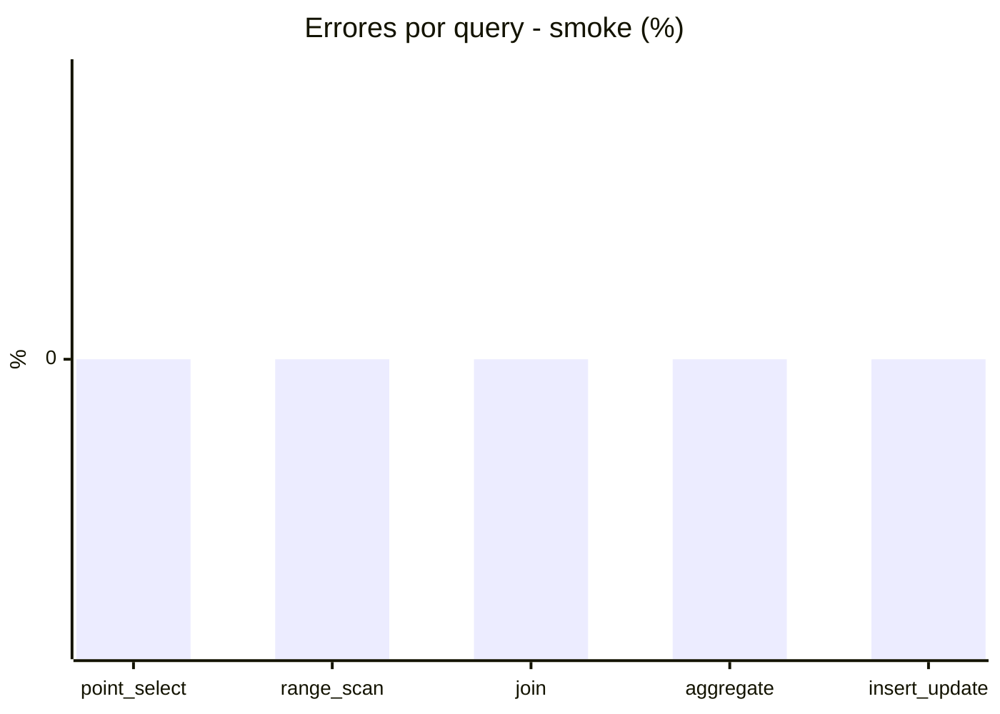

# Reporte de performance - SQL Server (k6)

**Fecha:** 2026-08-08 14:05 UTC  
**Veredicto (SLO):** `WARN`  
**Corrida:** [ver en GitHub Actions](https://github.com/lrbg/k6-sqlserver-lab/actions/runs/31261001289)  

## Analisis del agente de IA

WARN (fallback por umbrales)

- Error maximo: 0.01%
- p95 maximo: 214 ms

## Resultados

### Escenario: `load`

| Metrica | Valor |
| --- | --- |
| Queries ejecutadas | 23690 |
| Errores | 3 (0.01%) |
| Latencia media | 50.7 ms |
| p50 / p90 / p95 / p99 | 14 / 185 / 214 / 244 ms |
| Min / Max | 0 / 393 ms |
| Throughput | 394 queries/s |
| Duracion | 60.1 s |

Detalle por query

| Query | Ejecuciones | Error % | avg | p95 | p99 | q/s |
| --- | --- | --- | --- | --- | --- | --- |
| point_select | 4738 | 0% | 4.1 | 13 | 20 | 78.8 |
| range_scan | 4738 | 0% | 22.9 | 65 | 188.6 | 78.8 |
| join | 4738 | 0% | 7.3 | 17 | 21 | 78.8 |
| aggregate | 4738 | 0% | 174.3 | 242 | 252 | 78.8 |
| insert_update | 4738 | 0.06% | 44.8 | 138 | 245 | 78.8 |

### Escenario: `smoke`

| Metrica | Valor |
| --- | --- |
| Queries ejecutadas | 10820 |
| Errores | 0 (0%) |
| Latencia media | 8.3 ms |
| p50 / p90 / p95 / p99 | 2 / 35 / 39 / 50 ms |
| Min / Max | 0 / 125 ms |
| Throughput | 360.3 queries/s |
| Duracion | 30 s |

Detalle por query

| Query | Ejecuciones | Error % | avg | p95 | p99 | q/s |
| --- | --- | --- | --- | --- | --- | --- |
| point_select | 2164 | 0% | 0.5 | 1 | 4 | 72.06 |
| range_scan | 2164 | 0% | 2.3 | 4 | 10 | 72.06 |
| join | 2164 | 0% | 0.9 | 3 | 5 | 72.06 |
| aggregate | 2164 | 0% | 33.6 | 50 | 58 | 72.06 |
| insert_update | 2164 | 0% | 4.2 | 15.8 | 22 | 72.06 |

