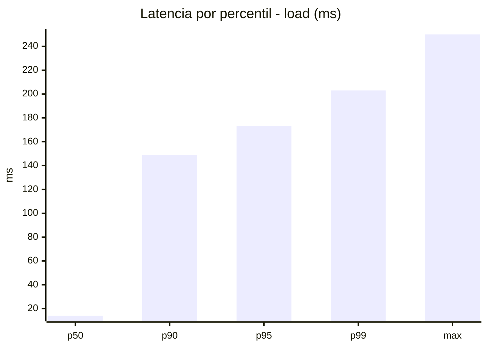
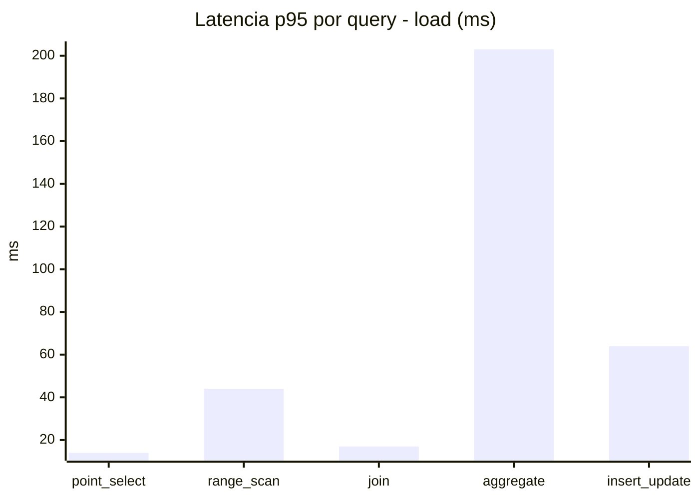
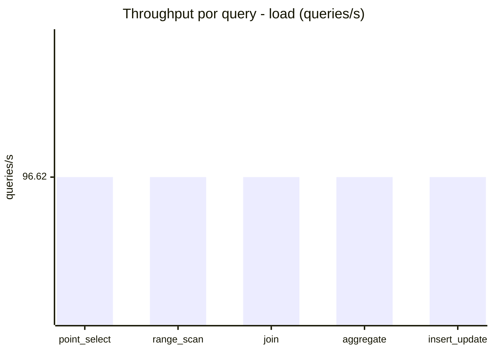
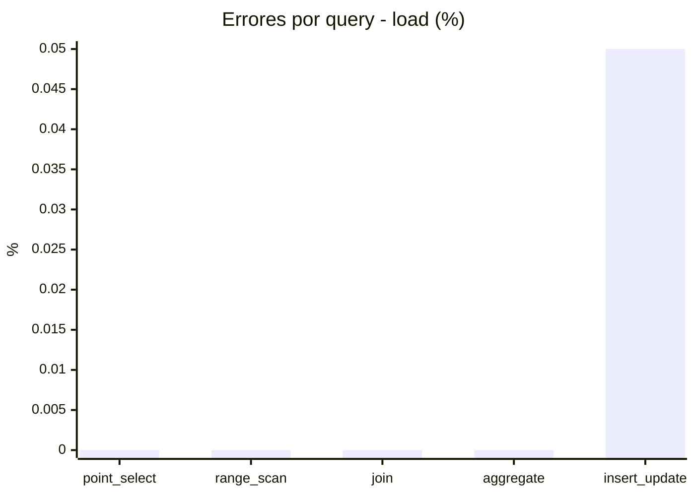
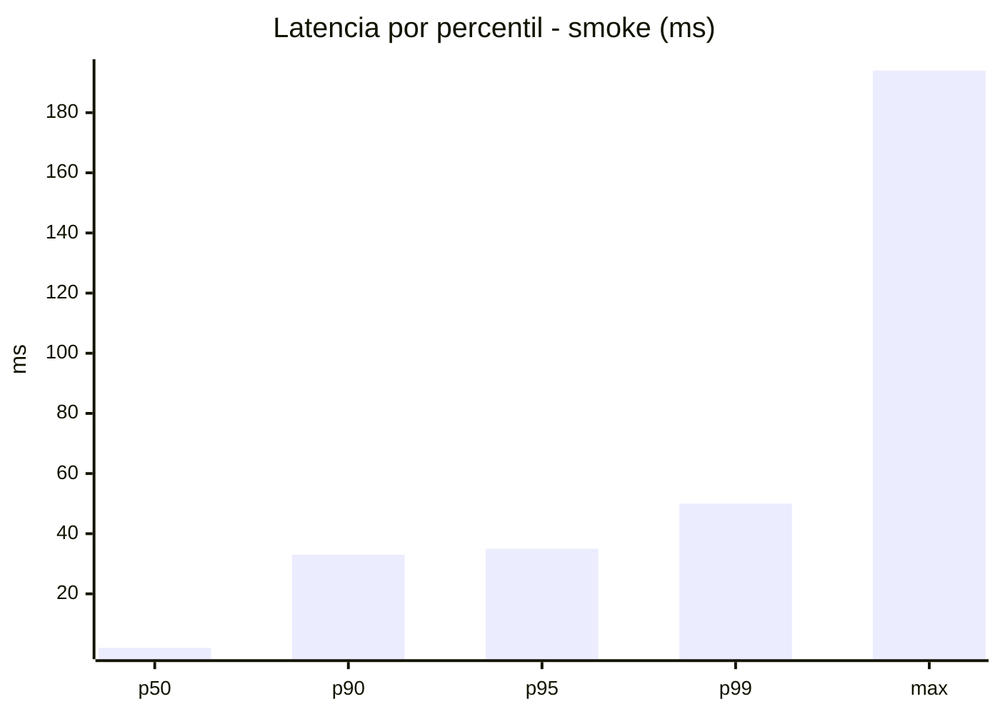
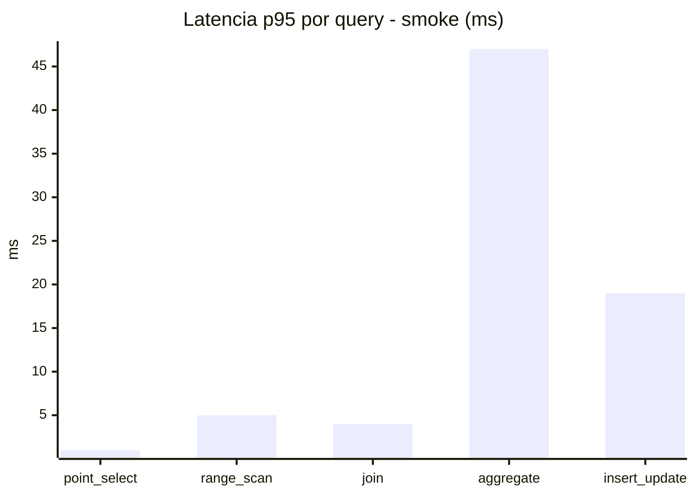
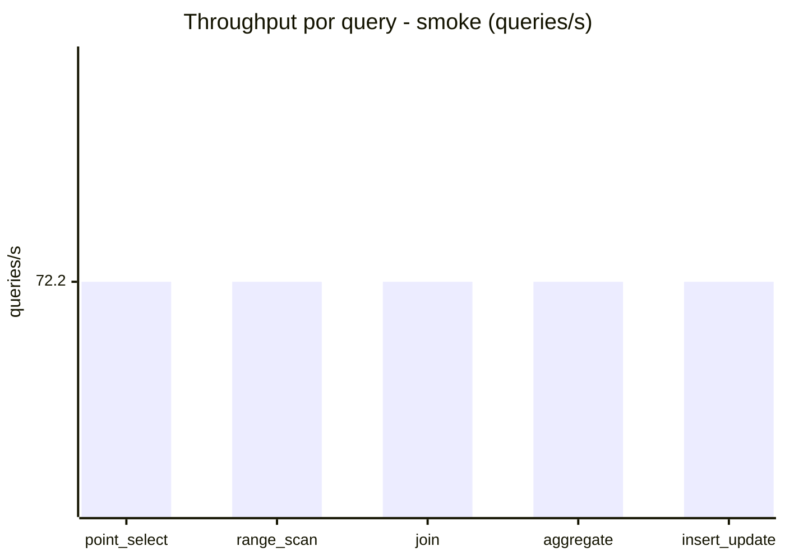
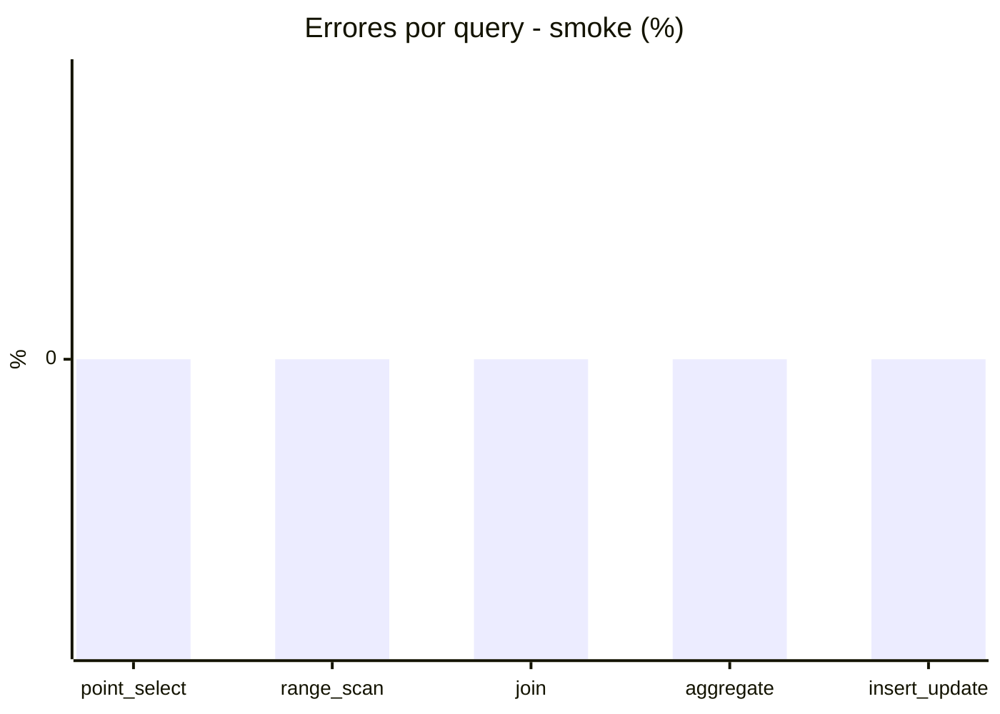

# Reporte de performance - SQL Server (k6)

**Fecha:** 2026-08-09 14:05 UTC  
**Veredicto (SLO):** `PASS`  
**Corrida:** [ver en GitHub Actions](https://github.com/lrbg/k6-sqlserver-lab/actions/runs/31317446177)  

## Analisis del agente de IA

PASS (fallback por umbrales)

- Error maximo: 0.01%
- p95 maximo: 173 ms

## Resultados

### Escenario: `load`

| Metrica | Valor |
| --- | --- |
| Queries ejecutadas | 29050 |
| Errores | 3 (0.01%) |
| Latencia media | 41.3 ms |
| p50 / p90 / p95 / p99 | 14 / 149 / 173 / 203 ms |
| Min / Max | 0 / 250 ms |
| Throughput | 483.11 queries/s |
| Duracion | 60.1 s |

Detalle por query

| Query | Ejecuciones | Error % | avg | p95 | p99 | q/s |
| --- | --- | --- | --- | --- | --- | --- |
| point_select | 5810 | 0% | 4.4 | 14 | 20 | 96.62 |
| range_scan | 5810 | 0% | 19.1 | 44 | 60 | 96.62 |
| join | 5810 | 0% | 7 | 17 | 21 | 96.62 |
| aggregate | 5810 | 0% | 147.4 | 203 | 221 | 96.62 |
| insert_update | 5810 | 0.05% | 28.7 | 64 | 83 | 96.62 |

### Escenario: `smoke`

| Metrica | Valor |
| --- | --- |
| Queries ejecutadas | 10845 |
| Errores | 0 (0%) |
| Latencia media | 8.3 ms |
| p50 / p90 / p95 / p99 | 2 / 33 / 35 / 50 ms |
| Min / Max | 0 / 194 ms |
| Throughput | 361.01 queries/s |
| Duracion | 30 s |

Detalle por query

| Query | Ejecuciones | Error % | avg | p95 | p99 | q/s |
| --- | --- | --- | --- | --- | --- | --- |
| point_select | 2169 | 0% | 0.5 | 1 | 4 | 72.2 |
| range_scan | 2169 | 0% | 2.4 | 5 | 11 | 72.2 |
| join | 2169 | 0% | 0.9 | 4 | 5 | 72.2 |
| aggregate | 2169 | 0% | 30.6 | 47 | 52 | 72.2 |
| insert_update | 2169 | 0% | 7 | 19 | 149.6 | 72.2 |

