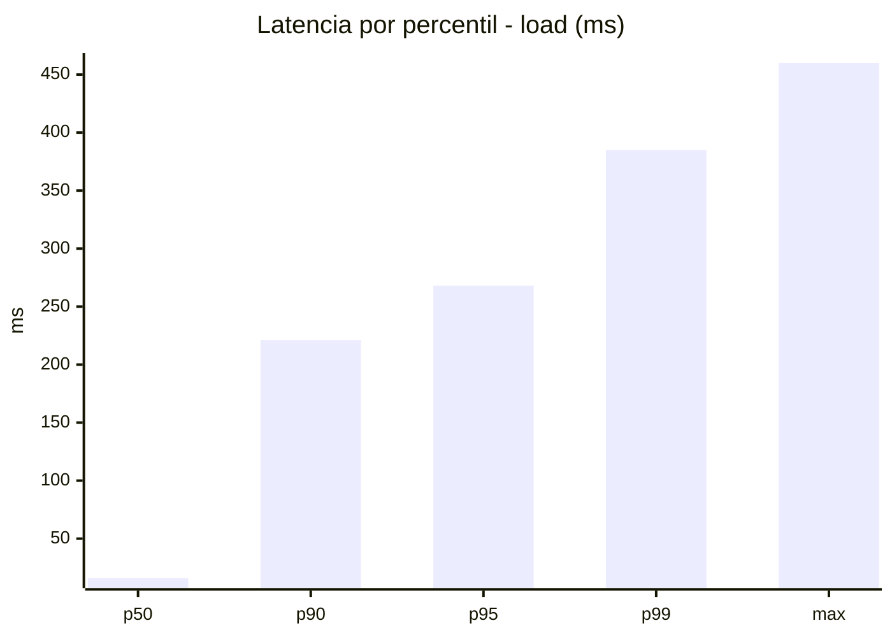
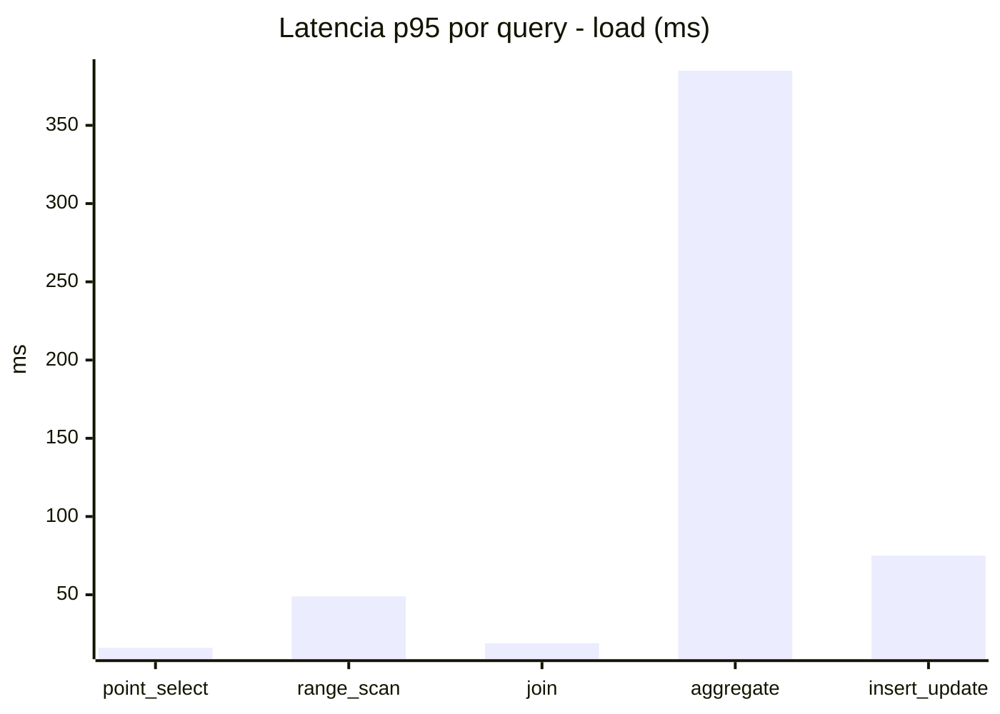
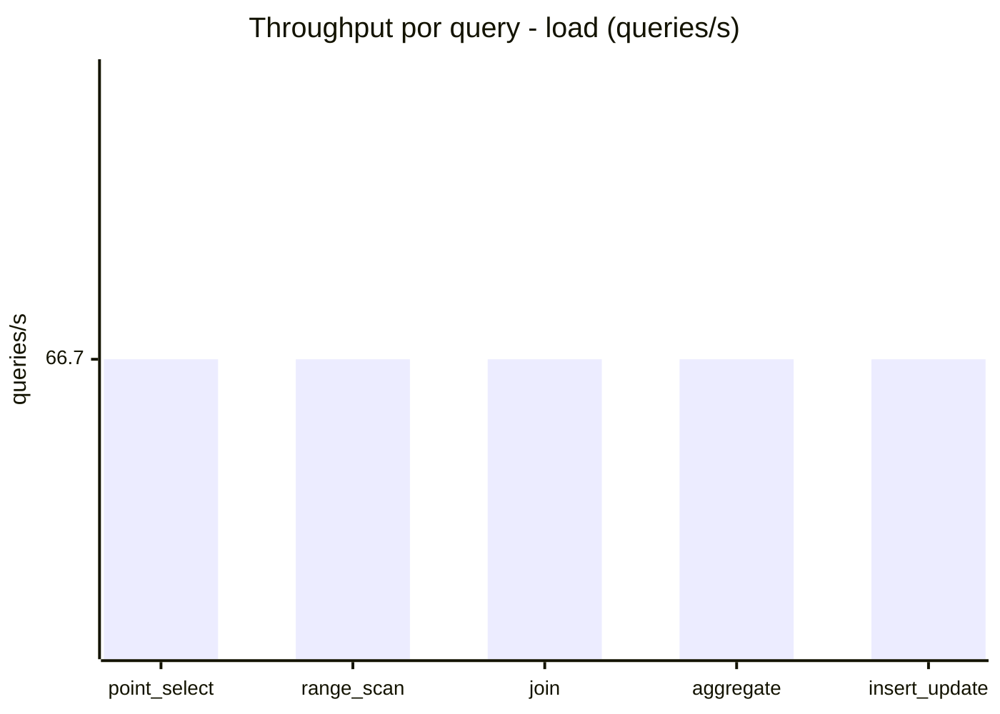
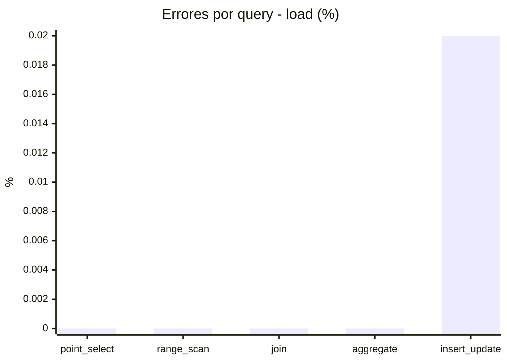
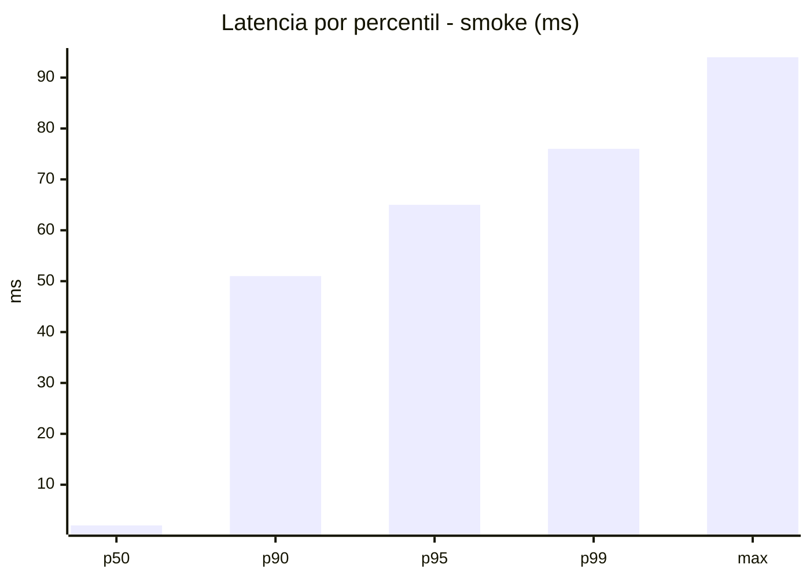
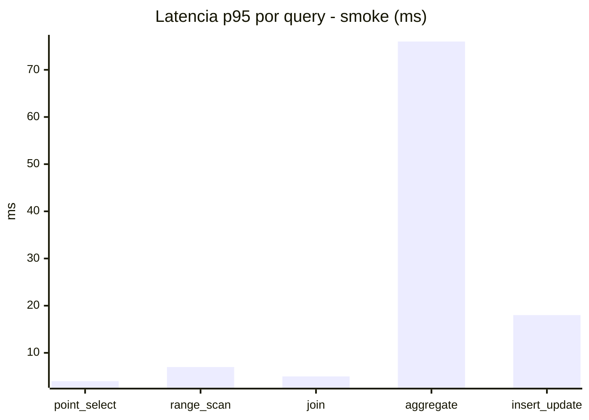
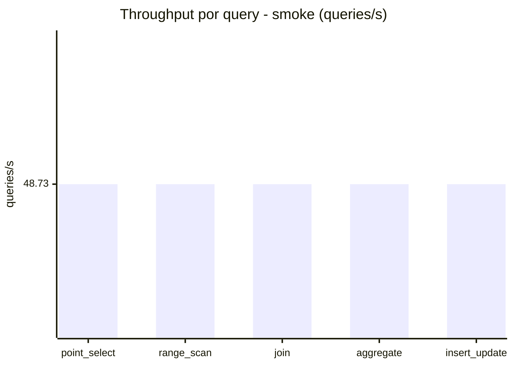
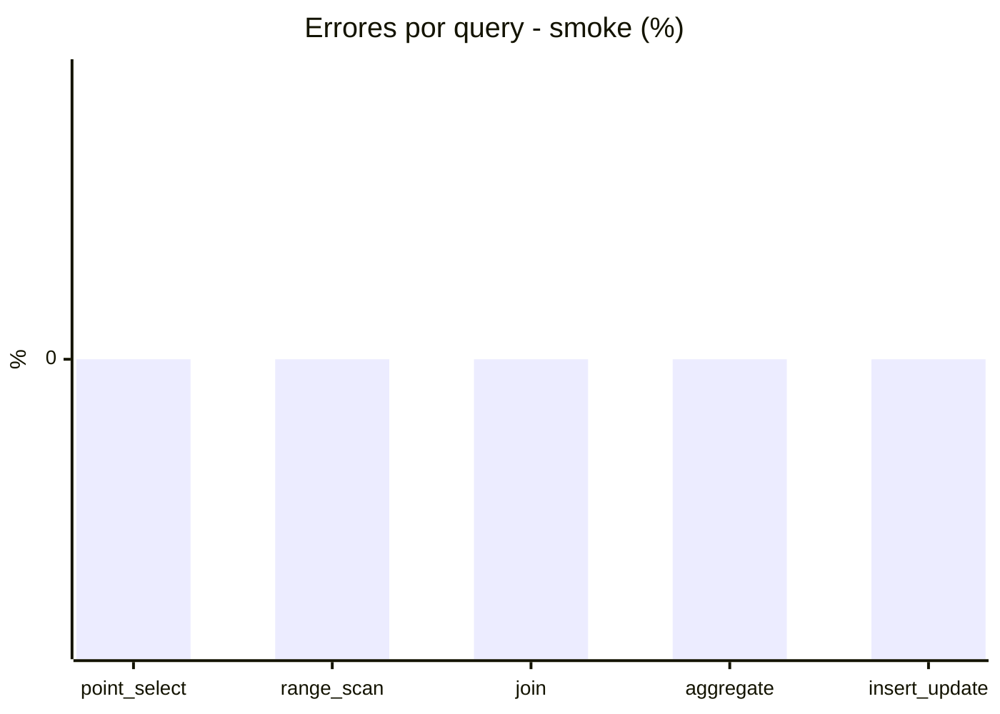

# Reporte de performance - SQL Server (k6)

**Fecha:** 2026-08-10 14:35 UTC  
**Veredicto (SLO):** `WARN`  
**Corrida:** [ver en GitHub Actions](https://github.com/lrbg/k6-sqlserver-lab/actions/runs/31398827039)  

## Analisis del agente de IA

WARN (fallback por umbrales)

- Error maximo: 0%
- p95 maximo: 268 ms

## Resultados

### Escenario: `load`

| Metrica | Valor |
| --- | --- |
| Queries ejecutadas | 20060 |
| Errores | 1 (0%) |
| Latencia media | 59.9 ms |
| p50 / p90 / p95 / p99 | 16 / 221 / 268 / 385 ms |
| Min / Max | 0 / 460 ms |
| Throughput | 333.5 queries/s |
| Duracion | 60.2 s |

Detalle por query

| Query | Ejecuciones | Error % | avg | p95 | p99 | q/s |
| --- | --- | --- | --- | --- | --- | --- |
| point_select | 4012 | 0% | 5.5 | 16 | 25 | 66.7 |
| range_scan | 4012 | 0% | 21.6 | 49 | 71 | 66.7 |
| join | 4012 | 0% | 8.4 | 19 | 28 | 66.7 |
| aggregate | 4012 | 0% | 231.5 | 385 | 424.9 | 66.7 |
| insert_update | 4012 | 0.02% | 32.6 | 75 | 99.9 | 66.7 |

### Escenario: `smoke`

| Metrica | Valor |
| --- | --- |
| Queries ejecutadas | 7320 |
| Errores | 0 (0%) |
| Latencia media | 12.3 ms |
| p50 / p90 / p95 / p99 | 2 / 51 / 65 / 76 ms |
| Min / Max | 0 / 94 ms |
| Throughput | 243.67 queries/s |
| Duracion | 30 s |

Detalle por query

| Query | Ejecuciones | Error % | avg | p95 | p99 | q/s |
| --- | --- | --- | --- | --- | --- | --- |
| point_select | 1464 | 0% | 0.8 | 4 | 5 | 48.73 |
| range_scan | 1464 | 0% | 3.2 | 7 | 10.4 | 48.73 |
| join | 1464 | 0% | 1.7 | 5 | 5 | 48.73 |
| aggregate | 1464 | 0% | 50.5 | 76 | 82 | 48.73 |
| insert_update | 1464 | 0% | 5.2 | 18 | 25 | 48.73 |

