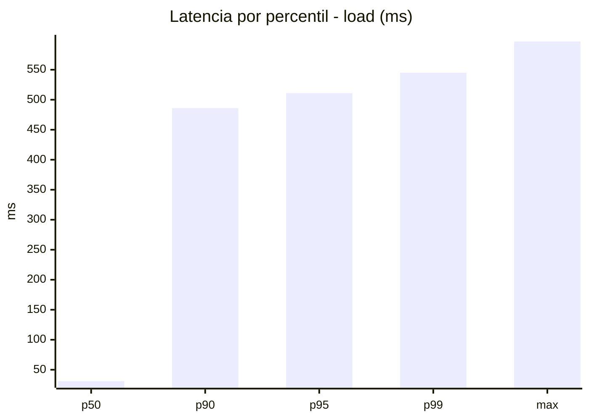
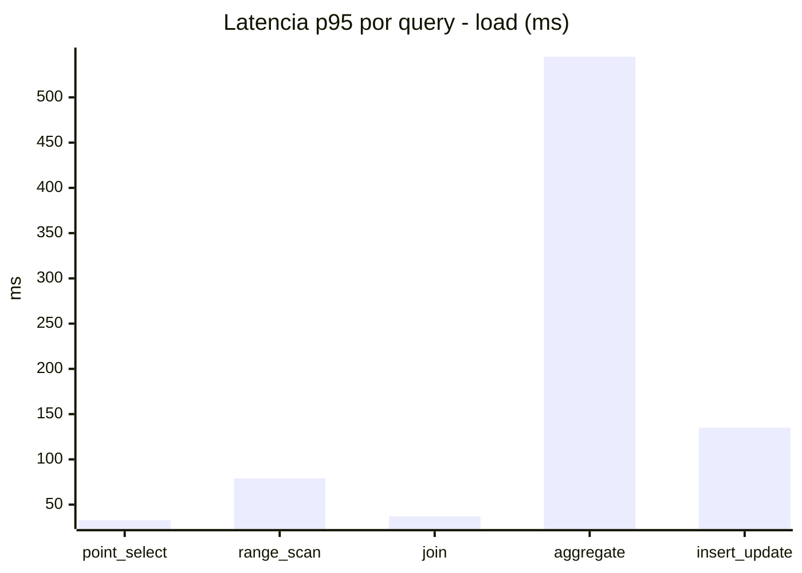
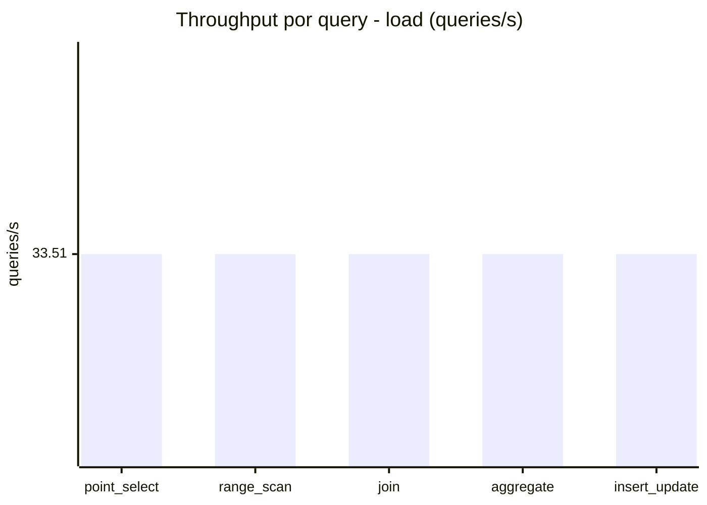
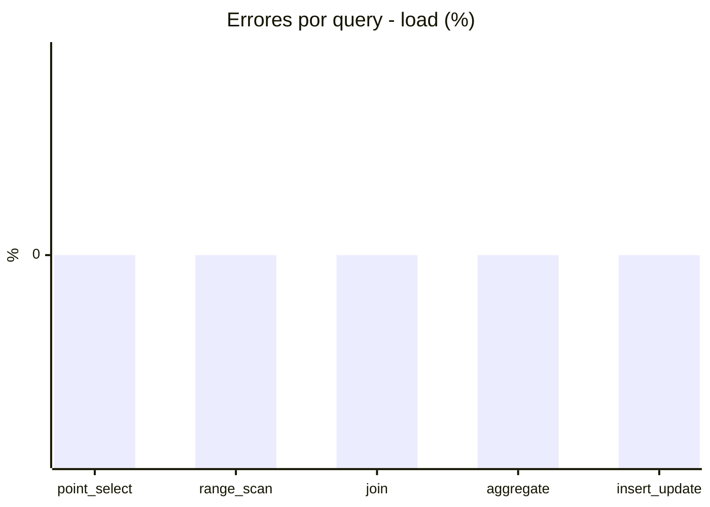
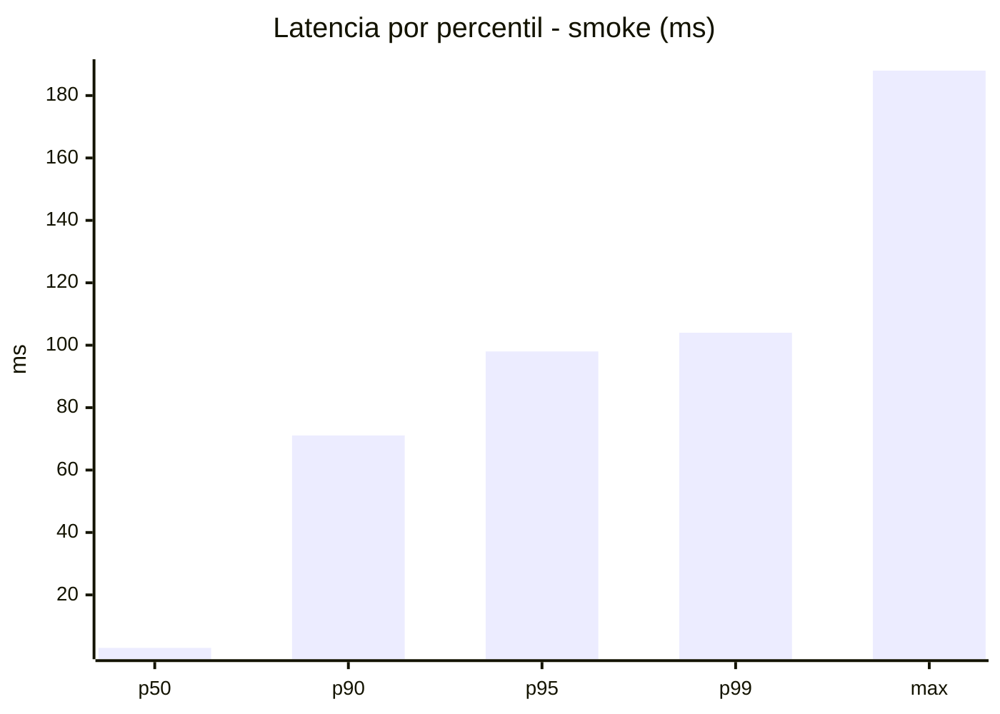
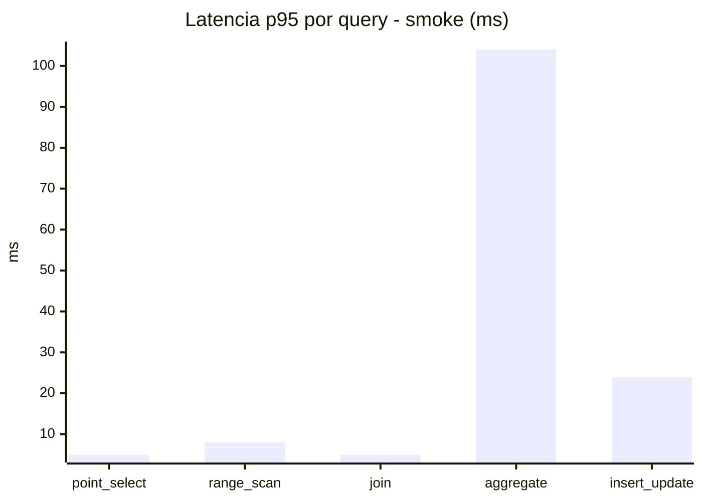
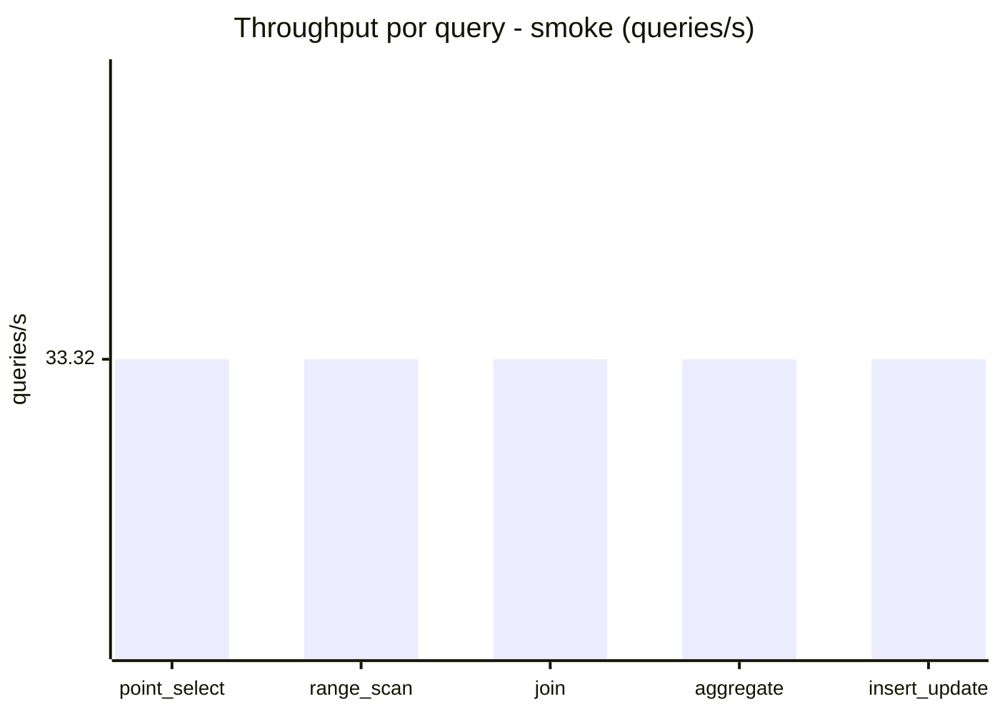
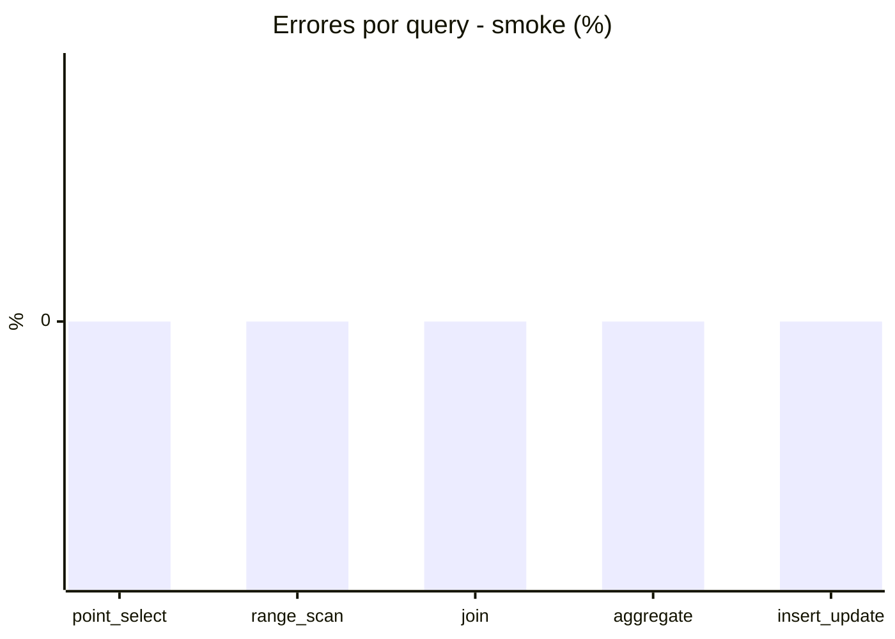

# Reporte de performance - SQL Server (k6)

**Fecha:** 2026-08-11 14:36 UTC  
**Veredicto (SLO):** `FAIL`  
**Corrida:** [ver en GitHub Actions](https://github.com/lrbg/k6-sqlserver-lab/actions/runs/31502208431)  

## Analisis del agente de IA

FAIL (fallback por umbrales)

- Error maximo: 0%
- p95 maximo: 511 ms

## Resultados

### Escenario: `load`

| Metrica | Valor |
| --- | --- |
| Queries ejecutadas | 10140 |
| Errores | 0 (0%) |
| Latencia media | 119.3 ms |
| p50 / p90 / p95 / p99 | 31 / 486 / 511 / 545 ms |
| Min / Max | 0 / 597 ms |
| Throughput | 167.54 queries/s |
| Duracion | 60.5 s |

Detalle por query

| Query | Ejecuciones | Error % | avg | p95 | p99 | q/s |
| --- | --- | --- | --- | --- | --- | --- |
| point_select | 2028 | 0% | 12.2 | 33 | 38 | 33.51 |
| range_scan | 2028 | 0% | 35.7 | 79 | 109.7 | 33.51 |
| join | 2028 | 0% | 17.3 | 37 | 39 | 33.51 |
| aggregate | 2028 | 0% | 471.2 | 545 | 573 | 33.51 |
| insert_update | 2028 | 0% | 60.2 | 135 | 159 | 33.51 |

### Escenario: `smoke`

| Metrica | Valor |
| --- | --- |
| Queries ejecutadas | 5010 |
| Errores | 0 (0%) |
| Latencia media | 18 ms |
| p50 / p90 / p95 / p99 | 3 / 71.1 / 98 / 104 ms |
| Min / Max | 0 / 188 ms |
| Throughput | 166.6 queries/s |
| Duracion | 30.1 s |

Detalle por query

| Query | Ejecuciones | Error % | avg | p95 | p99 | q/s |
| --- | --- | --- | --- | --- | --- | --- |
| point_select | 1002 | 0% | 1.4 | 5 | 5 | 33.32 |
| range_scan | 1002 | 0% | 4.5 | 8 | 12 | 33.32 |
| join | 1002 | 0% | 2.1 | 5 | 9 | 33.32 |
| aggregate | 1002 | 0% | 74.3 | 104 | 109 | 33.32 |
| insert_update | 1002 | 0% | 7.6 | 24 | 27 | 33.32 |

