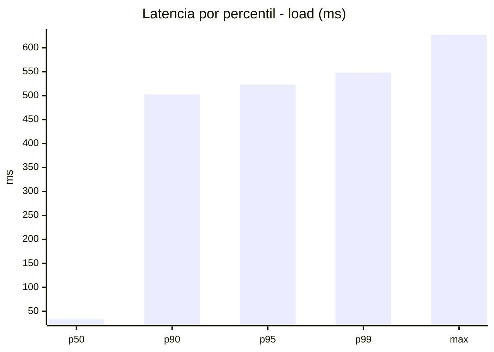
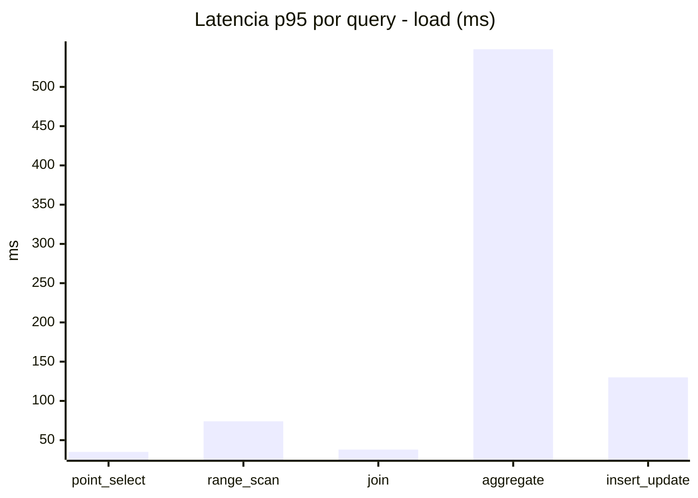
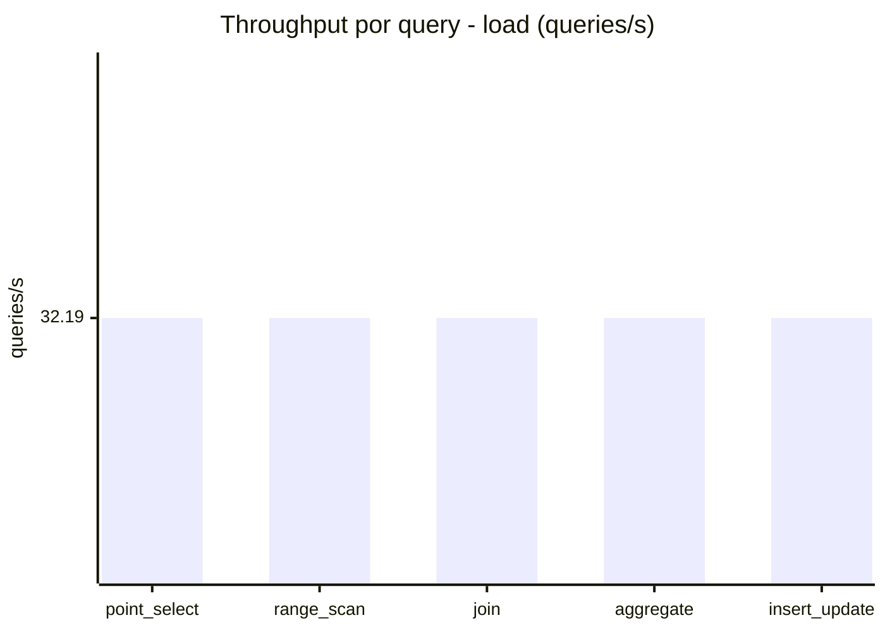
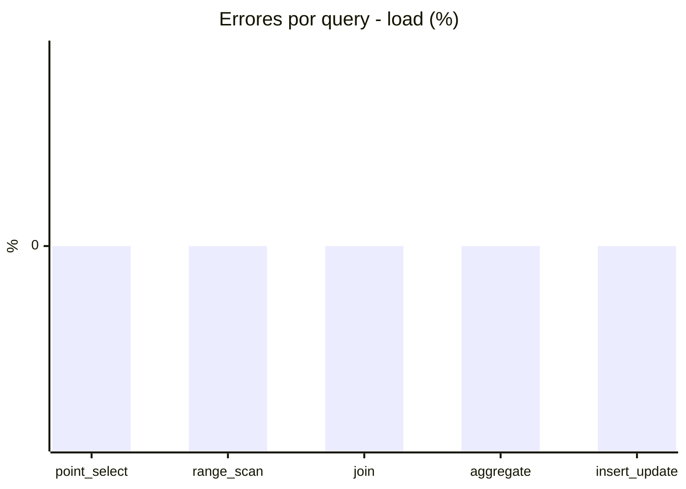
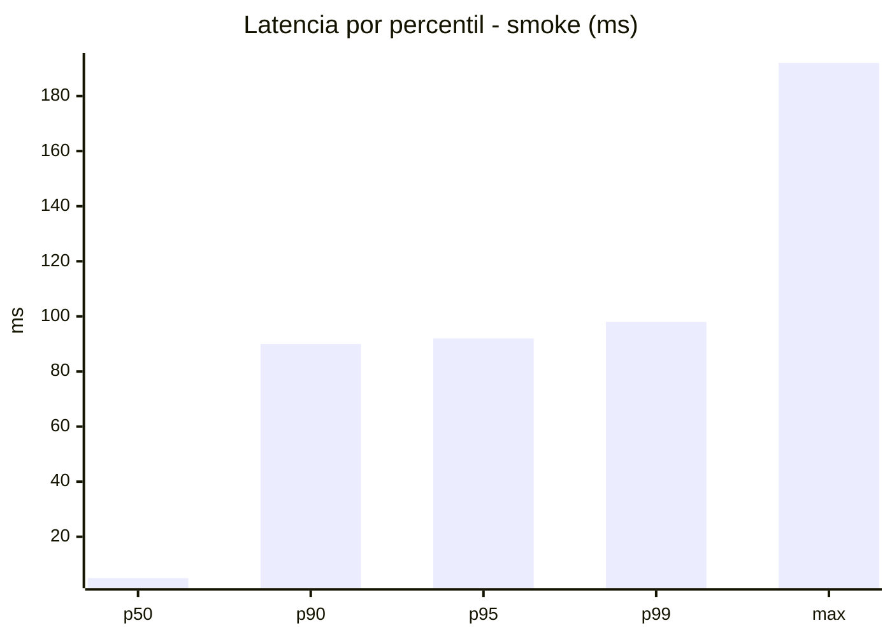
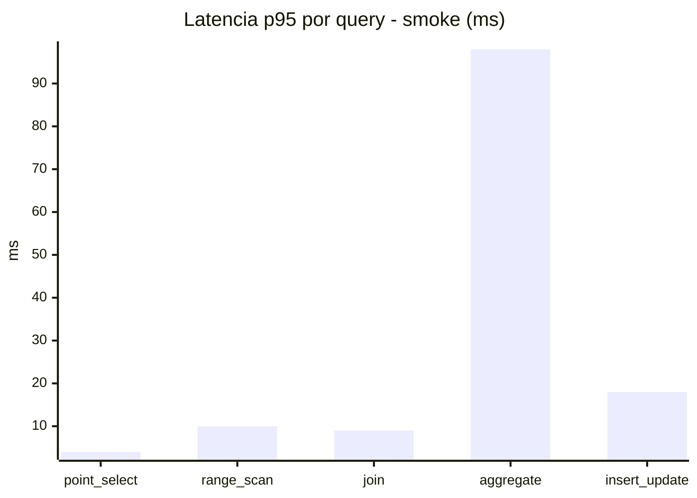
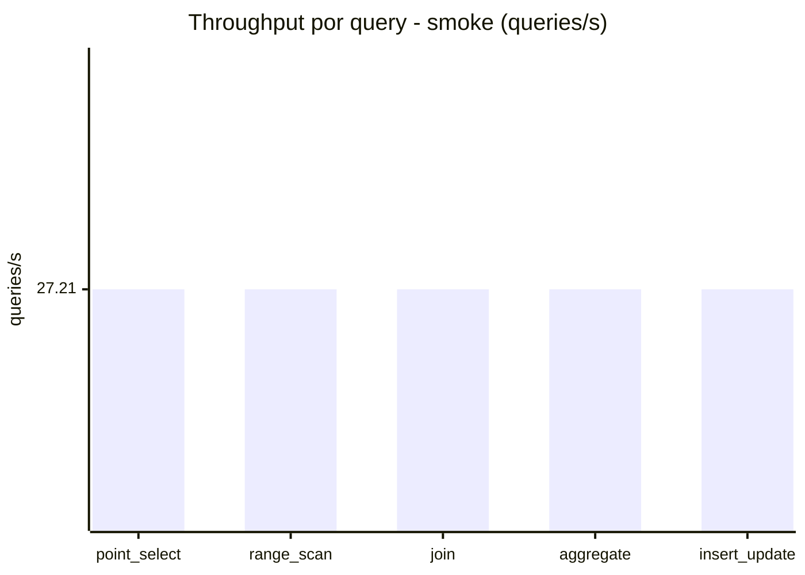
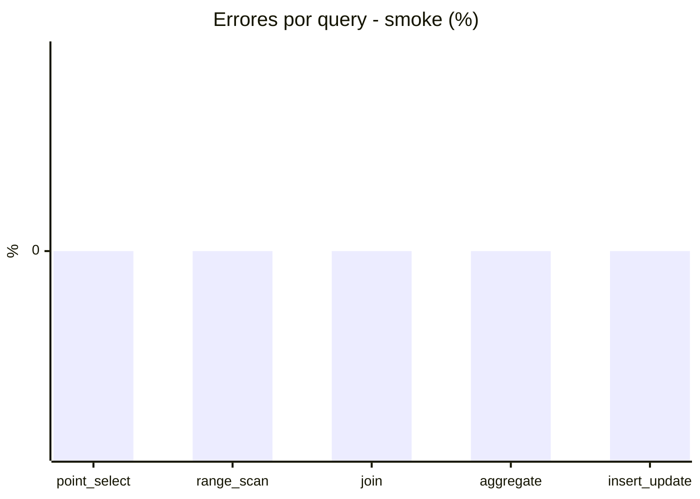

# Reporte de performance - SQL Server (k6)

**Fecha:** 2026-08-12 14:36 UTC  
**Veredicto (SLO):** `FAIL`  
**Corrida:** [ver en GitHub Actions](https://github.com/lrbg/k6-sqlserver-lab/actions/runs/31607461788)  

## Analisis del agente de IA

FAIL (fallback por umbrales)

- Error maximo: 0%
- p95 maximo: 523 ms

## Resultados

### Escenario: `load`

| Metrica | Valor |
| --- | --- |
| Queries ejecutadas | 9705 |
| Errores | 0 (0%) |
| Latencia media | 124.2 ms |
| p50 / p90 / p95 / p99 | 33 / 503 / 523 / 548 ms |
| Min / Max | 0 / 627 ms |
| Throughput | 160.94 queries/s |
| Duracion | 60.3 s |

Detalle por query

| Query | Ejecuciones | Error % | avg | p95 | p99 | q/s |
| --- | --- | --- | --- | --- | --- | --- |
| point_select | 1941 | 0% | 12.3 | 35 | 40 | 32.19 |
| range_scan | 1941 | 0% | 36.6 | 74 | 115.4 | 32.19 |
| join | 1941 | 0% | 18.6 | 38 | 39 | 32.19 |
| aggregate | 1941 | 0% | 492.7 | 548 | 562.6 | 32.19 |
| insert_update | 1941 | 0% | 60.4 | 130 | 159 | 32.19 |

### Escenario: `smoke`

| Metrica | Valor |
| --- | --- |
| Queries ejecutadas | 4085 |
| Errores | 0 (0%) |
| Latencia media | 22 ms |
| p50 / p90 / p95 / p99 | 5 / 90 / 92 / 98 ms |
| Min / Max | 0 / 192 ms |
| Throughput | 136.03 queries/s |
| Duracion | 30 s |

Detalle por query

| Query | Ejecuciones | Error % | avg | p95 | p99 | q/s |
| --- | --- | --- | --- | --- | --- | --- |
| point_select | 817 | 0% | 1.7 | 4 | 8 | 27.21 |
| range_scan | 817 | 0% | 4.6 | 10 | 12 | 27.21 |
| join | 817 | 0% | 4.3 | 9 | 9.8 | 27.21 |
| aggregate | 817 | 0% | 90.4 | 98 | 119.5 | 27.21 |
| insert_update | 817 | 0% | 9 | 18 | 28.7 | 27.21 |

