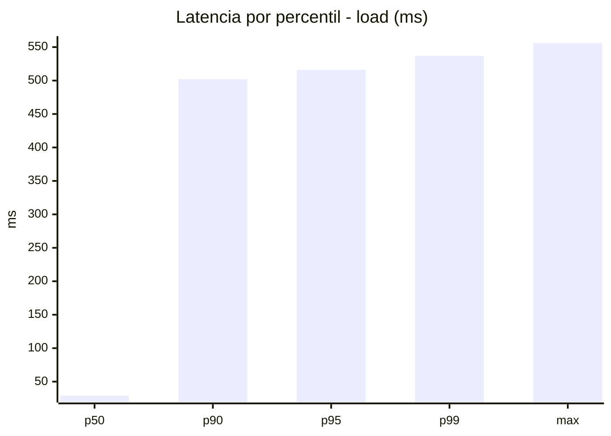
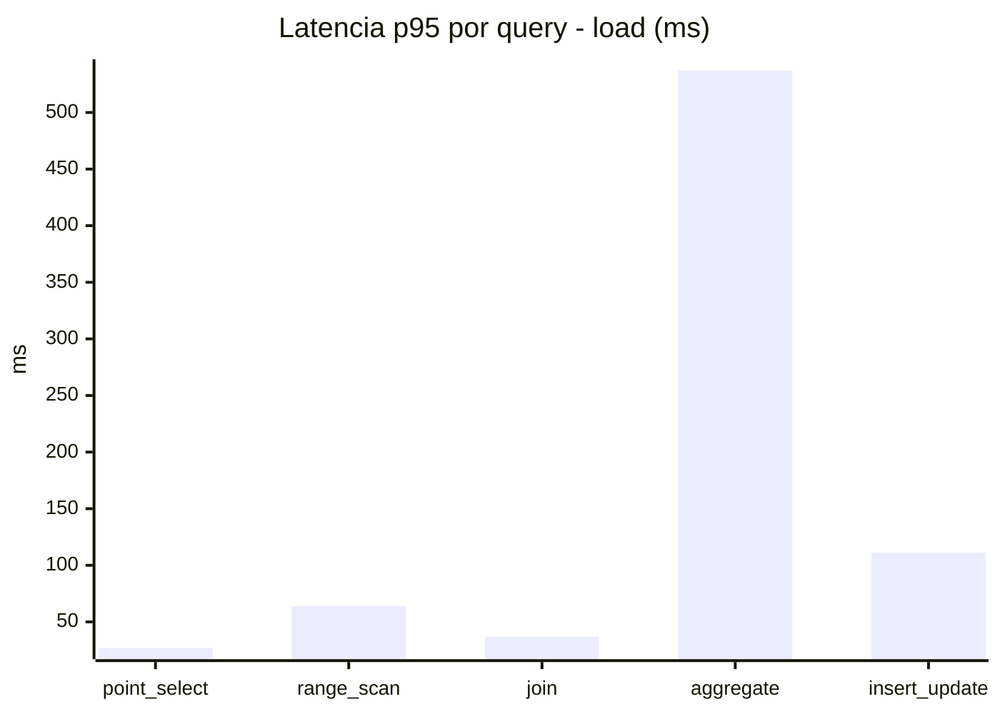
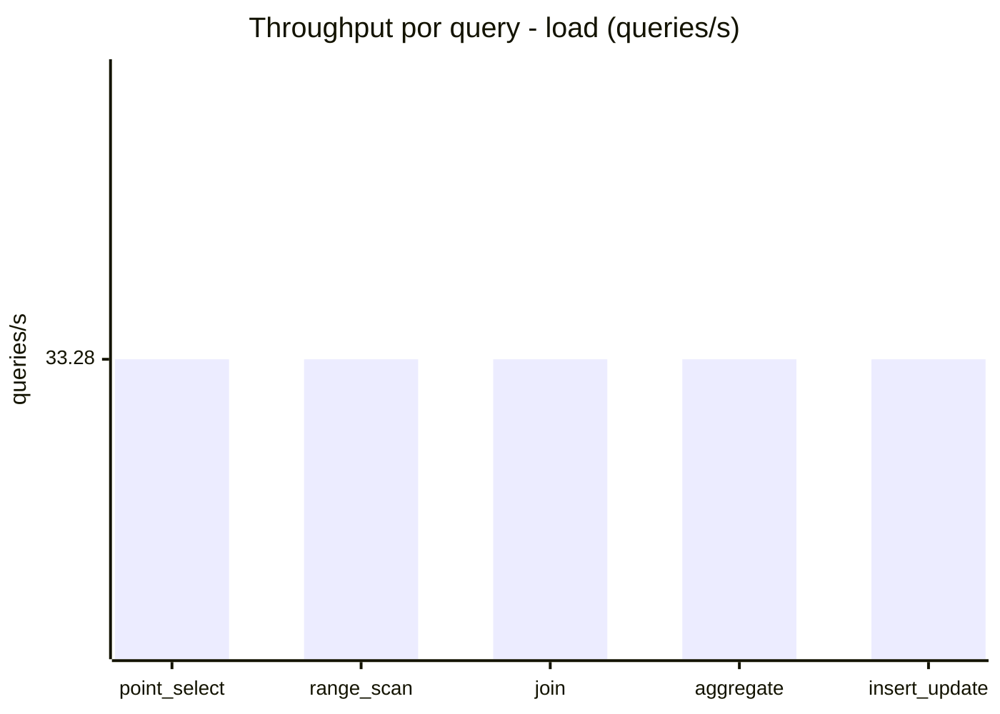
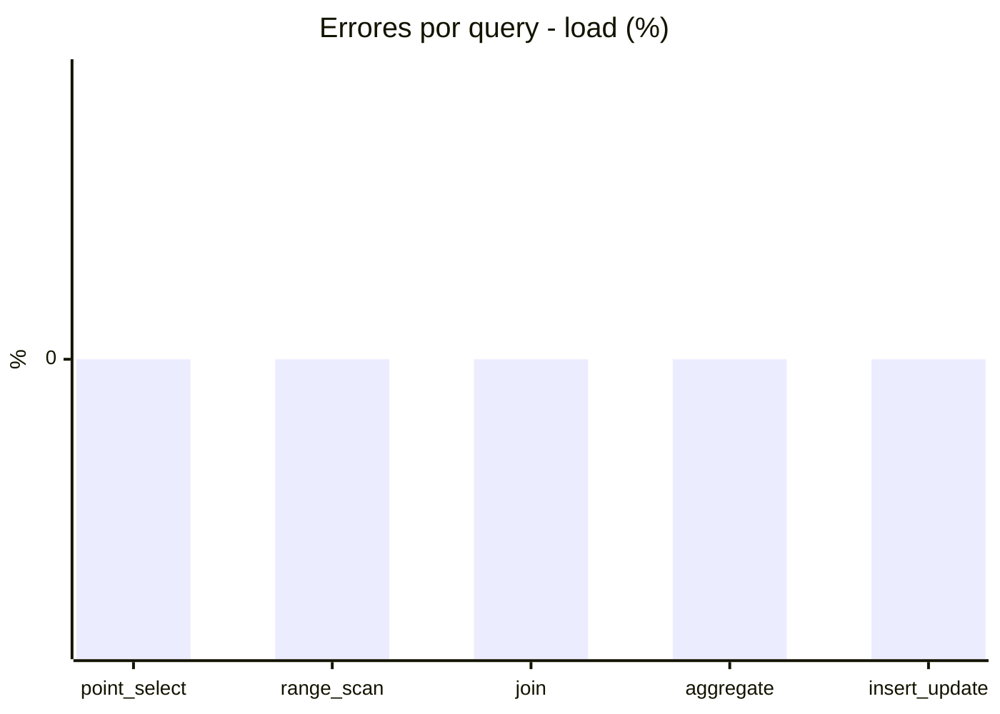
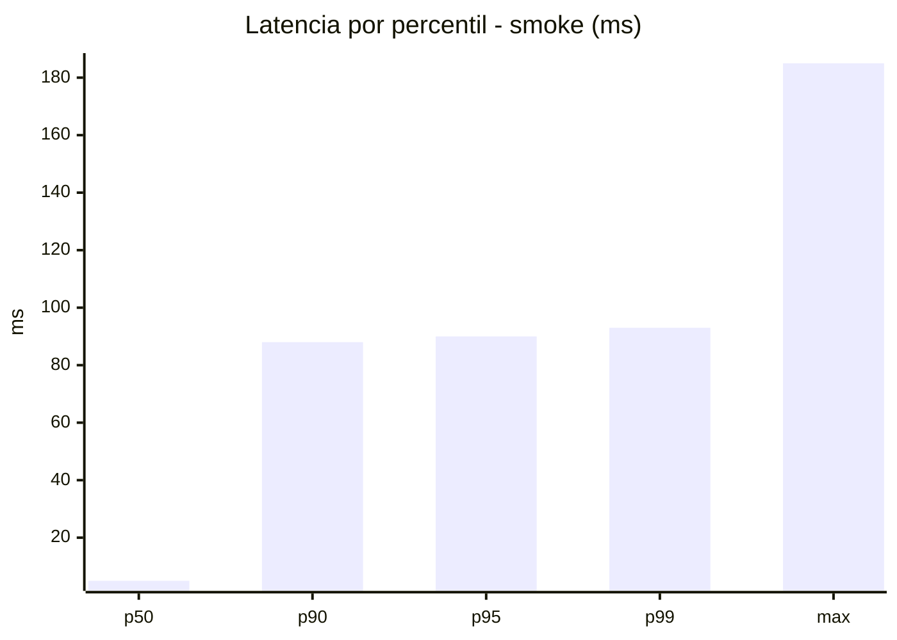
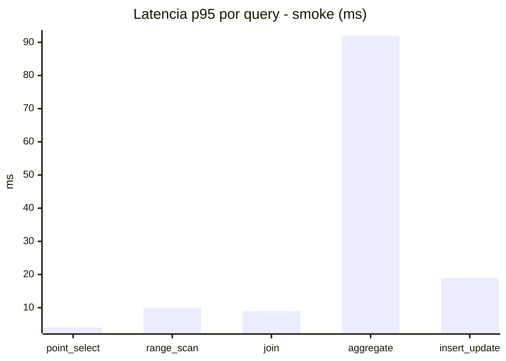
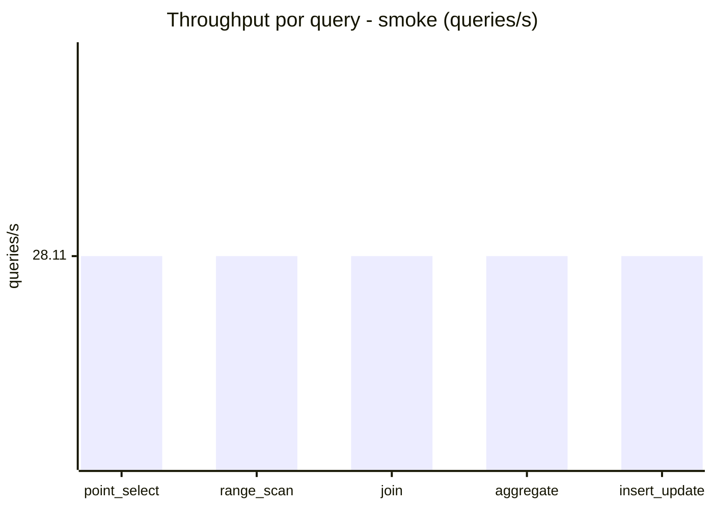
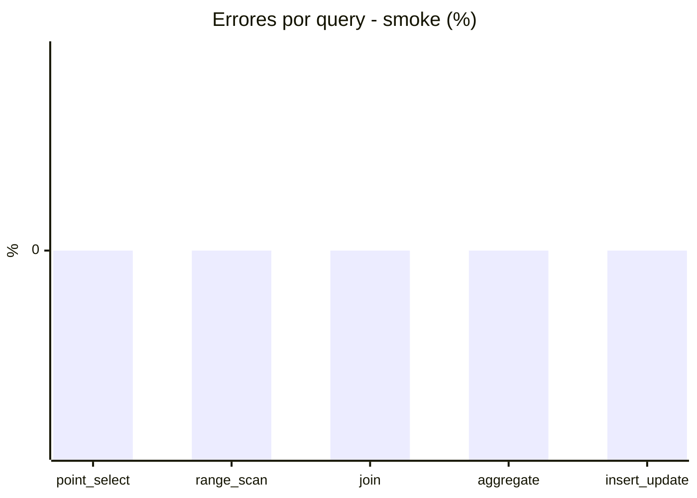

# Reporte de performance - SQL Server (k6)

**Fecha:** 2026-08-14 14:31 UTC  
**Veredicto (SLO):** `FAIL`  
**Corrida:** [ver en GitHub Actions](https://github.com/lrbg/k6-sqlserver-lab/actions/runs/31809693854)  

## Analisis del agente de IA

FAIL (fallback por umbrales)

- Error maximo: 0%
- p95 maximo: 516 ms

## Resultados

### Escenario: `load`

| Metrica | Valor |
| --- | --- |
| Queries ejecutadas | 10045 |
| Errores | 0 (0%) |
| Latencia media | 120.1 ms |
| p50 / p90 / p95 / p99 | 29 / 502 / 516 / 537 ms |
| Min / Max | 0 / 556 ms |
| Throughput | 166.4 queries/s |
| Duracion | 60.4 s |

Detalle por query

| Query | Ejecuciones | Error % | avg | p95 | p99 | q/s |
| --- | --- | --- | --- | --- | --- | --- |
| point_select | 2009 | 0% | 9.2 | 27 | 37 | 33.28 |
| range_scan | 2009 | 0% | 32.5 | 64 | 91 | 33.28 |
| join | 2009 | 0% | 15.7 | 37 | 38 | 33.28 |
| aggregate | 2009 | 0% | 492.6 | 537 | 546 | 33.28 |
| insert_update | 2009 | 0% | 50.5 | 111 | 152.9 | 33.28 |

### Escenario: `smoke`

| Metrica | Valor |
| --- | --- |
| Queries ejecutadas | 4225 |
| Errores | 0 (0%) |
| Latencia media | 21.3 ms |
| p50 / p90 / p95 / p99 | 5 / 88 / 90 / 93 ms |
| Min / Max | 0 / 185 ms |
| Throughput | 140.53 queries/s |
| Duracion | 30.1 s |

Detalle por query

| Query | Ejecuciones | Error % | avg | p95 | p99 | q/s |
| --- | --- | --- | --- | --- | --- | --- |
| point_select | 845 | 0% | 1.5 | 4 | 6.6 | 28.11 |
| range_scan | 845 | 0% | 5.1 | 10 | 12.6 | 28.11 |
| join | 845 | 0% | 4.1 | 9 | 10 | 28.11 |
| aggregate | 845 | 0% | 87.6 | 92 | 103.6 | 28.11 |
| insert_update | 845 | 0% | 8.3 | 19 | 28.1 | 28.11 |

