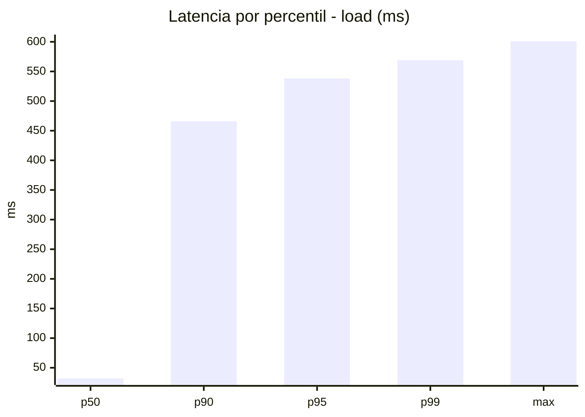
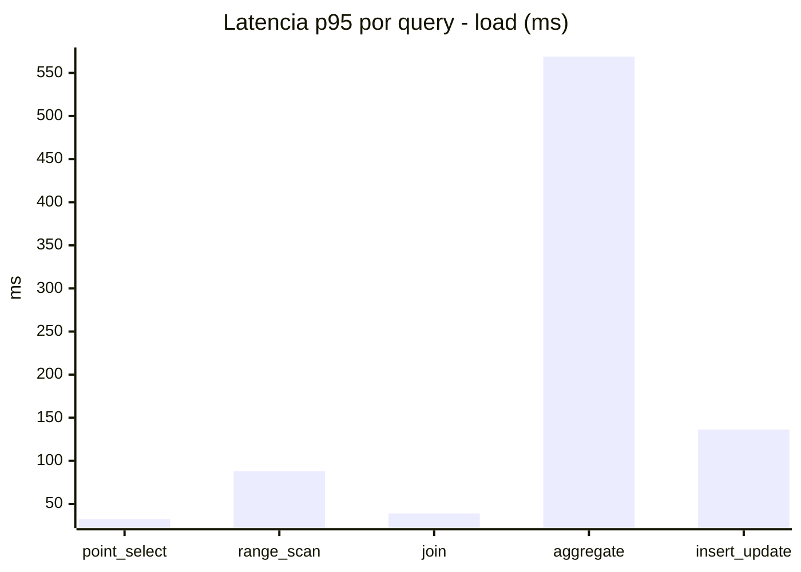
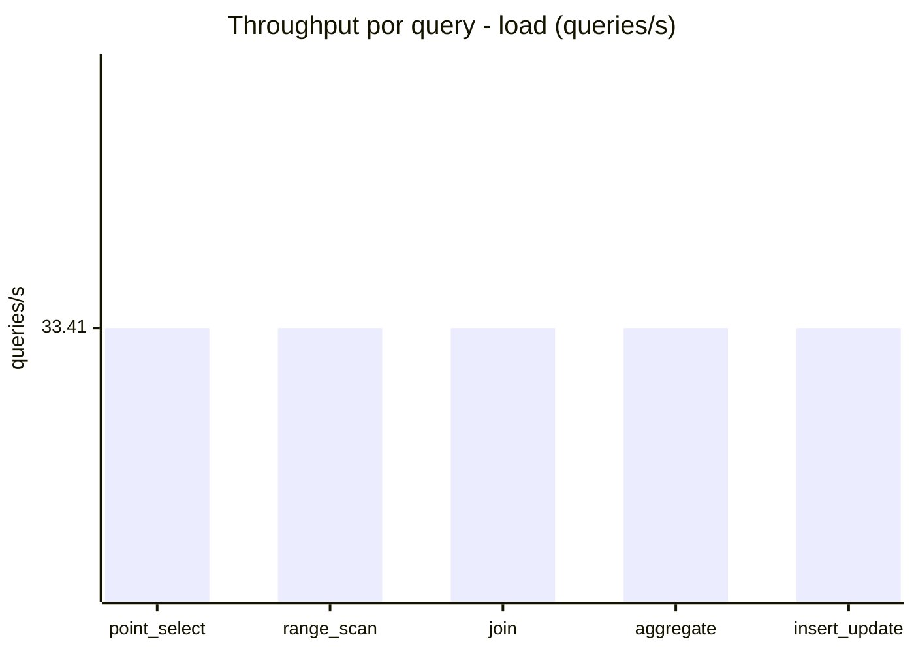
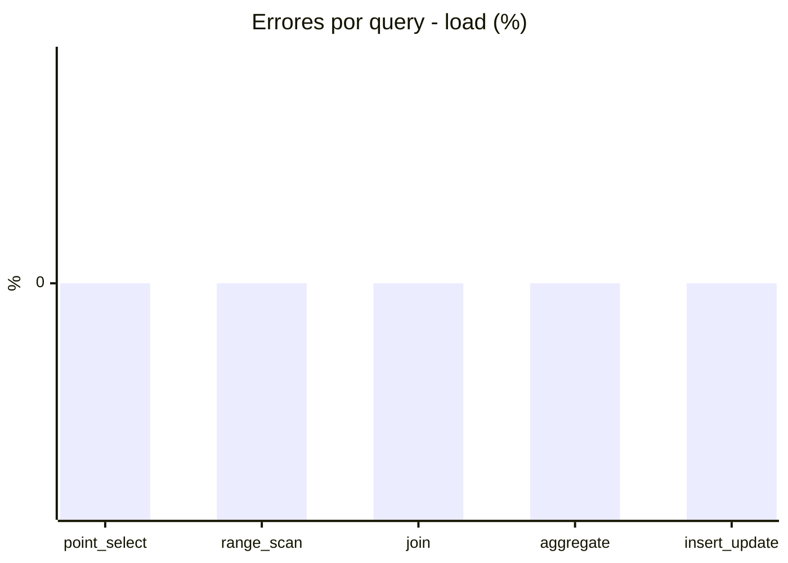
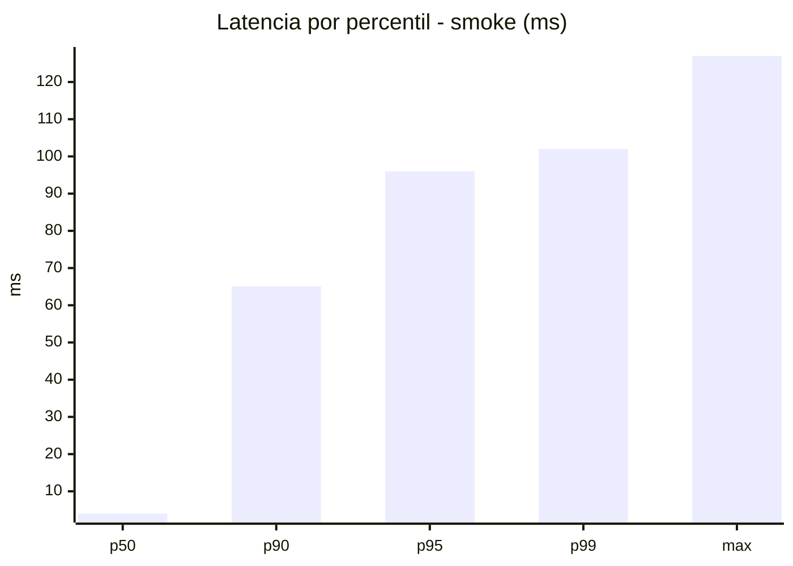
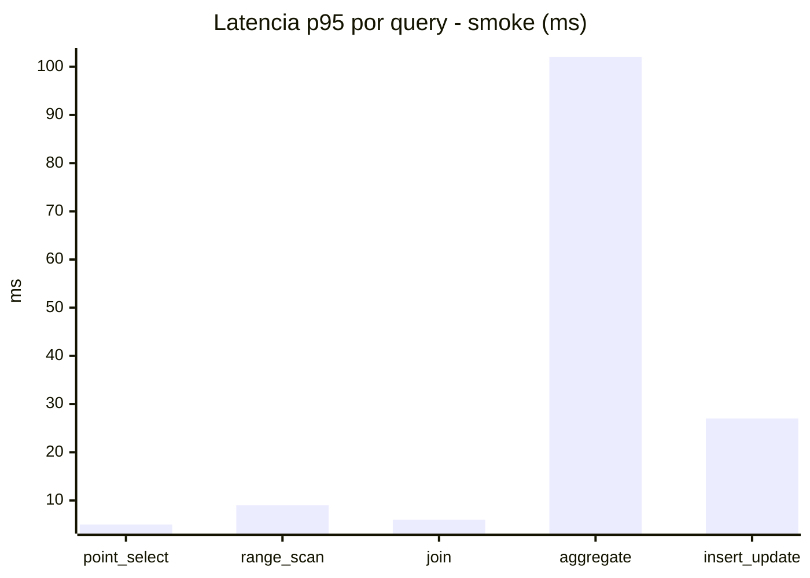
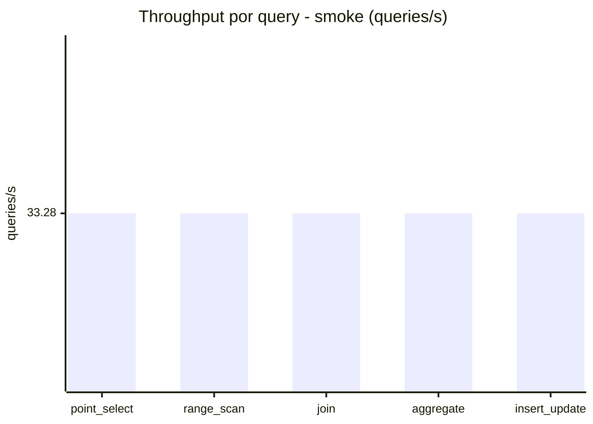
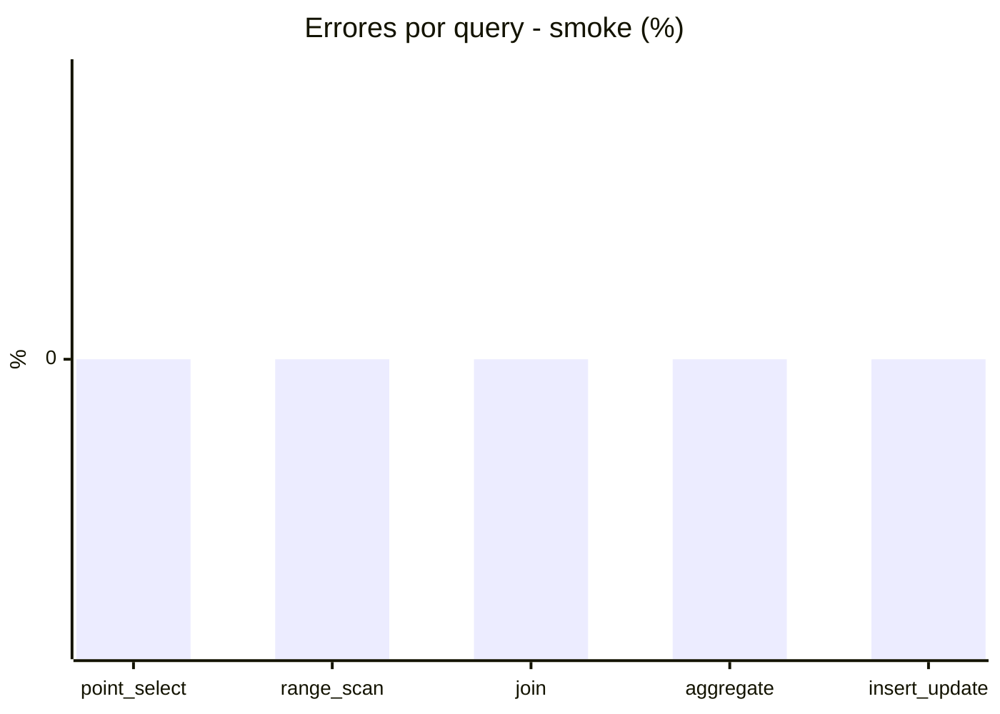

# Reporte de performance - SQL Server (k6)

**Fecha:** 2026-08-15 13:50 UTC  
**Veredicto (SLO):** `FAIL`  
**Corrida:** [ver en GitHub Actions](https://github.com/lrbg/k6-sqlserver-lab/actions/runs/31888196170)  

## Analisis del agente de IA

FAIL (fallback por umbrales)

- Error maximo: 0%
- p95 maximo: 538 ms

## Resultados

### Escenario: `load`

| Metrica | Valor |
| --- | --- |
| Queries ejecutadas | 10065 |
| Errores | 0 (0%) |
| Latencia media | 119.6 ms |
| p50 / p90 / p95 / p99 | 32 / 466 / 538 / 569 ms |
| Min / Max | 0 / 601 ms |
| Throughput | 167.05 queries/s |
| Duracion | 60.3 s |

Detalle por query

| Query | Ejecuciones | Error % | avg | p95 | p99 | q/s |
| --- | --- | --- | --- | --- | --- | --- |
| point_select | 2013 | 0% | 10.4 | 32.4 | 43 | 33.41 |
| range_scan | 2013 | 0% | 37.3 | 88 | 123 | 33.41 |
| join | 2013 | 0% | 17.3 | 39 | 43 | 33.41 |
| aggregate | 2013 | 0% | 471.2 | 569 | 580 | 33.41 |
| insert_update | 2013 | 0% | 61.7 | 136.4 | 176.8 | 33.41 |

### Escenario: `smoke`

| Metrica | Valor |
| --- | --- |
| Queries ejecutadas | 5000 |
| Errores | 0 (0%) |
| Latencia media | 18 ms |
| p50 / p90 / p95 / p99 | 4 / 65.1 / 96 / 102 ms |
| Min / Max | 0 / 127 ms |
| Throughput | 166.38 queries/s |
| Duracion | 30.1 s |

Detalle por query

| Query | Ejecuciones | Error % | avg | p95 | p99 | q/s |
| --- | --- | --- | --- | --- | --- | --- |
| point_select | 1000 | 0% | 1.5 | 5 | 6 | 33.28 |
| range_scan | 1000 | 0% | 4.7 | 9 | 15 | 33.28 |
| join | 1000 | 0% | 2.5 | 6 | 7 | 33.28 |
| aggregate | 1000 | 0% | 72.2 | 102 | 108 | 33.28 |
| insert_update | 1000 | 0% | 9 | 27 | 35 | 33.28 |

