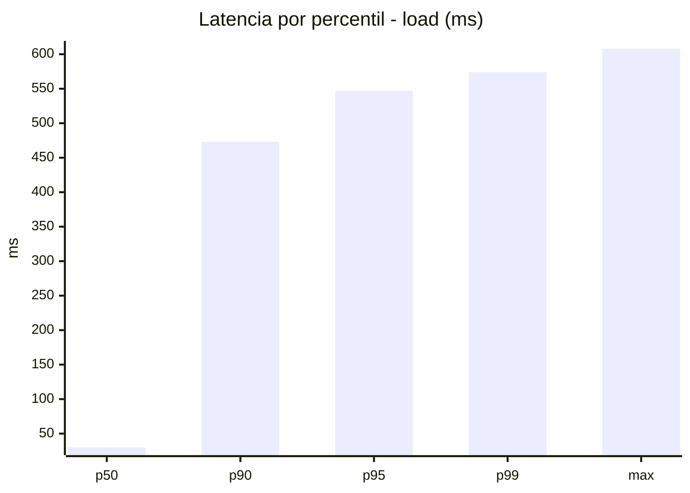
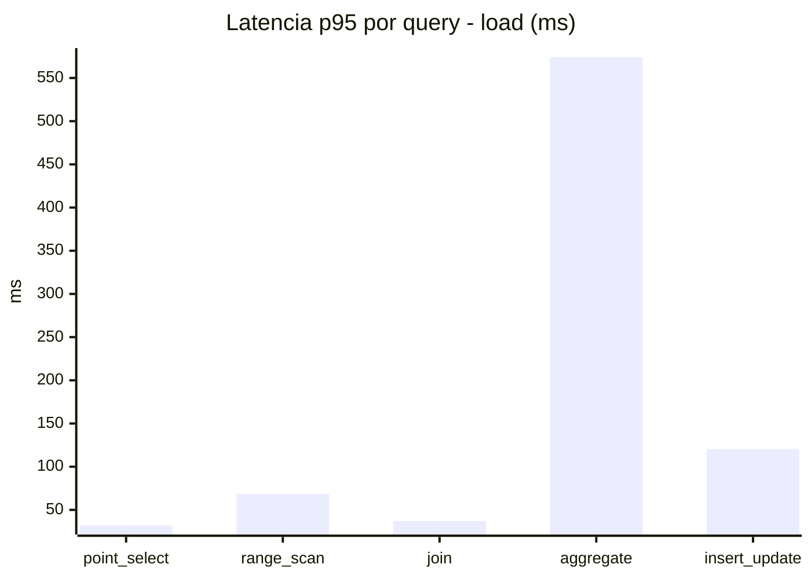
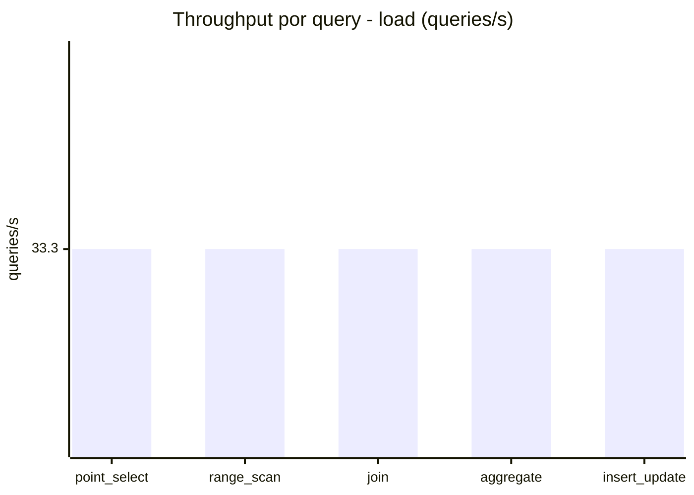
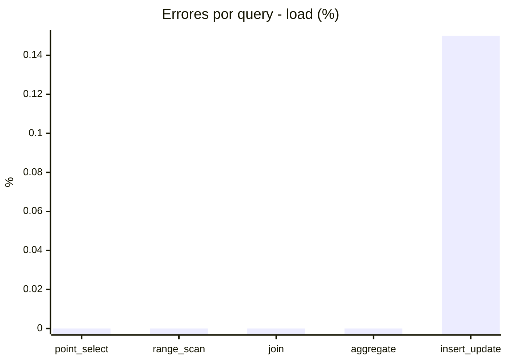
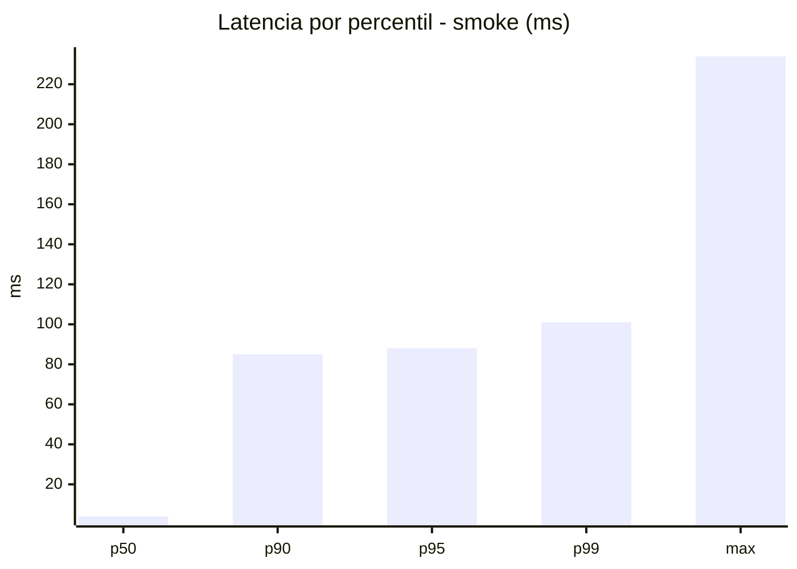
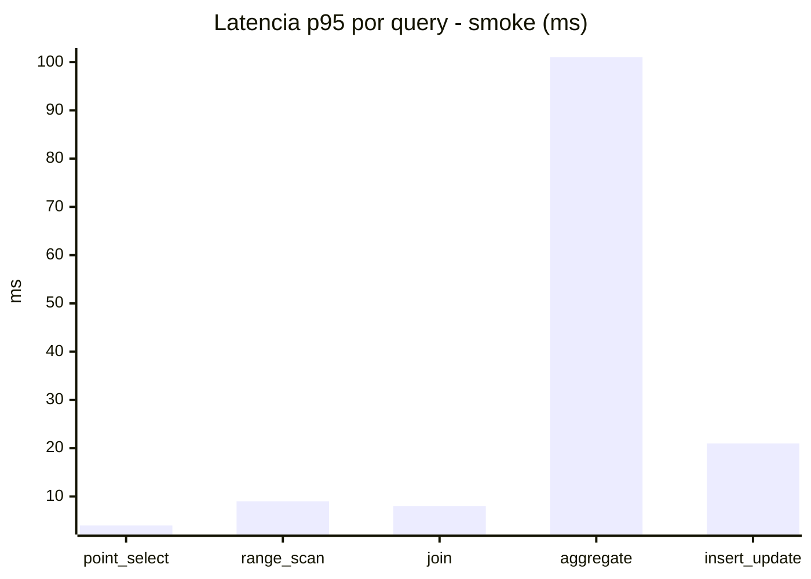
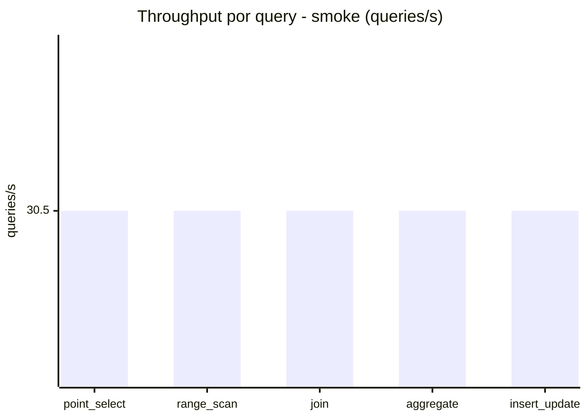
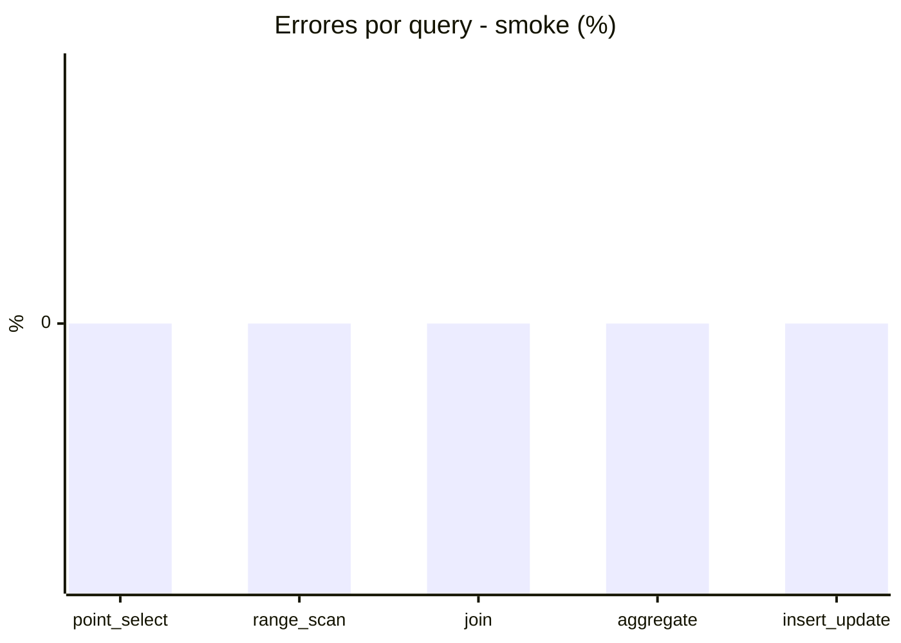

# Reporte de performance - SQL Server (k6)

**Fecha:** 2026-08-16 13:51 UTC  
**Veredicto (SLO):** `FAIL`  
**Corrida:** [ver en GitHub Actions](https://github.com/lrbg/k6-sqlserver-lab/actions/runs/31950917386)  

## Analisis del agente de IA

FAIL (fallback por umbrales)

- Error maximo: 0.03%
- p95 maximo: 547 ms

## Resultados

### Escenario: `load`

| Metrica | Valor |
| --- | --- |
| Queries ejecutadas | 10050 |
| Errores | 3 (0.03%) |
| Latencia media | 119.9 ms |
| p50 / p90 / p95 / p99 | 30 / 473 / 547 / 574 ms |
| Min / Max | 0 / 608 ms |
| Throughput | 166.52 queries/s |
| Duracion | 60.4 s |

Detalle por query

| Query | Ejecuciones | Error % | avg | p95 | p99 | q/s |
| --- | --- | --- | --- | --- | --- | --- |
| point_select | 2010 | 0% | 12 | 32 | 46.9 | 33.3 |
| range_scan | 2010 | 0% | 31.4 | 68.5 | 92 | 33.3 |
| join | 2010 | 0% | 18.5 | 37 | 40 | 33.3 |
| aggregate | 2010 | 0% | 480.6 | 574 | 591 | 33.3 |
| insert_update | 2010 | 0.15% | 57.4 | 120.5 | 155 | 33.3 |

### Escenario: `smoke`

| Metrica | Valor |
| --- | --- |
| Queries ejecutadas | 4580 |
| Errores | 0 (0%) |
| Latencia media | 19.6 ms |
| p50 / p90 / p95 / p99 | 4 / 85 / 88 / 101 ms |
| Min / Max | 0 / 234 ms |
| Throughput | 152.52 queries/s |
| Duracion | 30 s |

Detalle por query

| Query | Ejecuciones | Error % | avg | p95 | p99 | q/s |
| --- | --- | --- | --- | --- | --- | --- |
| point_select | 916 | 0% | 1.6 | 4 | 6 | 30.5 |
| range_scan | 916 | 0% | 4.3 | 9 | 12 | 30.5 |
| join | 916 | 0% | 3.4 | 8 | 9 | 30.5 |
| aggregate | 916 | 0% | 80.3 | 101 | 104.7 | 30.5 |
| insert_update | 916 | 0% | 8.5 | 21 | 34.9 | 30.5 |

