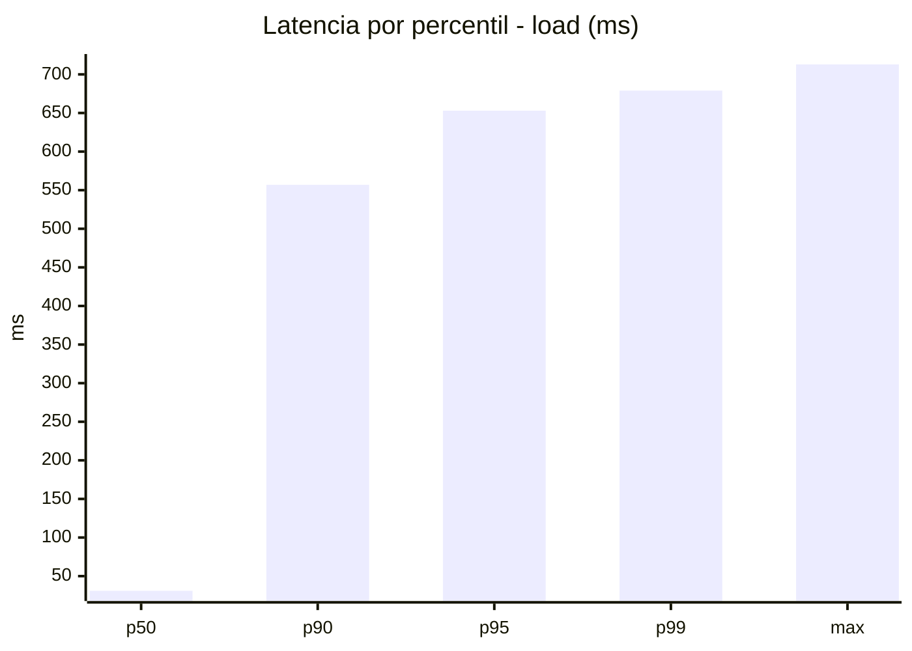
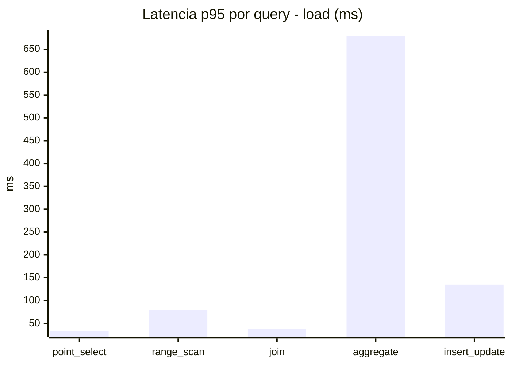
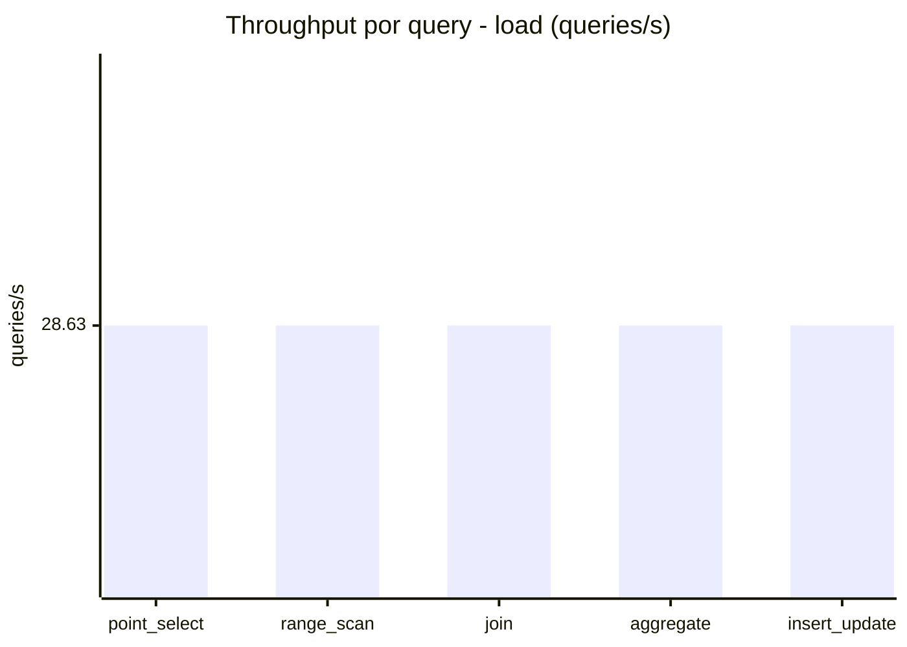
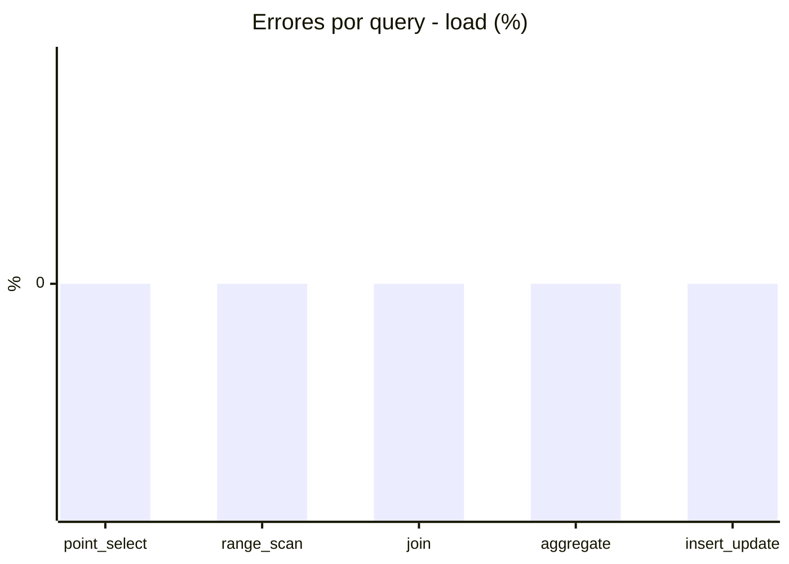
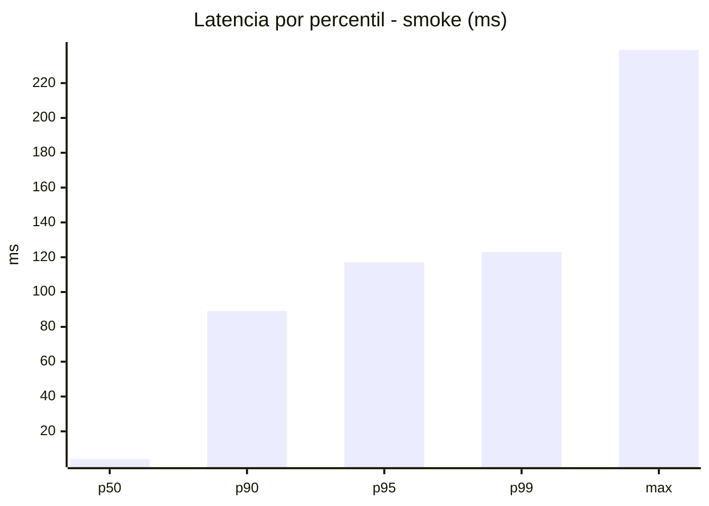
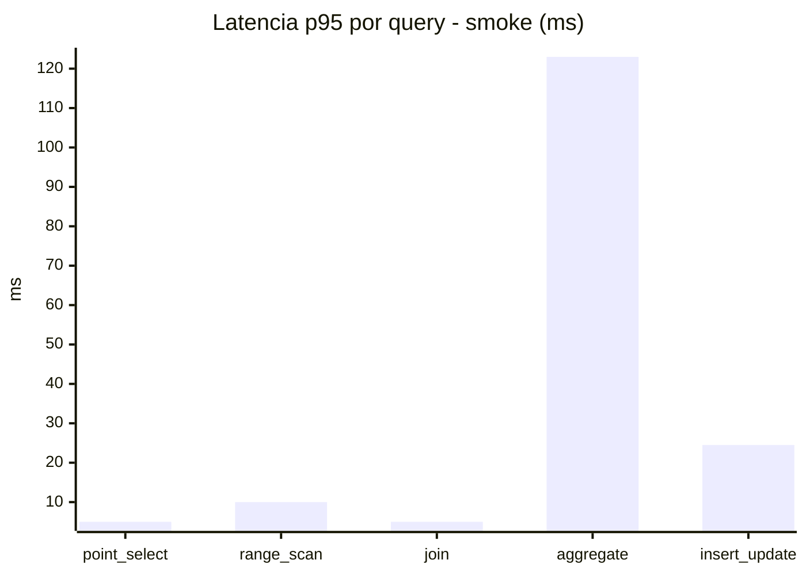
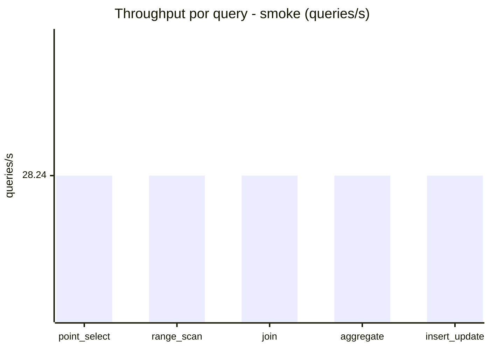
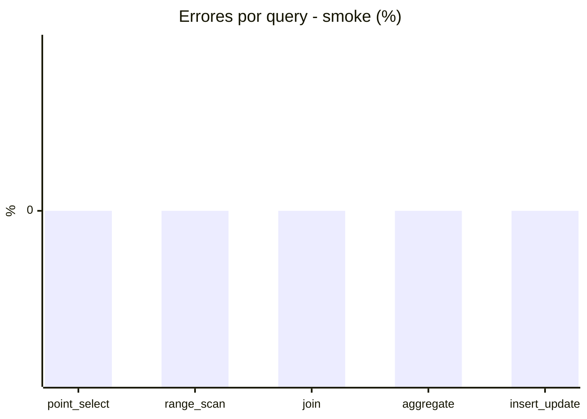

# Reporte de performance - SQL Server (k6)

**Fecha:** 2026-08-17 13:59 UTC  
**Veredicto (SLO):** `FAIL`  
**Corrida:** [ver en GitHub Actions](https://github.com/lrbg/k6-sqlserver-lab/actions/runs/32037304503)  

## Analisis del agente de IA

FAIL (fallback por umbrales)

- Error maximo: 0%
- p95 maximo: 653 ms

## Resultados

### Escenario: `load`

| Metrica | Valor |
| --- | --- |
| Queries ejecutadas | 8645 |
| Errores | 0 (0%) |
| Latencia media | 139.4 ms |
| p50 / p90 / p95 / p99 | 31 / 557 / 653 / 679 ms |
| Min / Max | 0 / 713 ms |
| Throughput | 143.15 queries/s |
| Duracion | 60.4 s |

Detalle por query

| Query | Ejecuciones | Error % | avg | p95 | p99 | q/s |
| --- | --- | --- | --- | --- | --- | --- |
| point_select | 1729 | 0% | 12.5 | 33 | 43.7 | 28.63 |
| range_scan | 1729 | 0% | 33.9 | 79 | 115.2 | 28.63 |
| join | 1729 | 0% | 18.9 | 38 | 41 | 28.63 |
| aggregate | 1729 | 0% | 574 | 679 | 695 | 28.63 |
| insert_update | 1729 | 0% | 57.8 | 135 | 170 | 28.63 |

### Escenario: `smoke`

| Metrica | Valor |
| --- | --- |
| Queries ejecutadas | 4250 |
| Errores | 0 (0%) |
| Latencia media | 21.2 ms |
| p50 / p90 / p95 / p99 | 4 / 89.1 / 117 / 123 ms |
| Min / Max | 0 / 239 ms |
| Throughput | 141.21 queries/s |
| Duracion | 30.1 s |

Detalle por query

| Query | Ejecuciones | Error % | avg | p95 | p99 | q/s |
| --- | --- | --- | --- | --- | --- | --- |
| point_select | 850 | 0% | 1.4 | 5 | 5 | 28.24 |
| range_scan | 850 | 0% | 5.2 | 10 | 13.5 | 28.24 |
| join | 850 | 0% | 2.4 | 5 | 8.5 | 28.24 |
| aggregate | 850 | 0% | 88.9 | 123 | 130 | 28.24 |
| insert_update | 850 | 0% | 8.1 | 24.5 | 27 | 28.24 |

