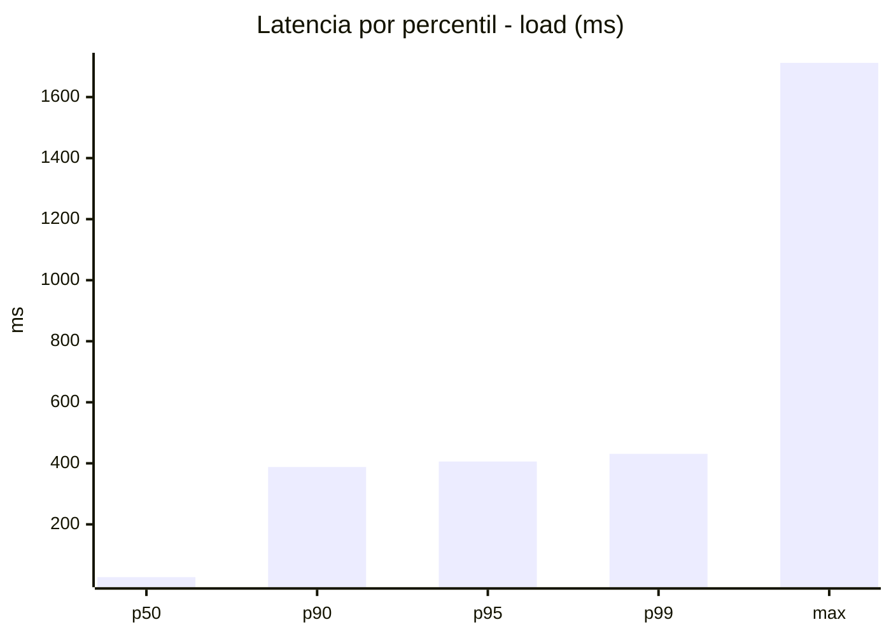
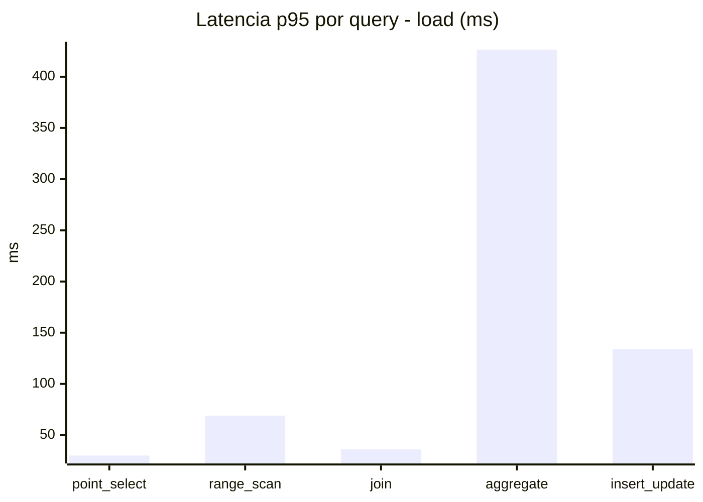
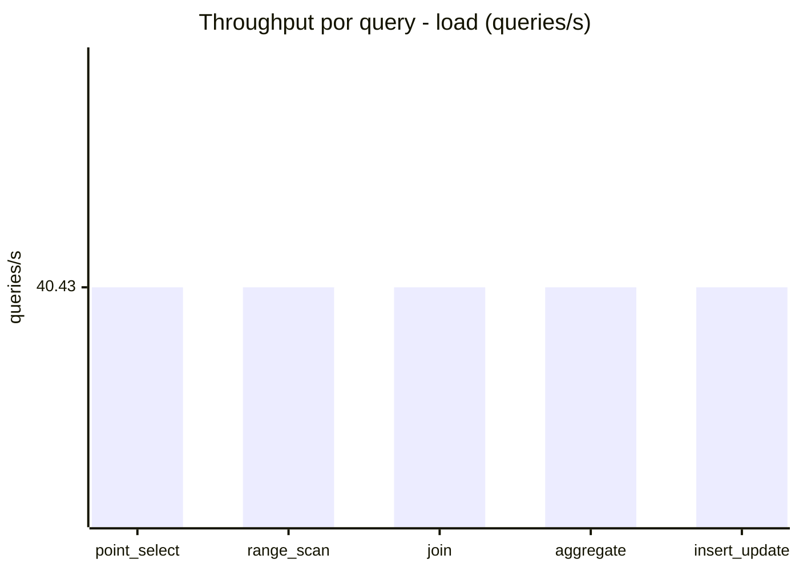
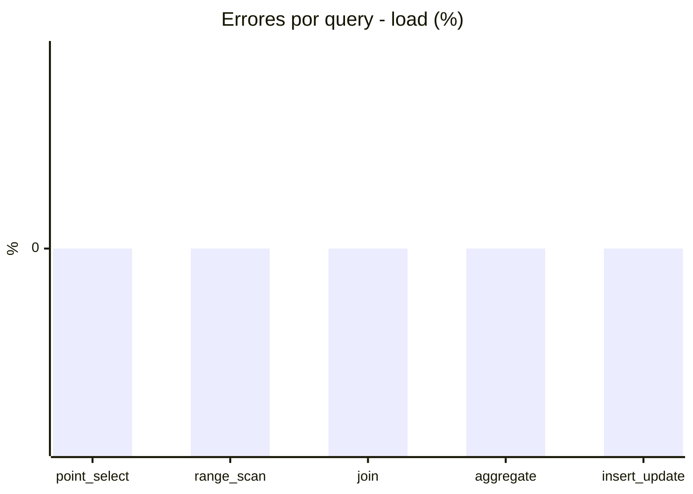
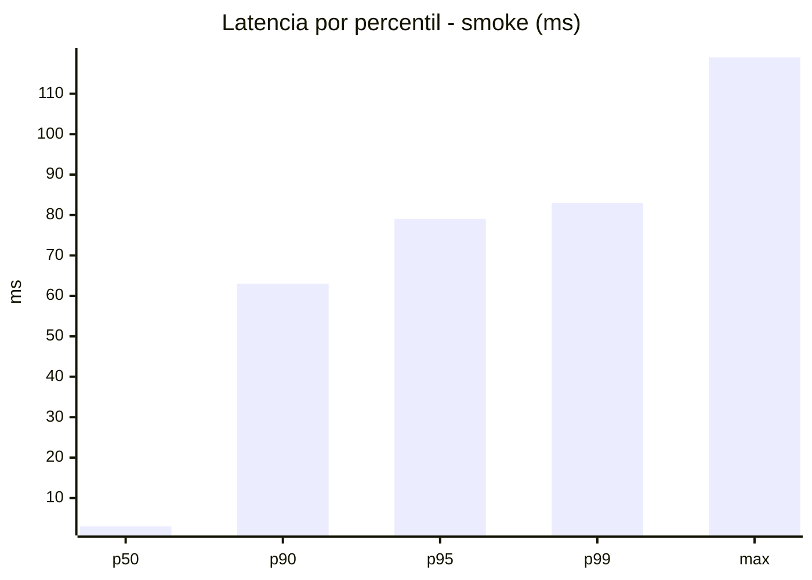
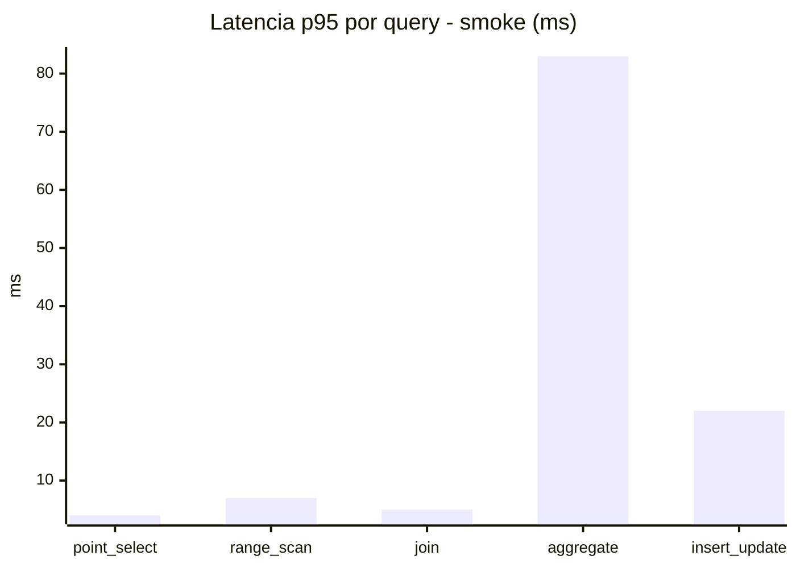
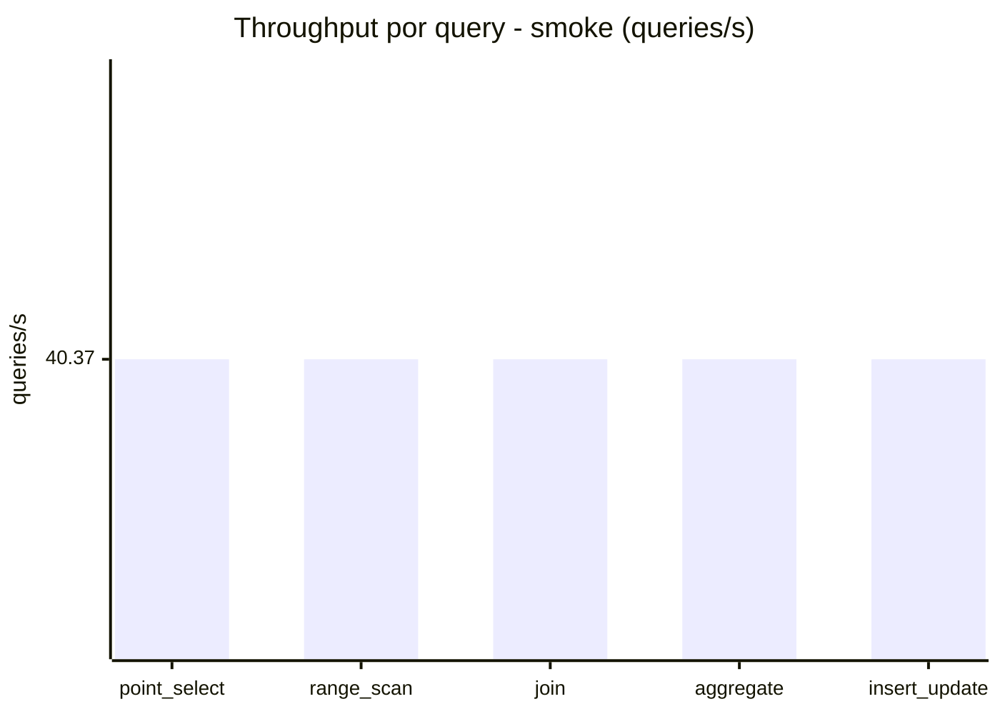
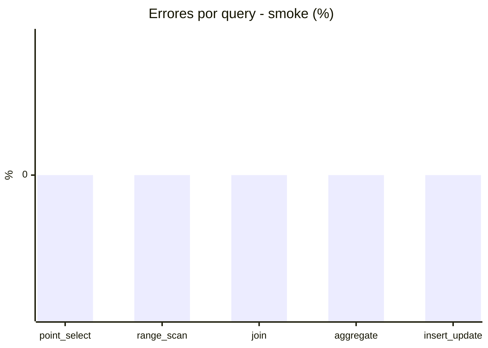

# Reporte de performance - SQL Server (k6)

**Fecha:** 2026-08-18 14:04 UTC  
**Veredicto (SLO):** `FAIL`  
**Corrida:** [ver en GitHub Actions](https://github.com/lrbg/k6-sqlserver-lab/actions/runs/32145817240)  

## Analisis del agente de IA

FAIL (fallback por umbrales)

- Error maximo: 0%
- p95 maximo: 406 ms

## Resultados

### Escenario: `load`

| Metrica | Valor |
| --- | --- |
| Queries ejecutadas | 12155 |
| Errores | 0 (0%) |
| Latencia media | 98.9 ms |
| p50 / p90 / p95 / p99 | 27 / 388 / 406 / 431 ms |
| Min / Max | 0 / 1712 ms |
| Throughput | 202.14 queries/s |
| Duracion | 60.1 s |

Detalle por query

| Query | Ejecuciones | Error % | avg | p95 | p99 | q/s |
| --- | --- | --- | --- | --- | --- | --- |
| point_select | 2431 | 0% | 8.5 | 30 | 39 | 40.43 |
| range_scan | 2431 | 0% | 30.3 | 69 | 103 | 40.43 |
| join | 2431 | 0% | 14.5 | 36 | 40 | 40.43 |
| aggregate | 2431 | 0% | 373.6 | 426.5 | 450 | 40.43 |
| insert_update | 2431 | 0% | 67.3 | 134 | 183.4 | 40.43 |

### Escenario: `smoke`

| Metrica | Valor |
| --- | --- |
| Queries ejecutadas | 6065 |
| Errores | 0 (0%) |
| Latencia media | 14.8 ms |
| p50 / p90 / p95 / p99 | 3 / 63 / 79 / 83 ms |
| Min / Max | 0 / 119 ms |
| Throughput | 201.83 queries/s |
| Duracion | 30 s |

Detalle por query

| Query | Ejecuciones | Error % | avg | p95 | p99 | q/s |
| --- | --- | --- | --- | --- | --- | --- |
| point_select | 1213 | 0% | 1 | 4 | 5 | 40.37 |
| range_scan | 1213 | 0% | 3.6 | 7 | 12 | 40.37 |
| join | 1213 | 0% | 1.7 | 5 | 6 | 40.37 |
| aggregate | 1213 | 0% | 60.2 | 83 | 86 | 40.37 |
| insert_update | 1213 | 0% | 7.7 | 22 | 62.5 | 40.37 |

