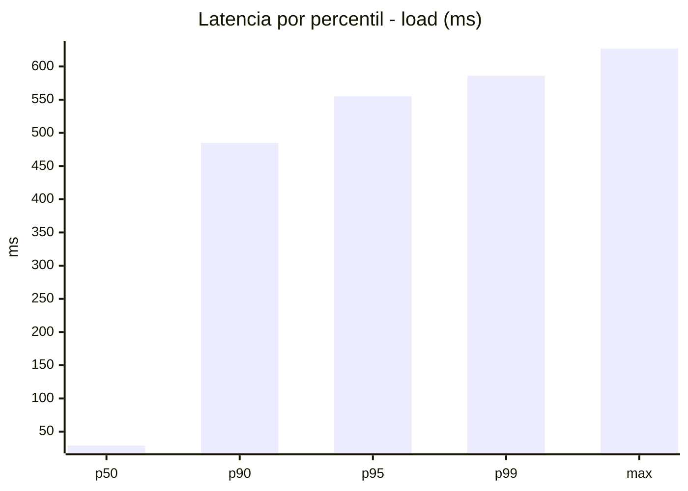
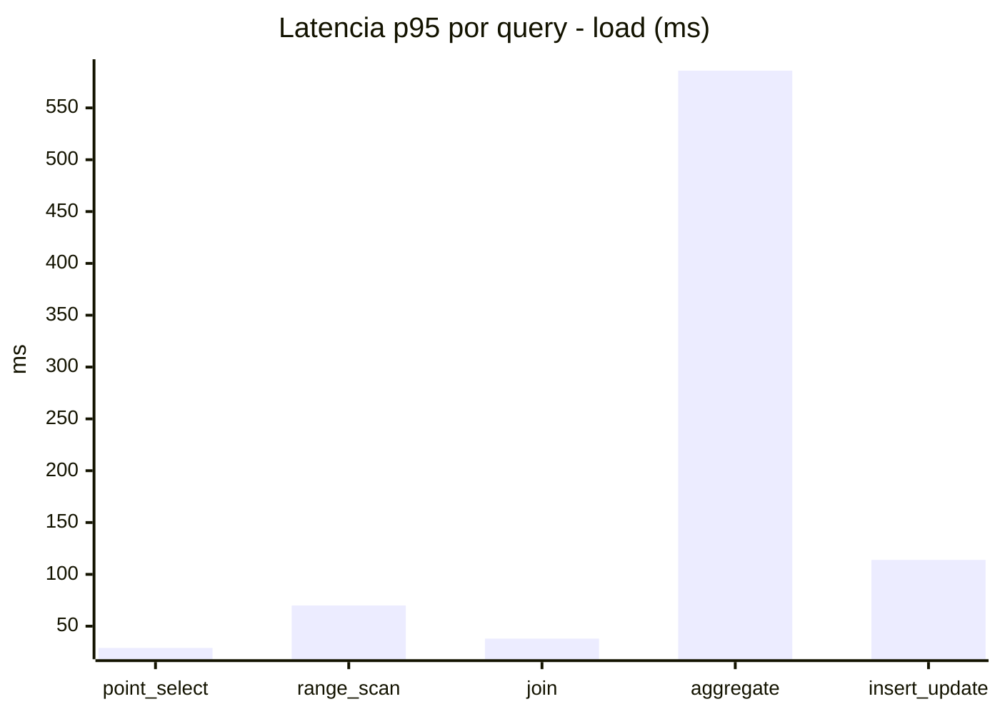
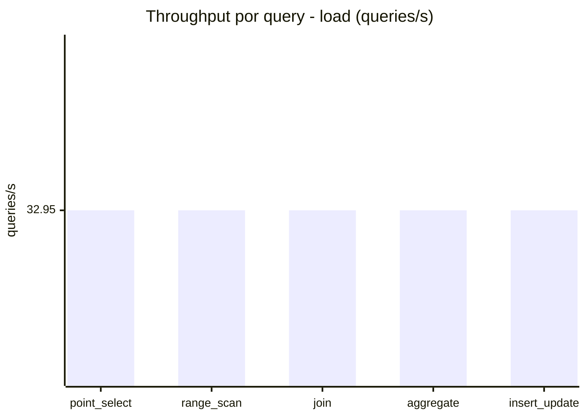
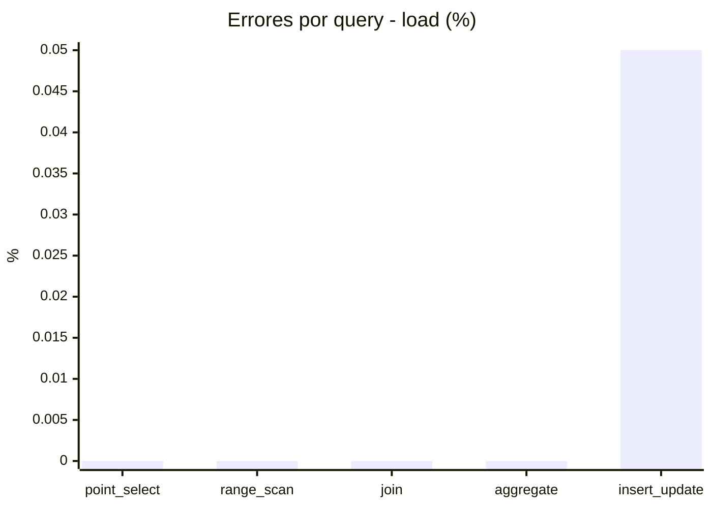
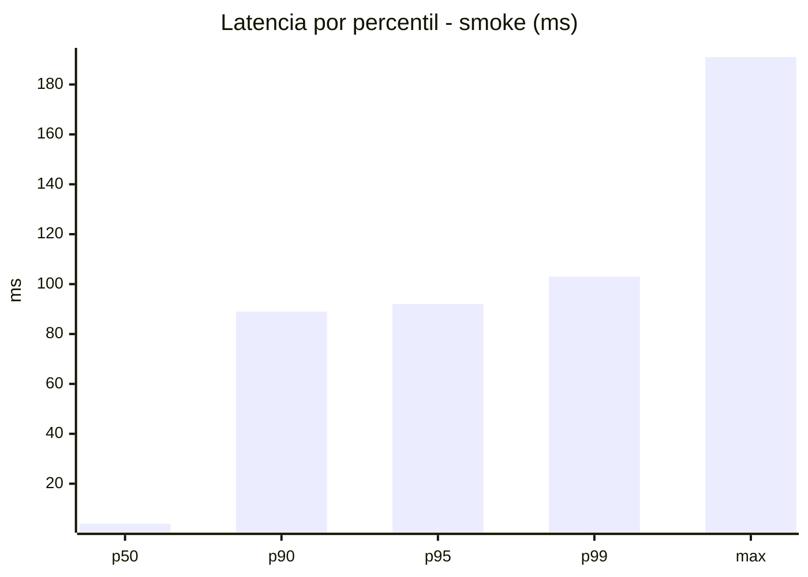
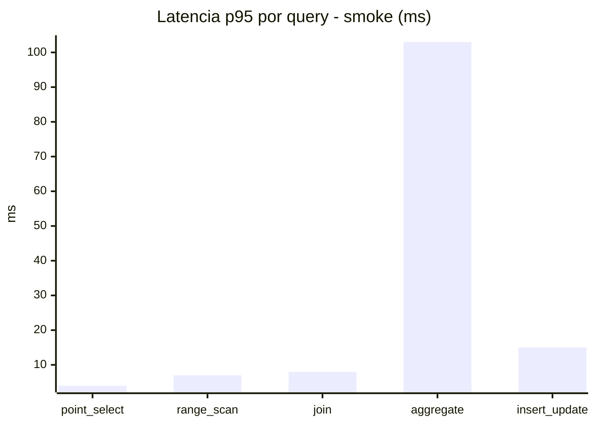
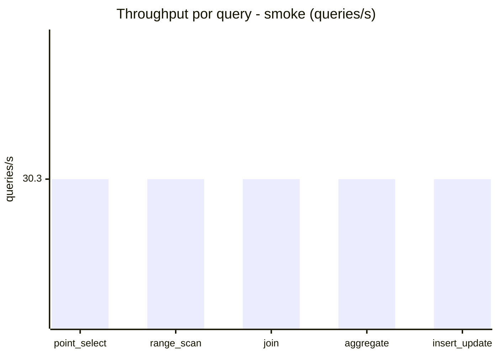
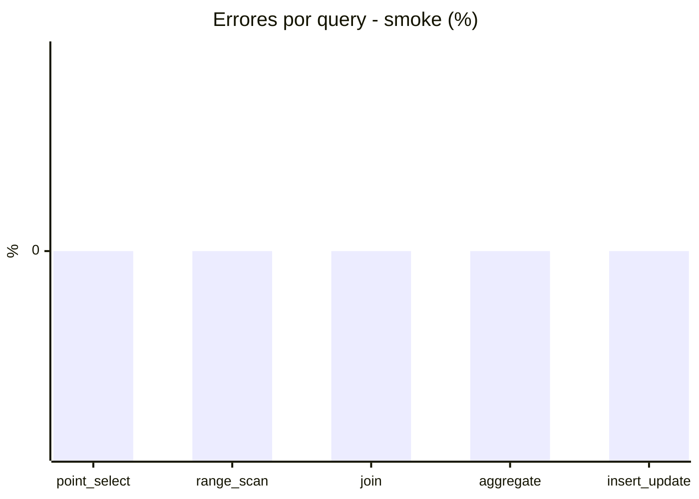

# Reporte de performance - SQL Server (k6)

**Fecha:** 2026-08-19 14:04 UTC  
**Veredicto (SLO):** `FAIL`  
**Corrida:** [ver en GitHub Actions](https://github.com/lrbg/k6-sqlserver-lab/actions/runs/32261656798)  

## Analisis del agente de IA

FAIL (fallback por umbrales)

- Error maximo: 0.01%
- p95 maximo: 555 ms

## Resultados

### Escenario: `load`

| Metrica | Valor |
| --- | --- |
| Queries ejecutadas | 9910 |
| Errores | 1 (0.01%) |
| Latencia media | 121.2 ms |
| p50 / p90 / p95 / p99 | 29 / 485 / 555 / 586 ms |
| Min / Max | 0 / 627 ms |
| Throughput | 164.76 queries/s |
| Duracion | 60.1 s |

Detalle por query

| Query | Ejecuciones | Error % | avg | p95 | p99 | q/s |
| --- | --- | --- | --- | --- | --- | --- |
| point_select | 1982 | 0% | 9.8 | 29 | 39 | 32.95 |
| range_scan | 1982 | 0% | 30.6 | 70 | 92 | 32.95 |
| join | 1982 | 0% | 17 | 38 | 43 | 32.95 |
| aggregate | 1982 | 0% | 494.8 | 586 | 602 | 32.95 |
| insert_update | 1982 | 0.05% | 53.7 | 113.9 | 153.2 | 32.95 |

### Escenario: `smoke`

| Metrica | Valor |
| --- | --- |
| Queries ejecutadas | 4555 |
| Errores | 0 (0%) |
| Latencia media | 19.8 ms |
| p50 / p90 / p95 / p99 | 4 / 89 / 92 / 103 ms |
| Min / Max | 0 / 191 ms |
| Throughput | 151.51 queries/s |
| Duracion | 30.1 s |

Detalle por query

| Query | Ejecuciones | Error % | avg | p95 | p99 | q/s |
| --- | --- | --- | --- | --- | --- | --- |
| point_select | 911 | 0% | 1.3 | 4 | 5 | 30.3 |
| range_scan | 911 | 0% | 4.2 | 7 | 10.9 | 30.3 |
| join | 911 | 0% | 3.2 | 8 | 10 | 30.3 |
| aggregate | 911 | 0% | 83.6 | 103 | 106 | 30.3 |
| insert_update | 911 | 0% | 6.5 | 15 | 24 | 30.3 |

