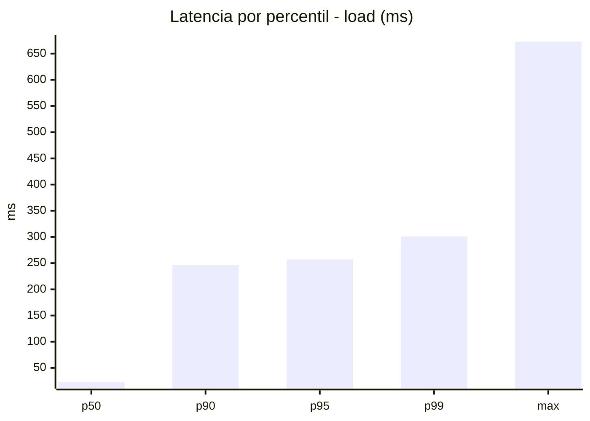
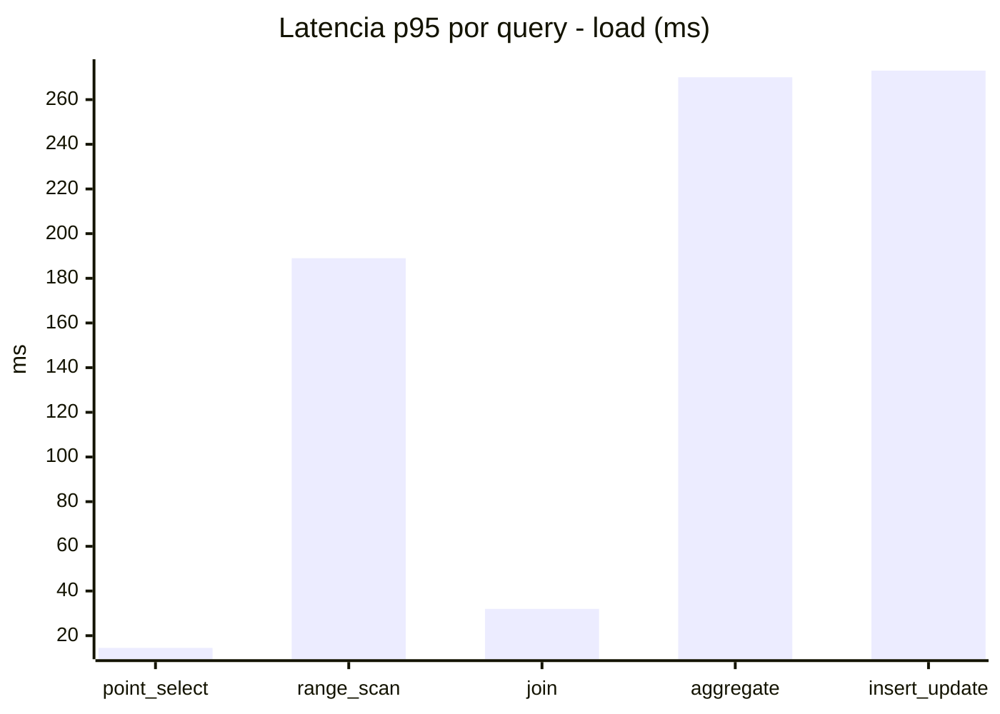
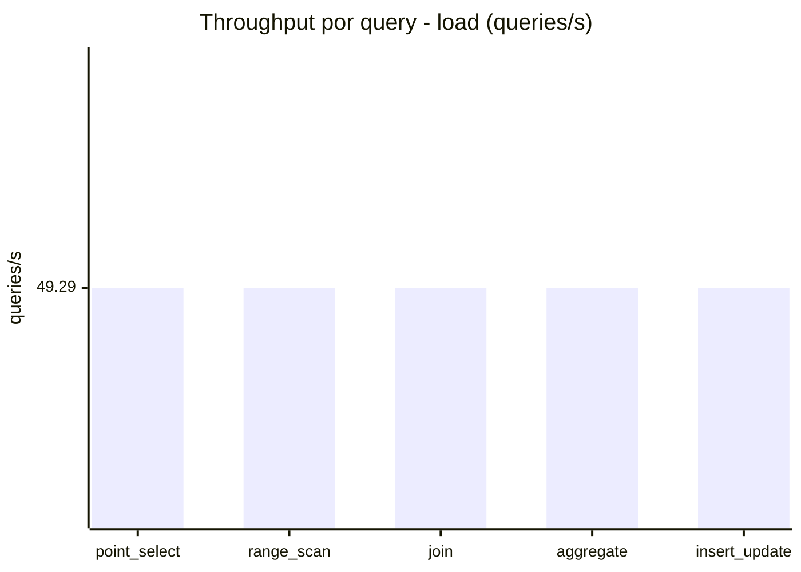
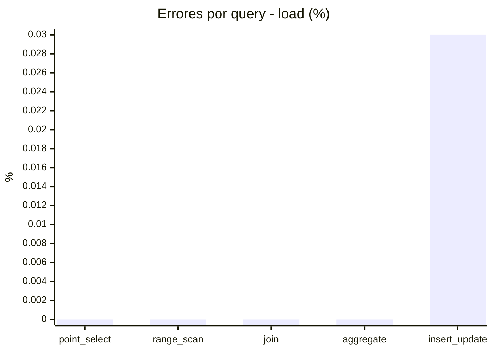
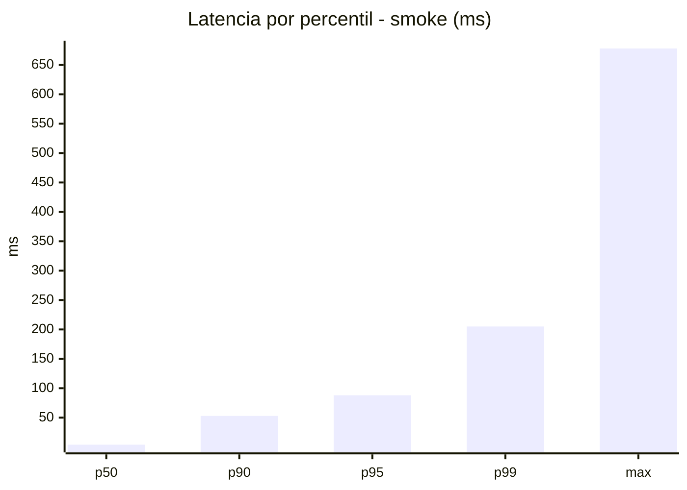
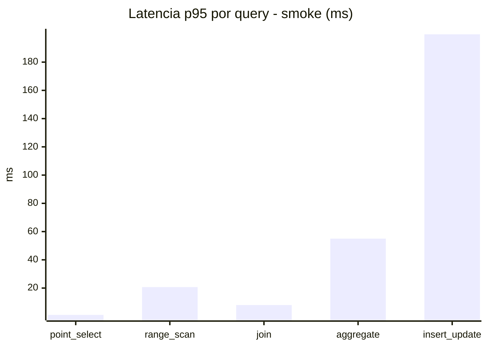
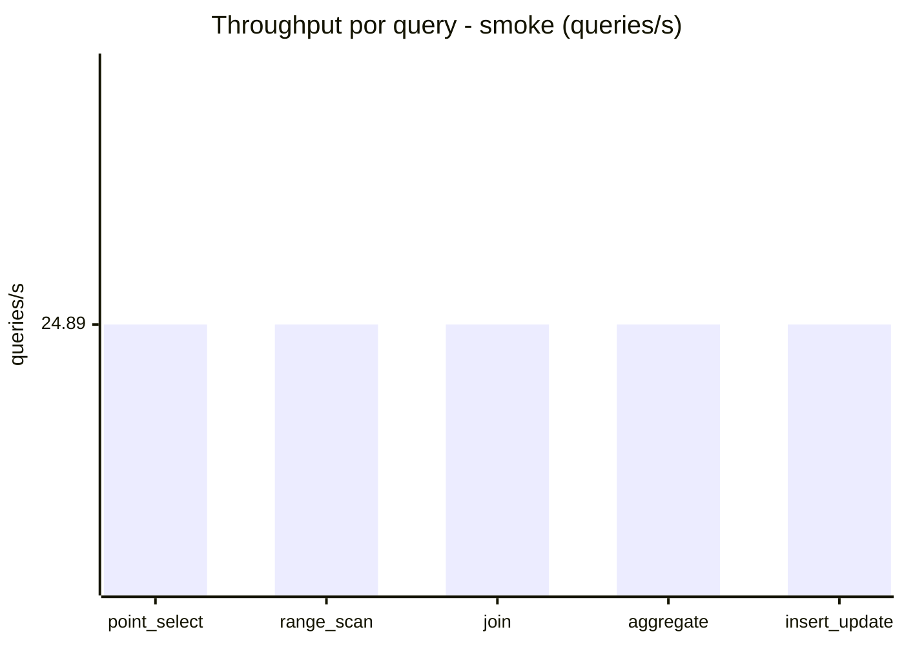
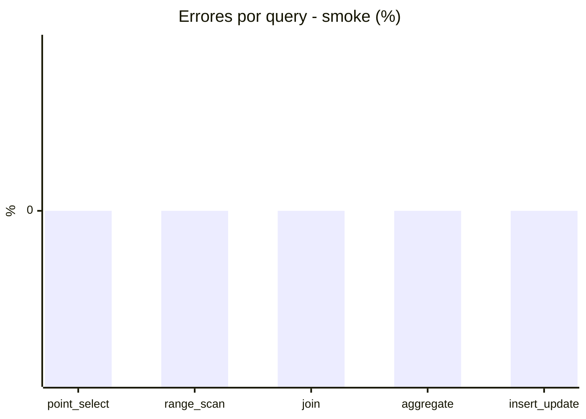

# Reporte de performance - SQL Server (k6)

**Fecha:** 2026-08-20 14:07 UTC  
**Veredicto (SLO):** `WARN`  
**Corrida:** [ver en GitHub Actions](https://github.com/lrbg/k6-sqlserver-lab/actions/runs/32378001835)  

## Analisis del agente de IA

WARN (fallback por umbrales)

- Error maximo: 0.01%
- p95 maximo: 257 ms

## Resultados

### Escenario: `load`

| Metrica | Valor |
| --- | --- |
| Queries ejecutadas | 14855 |
| Errores | 1 (0.01%) |
| Latencia media | 81.1 ms |
| p50 / p90 / p95 / p99 | 23 / 246 / 257 / 301 ms |
| Min / Max | 0 / 673 ms |
| Throughput | 246.43 queries/s |
| Duracion | 60.3 s |

Detalle por query

| Query | Ejecuciones | Error % | avg | p95 | p99 | q/s |
| --- | --- | --- | --- | --- | --- | --- |
| point_select | 2971 | 0% | 4.4 | 14.5 | 30.3 | 49.29 |
| range_scan | 2971 | 0% | 43 | 189 | 321.3 | 49.29 |
| join | 2971 | 0% | 12 | 32 | 36 | 49.29 |
| aggregate | 2971 | 0% | 230 | 270 | 286 | 49.29 |
| insert_update | 2971 | 0.03% | 116.2 | 273 | 476.4 | 49.29 |

### Escenario: `smoke`

| Metrica | Valor |
| --- | --- |
| Queries ejecutadas | 3735 |
| Errores | 0 (0%) |
| Latencia media | 24.1 ms |
| p50 / p90 / p95 / p99 | 4 / 53 / 88 / 205 ms |
| Min / Max | 0 / 678 ms |
| Throughput | 124.44 queries/s |
| Duracion | 30 s |

Detalle por query

| Query | Ejecuciones | Error % | avg | p95 | p99 | q/s |
| --- | --- | --- | --- | --- | --- | --- |
| point_select | 747 | 0% | 1 | 1 | 3.5 | 24.89 |
| range_scan | 747 | 0% | 7.3 | 20.7 | 87.3 | 24.89 |
| join | 747 | 0% | 3 | 8 | 9 | 24.89 |
| aggregate | 747 | 0% | 49.4 | 55 | 65 | 24.89 |
| insert_update | 747 | 0% | 59.6 | 199.7 | 311.2 | 24.89 |

