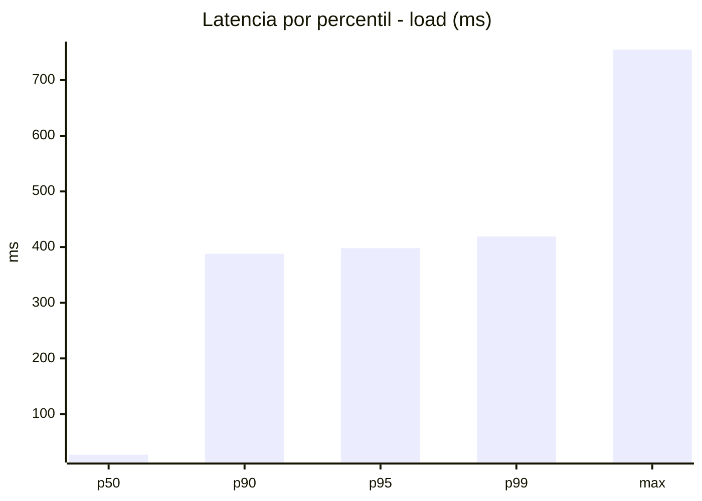
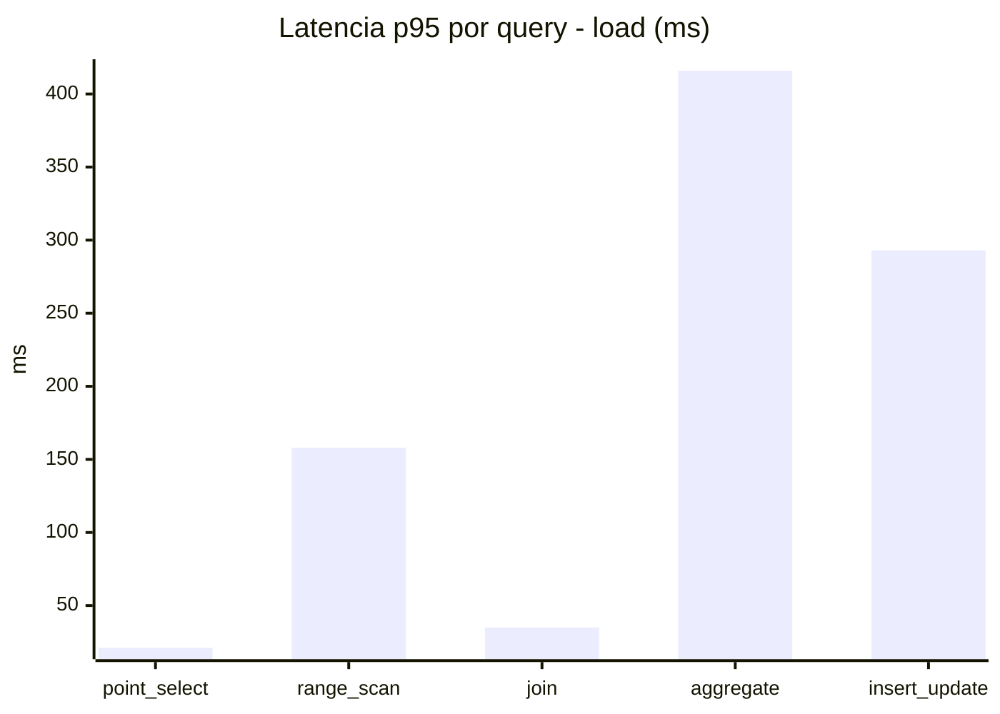
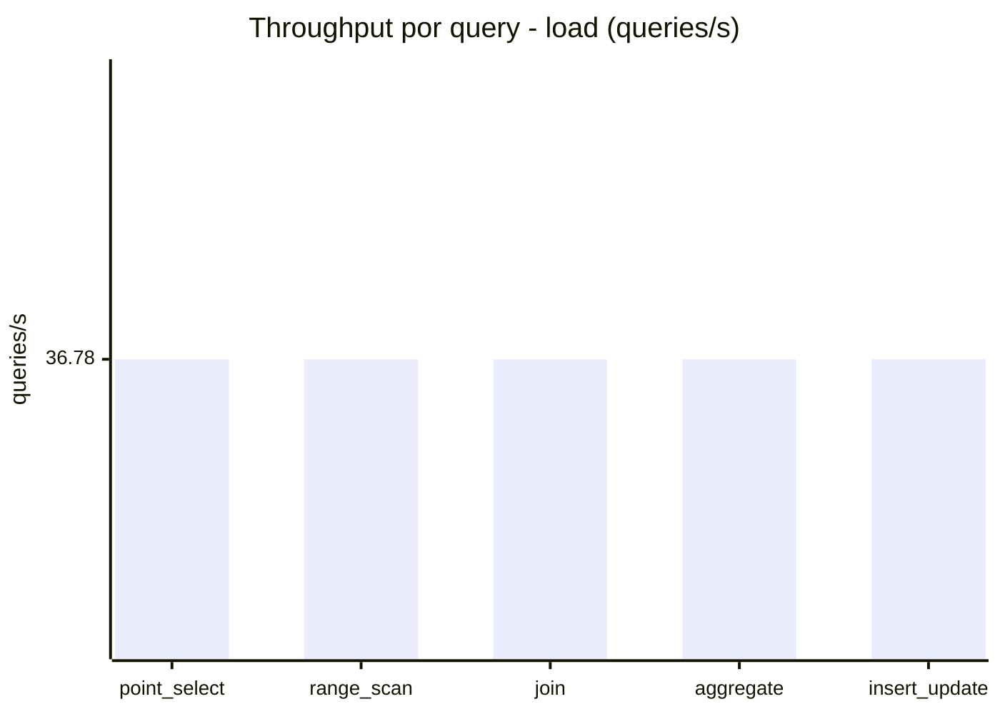
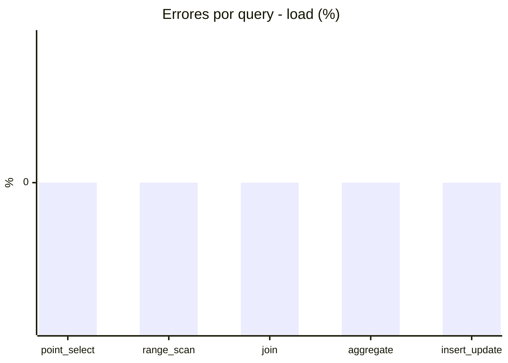
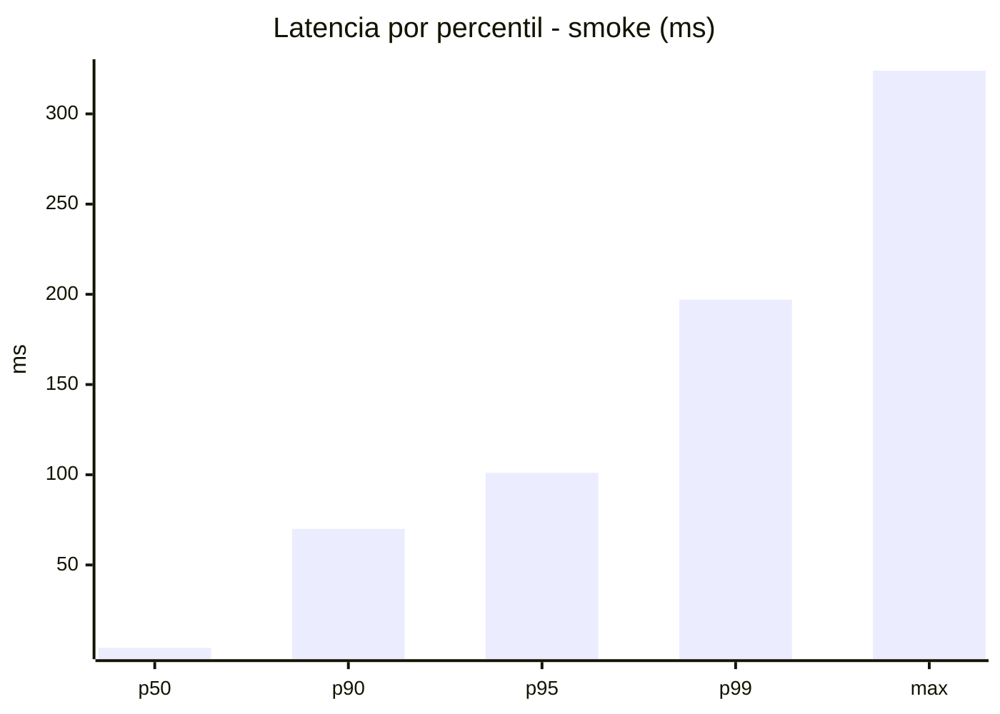
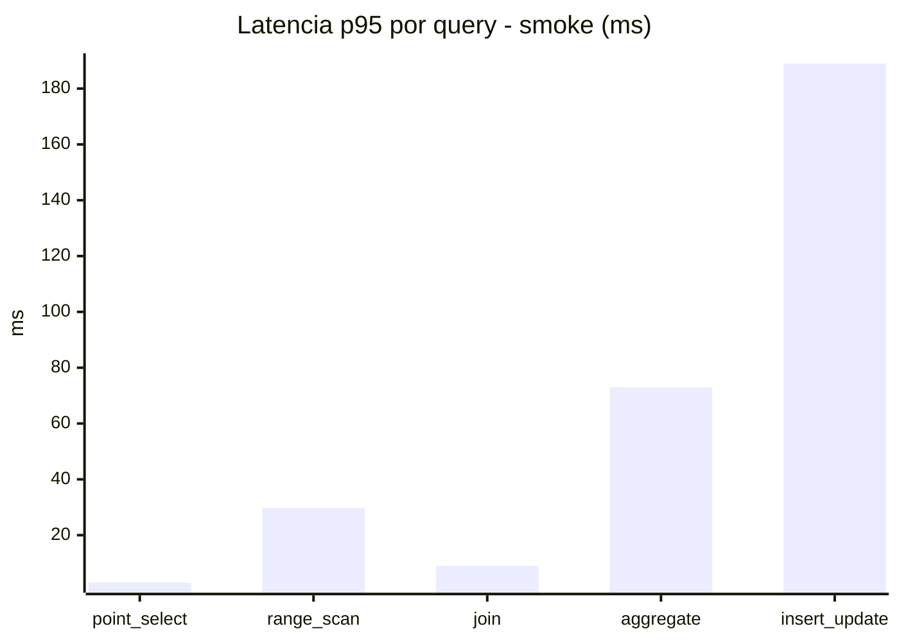
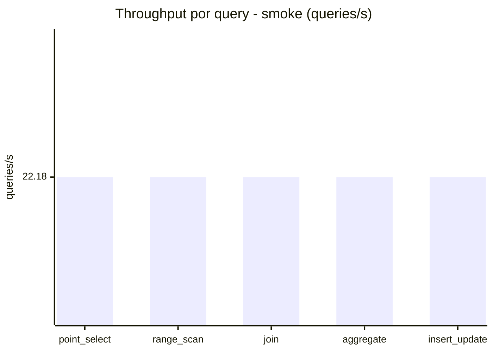
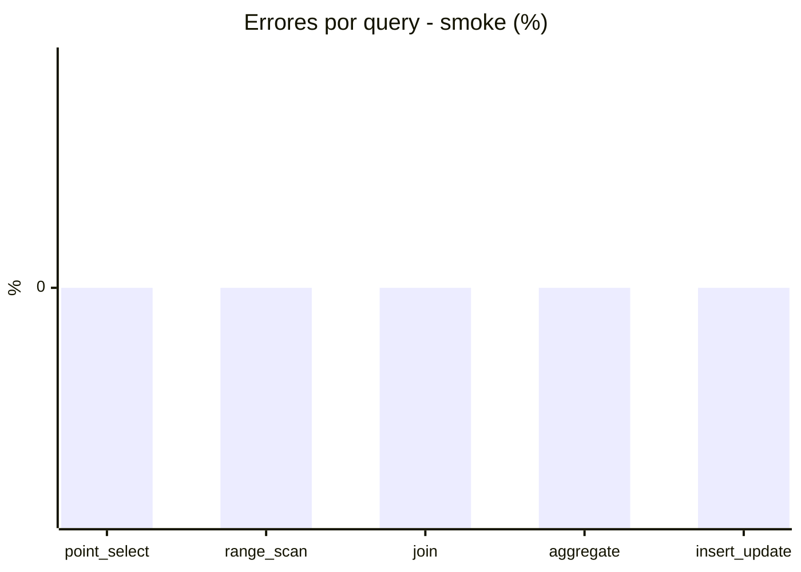

# Reporte de performance - SQL Server (k6)

**Fecha:** 2026-08-21 14:06 UTC  
**Veredicto (SLO):** `WARN`  
**Corrida:** [ver en GitHub Actions](https://github.com/lrbg/k6-sqlserver-lab/actions/runs/32490094311)  

## Analisis del agente de IA

WARN (fallback por umbrales)

- Error maximo: 0%
- p95 maximo: 398 ms

## Resultados

### Escenario: `load`

| Metrica | Valor |
| --- | --- |
| Queries ejecutadas | 11100 |
| Errores | 0 (0%) |
| Latencia media | 108.7 ms |
| p50 / p90 / p95 / p99 | 27 / 388 / 398 / 419 ms |
| Min / Max | 0 / 755 ms |
| Throughput | 183.88 queries/s |
| Duracion | 60.4 s |

Detalle por query

| Query | Ejecuciones | Error % | avg | p95 | p99 | q/s |
| --- | --- | --- | --- | --- | --- | --- |
| point_select | 2220 | 0% | 6.5 | 21 | 36 | 36.78 |
| range_scan | 2220 | 0% | 43.4 | 158 | 294.8 | 36.78 |
| join | 2220 | 0% | 15 | 35 | 44 | 36.78 |
| aggregate | 2220 | 0% | 370 | 416 | 425 | 36.78 |
| insert_update | 2220 | 0% | 108.5 | 293 | 466 | 36.78 |

### Escenario: `smoke`

| Metrica | Valor |
| --- | --- |
| Queries ejecutadas | 3335 |
| Errores | 0 (0%) |
| Latencia media | 27 ms |
| p50 / p90 / p95 / p99 | 4 / 70 / 101 / 197 ms |
| Min / Max | 0 / 324 ms |
| Throughput | 110.89 queries/s |
| Duracion | 30.1 s |

Detalle por query

| Query | Ejecuciones | Error % | avg | p95 | p99 | q/s |
| --- | --- | --- | --- | --- | --- | --- |
| point_select | 667 | 0% | 1.1 | 3 | 5 | 22.18 |
| range_scan | 667 | 0% | 9.4 | 29.7 | 152 | 22.18 |
| join | 667 | 0% | 3.5 | 9 | 9.3 | 22.18 |
| aggregate | 667 | 0% | 66.1 | 73 | 87.3 | 22.18 |
| insert_update | 667 | 0% | 54.9 | 189 | 260.7 | 22.18 |

