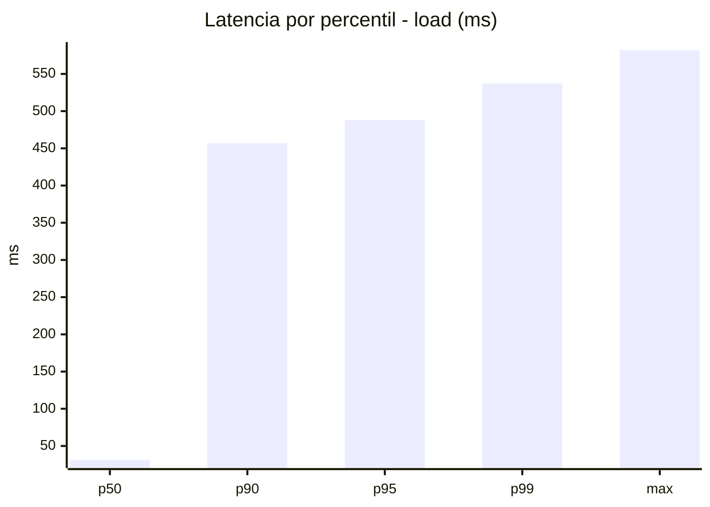
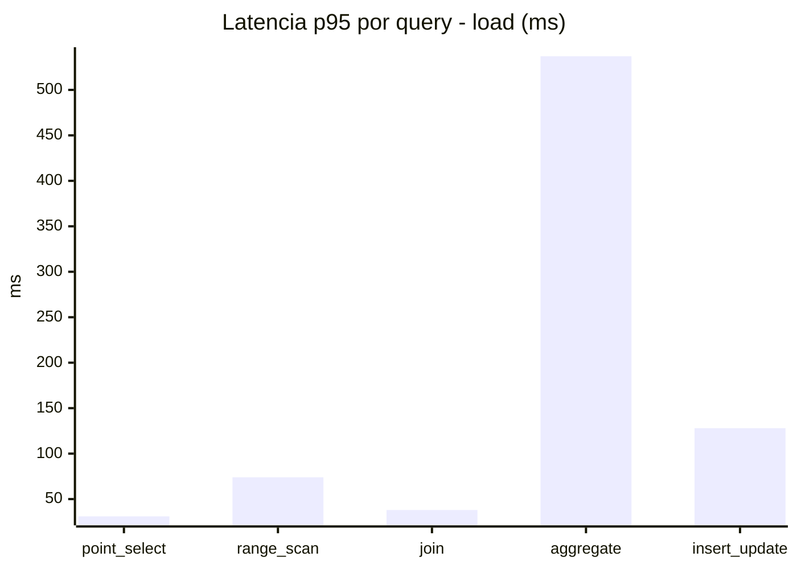
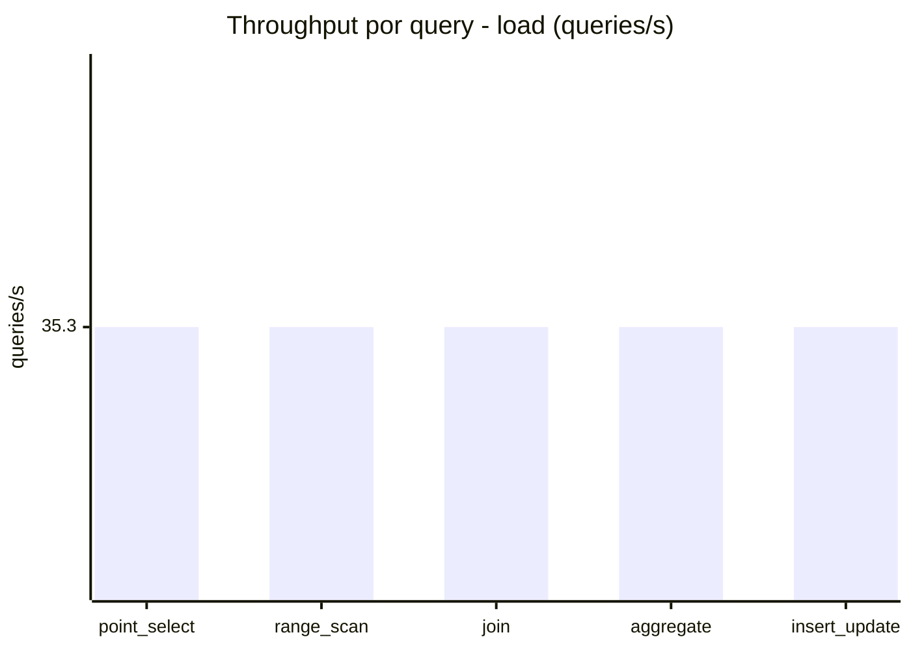
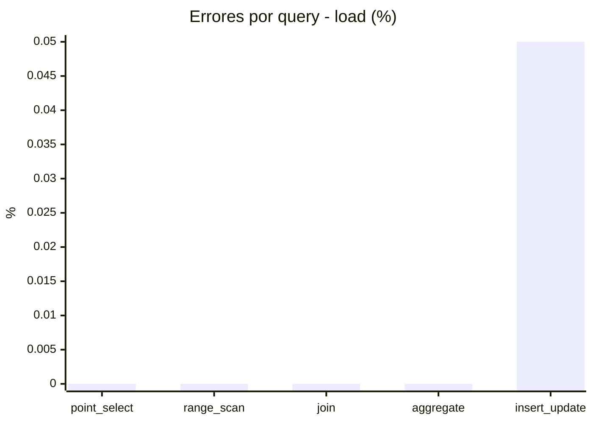
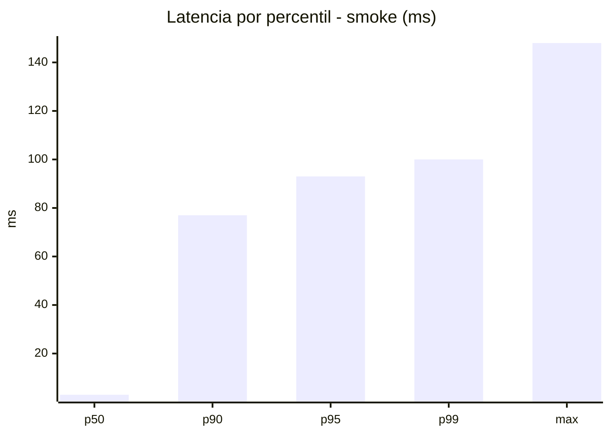
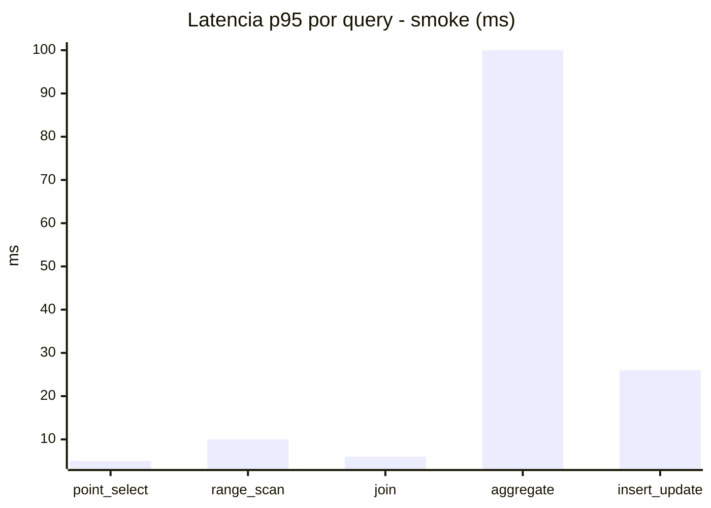
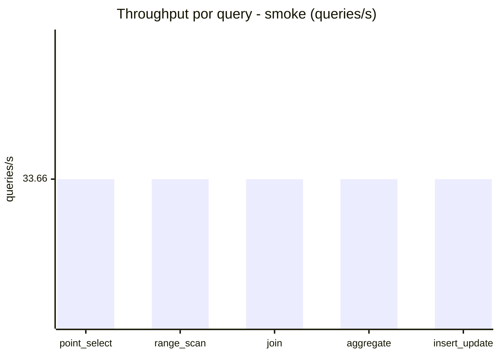
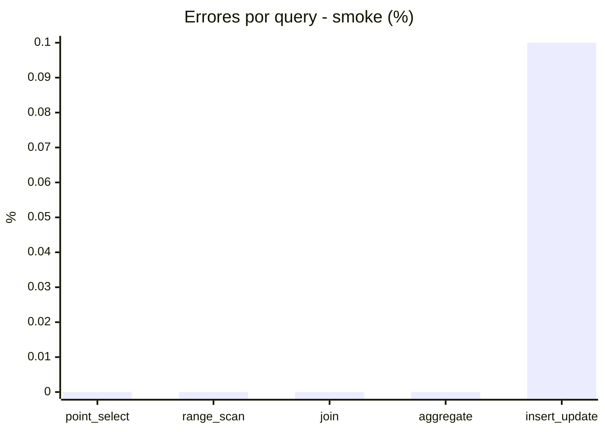

# Reporte de performance - SQL Server (k6)

**Fecha:** 2026-08-22 13:50 UTC  
**Veredicto (SLO):** `FAIL`  
**Corrida:** [ver en GitHub Actions](https://github.com/lrbg/k6-sqlserver-lab/actions/runs/32576849591)  

## Analisis del agente de IA

FAIL (fallback por umbrales)

- Error maximo: 0.02%
- p95 maximo: 488 ms

## Resultados

### Escenario: `load`

| Metrica | Valor |
| --- | --- |
| Queries ejecutadas | 10610 |
| Errores | 1 (0.01%) |
| Latencia media | 113.2 ms |
| p50 / p90 / p95 / p99 | 31 / 457 / 488 / 537 ms |
| Min / Max | 0 / 582 ms |
| Throughput | 176.49 queries/s |
| Duracion | 60.1 s |

Detalle por query

| Query | Ejecuciones | Error % | avg | p95 | p99 | q/s |
| --- | --- | --- | --- | --- | --- | --- |
| point_select | 2122 | 0% | 9.8 | 31 | 42 | 35.3 |
| range_scan | 2122 | 0% | 34.9 | 74 | 103 | 35.3 |
| join | 2122 | 0% | 15.9 | 38 | 42 | 35.3 |
| aggregate | 2122 | 0% | 446.7 | 537 | 563.8 | 35.3 |
| insert_update | 2122 | 0.05% | 58.3 | 128 | 163 | 35.3 |

### Escenario: `smoke`

| Metrica | Valor |
| --- | --- |
| Queries ejecutadas | 5060 |
| Errores | 1 (0.02%) |
| Latencia media | 17.8 ms |
| p50 / p90 / p95 / p99 | 3 / 77 / 93 / 100 ms |
| Min / Max | 0 / 148 ms |
| Throughput | 168.31 queries/s |
| Duracion | 30.1 s |

Detalle por query

| Query | Ejecuciones | Error % | avg | p95 | p99 | q/s |
| --- | --- | --- | --- | --- | --- | --- |
| point_select | 1012 | 0% | 1.4 | 5 | 6 | 33.66 |
| range_scan | 1012 | 0% | 4.5 | 10 | 12 | 33.66 |
| join | 1012 | 0% | 2.4 | 6 | 9 | 33.66 |
| aggregate | 1012 | 0% | 72.6 | 100 | 106 | 33.66 |
| insert_update | 1012 | 0.1% | 8.1 | 26 | 29.8 | 33.66 |

