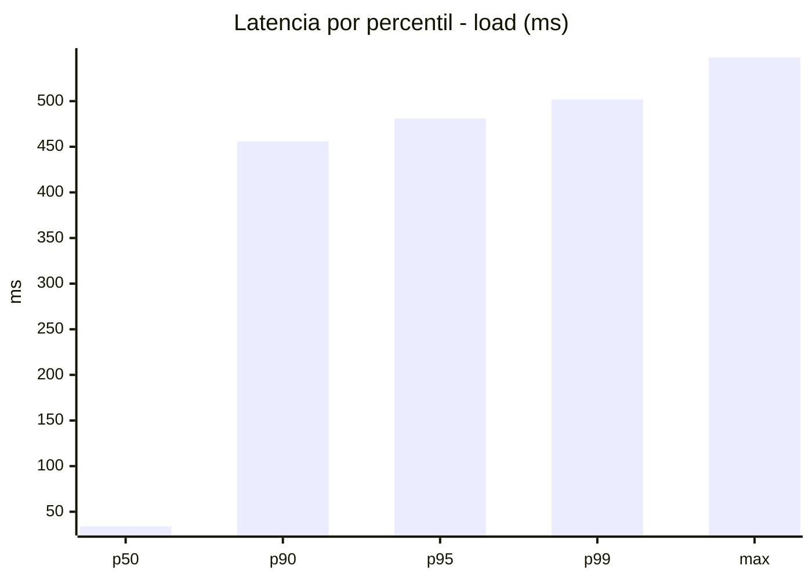
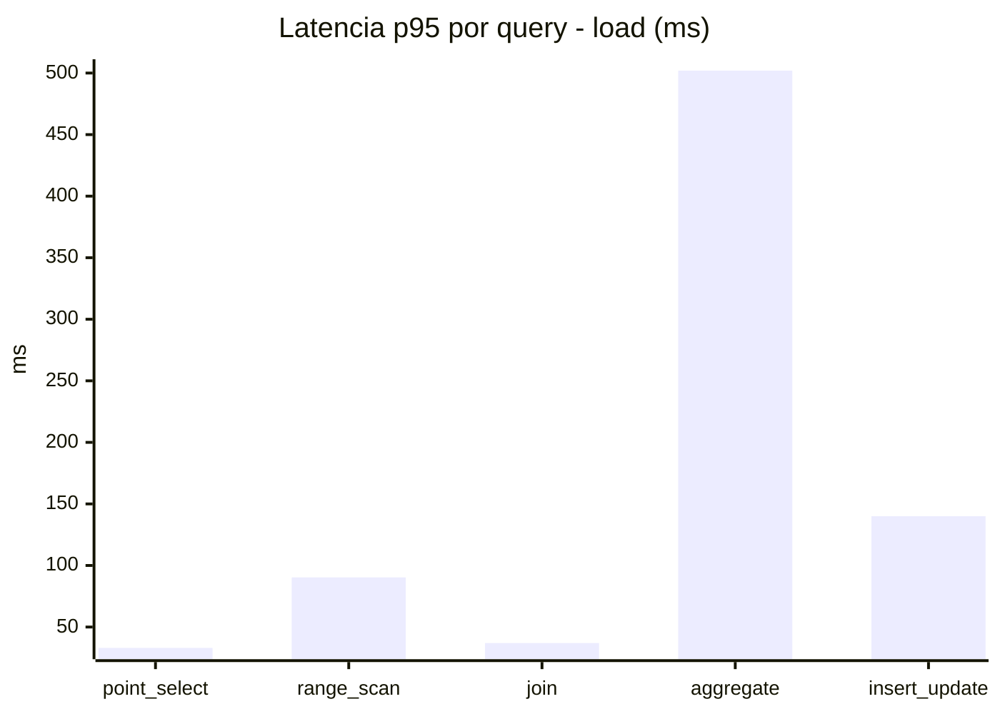
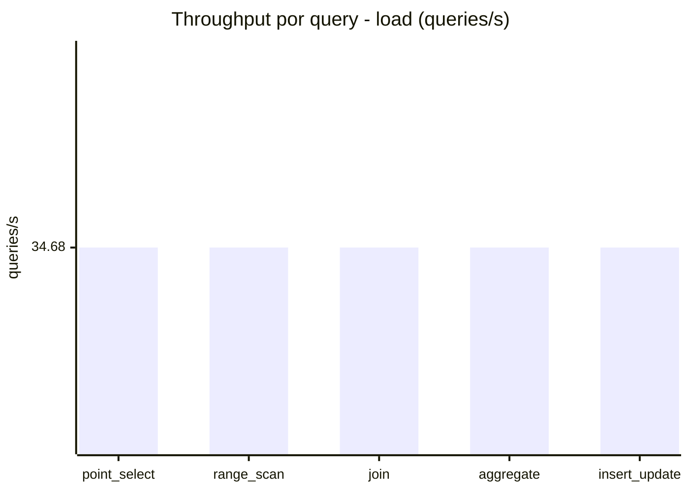
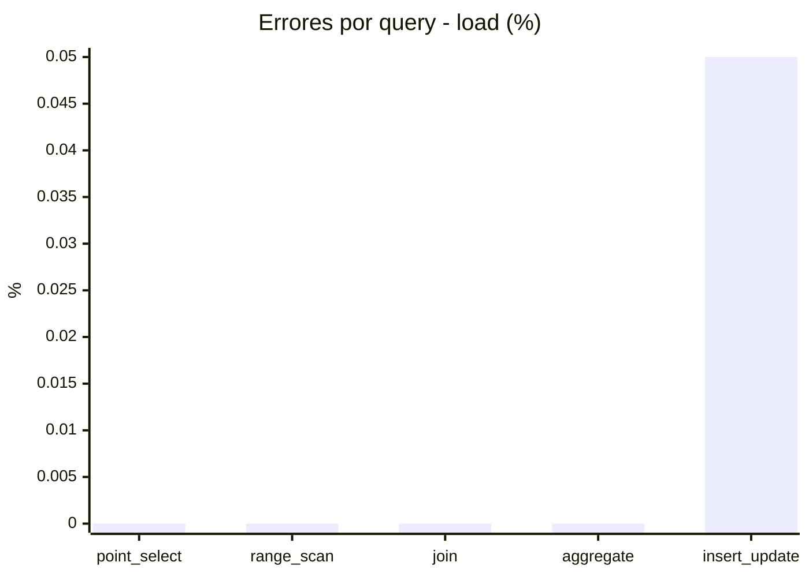
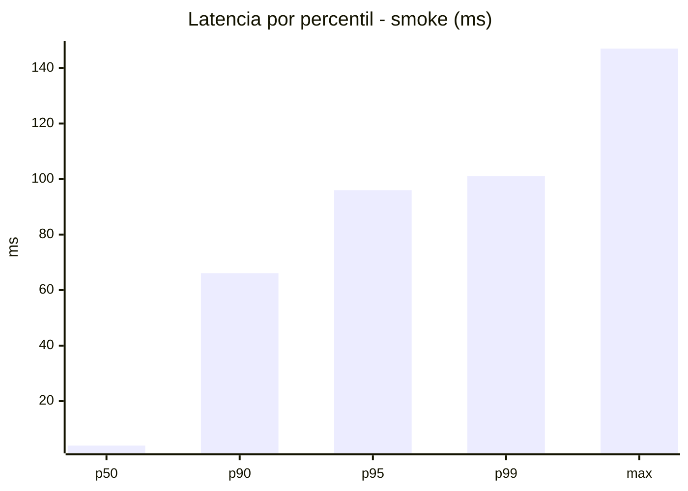
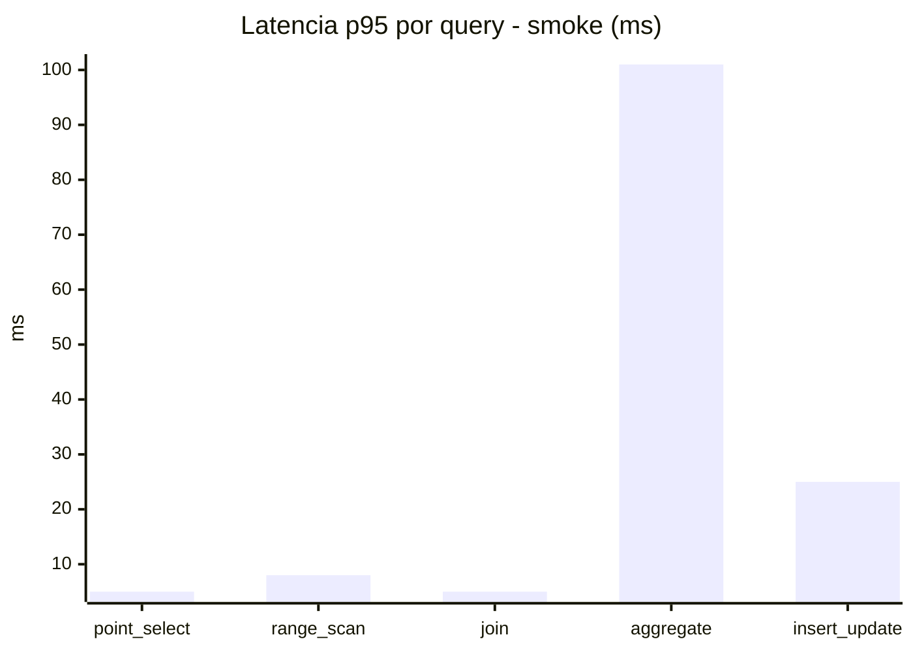
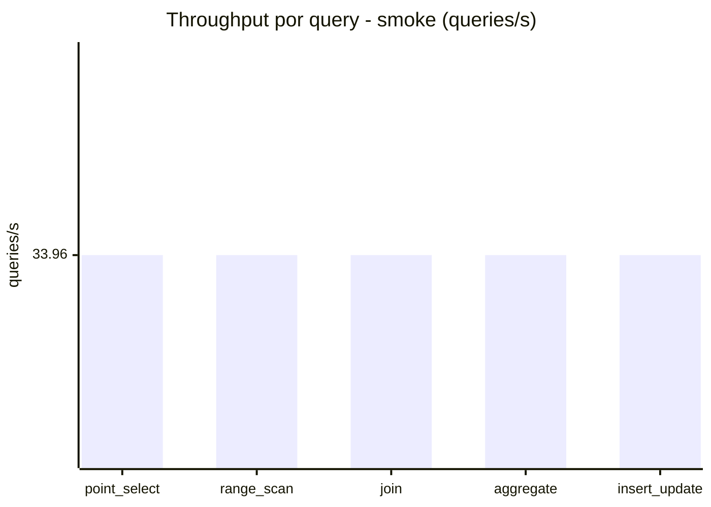
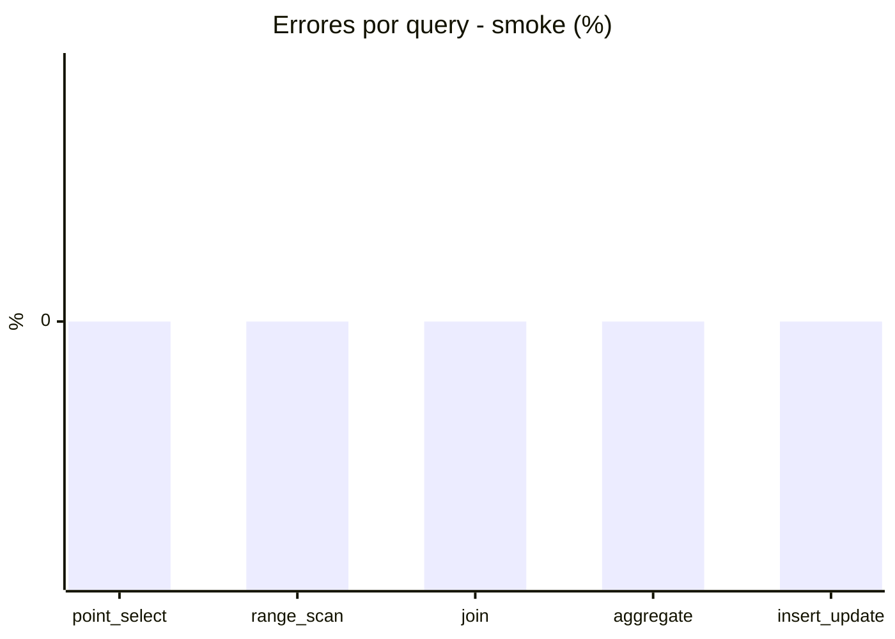

# Reporte de performance - SQL Server (k6)

**Fecha:** 2026-08-23 13:52 UTC  
**Veredicto (SLO):** `FAIL`  
**Corrida:** [ver en GitHub Actions](https://github.com/lrbg/k6-sqlserver-lab/actions/runs/32643586992)  

## Analisis del agente de IA

FAIL (fallback por umbrales)

- Error maximo: 0.01%
- p95 maximo: 481 ms

## Resultados

### Escenario: `load`

| Metrica | Valor |
| --- | --- |
| Queries ejecutadas | 10470 |
| Errores | 1 (0.01%) |
| Latencia media | 115.2 ms |
| p50 / p90 / p95 / p99 | 34 / 456 / 481 / 502 ms |
| Min / Max | 0 / 548 ms |
| Throughput | 173.4 queries/s |
| Duracion | 60.4 s |

Detalle por query

| Query | Ejecuciones | Error % | avg | p95 | p99 | q/s |
| --- | --- | --- | --- | --- | --- | --- |
| point_select | 2094 | 0% | 11.9 | 33 | 40.1 | 34.68 |
| range_scan | 2094 | 0% | 43 | 90.3 | 121.1 | 34.68 |
| join | 2094 | 0% | 17.1 | 37 | 39 | 34.68 |
| aggregate | 2094 | 0% | 438.9 | 502 | 515 | 34.68 |
| insert_update | 2094 | 0.05% | 65 | 140 | 168.2 | 34.68 |

### Escenario: `smoke`

| Metrica | Valor |
| --- | --- |
| Queries ejecutadas | 5100 |
| Errores | 0 (0%) |
| Latencia media | 17.6 ms |
| p50 / p90 / p95 / p99 | 4 / 66.1 / 96 / 101 ms |
| Min / Max | 0 / 147 ms |
| Throughput | 169.79 queries/s |
| Duracion | 30 s |

Detalle por query

| Query | Ejecuciones | Error % | avg | p95 | p99 | q/s |
| --- | --- | --- | --- | --- | --- | --- |
| point_select | 1020 | 0% | 1.5 | 5 | 6 | 33.96 |
| range_scan | 1020 | 0% | 4.4 | 8 | 11 | 33.96 |
| join | 1020 | 0% | 2.3 | 5 | 7 | 33.96 |
| aggregate | 1020 | 0% | 71.9 | 101 | 110 | 33.96 |
| insert_update | 1020 | 0% | 7.9 | 25 | 27 | 33.96 |

