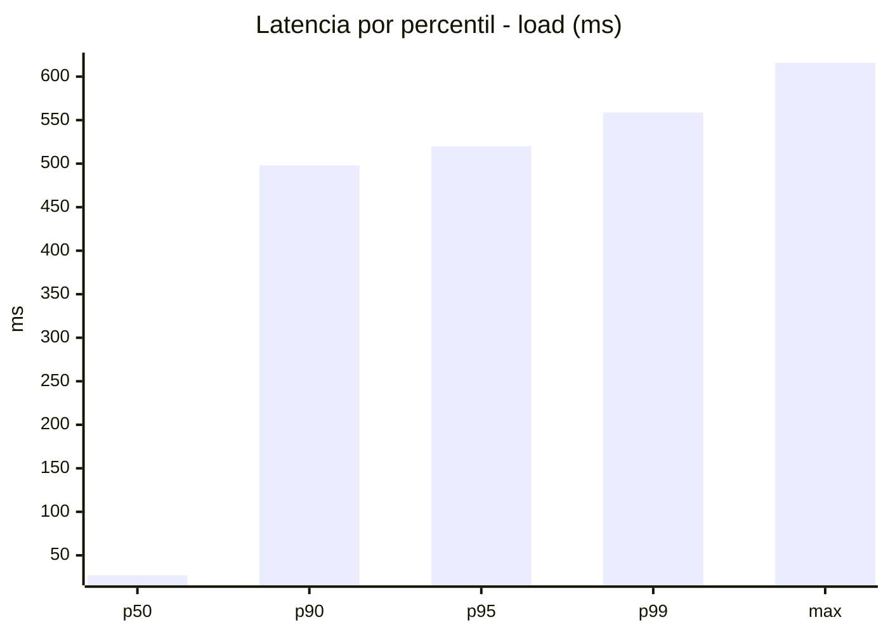
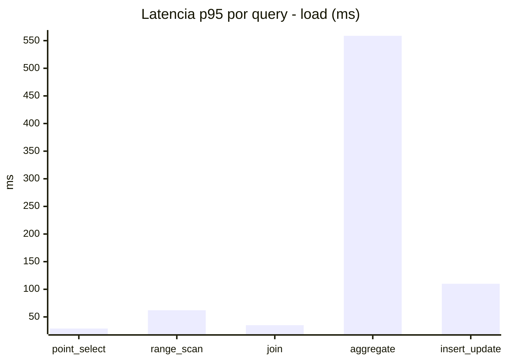
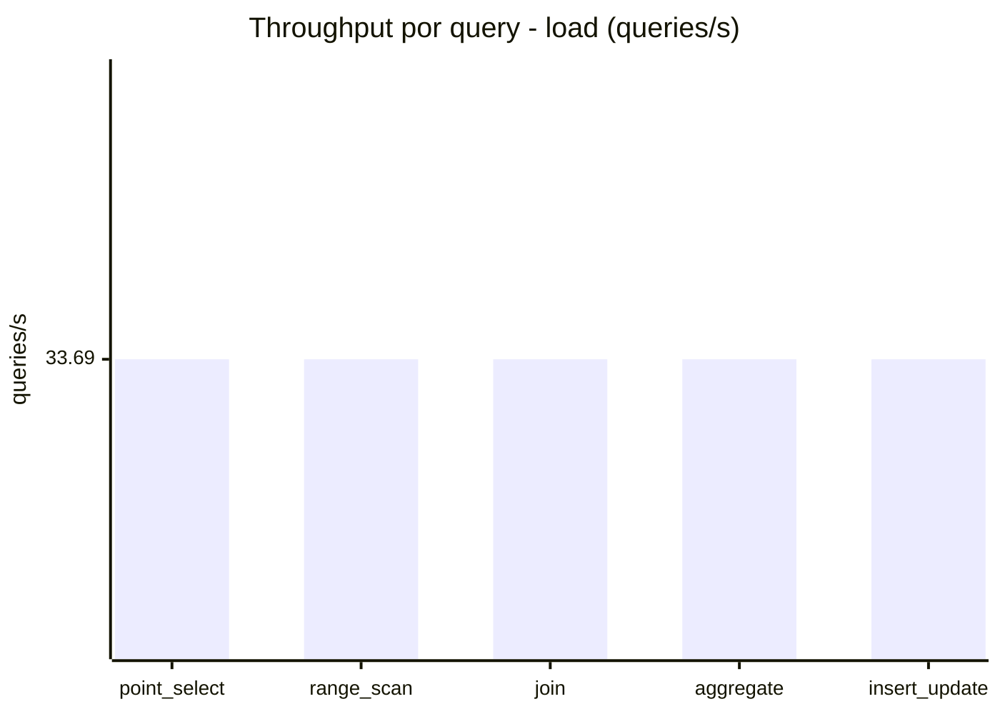
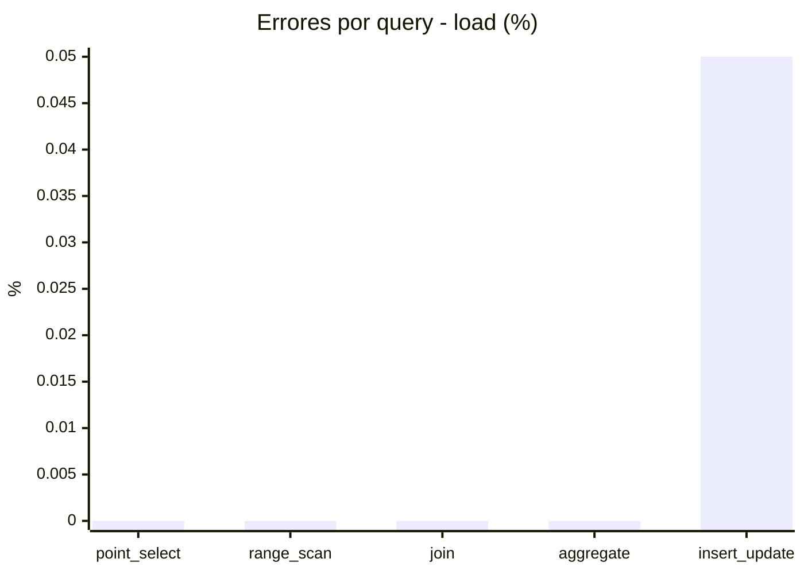
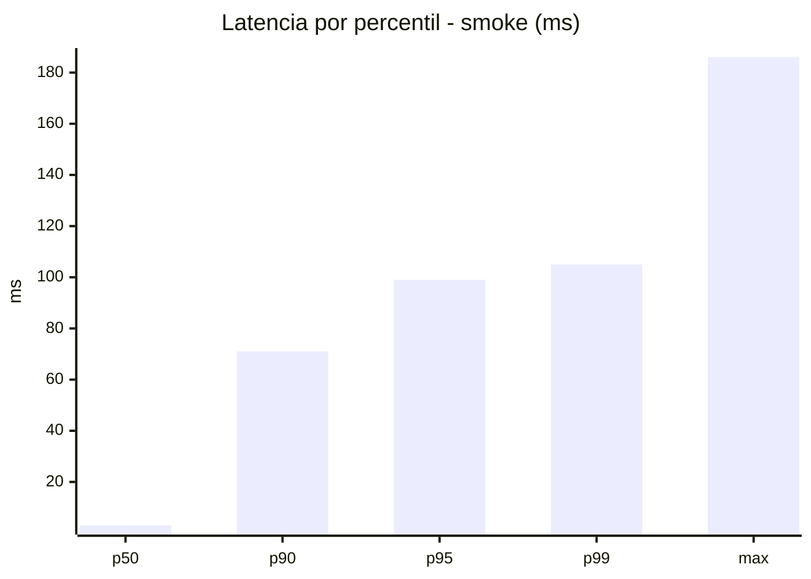
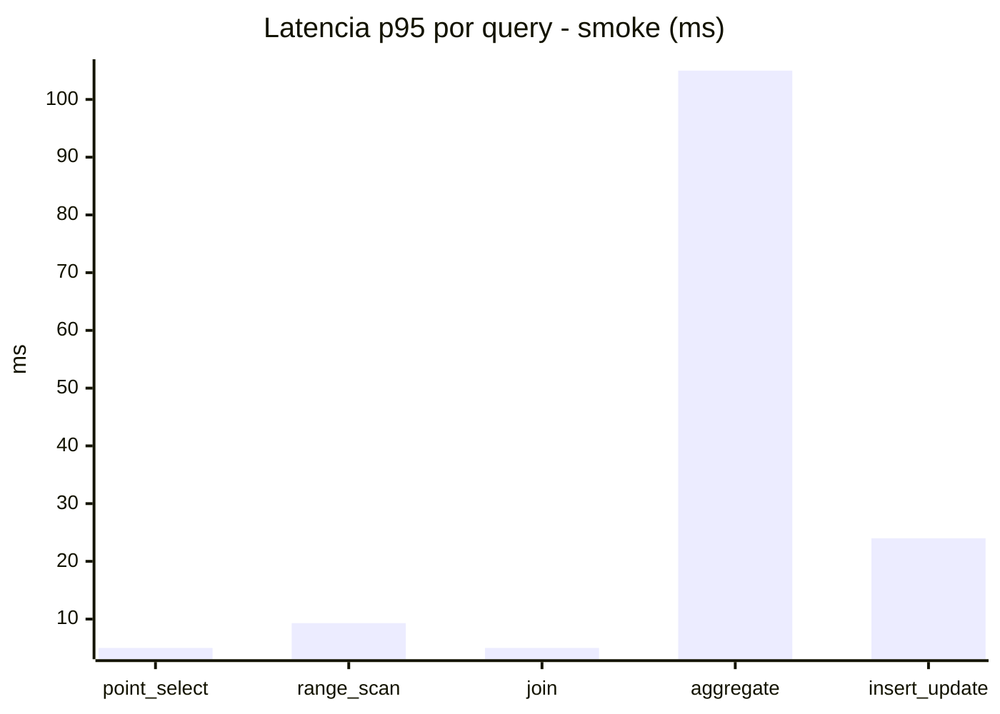
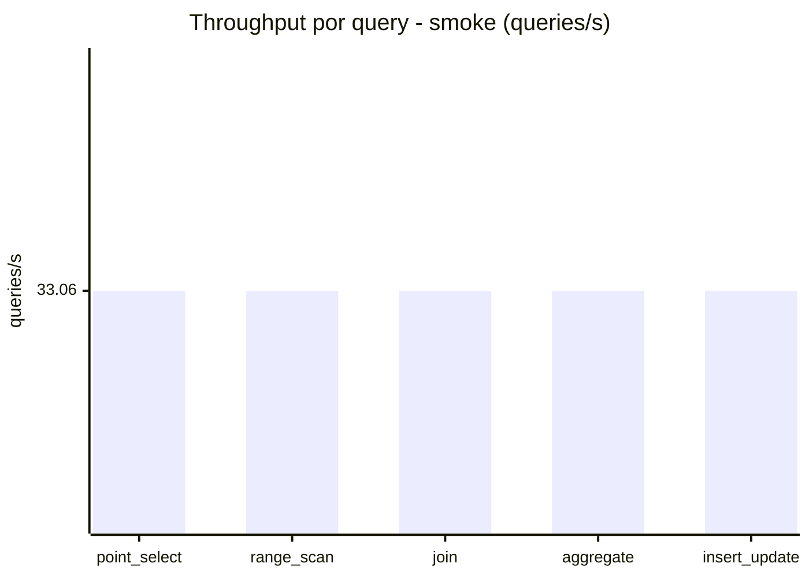
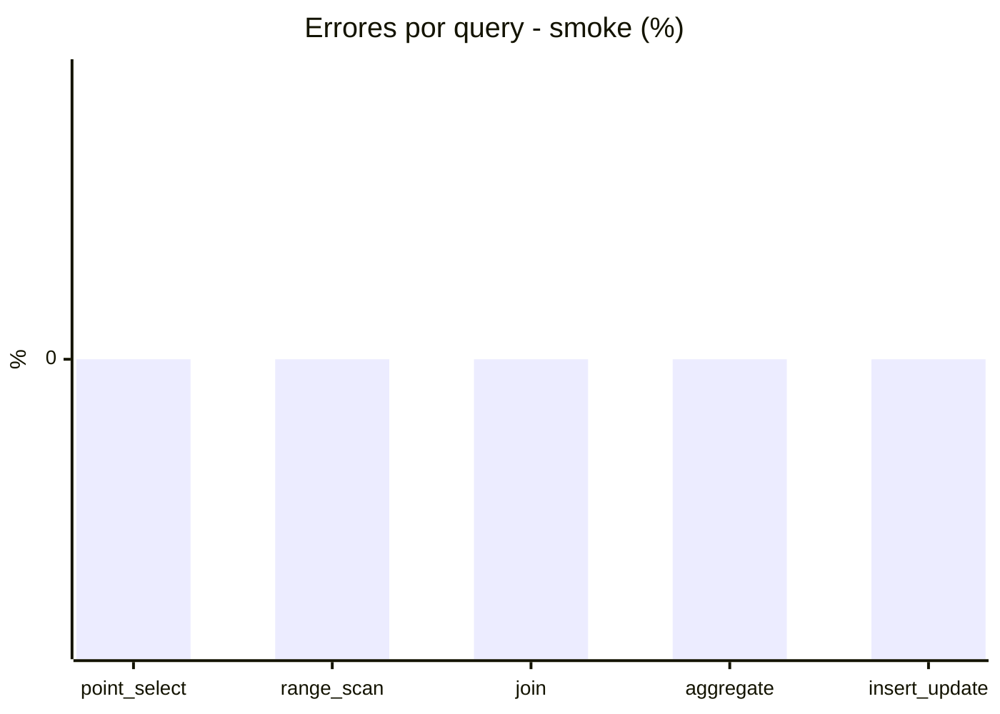

# Reporte de performance - SQL Server (k6)

**Fecha:** 2026-08-24 14:10 UTC  
**Veredicto (SLO):** `FAIL`  
**Corrida:** [ver en GitHub Actions](https://github.com/lrbg/k6-sqlserver-lab/actions/runs/32736811327)  

## Analisis del agente de IA

FAIL (fallback por umbrales)

- Error maximo: 0.01%
- p95 maximo: 520 ms

## Resultados

### Escenario: `load`

| Metrica | Valor |
| --- | --- |
| Queries ejecutadas | 10130 |
| Errores | 1 (0.01%) |
| Latencia media | 118.6 ms |
| p50 / p90 / p95 / p99 | 27 / 498 / 520 / 558.7 ms |
| Min / Max | 0 / 616 ms |
| Throughput | 168.45 queries/s |
| Duracion | 60.1 s |

Detalle por query

| Query | Ejecuciones | Error % | avg | p95 | p99 | q/s |
| --- | --- | --- | --- | --- | --- | --- |
| point_select | 2026 | 0% | 9.5 | 29 | 37 | 33.69 |
| range_scan | 2026 | 0% | 30.1 | 62 | 89 | 33.69 |
| join | 2026 | 0% | 15.9 | 35 | 37 | 33.69 |
| aggregate | 2026 | 0% | 489.6 | 558.8 | 578.8 | 33.69 |
| insert_update | 2026 | 0.05% | 48.1 | 110 | 149 | 33.69 |

### Escenario: `smoke`

| Metrica | Valor |
| --- | --- |
| Queries ejecutadas | 4970 |
| Errores | 0 (0%) |
| Latencia media | 18.1 ms |
| p50 / p90 / p95 / p99 | 3 / 71 / 99 / 105 ms |
| Min / Max | 0 / 186 ms |
| Throughput | 165.28 queries/s |
| Duracion | 30.1 s |

Detalle por query

| Query | Ejecuciones | Error % | avg | p95 | p99 | q/s |
| --- | --- | --- | --- | --- | --- | --- |
| point_select | 994 | 0% | 1.4 | 5 | 5 | 33.06 |
| range_scan | 994 | 0% | 4.5 | 9.3 | 13 | 33.06 |
| join | 994 | 0% | 2.1 | 5 | 7 | 33.06 |
| aggregate | 994 | 0% | 74.7 | 105 | 126.1 | 33.06 |
| insert_update | 994 | 0% | 7.8 | 24 | 25.1 | 33.06 |

