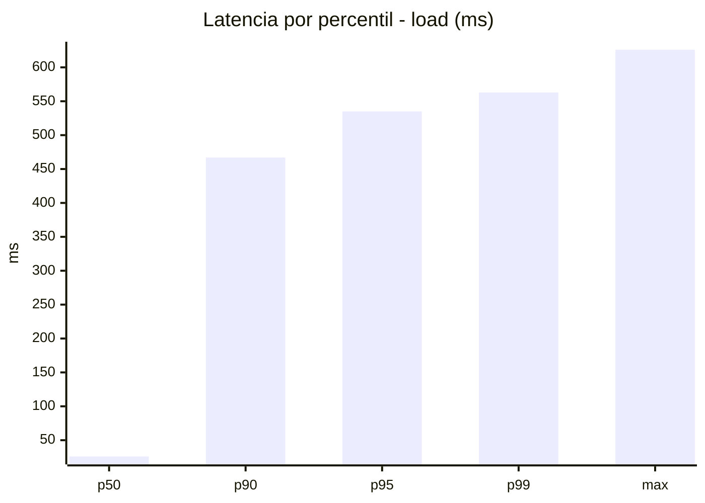
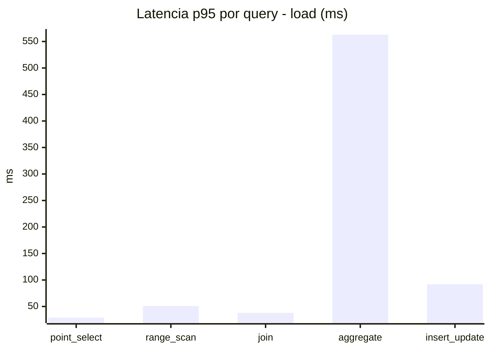
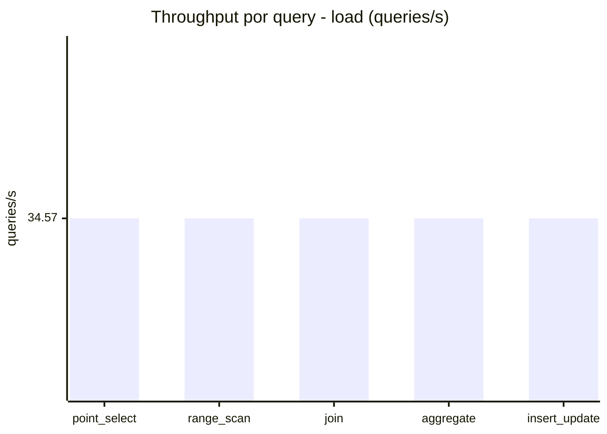
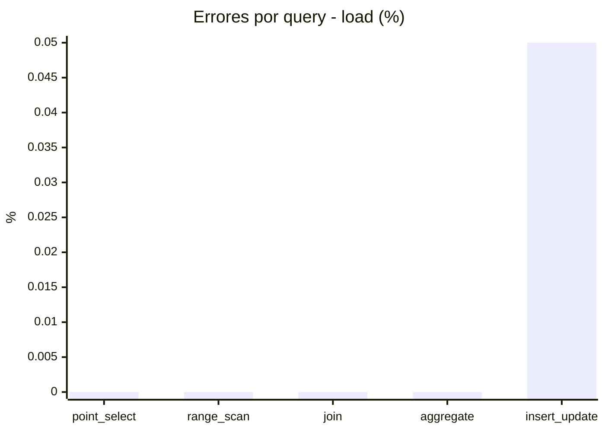
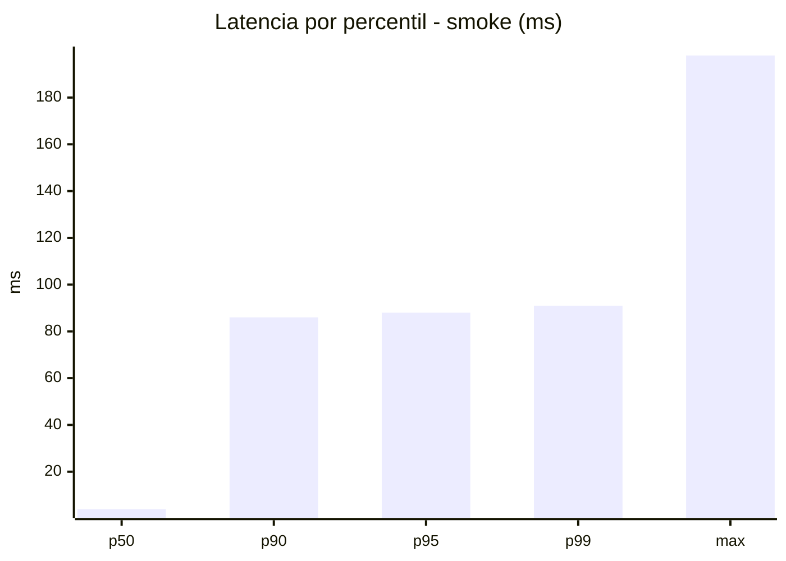
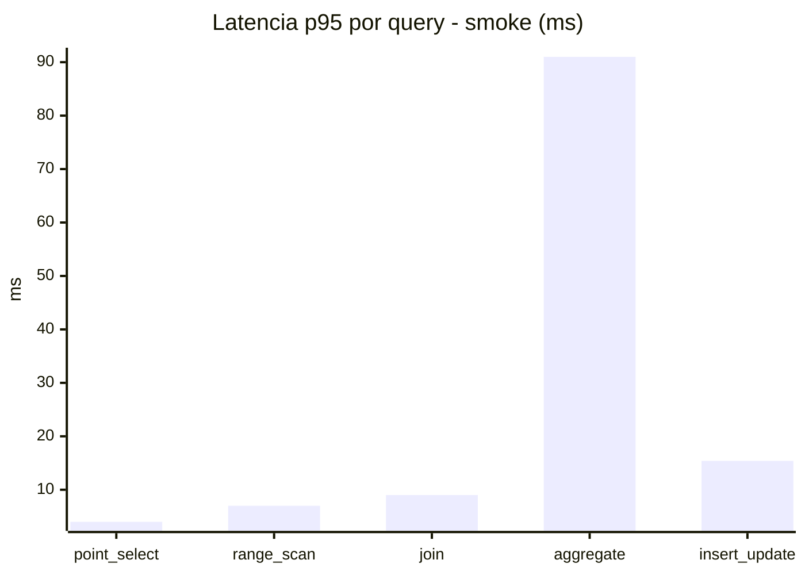
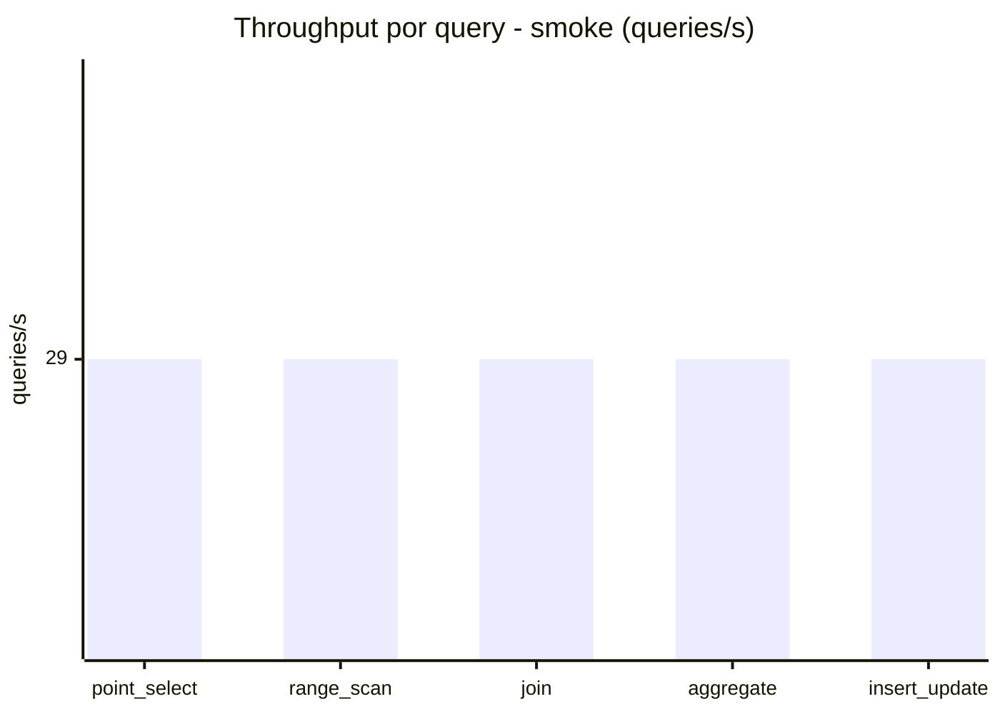
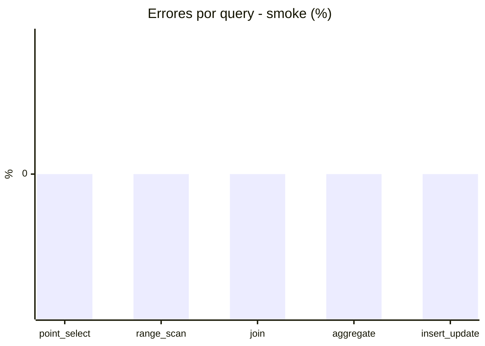

# Reporte de performance - SQL Server (k6)

**Fecha:** 2026-08-25 14:12 UTC  
**Veredicto (SLO):** `FAIL`  
**Corrida:** [ver en GitHub Actions](https://github.com/lrbg/k6-sqlserver-lab/actions/runs/32857876063)  

## Analisis del agente de IA

FAIL (fallback por umbrales)

- Error maximo: 0.01%
- p95 maximo: 535 ms

## Resultados

### Escenario: `load`

| Metrica | Valor |
| --- | --- |
| Queries ejecutadas | 10415 |
| Errores | 1 (0.01%) |
| Latencia media | 115.5 ms |
| p50 / p90 / p95 / p99 | 26 / 467 / 535 / 563 ms |
| Min / Max | 0 / 626 ms |
| Throughput | 172.83 queries/s |
| Duracion | 60.3 s |

Detalle por query

| Query | Ejecuciones | Error % | avg | p95 | p99 | q/s |
| --- | --- | --- | --- | --- | --- | --- |
| point_select | 2083 | 0% | 9.5 | 29 | 44 | 34.57 |
| range_scan | 2083 | 0% | 25.2 | 51 | 73.2 | 34.57 |
| join | 2083 | 0% | 16.5 | 38 | 42 | 34.57 |
| aggregate | 2083 | 0% | 479.6 | 563 | 584 | 34.57 |
| insert_update | 2083 | 0.05% | 46.5 | 91.9 | 133 | 34.57 |

### Escenario: `smoke`

| Metrica | Valor |
| --- | --- |
| Queries ejecutadas | 4365 |
| Errores | 0 (0%) |
| Latencia media | 20.7 ms |
| p50 / p90 / p95 / p99 | 4 / 86 / 88 / 91 ms |
| Min / Max | 0 / 198 ms |
| Throughput | 145 queries/s |
| Duracion | 30.1 s |

Detalle por query

| Query | Ejecuciones | Error % | avg | p95 | p99 | q/s |
| --- | --- | --- | --- | --- | --- | --- |
| point_select | 873 | 0% | 1.5 | 4 | 6 | 29 |
| range_scan | 873 | 0% | 4.2 | 7 | 11 | 29 |
| join | 873 | 0% | 4 | 9 | 9 | 29 |
| aggregate | 873 | 0% | 86 | 91 | 100.3 | 29 |
| insert_update | 873 | 0% | 7.6 | 15.4 | 27.8 | 29 |

