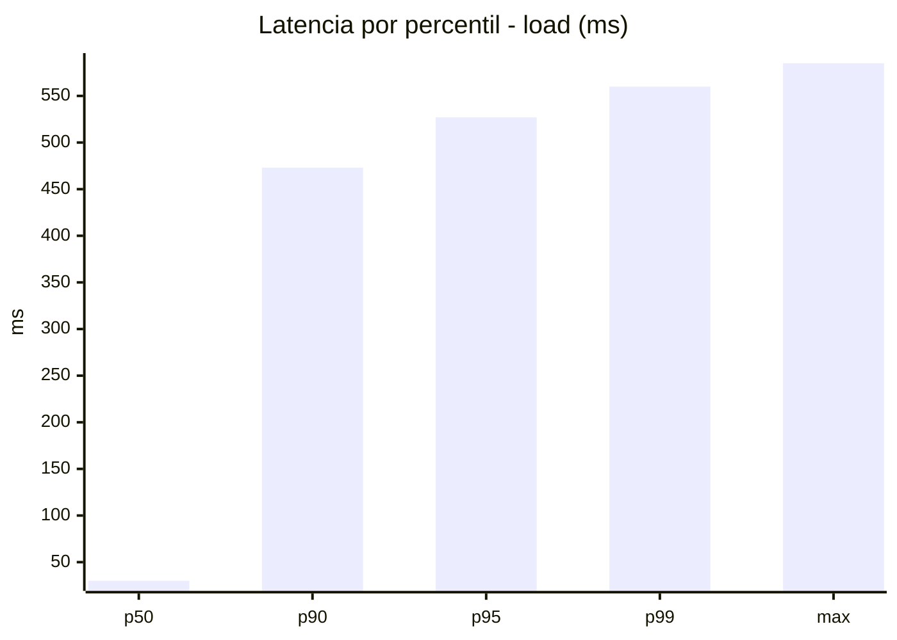
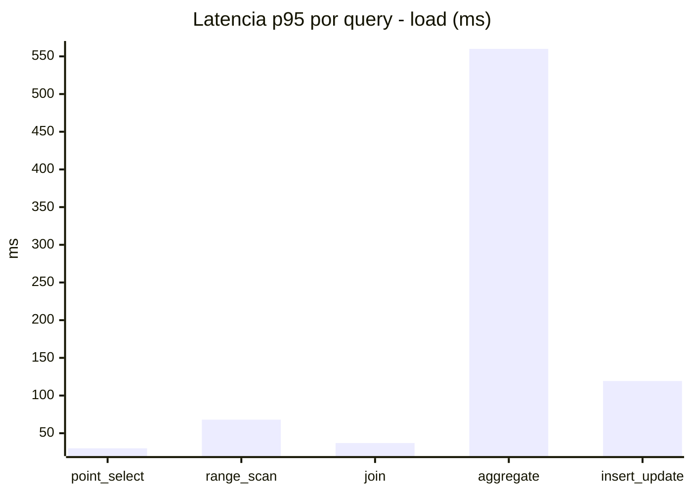
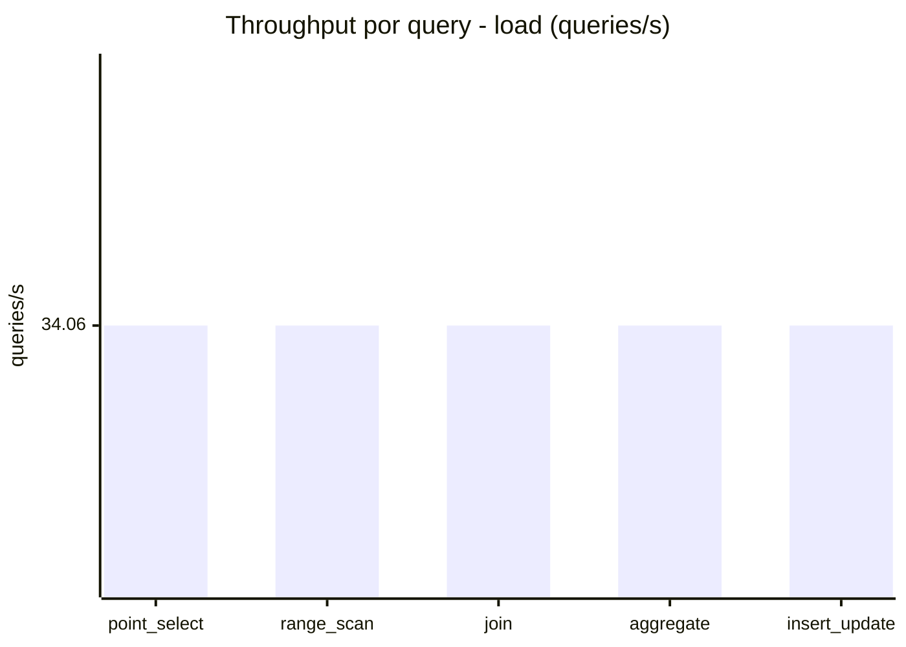
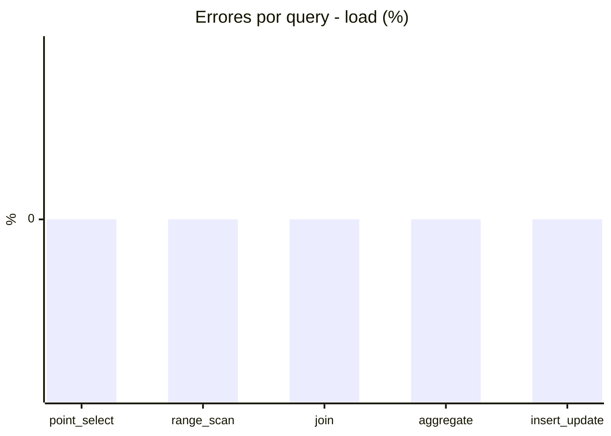
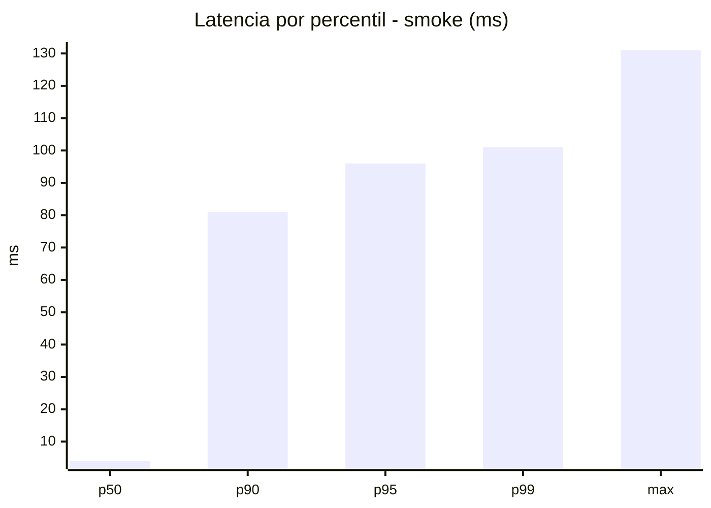
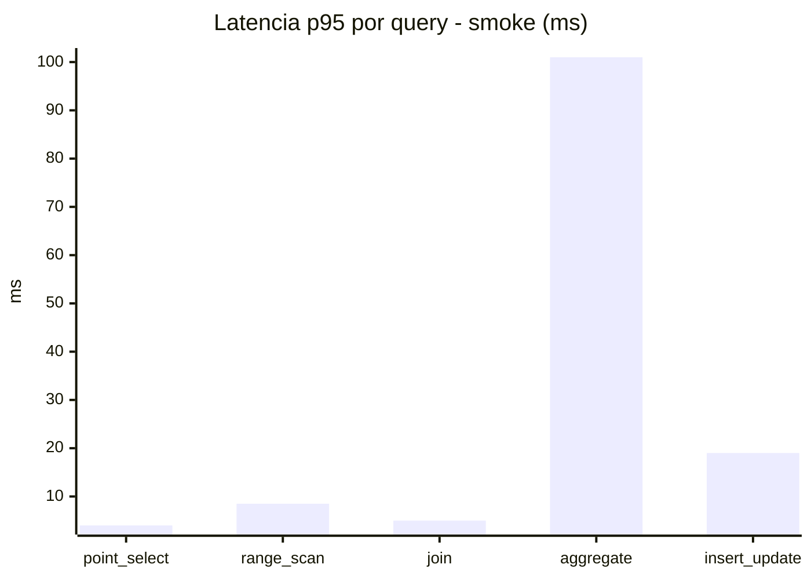
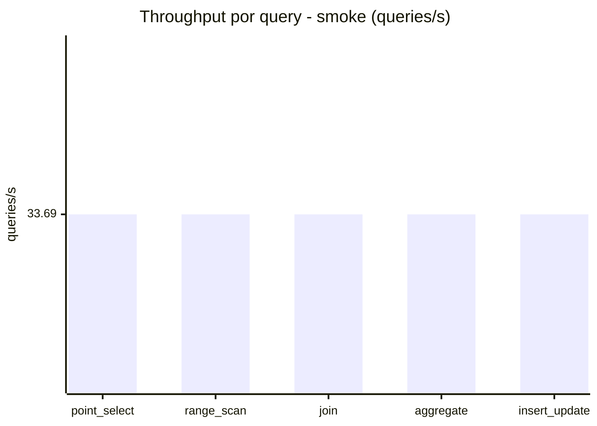
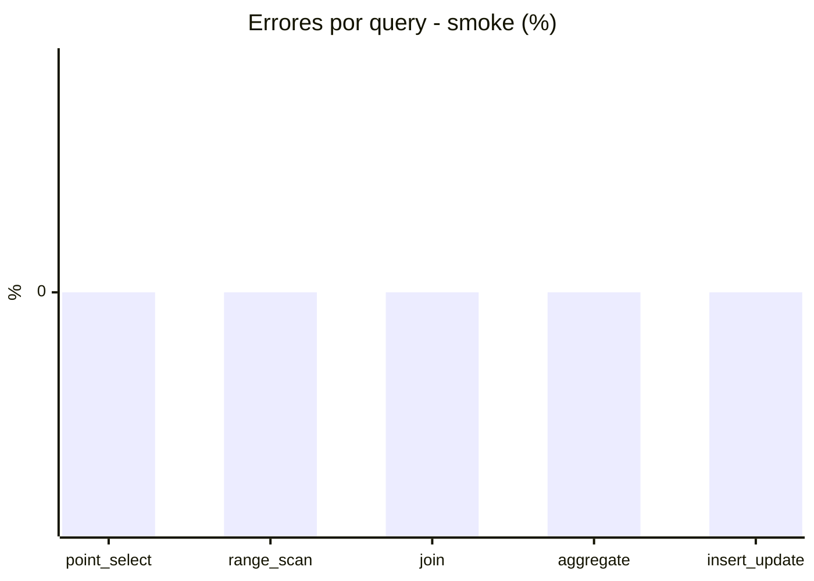

# Reporte de performance - SQL Server (k6)

**Fecha:** 2026-08-26 14:11 UTC  
**Veredicto (SLO):** `FAIL`  
**Corrida:** [ver en GitHub Actions](https://github.com/lrbg/k6-sqlserver-lab/actions/runs/32978489940)  

## Analisis del agente de IA

FAIL (fallback por umbrales)

- Error maximo: 0%
- p95 maximo: 527 ms

## Resultados

### Escenario: `load`

| Metrica | Valor |
| --- | --- |
| Queries ejecutadas | 10280 |
| Errores | 0 (0%) |
| Latencia media | 117.3 ms |
| p50 / p90 / p95 / p99 | 30 / 473 / 527 / 560 ms |
| Min / Max | 0 / 585 ms |
| Throughput | 170.32 queries/s |
| Duracion | 60.4 s |

Detalle por query

| Query | Ejecuciones | Error % | avg | p95 | p99 | q/s |
| --- | --- | --- | --- | --- | --- | --- |
| point_select | 2056 | 0% | 10.8 | 30 | 41 | 34.06 |
| range_scan | 2056 | 0% | 32.8 | 68 | 115.9 | 34.06 |
| join | 2056 | 0% | 17.2 | 37 | 41 | 34.06 |
| aggregate | 2056 | 0% | 468.2 | 560 | 577.5 | 34.06 |
| insert_update | 2056 | 0% | 57.5 | 119.3 | 155 | 34.06 |

### Escenario: `smoke`

| Metrica | Valor |
| --- | --- |
| Queries ejecutadas | 5055 |
| Errores | 0 (0%) |
| Latencia media | 17.8 ms |
| p50 / p90 / p95 / p99 | 4 / 81 / 96 / 101 ms |
| Min / Max | 0 / 131 ms |
| Throughput | 168.44 queries/s |
| Duracion | 30 s |

Detalle por query

| Query | Ejecuciones | Error % | avg | p95 | p99 | q/s |
| --- | --- | --- | --- | --- | --- | --- |
| point_select | 1011 | 0% | 1.2 | 4 | 5 | 33.69 |
| range_scan | 1011 | 0% | 4.3 | 8.5 | 12 | 33.69 |
| join | 1011 | 0% | 2.3 | 5 | 8 | 33.69 |
| aggregate | 1011 | 0% | 74 | 101 | 107.8 | 33.69 |
| insert_update | 1011 | 0% | 7.1 | 19 | 24 | 33.69 |

