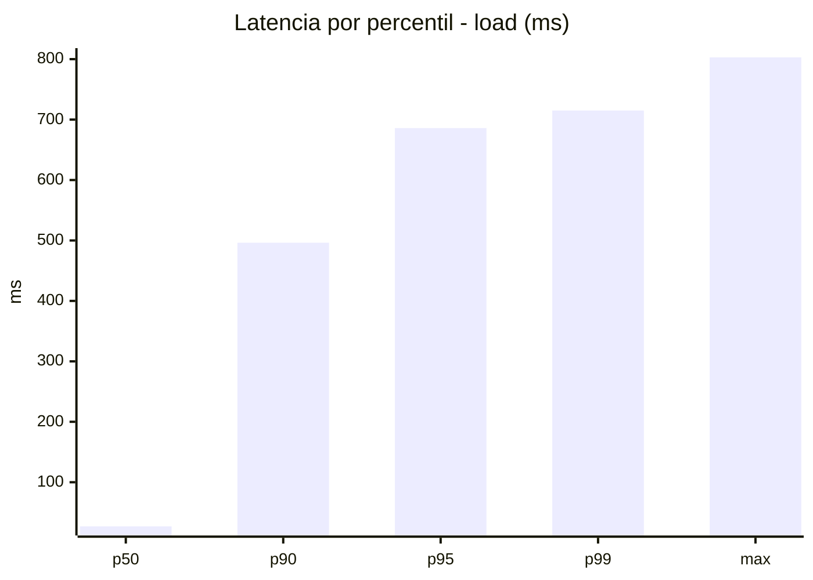
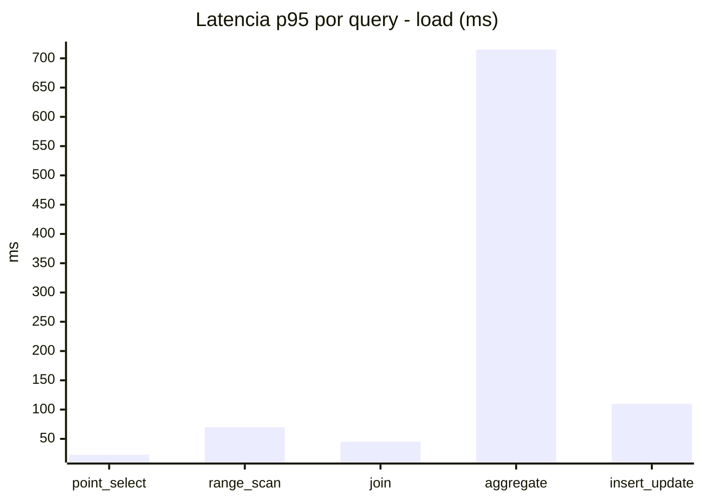
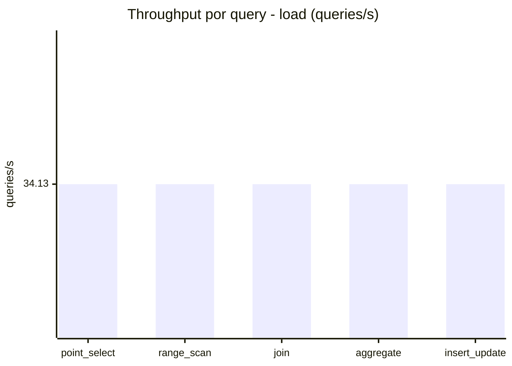
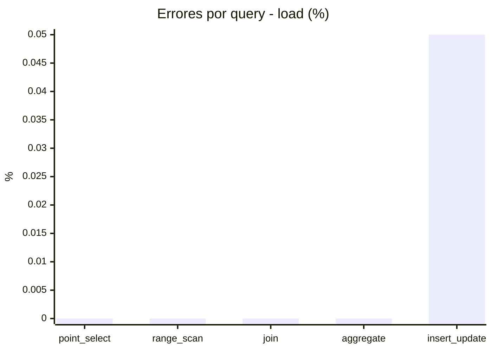
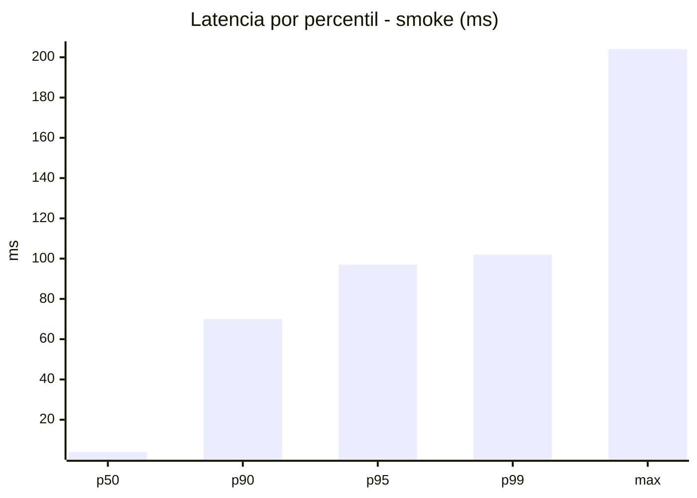
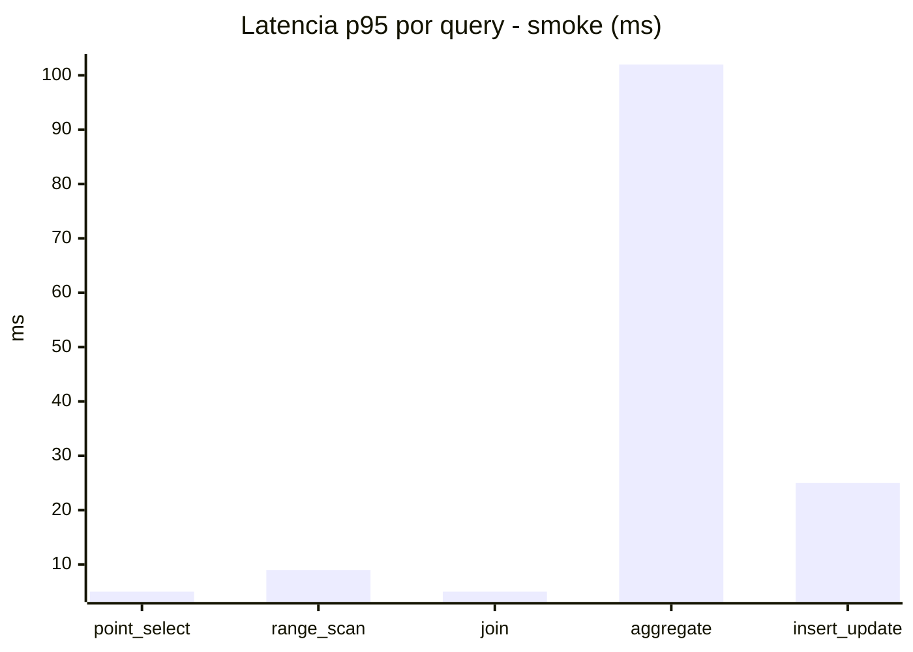
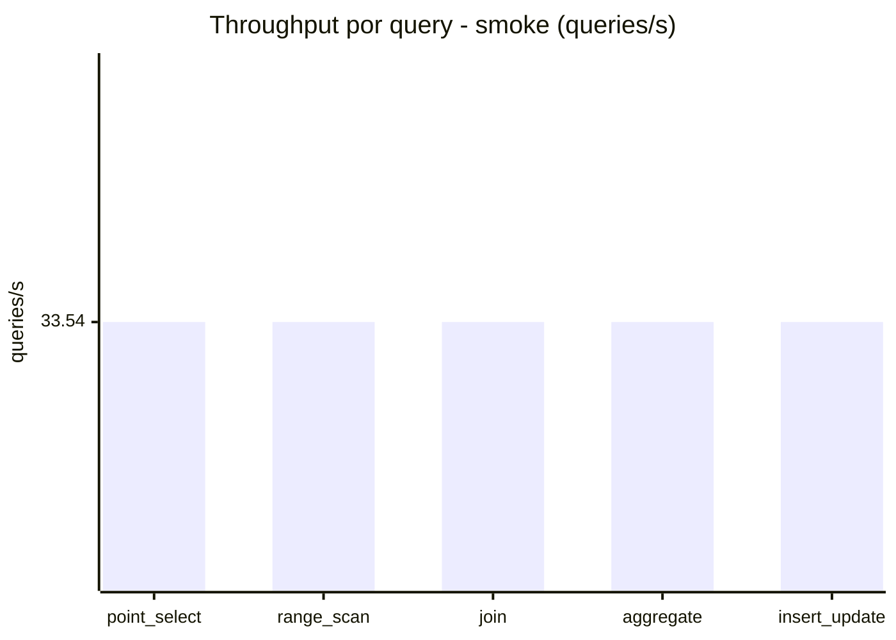
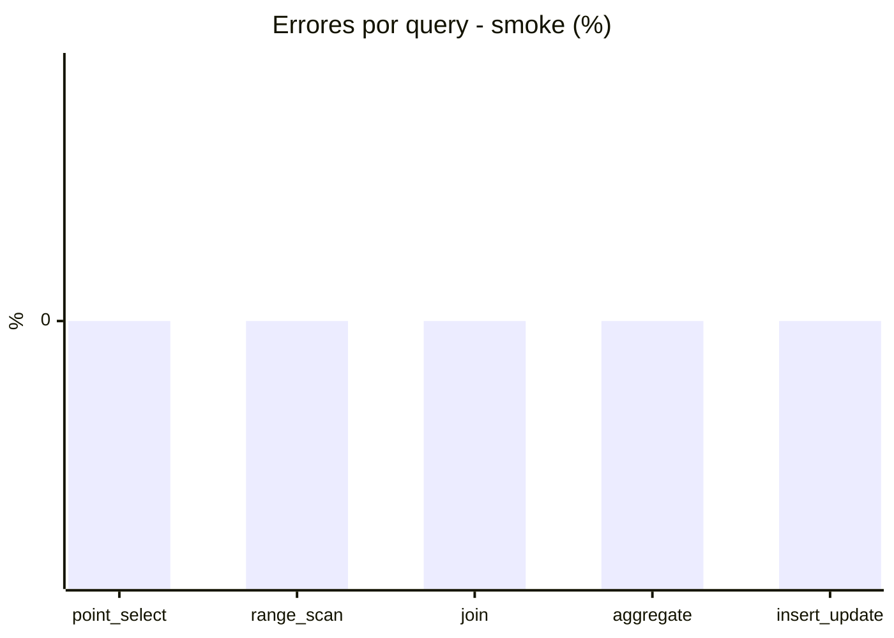

# Reporte de performance - SQL Server (k6)

**Fecha:** 2026-08-27 23:01 UTC  
**Veredicto (SLO):** `FAIL`  
**Corrida:** [ver en GitHub Actions](https://github.com/lrbg/k6-sqlserver-lab/actions/runs/33124623585)  

## Analisis del agente de IA

FAIL (fallback por umbrales)

- Error maximo: 0.01%
- p95 maximo: 686 ms

## Resultados

### Escenario: `load`

| Metrica | Valor |
| --- | --- |
| Queries ejecutadas | 10320 |
| Errores | 1 (0.01%) |
| Latencia media | 117 ms |
| p50 / p90 / p95 / p99 | 27 / 496.3 / 686 / 715 ms |
| Min / Max | 0 / 803 ms |
| Throughput | 170.64 queries/s |
| Duracion | 60.5 s |

Detalle por query

| Query | Ejecuciones | Error % | avg | p95 | p99 | q/s |
| --- | --- | --- | --- | --- | --- | --- |
| point_select | 2064 | 0% | 8.8 | 23 | 51.7 | 34.13 |
| range_scan | 2064 | 0% | 31 | 70 | 105.4 | 34.13 |
| join | 2064 | 0% | 16 | 45 | 53 | 34.13 |
| aggregate | 2064 | 0% | 475.5 | 715 | 739.4 | 34.13 |
| insert_update | 2064 | 0.05% | 53.4 | 110 | 179.5 | 34.13 |

### Escenario: `smoke`

| Metrica | Valor |
| --- | --- |
| Queries ejecutadas | 5040 |
| Errores | 0 (0%) |
| Latencia media | 17.8 ms |
| p50 / p90 / p95 / p99 | 4 / 70 / 97 / 102 ms |
| Min / Max | 0 / 204 ms |
| Throughput | 167.72 queries/s |
| Duracion | 30 s |

Detalle por query

| Query | Ejecuciones | Error % | avg | p95 | p99 | q/s |
| --- | --- | --- | --- | --- | --- | --- |
| point_select | 1008 | 0% | 1.3 | 5 | 5 | 33.54 |
| range_scan | 1008 | 0% | 4.5 | 9 | 12 | 33.54 |
| join | 1008 | 0% | 2.2 | 5 | 6.9 | 33.54 |
| aggregate | 1008 | 0% | 73.1 | 102 | 107.9 | 33.54 |
| insert_update | 1008 | 0% | 8.1 | 25 | 26.9 | 33.54 |

