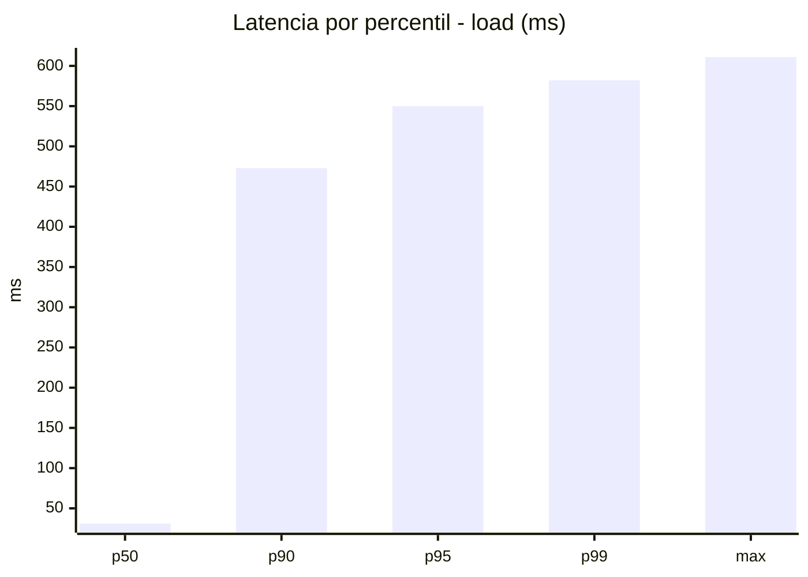
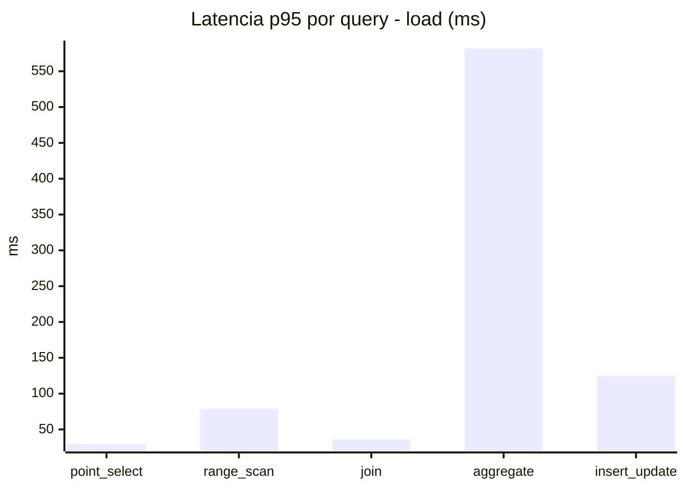
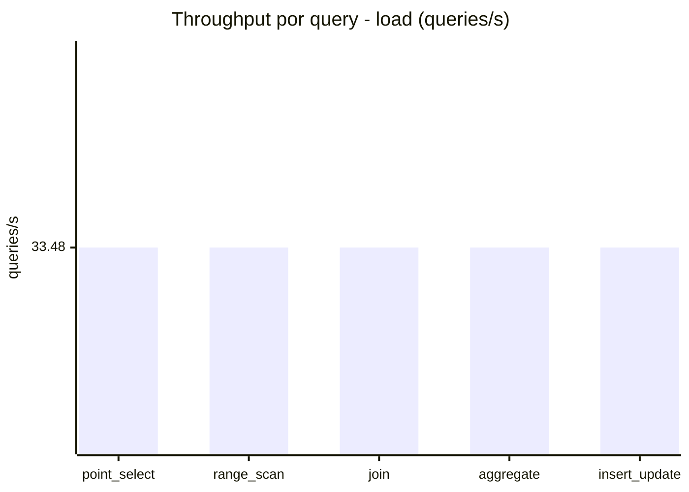
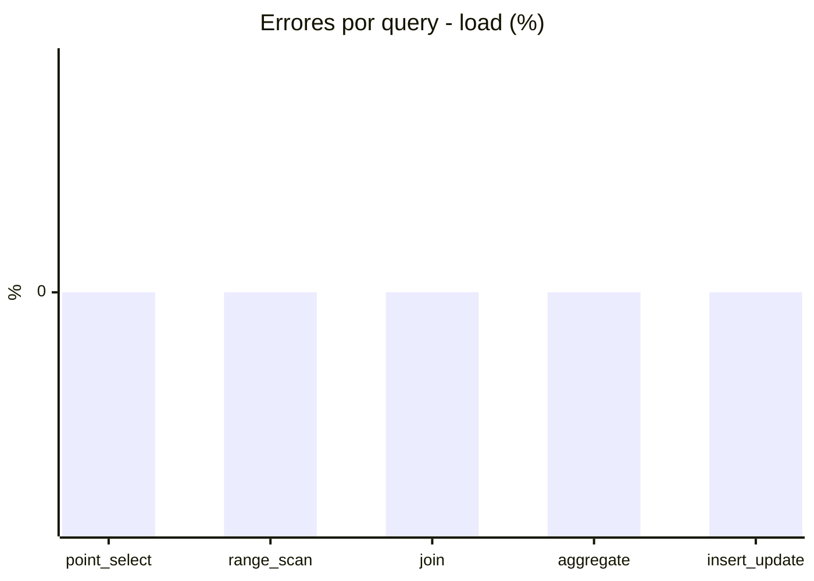
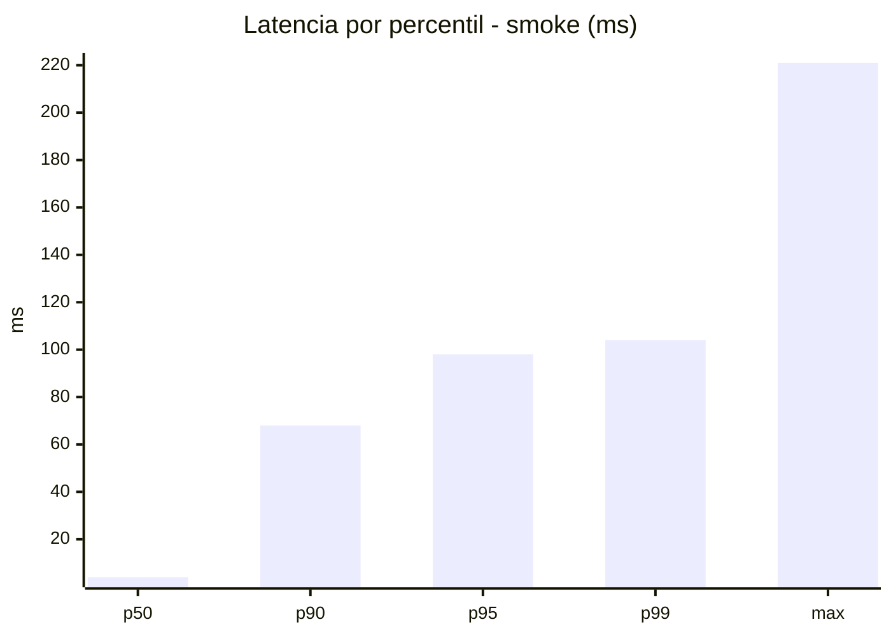
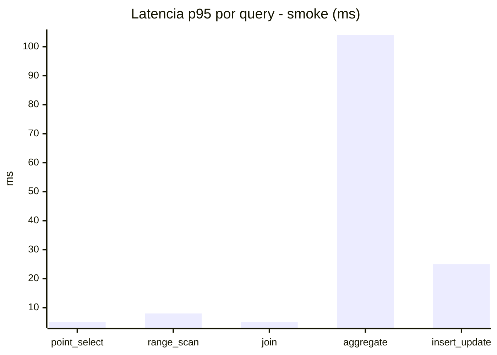
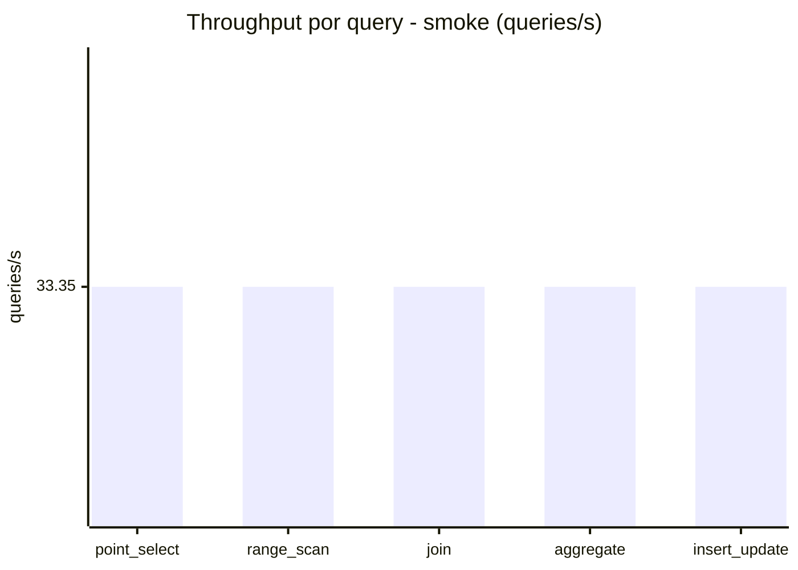
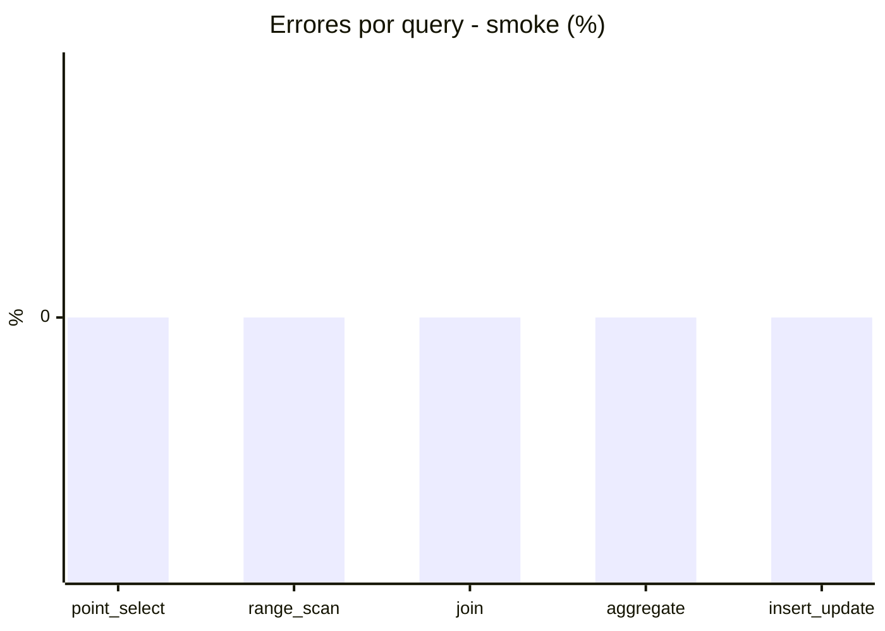

# Reporte de performance - SQL Server (k6)

**Fecha:** 2026-08-28 23:07 UTC  
**Veredicto (SLO):** `FAIL`  
**Corrida:** [ver en GitHub Actions](https://github.com/lrbg/k6-sqlserver-lab/actions/runs/33219209543)  

## Analisis del agente de IA

FAIL (fallback por umbrales)

- Error maximo: 0%
- p95 maximo: 550 ms

## Resultados

### Escenario: `load`

| Metrica | Valor |
| --- | --- |
| Queries ejecutadas | 10115 |
| Errores | 0 (0%) |
| Latencia media | 119.2 ms |
| p50 / p90 / p95 / p99 | 31 / 473 / 550 / 582 ms |
| Min / Max | 0 / 611 ms |
| Throughput | 167.4 queries/s |
| Duracion | 60.4 s |

Detalle por query

| Query | Ejecuciones | Error % | avg | p95 | p99 | q/s |
| --- | --- | --- | --- | --- | --- | --- |
| point_select | 2023 | 0% | 10.1 | 30 | 40 | 33.48 |
| range_scan | 2023 | 0% | 34.8 | 79 | 121 | 33.48 |
| join | 2023 | 0% | 16.2 | 36 | 41 | 33.48 |
| aggregate | 2023 | 0% | 476.4 | 582 | 594.6 | 33.48 |
| insert_update | 2023 | 0% | 58.7 | 125 | 161 | 33.48 |

### Escenario: `smoke`

| Metrica | Valor |
| --- | --- |
| Queries ejecutadas | 5005 |
| Errores | 0 (0%) |
| Latencia media | 17.9 ms |
| p50 / p90 / p95 / p99 | 4 / 68 / 98 / 104 ms |
| Min / Max | 0 / 221 ms |
| Throughput | 166.73 queries/s |
| Duracion | 30 s |

Detalle por query

| Query | Ejecuciones | Error % | avg | p95 | p99 | q/s |
| --- | --- | --- | --- | --- | --- | --- |
| point_select | 1001 | 0% | 1.4 | 5 | 5 | 33.35 |
| range_scan | 1001 | 0% | 4.5 | 8 | 12 | 33.35 |
| join | 1001 | 0% | 2.2 | 5 | 9 | 33.35 |
| aggregate | 1001 | 0% | 73.7 | 104 | 108 | 33.35 |
| insert_update | 1001 | 0% | 7.9 | 25 | 29 | 33.35 |

