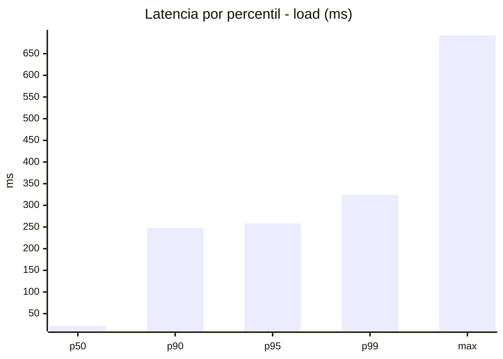
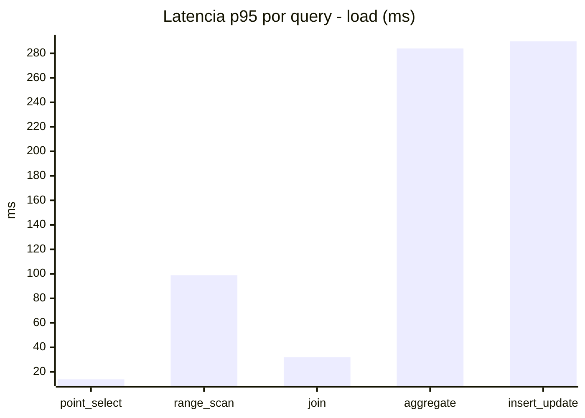
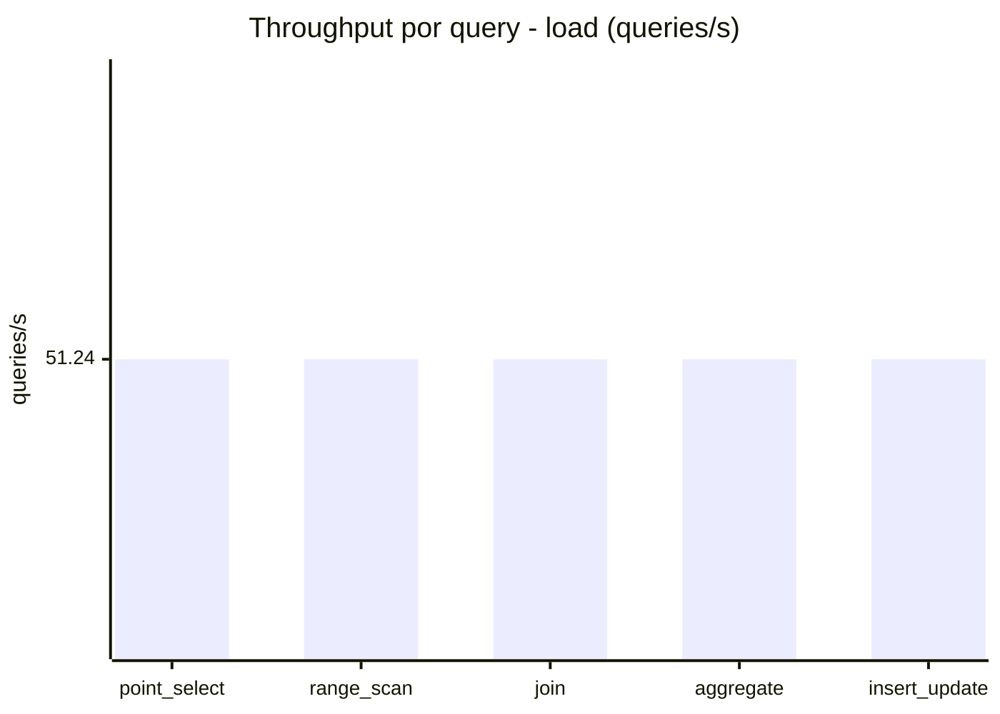
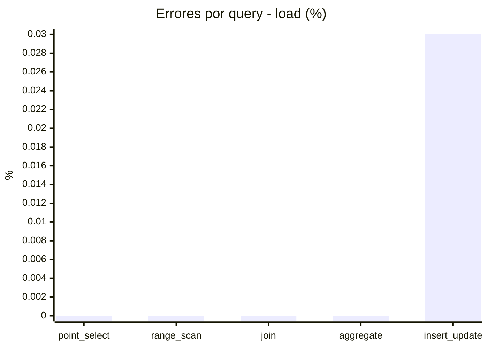
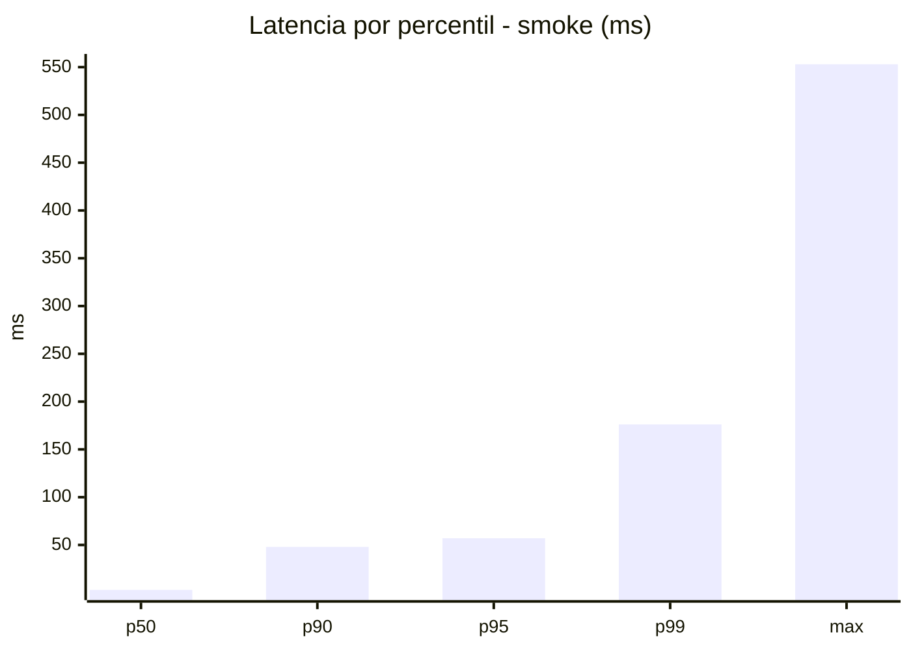
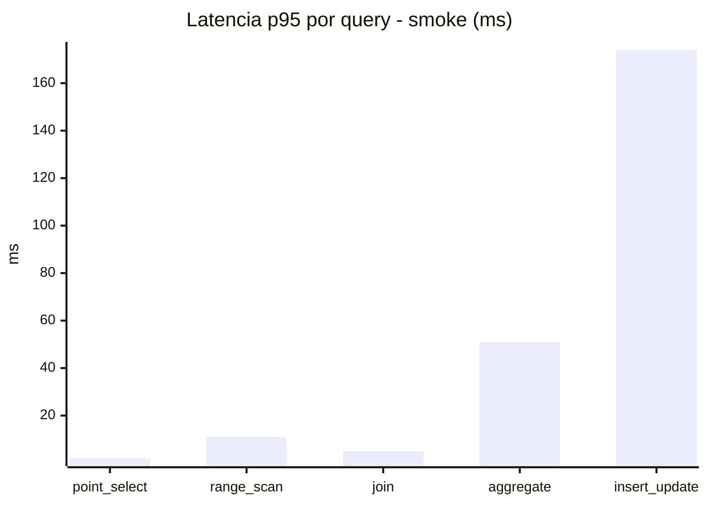
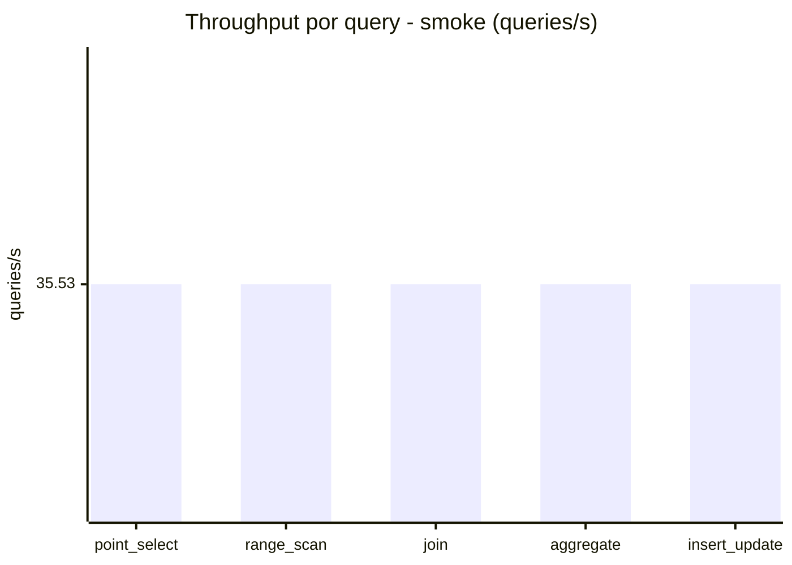
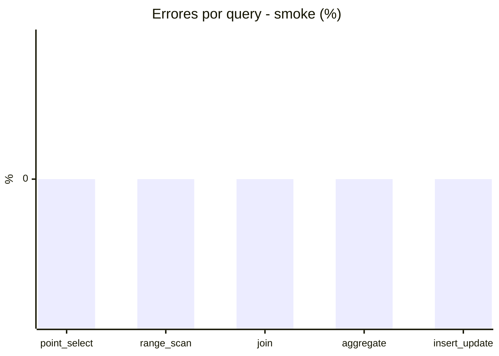

# Reporte de performance - SQL Server (k6)

**Fecha:** 2026-08-29 17:17 UTC  
**Veredicto (SLO):** `WARN`  
**Corrida:** [ver en GitHub Actions](https://github.com/lrbg/k6-sqlserver-lab/actions/runs/33265113908)  

## Analisis del agente de IA

WARN (fallback por umbrales)

- Error maximo: 0.01%
- p95 maximo: 258 ms

## Resultados

### Escenario: `load`

| Metrica | Valor |
| --- | --- |
| Queries ejecutadas | 15415 |
| Errores | 1 (0.01%) |
| Latencia media | 78 ms |
| p50 / p90 / p95 / p99 | 22 / 248 / 258 / 323.9 ms |
| Min / Max | 0 / 692 ms |
| Throughput | 256.18 queries/s |
| Duracion | 60.2 s |

Detalle por query

| Query | Ejecuciones | Error % | avg | p95 | p99 | q/s |
| --- | --- | --- | --- | --- | --- | --- |
| point_select | 3083 | 0% | 4.5 | 13.9 | 32.2 | 51.24 |
| range_scan | 3083 | 0% | 31.9 | 98.9 | 262.6 | 51.24 |
| join | 3083 | 0% | 11.7 | 32 | 37 | 51.24 |
| aggregate | 3083 | 0% | 238.3 | 284 | 297 | 51.24 |
| insert_update | 3083 | 0.03% | 103.7 | 289.8 | 413.4 | 51.24 |

### Escenario: `smoke`

| Metrica | Valor |
| --- | --- |
| Queries ejecutadas | 5330 |
| Errores | 0 (0%) |
| Latencia media | 16.9 ms |
| p50 / p90 / p95 / p99 | 3 / 48 / 57 / 176.1 ms |
| Min / Max | 0 / 553 ms |
| Throughput | 177.63 queries/s |
| Duracion | 30 s |

Detalle por query

| Query | Ejecuciones | Error % | avg | p95 | p99 | q/s |
| --- | --- | --- | --- | --- | --- | --- |
| point_select | 1066 | 0% | 0.7 | 2 | 5 | 35.53 |
| range_scan | 1066 | 0% | 5.3 | 11 | 65.6 | 35.53 |
| join | 1066 | 0% | 1.5 | 5 | 5 | 35.53 |
| aggregate | 1066 | 0% | 36.8 | 51 | 57 | 35.53 |
| insert_update | 1066 | 0% | 40.1 | 174 | 346.2 | 35.53 |

