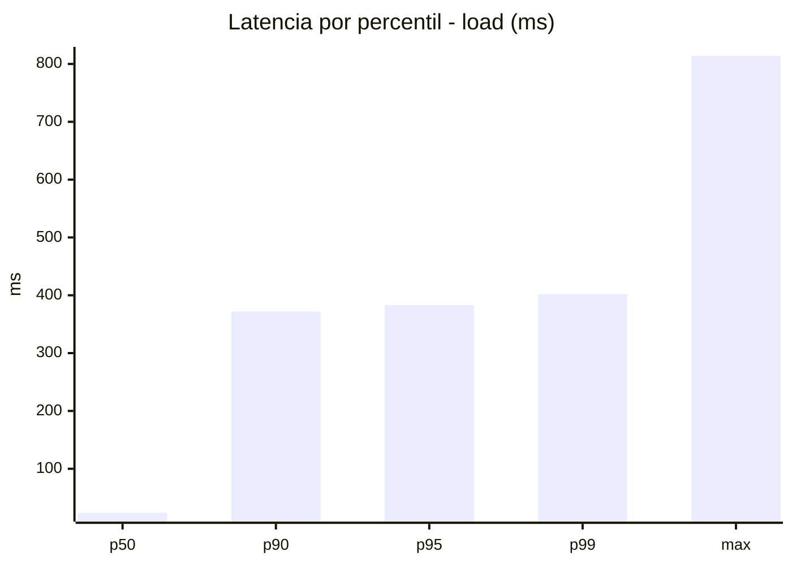
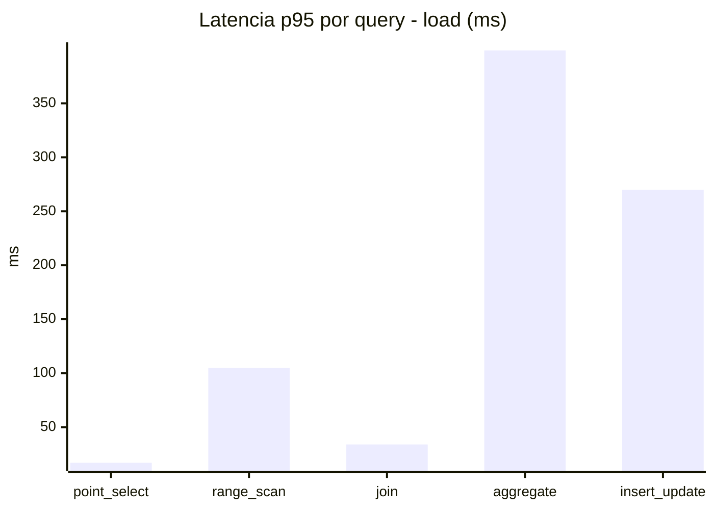
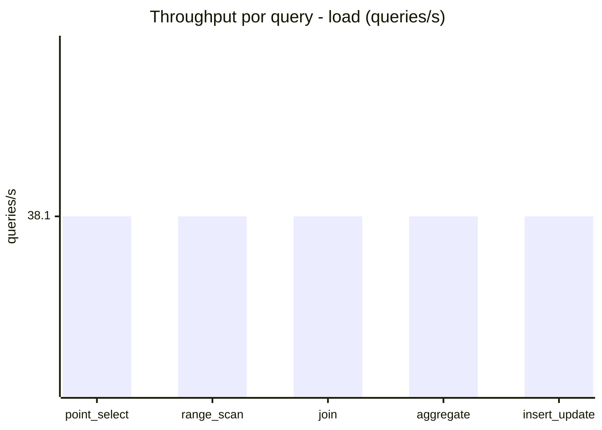
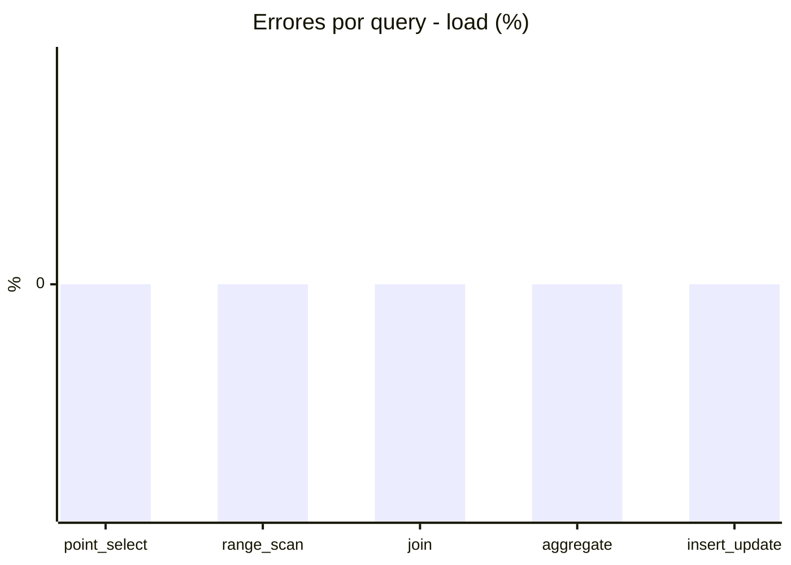
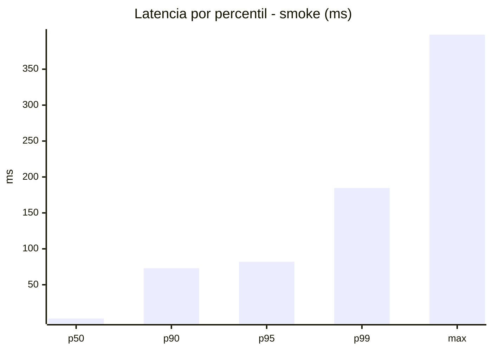
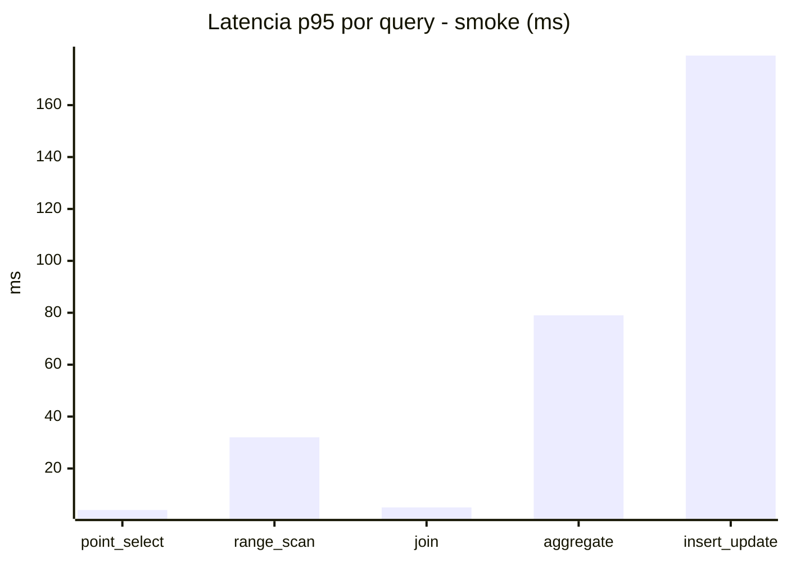
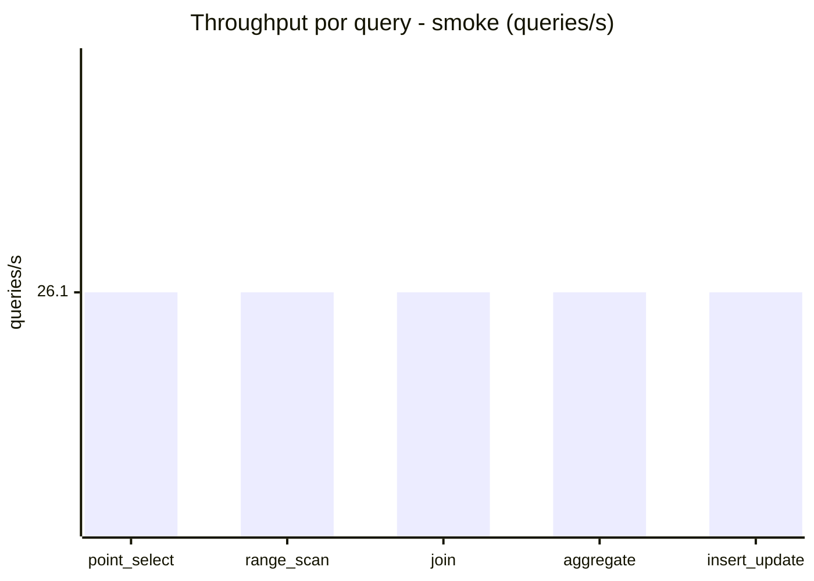
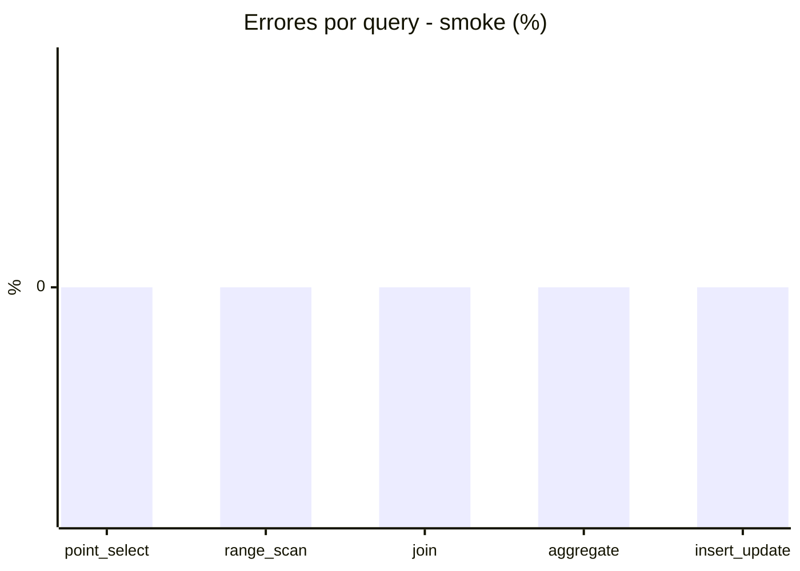

# Reporte de performance - SQL Server (k6)

**Fecha:** 2026-08-30 17:40 UTC  
**Veredicto (SLO):** `WARN`  
**Corrida:** [ver en GitHub Actions](https://github.com/lrbg/k6-sqlserver-lab/actions/runs/33325813382)  

## Analisis del agente de IA

WARN (fallback por umbrales)

- Error maximo: 0%
- p95 maximo: 383 ms

## Resultados

### Escenario: `load`

| Metrica | Valor |
| --- | --- |
| Queries ejecutadas | 11560 |
| Errores | 0 (0%) |
| Latencia media | 104.7 ms |
| p50 / p90 / p95 / p99 | 24 / 372 / 383 / 402 ms |
| Min / Max | 0 / 814 ms |
| Throughput | 190.48 queries/s |
| Duracion | 60.7 s |

Detalle por query

| Query | Ejecuciones | Error % | avg | p95 | p99 | q/s |
| --- | --- | --- | --- | --- | --- | --- |
| point_select | 2312 | 0% | 5.9 | 17 | 37 | 38.1 |
| range_scan | 2312 | 0% | 30.9 | 105 | 187 | 38.1 |
| join | 2312 | 0% | 13.9 | 34 | 38.9 | 38.1 |
| aggregate | 2312 | 0% | 363.9 | 399 | 409.9 | 38.1 |
| insert_update | 2312 | 0% | 109.1 | 270 | 414.3 | 38.1 |

### Escenario: `smoke`

| Metrica | Valor |
| --- | --- |
| Queries ejecutadas | 3935 |
| Errores | 0 (0%) |
| Latencia media | 22.9 ms |
| p50 / p90 / p95 / p99 | 3 / 73 / 82 / 184.7 ms |
| Min / Max | 0 / 398 ms |
| Throughput | 130.51 queries/s |
| Duracion | 30.2 s |

Detalle por query

| Query | Ejecuciones | Error % | avg | p95 | p99 | q/s |
| --- | --- | --- | --- | --- | --- | --- |
| point_select | 787 | 0% | 0.9 | 4 | 5 | 26.1 |
| range_scan | 787 | 0% | 9.2 | 32 | 117.8 | 26.1 |
| join | 787 | 0% | 1.8 | 5 | 7 | 26.1 |
| aggregate | 787 | 0% | 55.2 | 79 | 84 | 26.1 |
| insert_update | 787 | 0% | 47.4 | 179.1 | 369 | 26.1 |

