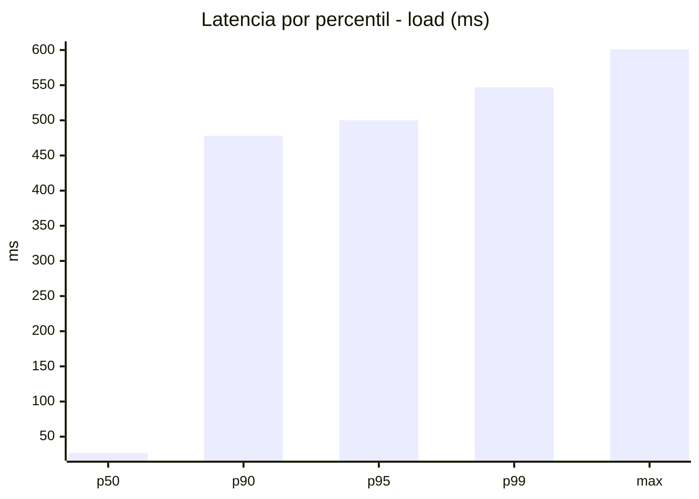
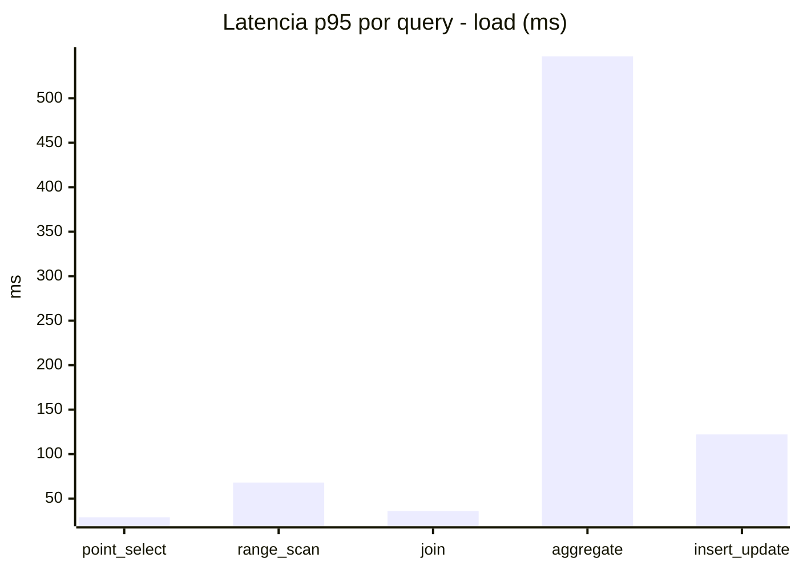
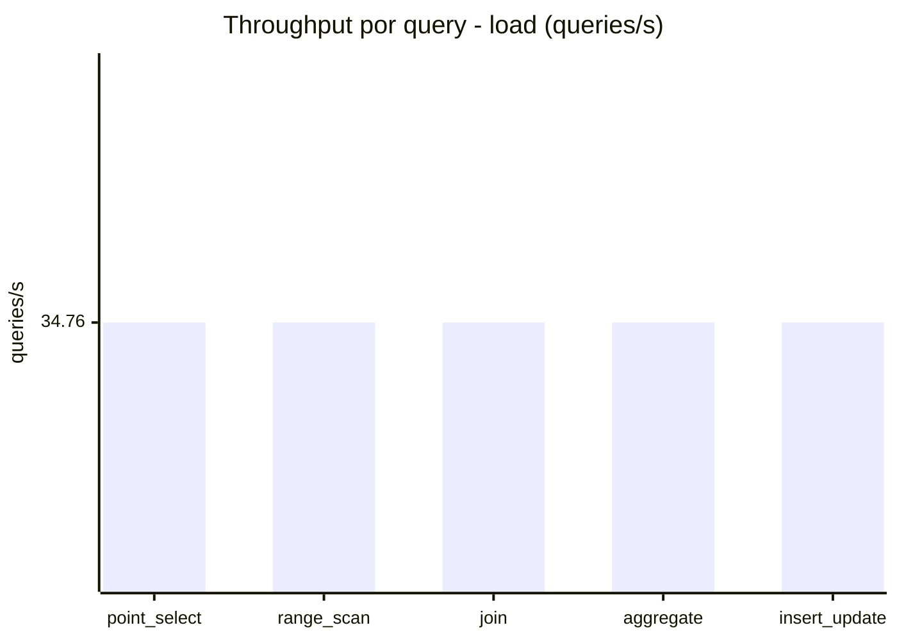
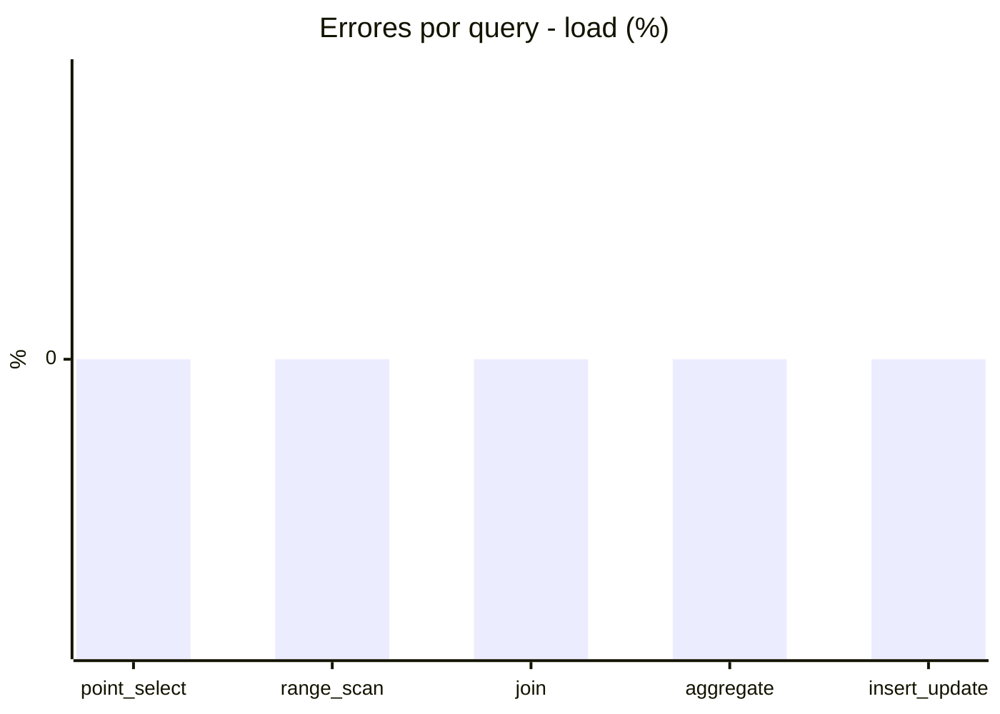
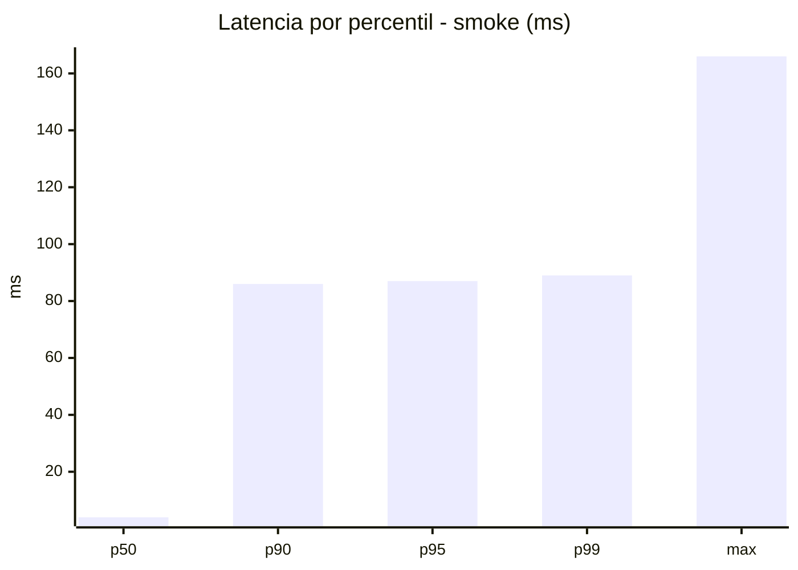
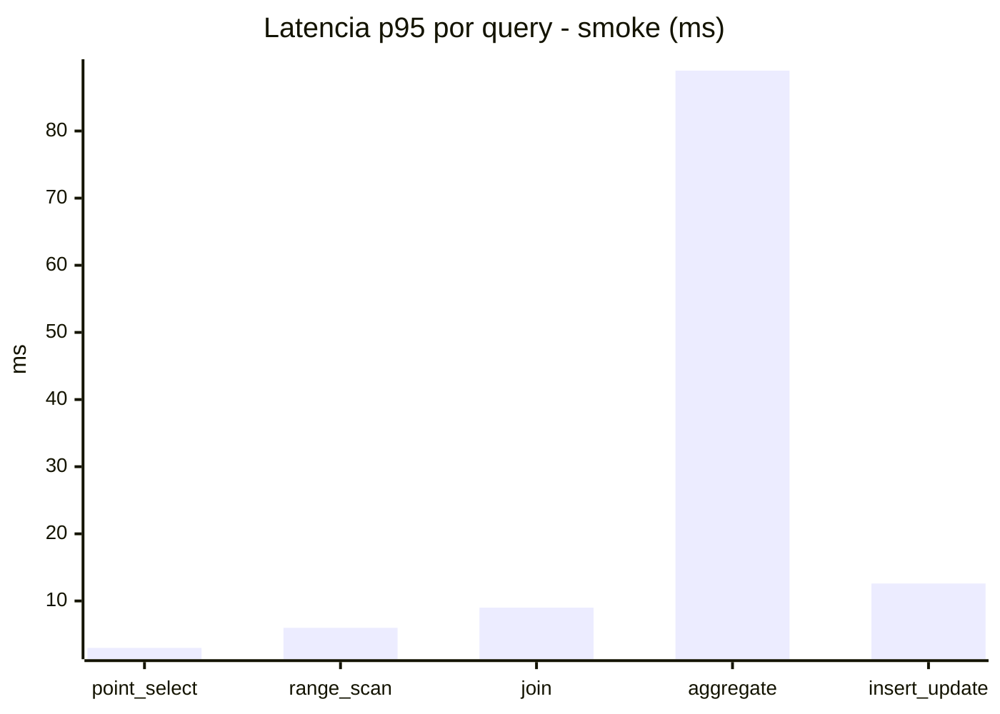
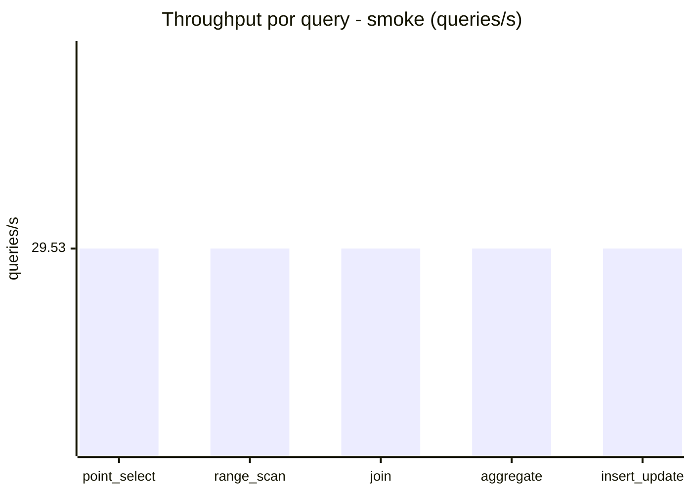
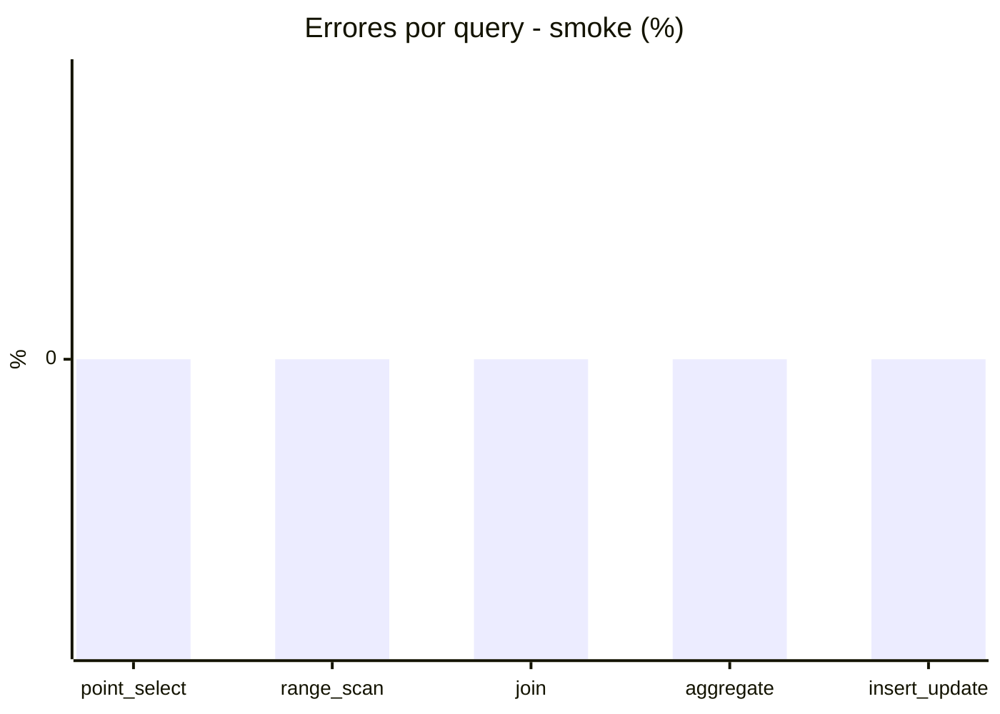

# Reporte de performance - SQL Server (k6)

**Fecha:** 2026-08-31 19:34 UTC  
**Veredicto (SLO):** `FAIL`  
**Corrida:** [ver en GitHub Actions](https://github.com/lrbg/k6-sqlserver-lab/actions/runs/33431099093)  

## Analisis del agente de IA

FAIL (fallback por umbrales)

- Error maximo: 0%
- p95 maximo: 500 ms

## Resultados

### Escenario: `load`

| Metrica | Valor |
| --- | --- |
| Queries ejecutadas | 10490 |
| Errores | 0 (0%) |
| Latencia media | 114.9 ms |
| p50 / p90 / p95 / p99 | 27 / 478 / 500 / 547.1 ms |
| Min / Max | 0 / 601 ms |
| Throughput | 173.79 queries/s |
| Duracion | 60.4 s |

Detalle por query

| Query | Ejecuciones | Error % | avg | p95 | p99 | q/s |
| --- | --- | --- | --- | --- | --- | --- |
| point_select | 2098 | 0% | 9.9 | 29 | 37 | 34.76 |
| range_scan | 2098 | 0% | 30 | 68 | 108.1 | 34.76 |
| join | 2098 | 0% | 16.2 | 36 | 41 | 34.76 |
| aggregate | 2098 | 0% | 466.8 | 547.1 | 559 | 34.76 |
| insert_update | 2098 | 0% | 51.5 | 122.1 | 155 | 34.76 |

### Escenario: `smoke`

| Metrica | Valor |
| --- | --- |
| Queries ejecutadas | 4440 |
| Errores | 0 (0%) |
| Latencia media | 20.3 ms |
| p50 / p90 / p95 / p99 | 4 / 86 / 87 / 89 ms |
| Min / Max | 0 / 166 ms |
| Throughput | 147.67 queries/s |
| Duracion | 30.1 s |

Detalle por query

| Query | Ejecuciones | Error % | avg | p95 | p99 | q/s |
| --- | --- | --- | --- | --- | --- | --- |
| point_select | 888 | 0% | 1.4 | 3 | 5 | 29.53 |
| range_scan | 888 | 0% | 3.9 | 6 | 9 | 29.53 |
| join | 888 | 0% | 4 | 9 | 9 | 29.53 |
| aggregate | 888 | 0% | 85.6 | 89 | 104.1 | 29.53 |
| insert_update | 888 | 0% | 6.4 | 12.6 | 19 | 29.53 |

