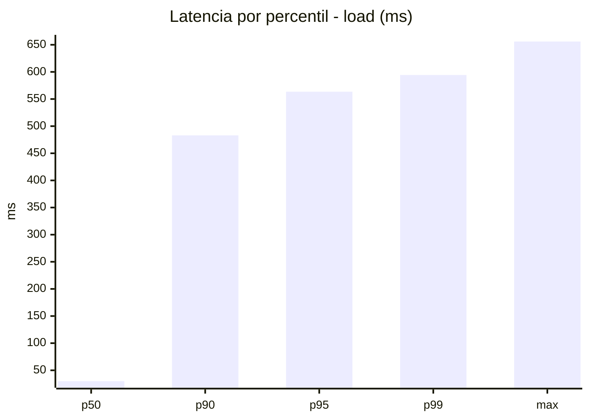
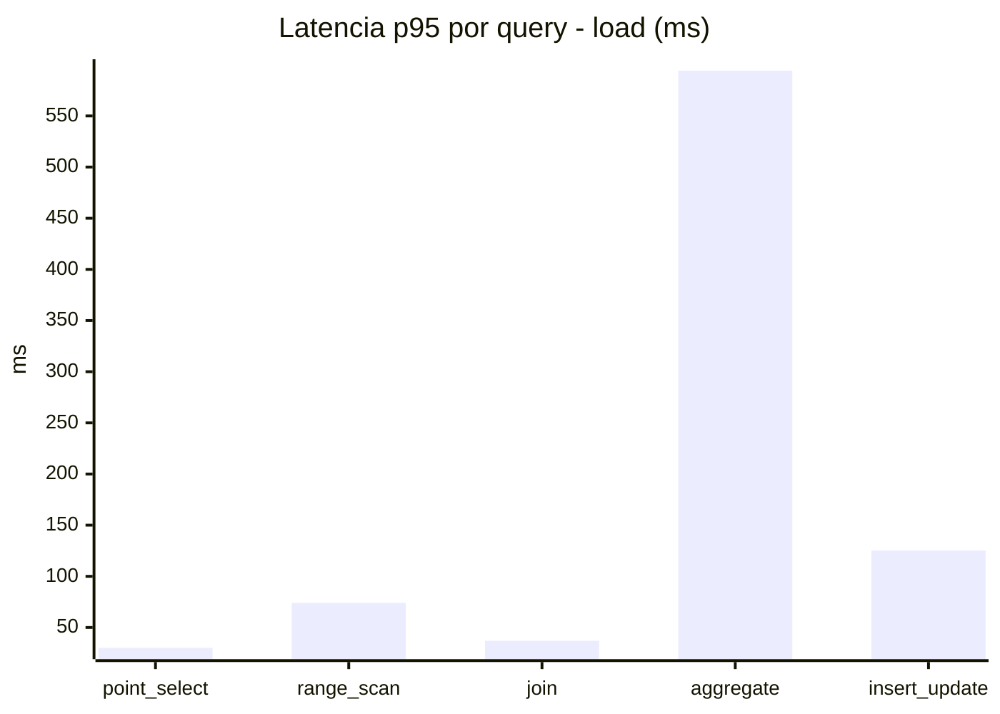
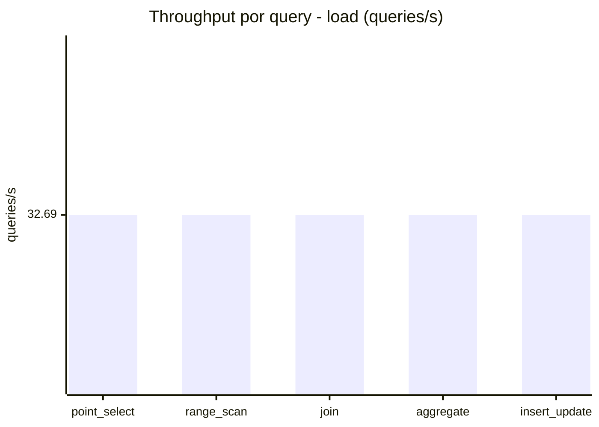
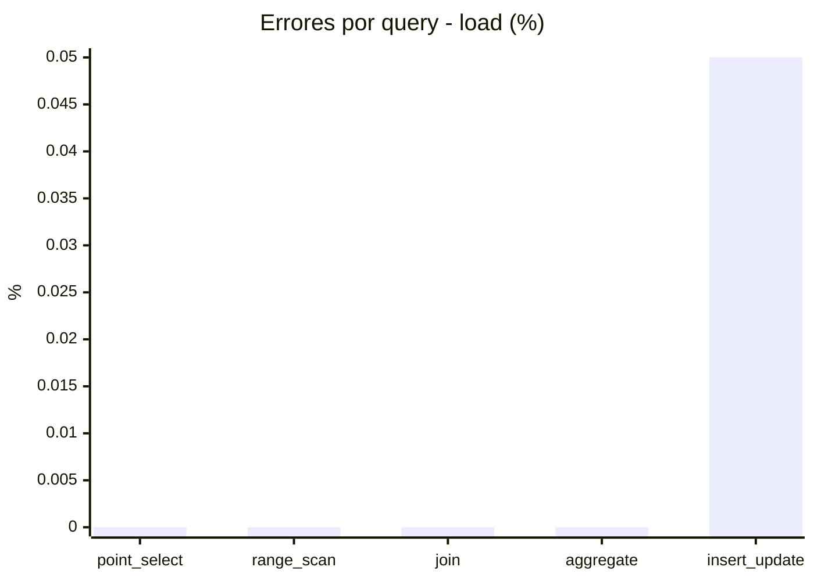
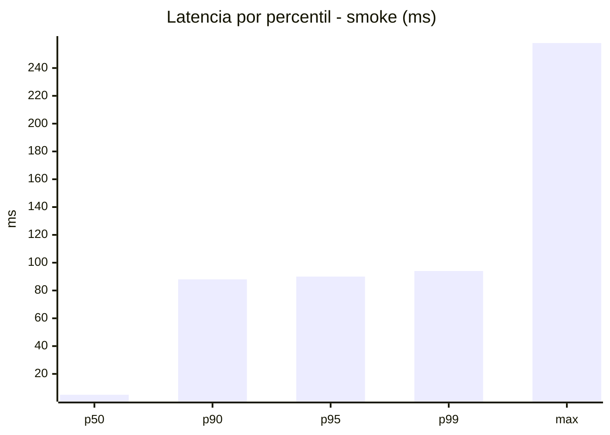
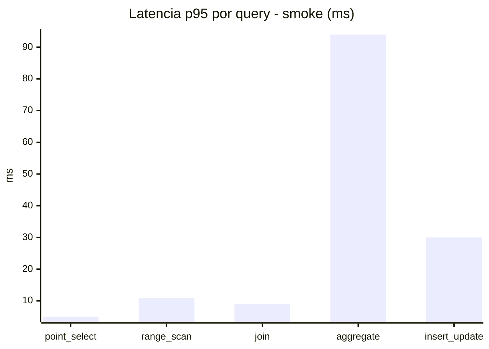
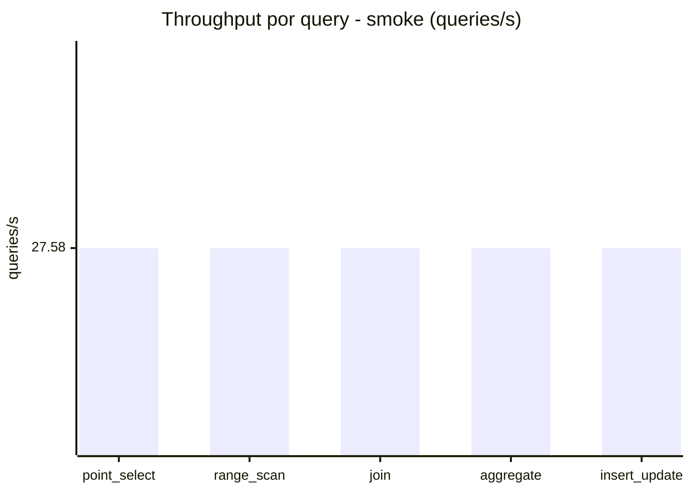
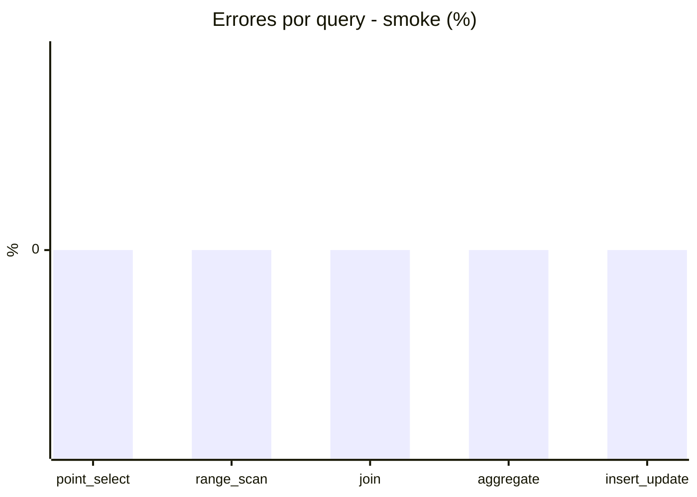

# Reporte de performance - SQL Server (k6)

**Fecha:** 2026-09-01 17:23 UTC  
**Veredicto (SLO):** `FAIL`  
**Corrida:** [ver en GitHub Actions](https://github.com/lrbg/k6-sqlserver-lab/actions/runs/33537255661)  

## Analisis del agente de IA

FAIL (fallback por umbrales)

- Error maximo: 0.01%
- p95 maximo: 563.5 ms

## Resultados

### Escenario: `load`

| Metrica | Valor |
| --- | --- |
| Queries ejecutadas | 9870 |
| Errores | 1 (0.01%) |
| Latencia media | 122 ms |
| p50 / p90 / p95 / p99 | 30 / 483 / 563.5 / 594.3 ms |
| Min / Max | 0 / 656 ms |
| Throughput | 163.43 queries/s |
| Duracion | 60.4 s |

Detalle por query

| Query | Ejecuciones | Error % | avg | p95 | p99 | q/s |
| --- | --- | --- | --- | --- | --- | --- |
| point_select | 1974 | 0% | 11.8 | 30 | 44.3 | 32.69 |
| range_scan | 1974 | 0% | 32.8 | 74 | 104 | 32.69 |
| join | 1974 | 0% | 17.8 | 37 | 42 | 32.69 |
| aggregate | 1974 | 0% | 489.4 | 594.3 | 617.3 | 32.69 |
| insert_update | 1974 | 0.05% | 58.3 | 125.3 | 164 | 32.69 |

### Escenario: `smoke`

| Metrica | Valor |
| --- | --- |
| Queries ejecutadas | 4145 |
| Errores | 0 (0%) |
| Latencia media | 21.7 ms |
| p50 / p90 / p95 / p99 | 5 / 88 / 90 / 94 ms |
| Min / Max | 0 / 258 ms |
| Throughput | 137.9 queries/s |
| Duracion | 30.1 s |

Detalle por query

| Query | Ejecuciones | Error % | avg | p95 | p99 | q/s |
| --- | --- | --- | --- | --- | --- | --- |
| point_select | 829 | 0% | 1.9 | 5 | 9 | 27.58 |
| range_scan | 829 | 0% | 5.5 | 11 | 18 | 27.58 |
| join | 829 | 0% | 4.4 | 9 | 9.7 | 27.58 |
| aggregate | 829 | 0% | 85.2 | 94 | 105.7 | 27.58 |
| insert_update | 829 | 0% | 11.7 | 30 | 41 | 27.58 |

