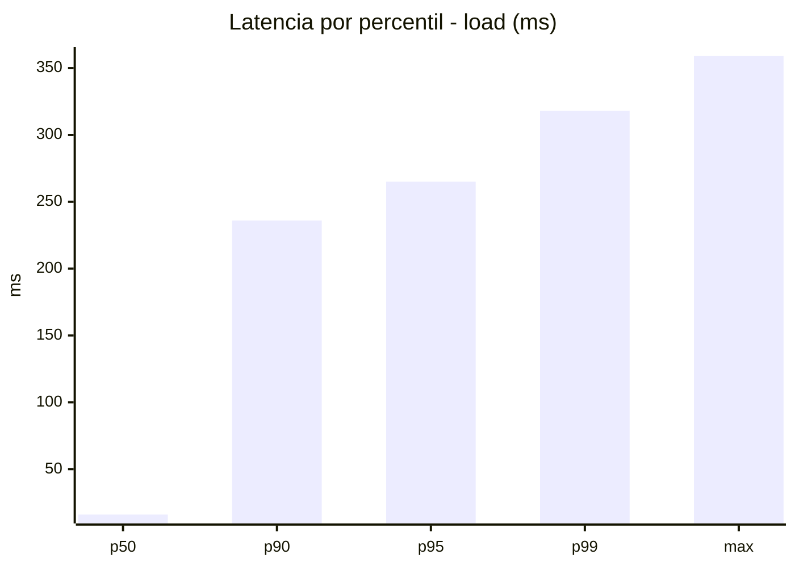
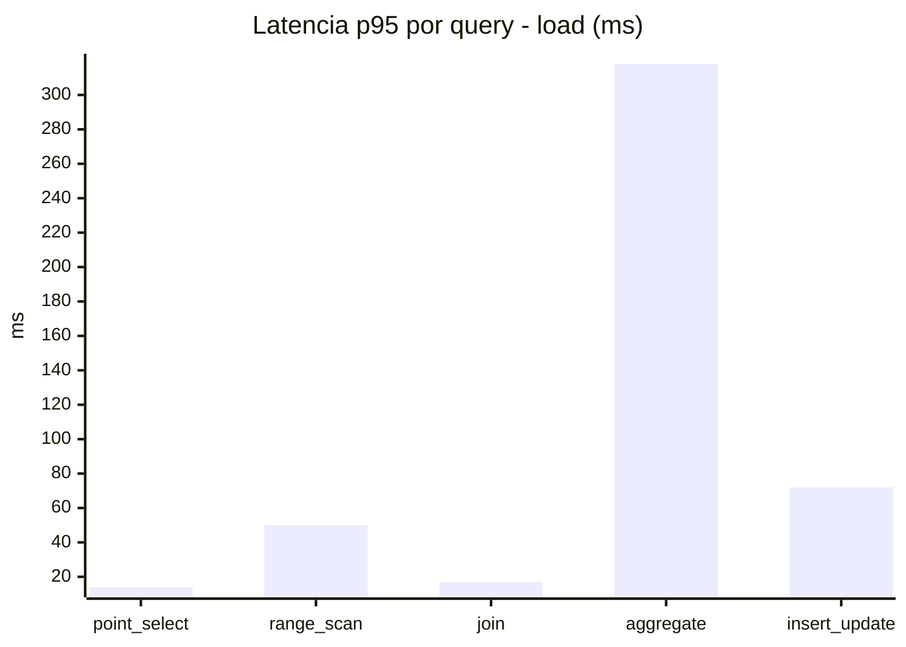
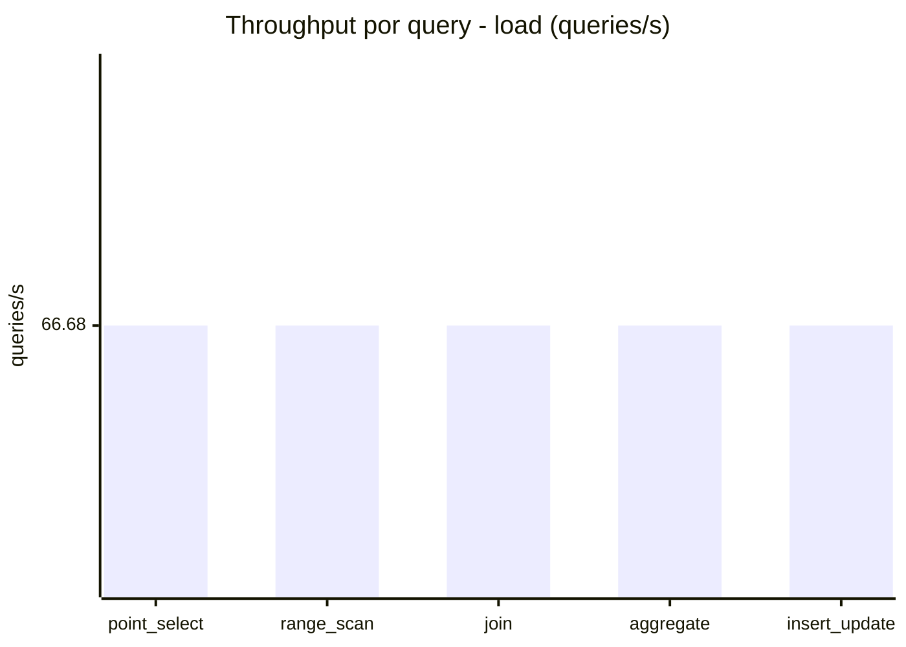
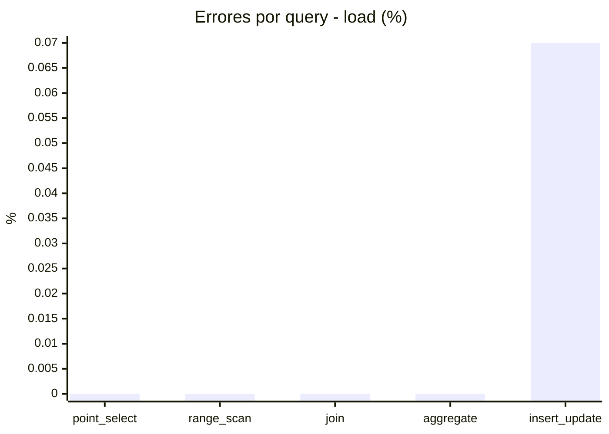
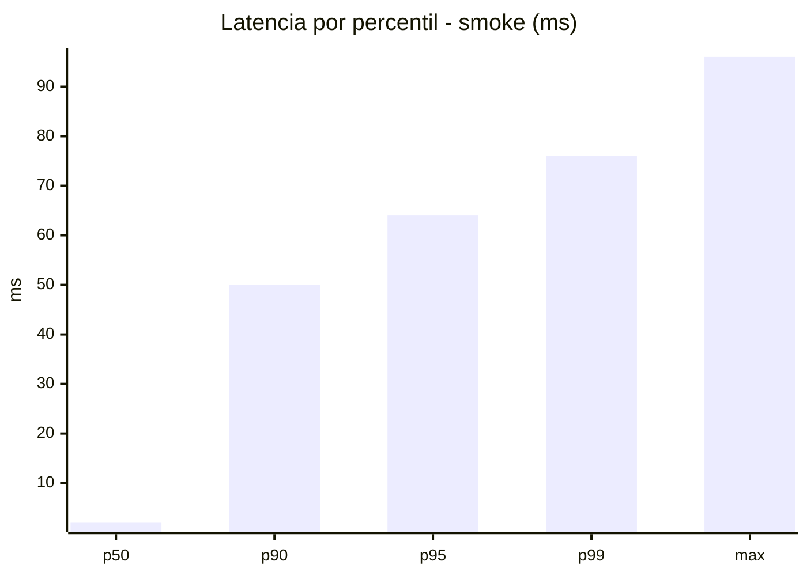
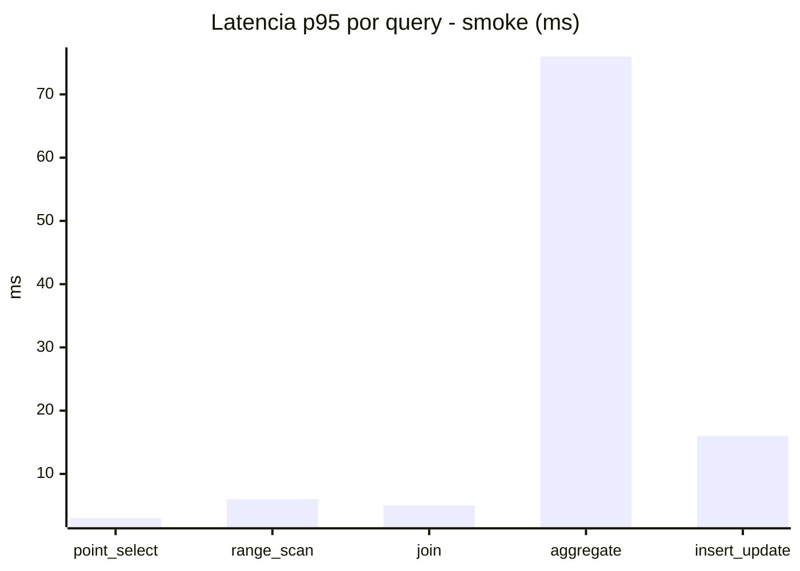
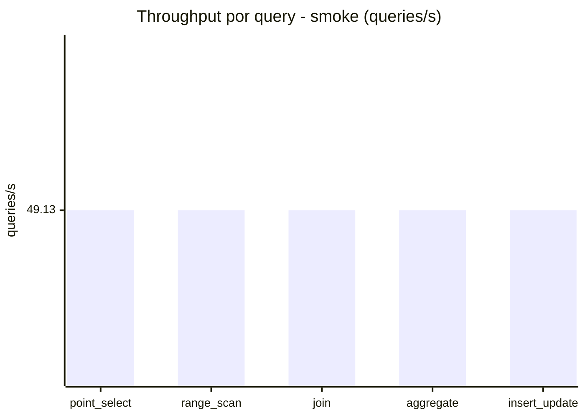
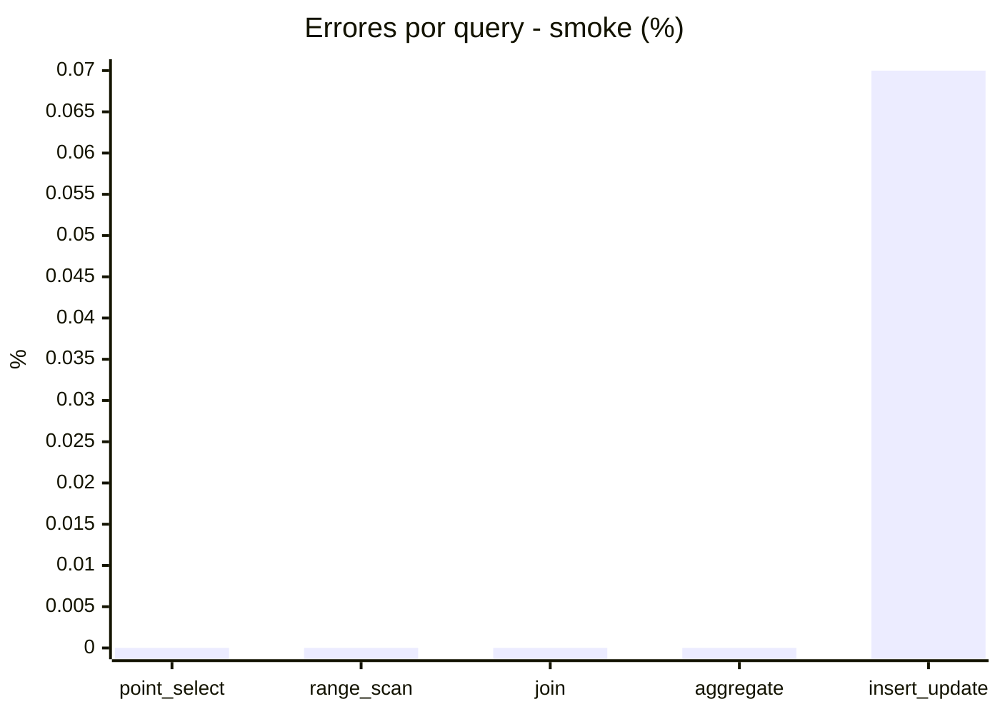

# Reporte de performance - SQL Server (k6)

**Fecha:** 2026-09-02 17:14 UTC  
**Veredicto (SLO):** `WARN`  
**Corrida:** [ver en GitHub Actions](https://github.com/lrbg/k6-sqlserver-lab/actions/runs/33659676678)  

## Analisis del agente de IA

WARN (fallback por umbrales)

- Error maximo: 0.01%
- p95 maximo: 265 ms

## Resultados

### Escenario: `load`

| Metrica | Valor |
| --- | --- |
| Queries ejecutadas | 20075 |
| Errores | 3 (0.01%) |
| Latencia media | 59.9 ms |
| p50 / p90 / p95 / p99 | 16 / 236 / 265 / 318 ms |
| Min / Max | 0 / 359 ms |
| Throughput | 333.39 queries/s |
| Duracion | 60.2 s |

Detalle por query

| Query | Ejecuciones | Error % | avg | p95 | p99 | q/s |
| --- | --- | --- | --- | --- | --- | --- |
| point_select | 4015 | 0% | 5.2 | 14 | 20 | 66.68 |
| range_scan | 4015 | 0% | 21.7 | 50 | 68.9 | 66.68 |
| join | 4015 | 0% | 8.4 | 17 | 21 | 66.68 |
| aggregate | 4015 | 0% | 231.2 | 318 | 328.9 | 66.68 |
| insert_update | 4015 | 0.07% | 33.1 | 72 | 89.9 | 66.68 |

### Escenario: `smoke`

| Metrica | Valor |
| --- | --- |
| Queries ejecutadas | 7385 |
| Errores | 1 (0.01%) |
| Latencia media | 12.2 ms |
| p50 / p90 / p95 / p99 | 2 / 50 / 64 / 76 ms |
| Min / Max | 0 / 96 ms |
| Throughput | 245.64 queries/s |
| Duracion | 30.1 s |

Detalle por query

| Query | Ejecuciones | Error % | avg | p95 | p99 | q/s |
| --- | --- | --- | --- | --- | --- | --- |
| point_select | 1477 | 0% | 0.8 | 3 | 4 | 49.13 |
| range_scan | 1477 | 0% | 3 | 6 | 7.2 | 49.13 |
| join | 1477 | 0% | 1.7 | 5 | 5 | 49.13 |
| aggregate | 1477 | 0% | 50.7 | 76 | 81 | 49.13 |
| insert_update | 1477 | 0.07% | 4.7 | 16 | 21 | 49.13 |

