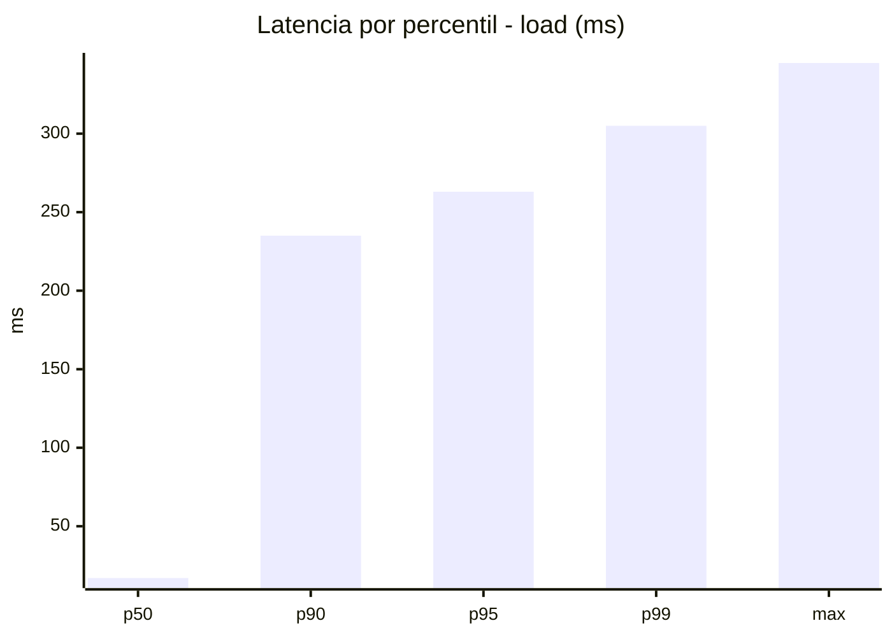
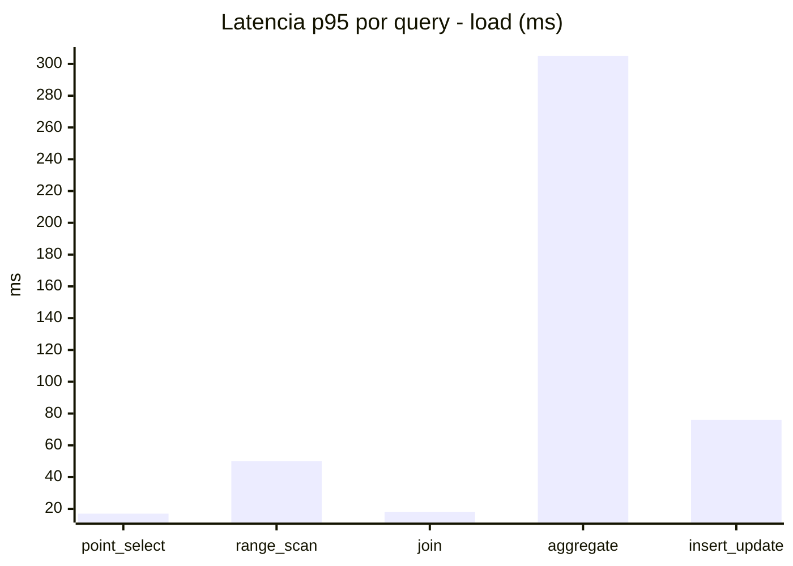
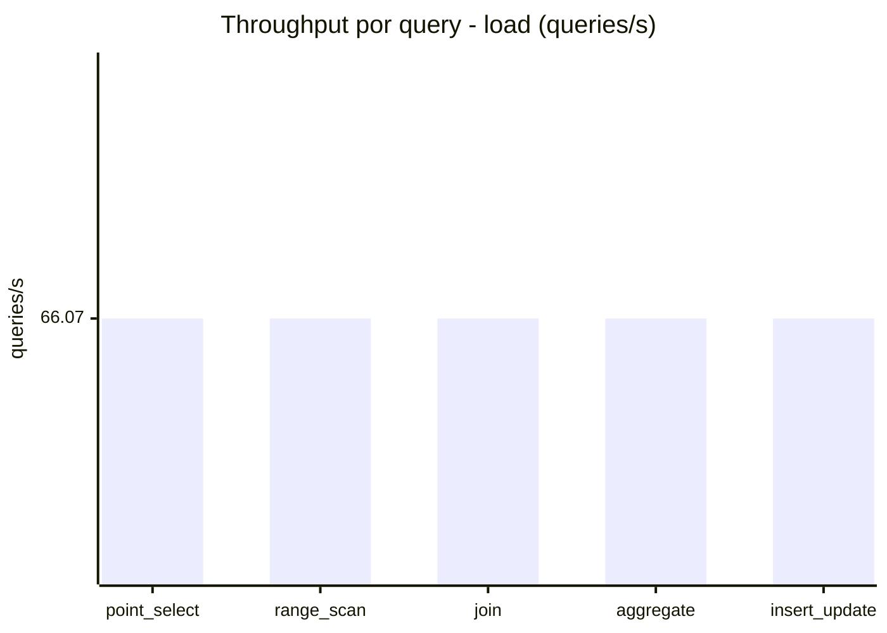
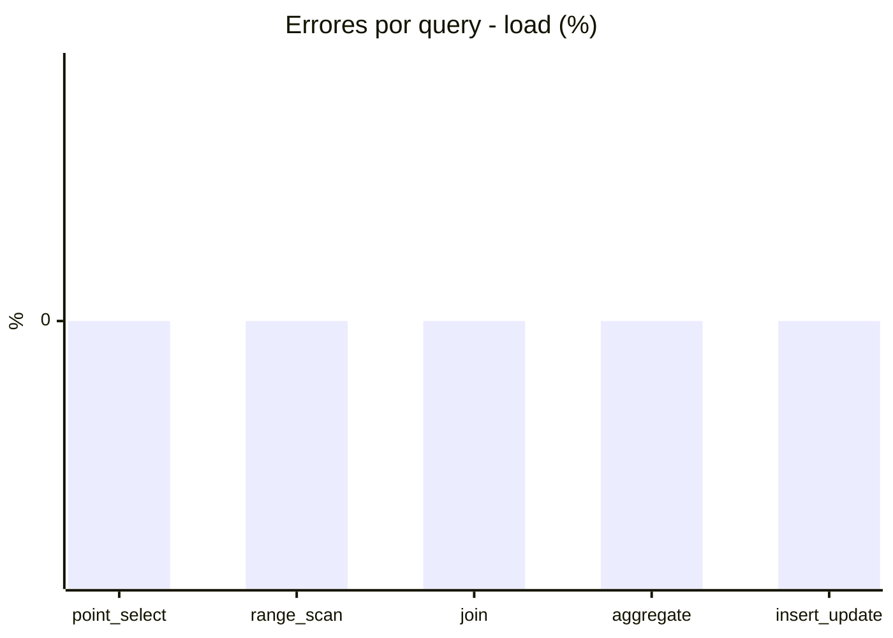
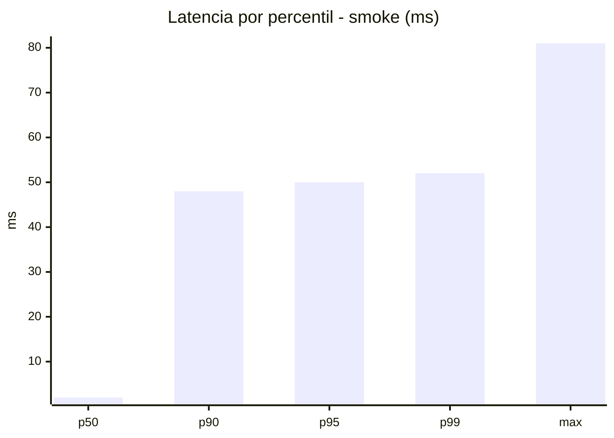
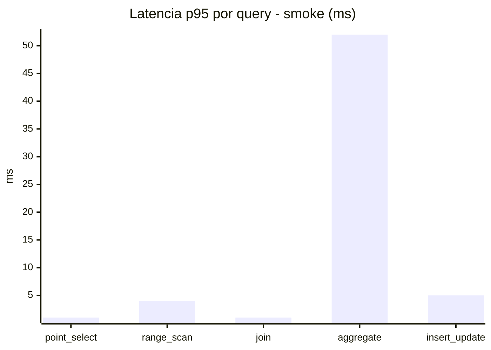
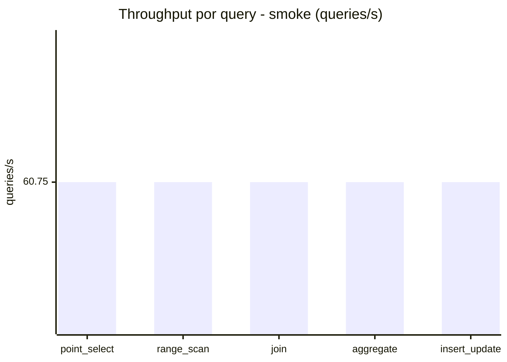
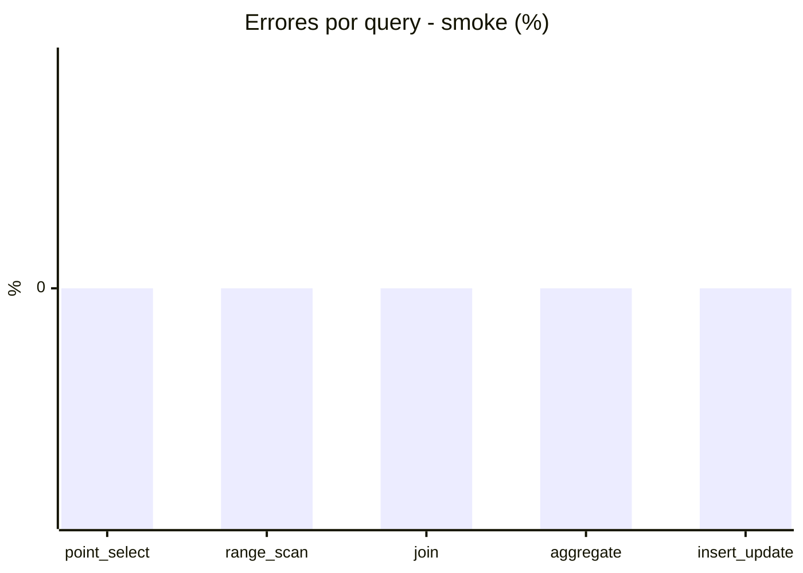

# Reporte de performance - SQL Server (k6)

**Fecha:** 2026-09-03 17:06 UTC  
**Veredicto (SLO):** `WARN`  
**Corrida:** [ver en GitHub Actions](https://github.com/lrbg/k6-sqlserver-lab/actions/runs/33782396211)  

## Analisis del agente de IA

WARN (fallback por umbrales)

- Error maximo: 0%
- p95 maximo: 263 ms

## Resultados

### Escenario: `load`

| Metrica | Valor |
| --- | --- |
| Queries ejecutadas | 19895 |
| Errores | 0 (0%) |
| Latencia media | 60.4 ms |
| p50 / p90 / p95 / p99 | 17 / 235 / 263 / 305 ms |
| Min / Max | 0 / 345 ms |
| Throughput | 330.34 queries/s |
| Duracion | 60.2 s |

Detalle por query

| Query | Ejecuciones | Error % | avg | p95 | p99 | q/s |
| --- | --- | --- | --- | --- | --- | --- |
| point_select | 3979 | 0% | 6.1 | 17 | 21 | 66.07 |
| range_scan | 3979 | 0% | 22 | 50 | 66 | 66.07 |
| join | 3979 | 0% | 8.9 | 18 | 22 | 66.07 |
| aggregate | 3979 | 0% | 231 | 305 | 324 | 66.07 |
| insert_update | 3979 | 0% | 34.2 | 76 | 96 | 66.07 |

### Escenario: `smoke`

| Metrica | Valor |
| --- | --- |
| Queries ejecutadas | 9125 |
| Errores | 0 (0%) |
| Latencia media | 9.8 ms |
| p50 / p90 / p95 / p99 | 2 / 48 / 50 / 52 ms |
| Min / Max | 0 / 81 ms |
| Throughput | 303.73 queries/s |
| Duracion | 30 s |

Detalle por query

| Query | Ejecuciones | Error % | avg | p95 | p99 | q/s |
| --- | --- | --- | --- | --- | --- | --- |
| point_select | 1825 | 0% | 0.6 | 1 | 2 | 60.75 |
| range_scan | 1825 | 0% | 2.8 | 4 | 4 | 60.75 |
| join | 1825 | 0% | 0.9 | 1 | 3 | 60.75 |
| aggregate | 1825 | 0% | 42.3 | 52 | 53 | 60.75 |
| insert_update | 1825 | 0% | 2.7 | 5 | 7 | 60.75 |

