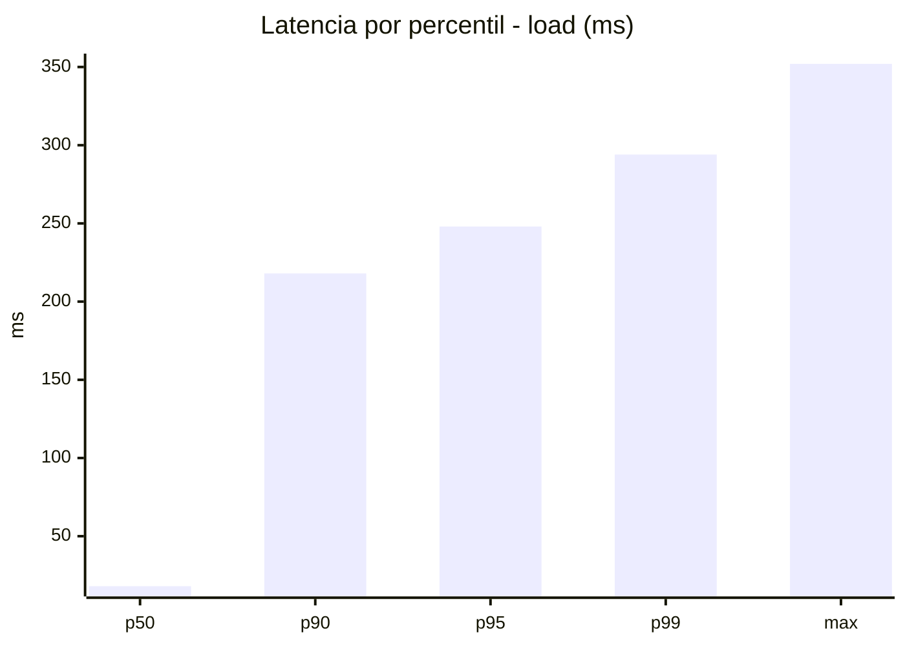
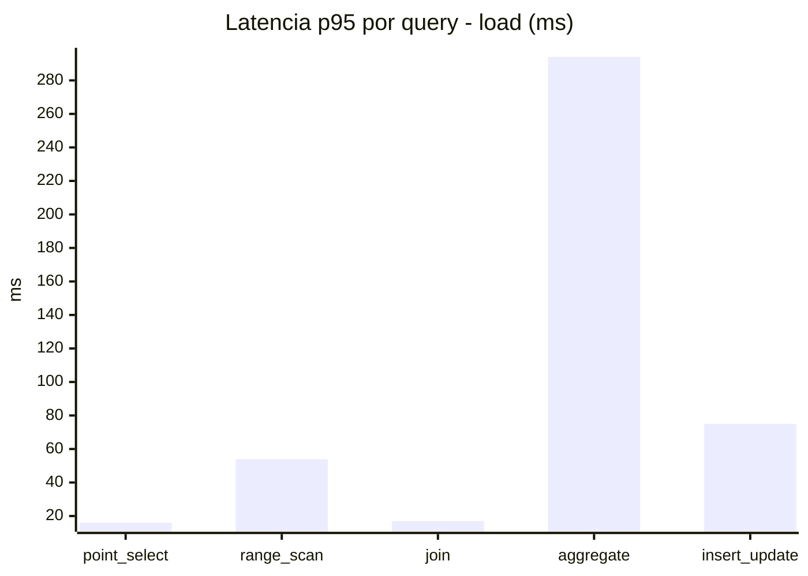
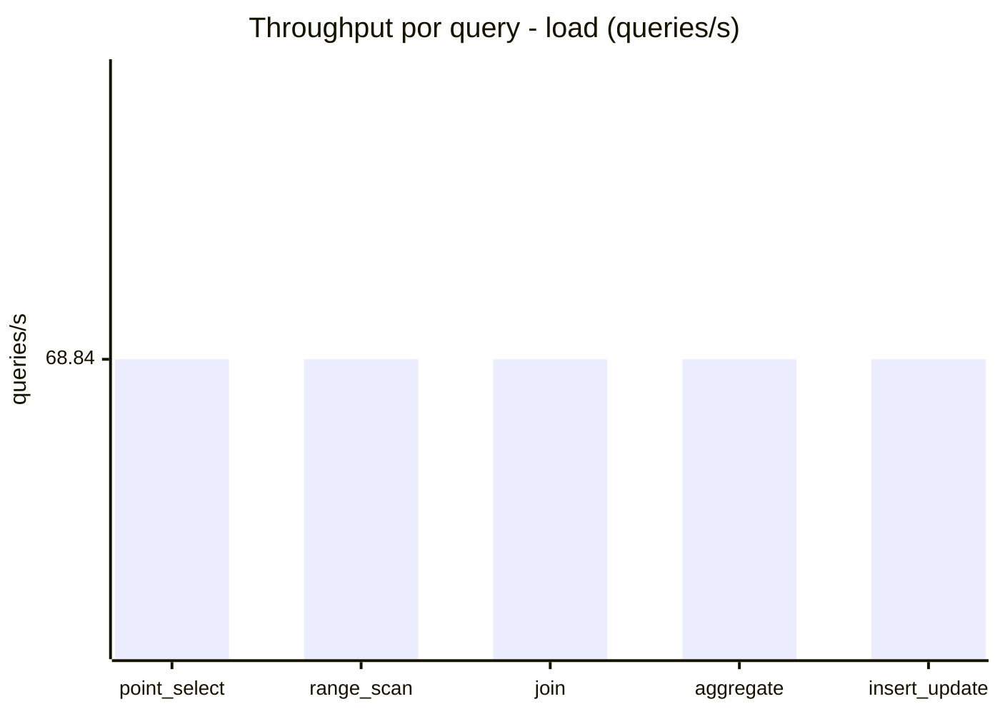
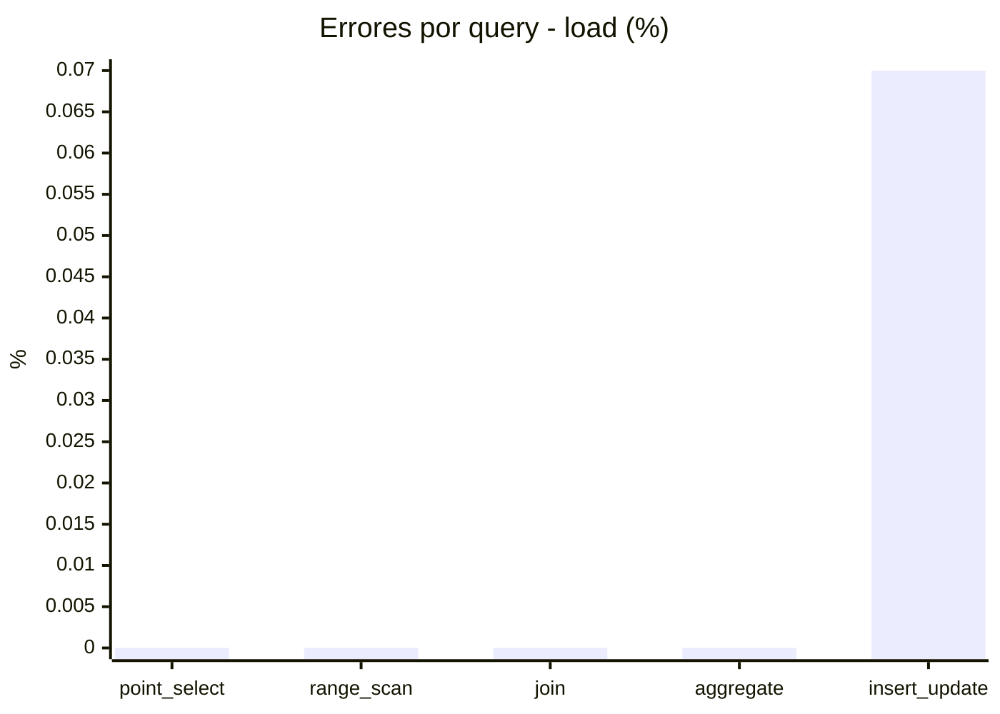
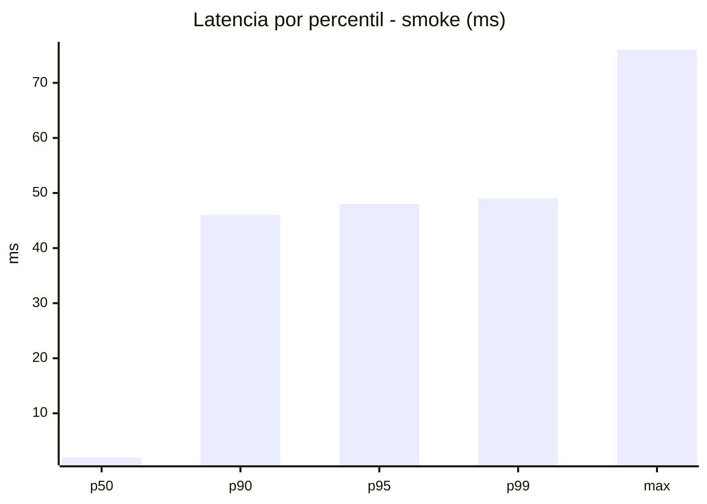
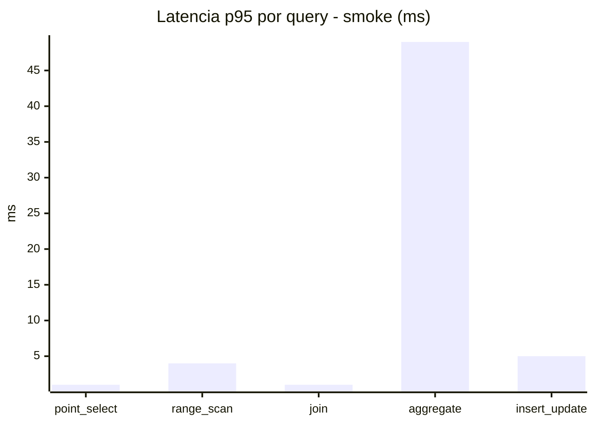
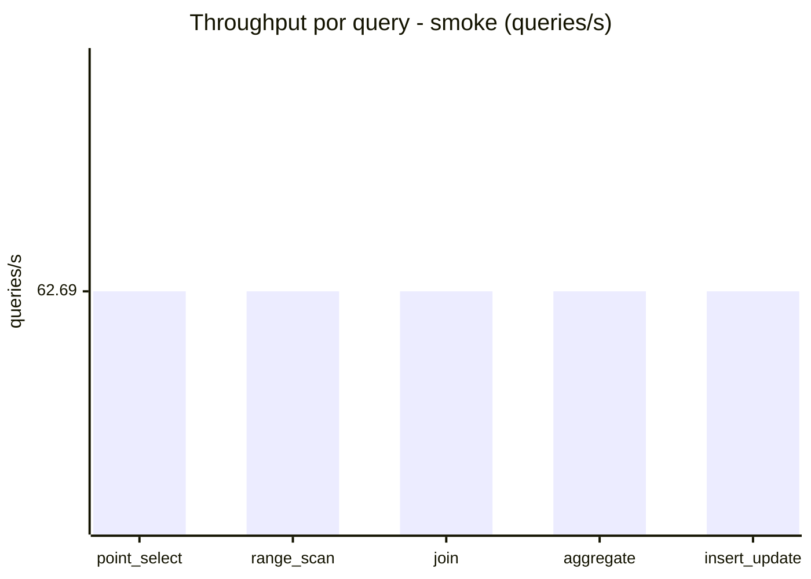
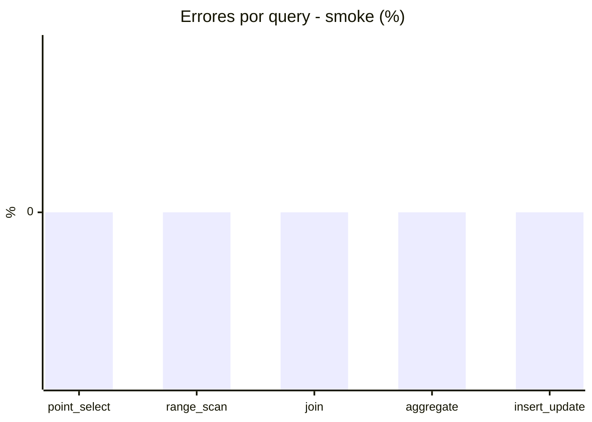

# Reporte de performance - SQL Server (k6)

**Fecha:** 2026-09-04 16:56 UTC  
**Veredicto (SLO):** `WARN`  
**Corrida:** [ver en GitHub Actions](https://github.com/lrbg/k6-sqlserver-lab/actions/runs/33897670819)  

## Analisis del agente de IA

WARN (fallback por umbrales)

- Error maximo: 0.01%
- p95 maximo: 248 ms

## Resultados

### Escenario: `load`

| Metrica | Valor |
| --- | --- |
| Queries ejecutadas | 20695 |
| Errores | 3 (0.01%) |
| Latencia media | 58 ms |
| p50 / p90 / p95 / p99 | 18 / 218 / 248 / 294 ms |
| Min / Max | 0 / 352 ms |
| Throughput | 344.2 queries/s |
| Duracion | 60.1 s |

Detalle por query

| Query | Ejecuciones | Error % | avg | p95 | p99 | q/s |
| --- | --- | --- | --- | --- | --- | --- |
| point_select | 4139 | 0% | 5.7 | 16 | 20 | 68.84 |
| range_scan | 4139 | 0% | 24.5 | 54 | 72 | 68.84 |
| join | 4139 | 0% | 8.4 | 17 | 21 | 68.84 |
| aggregate | 4139 | 0% | 215 | 294 | 312 | 68.84 |
| insert_update | 4139 | 0.07% | 36.6 | 75 | 96 | 68.84 |

### Escenario: `smoke`

| Metrica | Valor |
| --- | --- |
| Queries ejecutadas | 9415 |
| Errores | 0 (0%) |
| Latencia media | 9.5 ms |
| p50 / p90 / p95 / p99 | 2 / 46 / 48 / 49 ms |
| Min / Max | 0 / 76 ms |
| Throughput | 313.45 queries/s |
| Duracion | 30 s |

Detalle por query

| Query | Ejecuciones | Error % | avg | p95 | p99 | q/s |
| --- | --- | --- | --- | --- | --- | --- |
| point_select | 1883 | 0% | 0.6 | 1 | 2 | 62.69 |
| range_scan | 1883 | 0% | 2.8 | 4 | 10 | 62.69 |
| join | 1883 | 0% | 0.9 | 1 | 2.2 | 62.69 |
| aggregate | 1883 | 0% | 40.4 | 49 | 51 | 62.69 |
| insert_update | 1883 | 0% | 3 | 5 | 13 | 62.69 |

