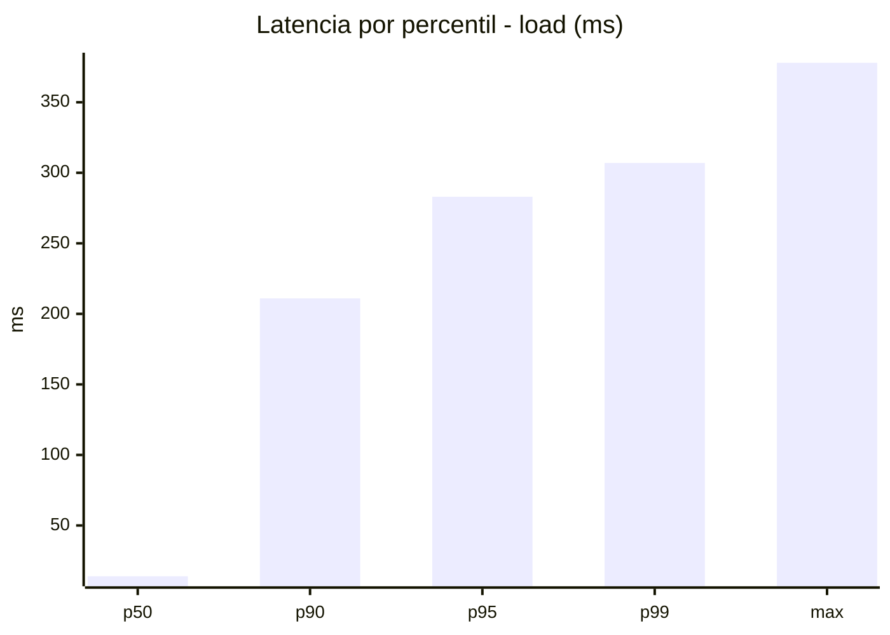
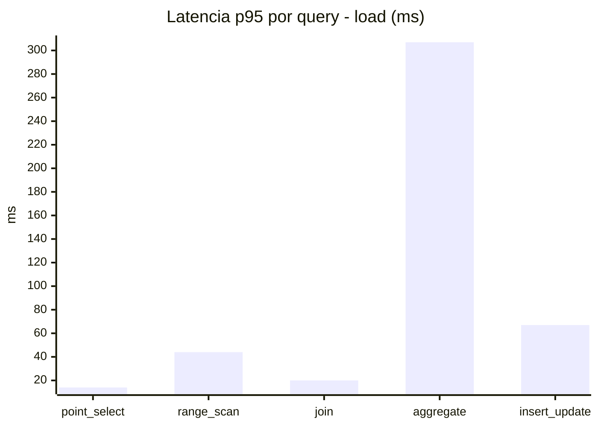
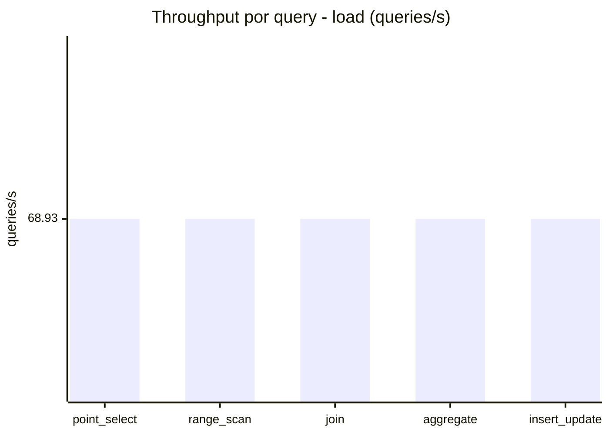
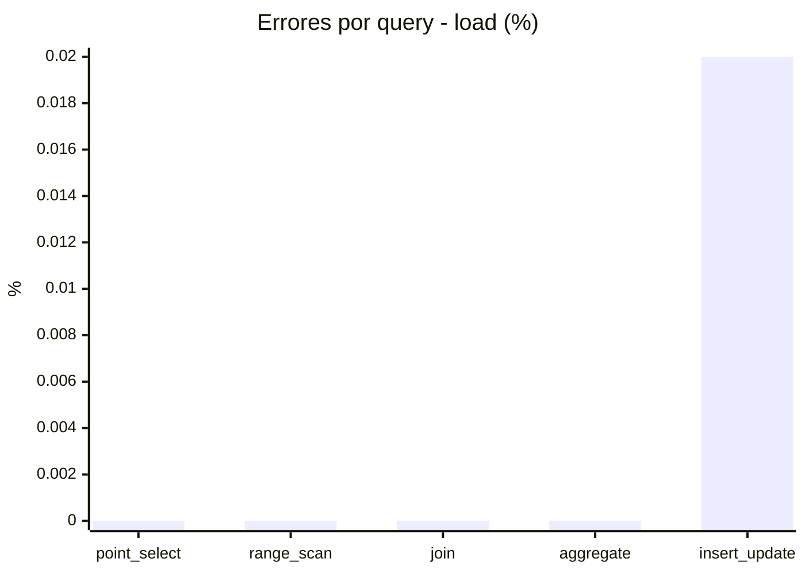
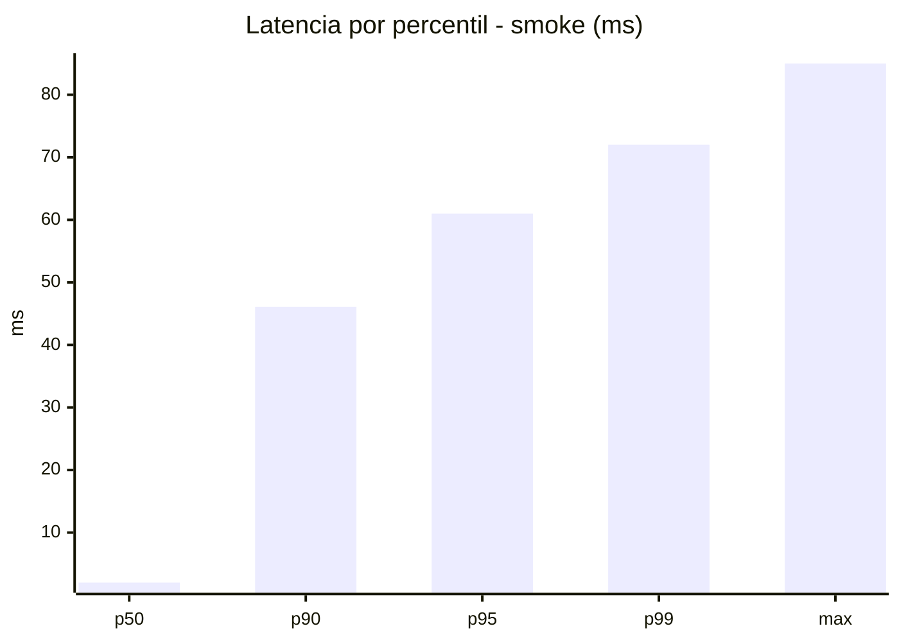
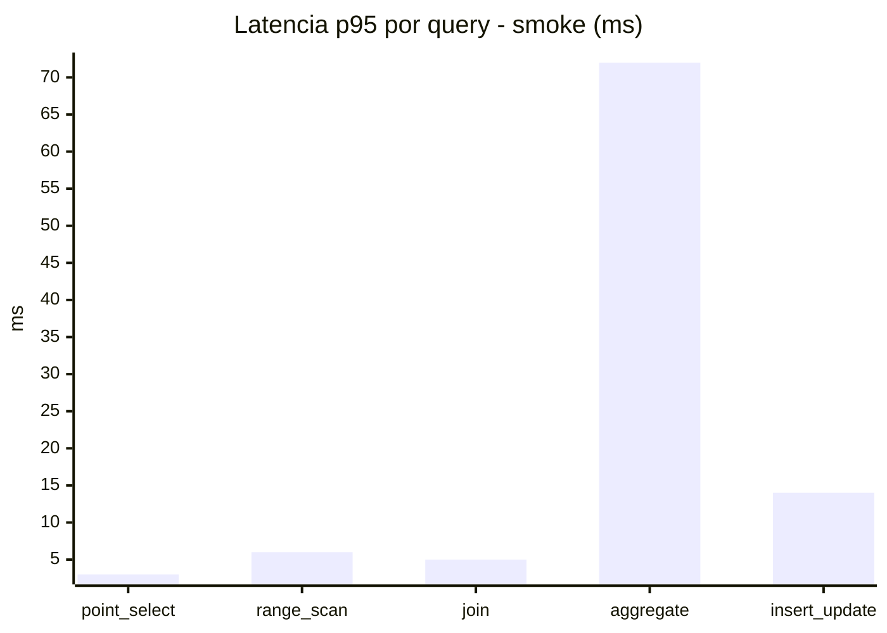
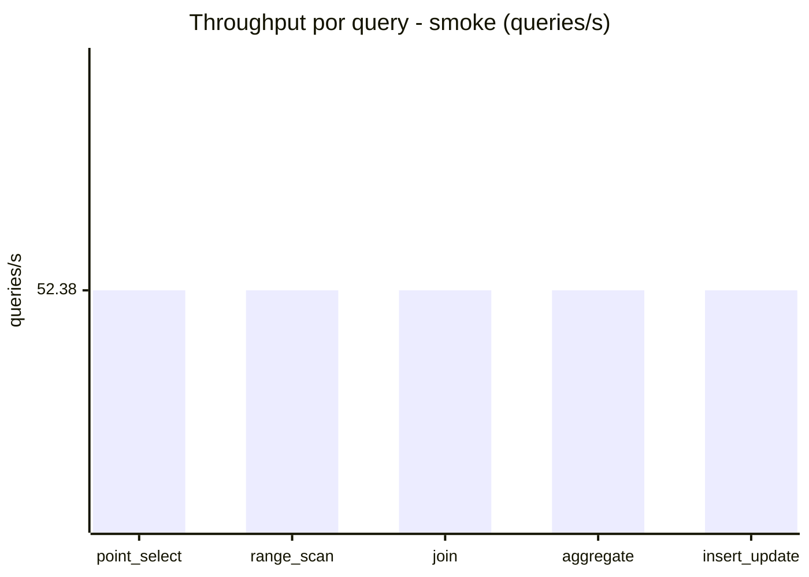
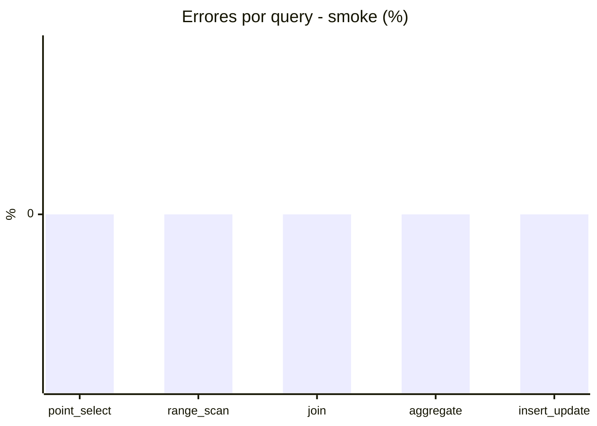

# Reporte de performance - SQL Server (k6)

**Fecha:** 2026-09-05 16:10 UTC  
**Veredicto (SLO):** `WARN`  
**Corrida:** [ver en GitHub Actions](https://github.com/lrbg/k6-sqlserver-lab/actions/runs/33976925845)  

## Analisis del agente de IA

WARN (fallback por umbrales)

- Error maximo: 0%
- p95 maximo: 283 ms

## Resultados

### Escenario: `load`

| Metrica | Valor |
| --- | --- |
| Queries ejecutadas | 20740 |
| Errores | 1 (0%) |
| Latencia media | 58 ms |
| p50 / p90 / p95 / p99 | 14 / 211 / 283 / 307 ms |
| Min / Max | 0 / 378 ms |
| Throughput | 344.65 queries/s |
| Duracion | 60.2 s |

Detalle por query

| Query | Ejecuciones | Error % | avg | p95 | p99 | q/s |
| --- | --- | --- | --- | --- | --- | --- |
| point_select | 4148 | 0% | 5.2 | 14 | 21 | 68.93 |
| range_scan | 4148 | 0% | 19 | 44 | 64 | 68.93 |
| join | 4148 | 0% | 8.4 | 20 | 22 | 68.93 |
| aggregate | 4148 | 0% | 228.1 | 307 | 321 | 68.93 |
| insert_update | 4148 | 0.02% | 29.1 | 67 | 89 | 68.93 |

### Escenario: `smoke`

| Metrica | Valor |
| --- | --- |
| Queries ejecutadas | 7870 |
| Errores | 0 (0%) |
| Latencia media | 11.4 ms |
| p50 / p90 / p95 / p99 | 2 / 46.1 / 61 / 72 ms |
| Min / Max | 0 / 85 ms |
| Throughput | 261.92 queries/s |
| Duracion | 30 s |

Detalle por query

| Query | Ejecuciones | Error % | avg | p95 | p99 | q/s |
| --- | --- | --- | --- | --- | --- | --- |
| point_select | 1574 | 0% | 0.8 | 3 | 5 | 52.38 |
| range_scan | 1574 | 0% | 2.9 | 6 | 10 | 52.38 |
| join | 1574 | 0% | 1.5 | 5 | 5 | 52.38 |
| aggregate | 1574 | 0% | 47.6 | 72 | 77 | 52.38 |
| insert_update | 1574 | 0% | 4.4 | 14 | 22 | 52.38 |

