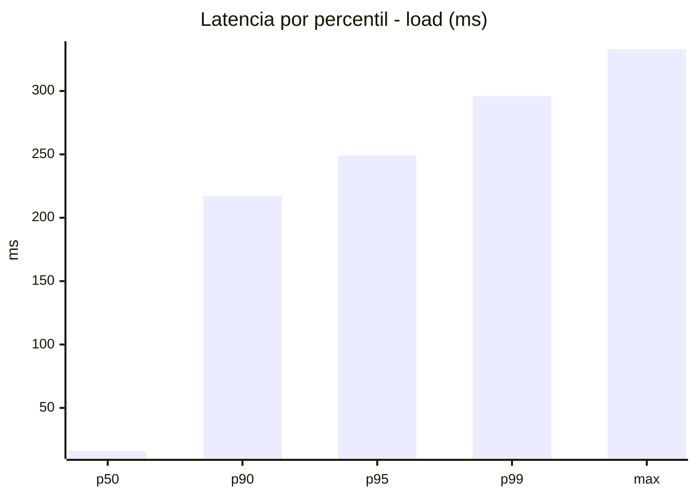
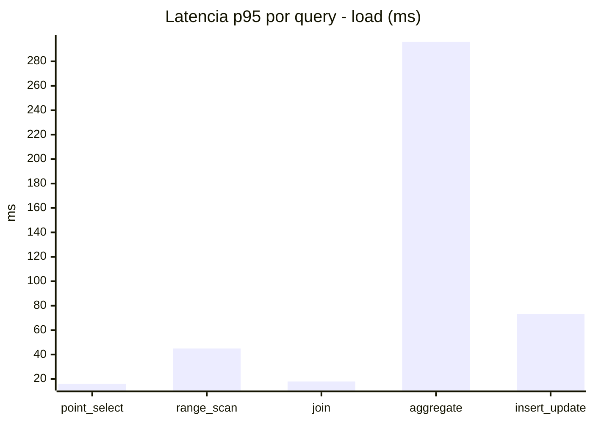
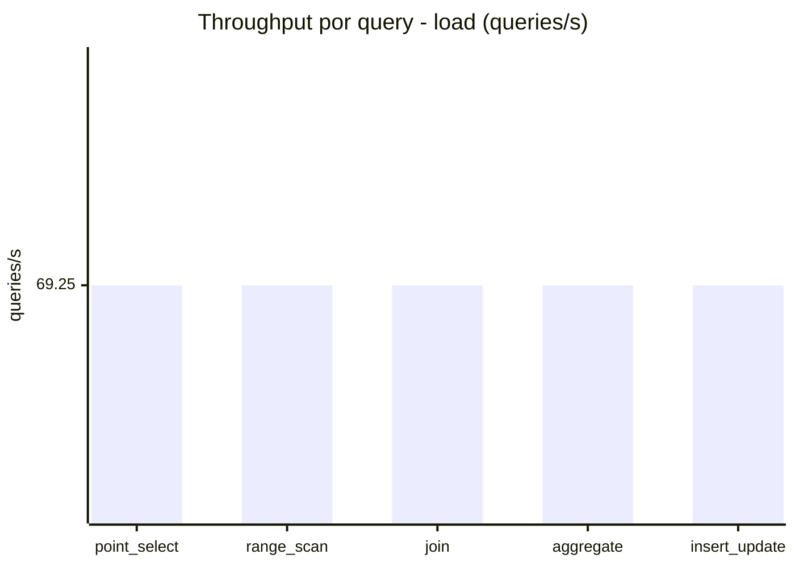
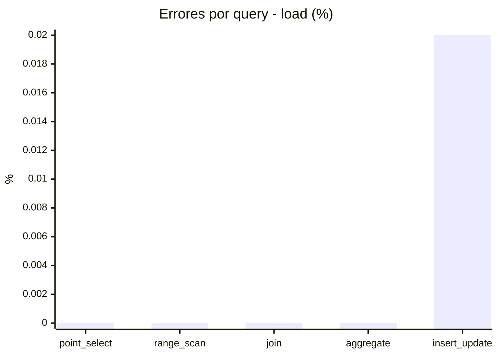
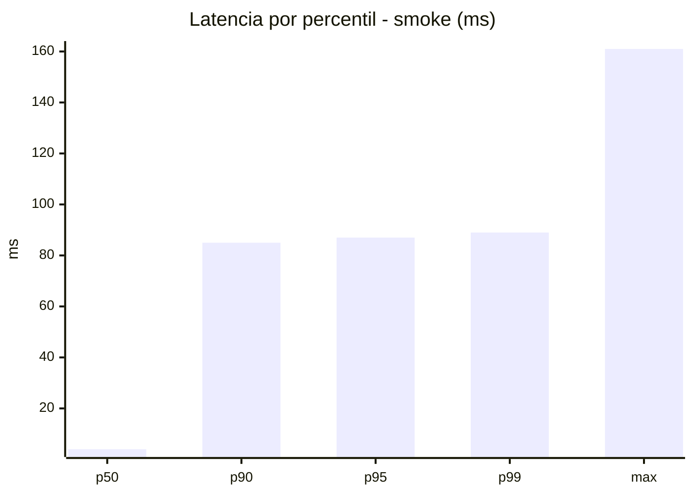
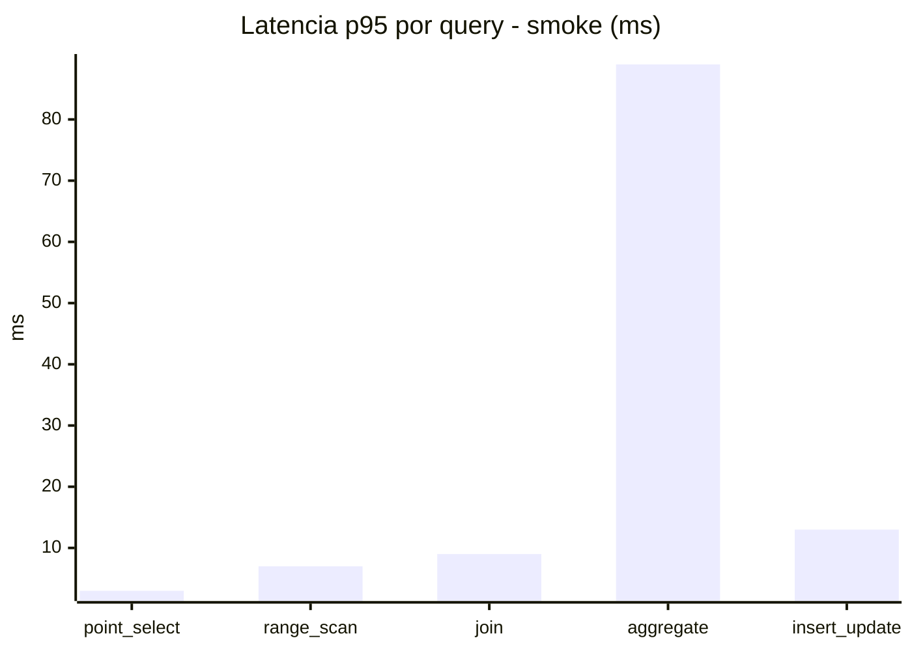
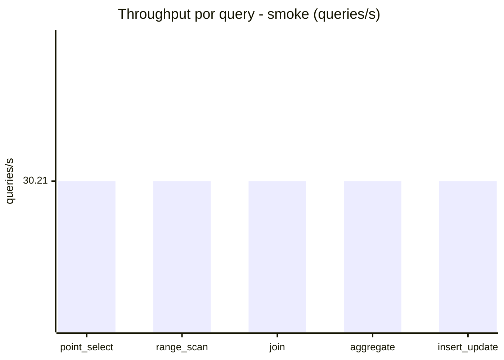
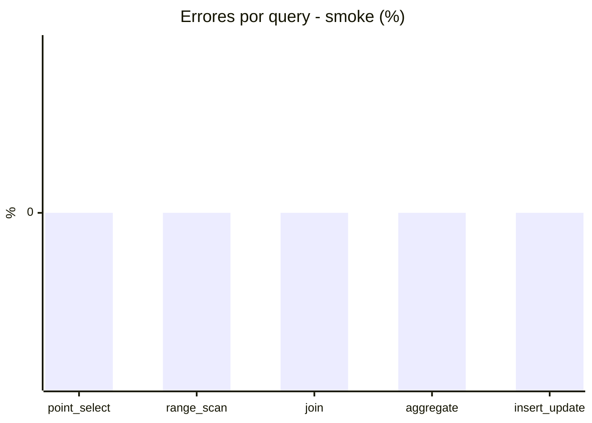

# Reporte de performance - SQL Server (k6)

**Fecha:** 2026-09-06 16:22 UTC  
**Veredicto (SLO):** `WARN`  
**Corrida:** [ver en GitHub Actions](https://github.com/lrbg/k6-sqlserver-lab/actions/runs/34045118511)  

## Analisis del agente de IA

WARN (fallback por umbrales)

- Error maximo: 0%
- p95 maximo: 249 ms

## Resultados

### Escenario: `load`

| Metrica | Valor |
| --- | --- |
| Queries ejecutadas | 20820 |
| Errores | 1 (0%) |
| Latencia media | 57.7 ms |
| p50 / p90 / p95 / p99 | 16 / 217 / 249 / 296 ms |
| Min / Max | 0 / 333 ms |
| Throughput | 346.27 queries/s |
| Duracion | 60.1 s |

Detalle por query

| Query | Ejecuciones | Error % | avg | p95 | p99 | q/s |
| --- | --- | --- | --- | --- | --- | --- |
| point_select | 4164 | 0% | 6.5 | 16 | 20 | 69.25 |
| range_scan | 4164 | 0% | 20.7 | 45 | 60 | 69.25 |
| join | 4164 | 0% | 8.8 | 18 | 21 | 69.25 |
| aggregate | 4164 | 0% | 218.3 | 296 | 310.4 | 69.25 |
| insert_update | 4164 | 0.02% | 34.2 | 73 | 89 | 69.25 |

### Escenario: `smoke`

| Metrica | Valor |
| --- | --- |
| Queries ejecutadas | 4545 |
| Errores | 0 (0%) |
| Latencia media | 19.8 ms |
| p50 / p90 / p95 / p99 | 4 / 85 / 87 / 89 ms |
| Min / Max | 0 / 161 ms |
| Throughput | 151.07 queries/s |
| Duracion | 30.1 s |

Detalle por query

| Query | Ejecuciones | Error % | avg | p95 | p99 | q/s |
| --- | --- | --- | --- | --- | --- | --- |
| point_select | 909 | 0% | 1.1 | 3 | 4 | 30.21 |
| range_scan | 909 | 0% | 3.8 | 7 | 11 | 30.21 |
| join | 909 | 0% | 3.6 | 9 | 9 | 30.21 |
| aggregate | 909 | 0% | 84.7 | 89 | 95.9 | 30.21 |
| insert_update | 909 | 0% | 6.1 | 13 | 16 | 30.21 |

