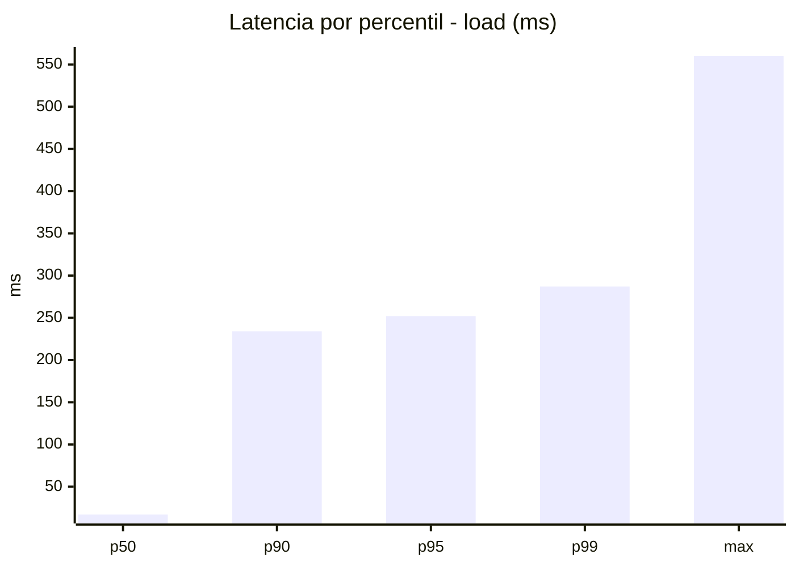
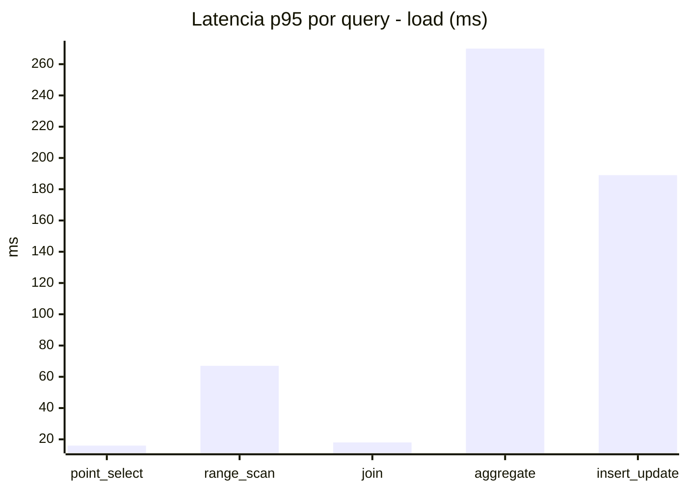
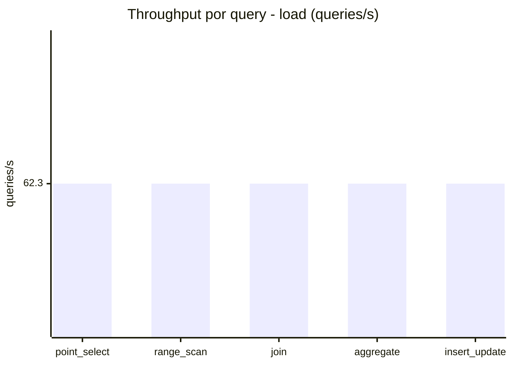
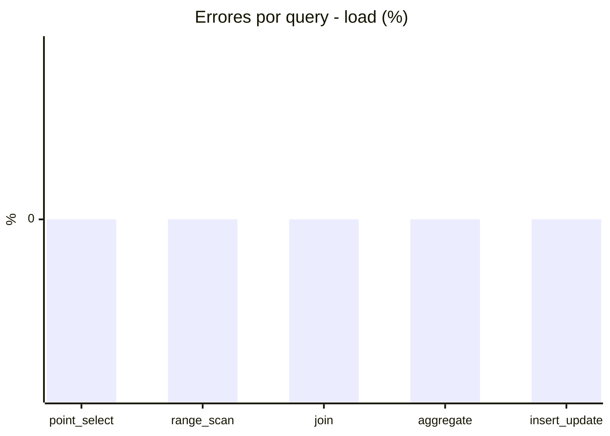
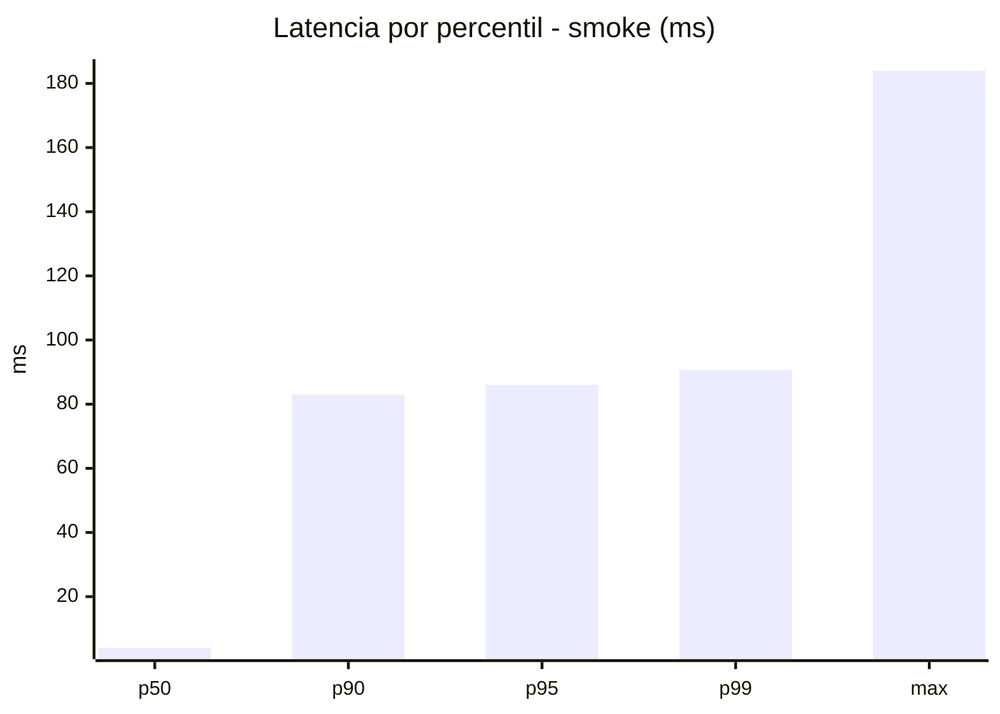
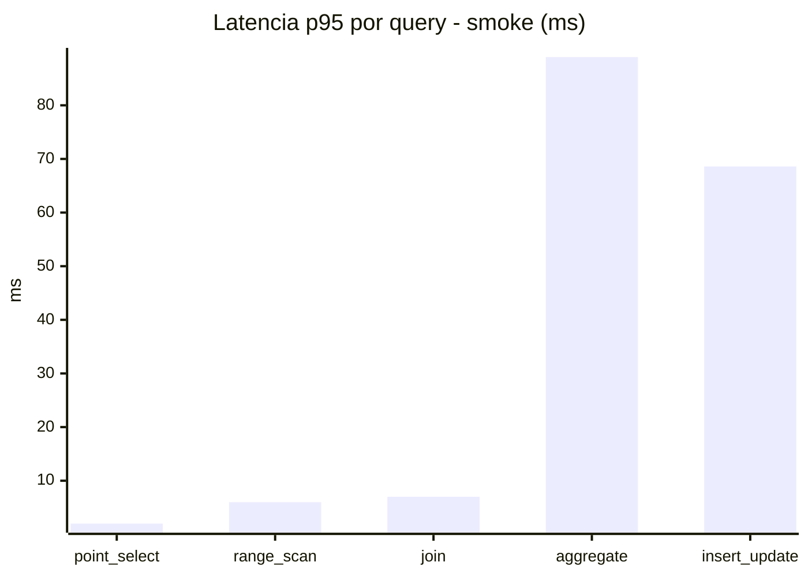
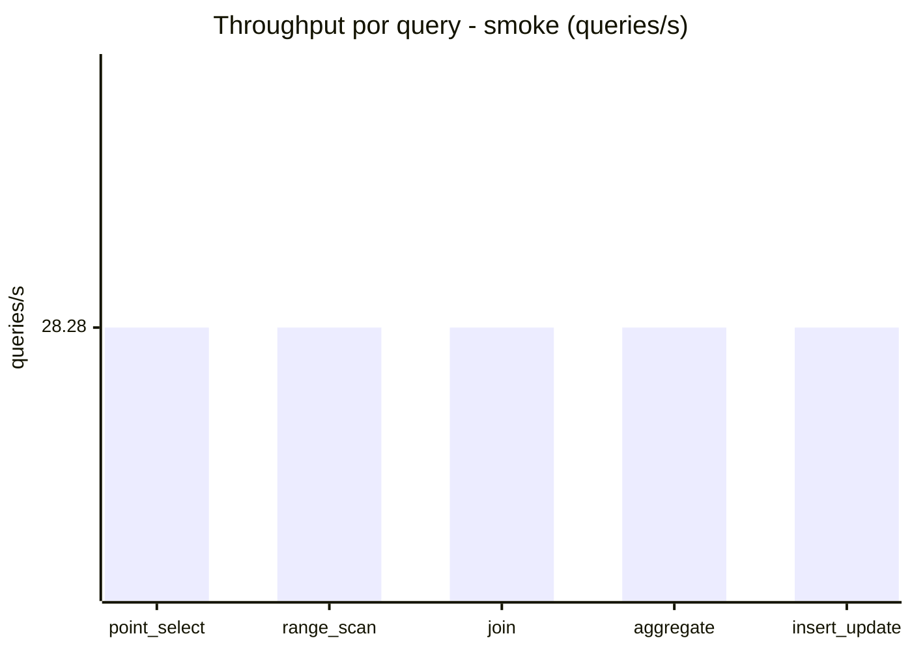
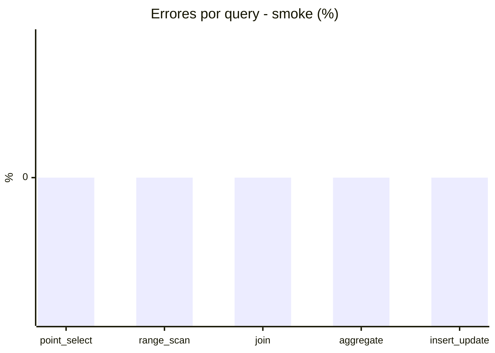

# Reporte de performance - SQL Server (k6)

**Fecha:** 2026-09-07 18:19 UTC  
**Veredicto (SLO):** `WARN`  
**Corrida:** [ver en GitHub Actions](https://github.com/lrbg/k6-sqlserver-lab/actions/runs/34151029183)  

## Analisis del agente de IA

WARN (fallback por umbrales)

- Error maximo: 0%
- p95 maximo: 252 ms

## Resultados

### Escenario: `load`

| Metrica | Valor |
| --- | --- |
| Queries ejecutadas | 18745 |
| Errores | 0 (0%) |
| Latencia media | 64.1 ms |
| p50 / p90 / p95 / p99 | 17 / 234 / 252 / 287 ms |
| Min / Max | 0 / 560 ms |
| Throughput | 311.5 queries/s |
| Duracion | 60.2 s |

Detalle por query

| Query | Ejecuciones | Error % | avg | p95 | p99 | q/s |
| --- | --- | --- | --- | --- | --- | --- |
| point_select | 3749 | 0% | 5.1 | 16 | 21 | 62.3 |
| range_scan | 3749 | 0% | 27.5 | 67 | 194 | 62.3 |
| join | 3749 | 0% | 8.4 | 18 | 22 | 62.3 |
| aggregate | 3749 | 0% | 220 | 270 | 305 | 62.3 |
| insert_update | 3749 | 0% | 59.6 | 189 | 461 | 62.3 |

### Escenario: `smoke`

| Metrica | Valor |
| --- | --- |
| Queries ejecutadas | 4245 |
| Errores | 0 (0%) |
| Latencia media | 21.2 ms |
| p50 / p90 / p95 / p99 | 4 / 83 / 86 / 90.6 ms |
| Min / Max | 0 / 184 ms |
| Throughput | 141.38 queries/s |
| Duracion | 30 s |

Detalle por query

| Query | Ejecuciones | Error % | avg | p95 | p99 | q/s |
| --- | --- | --- | --- | --- | --- | --- |
| point_select | 849 | 0% | 0.9 | 2 | 6.6 | 28.28 |
| range_scan | 849 | 0% | 4.1 | 6 | 11 | 28.28 |
| join | 849 | 0% | 3.2 | 7 | 9 | 28.28 |
| aggregate | 849 | 0% | 82.7 | 89 | 91 | 28.28 |
| insert_update | 849 | 0% | 15 | 68.6 | 143.5 | 28.28 |

