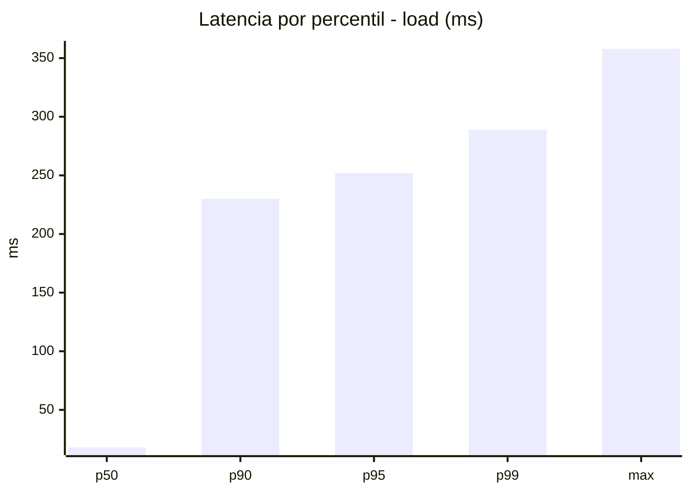
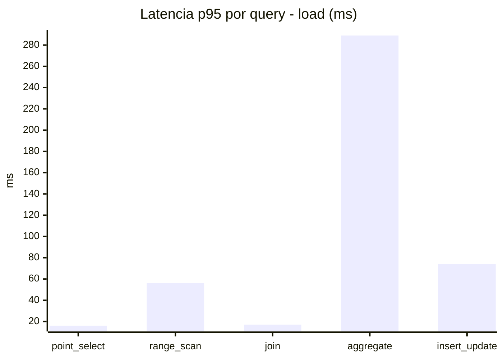
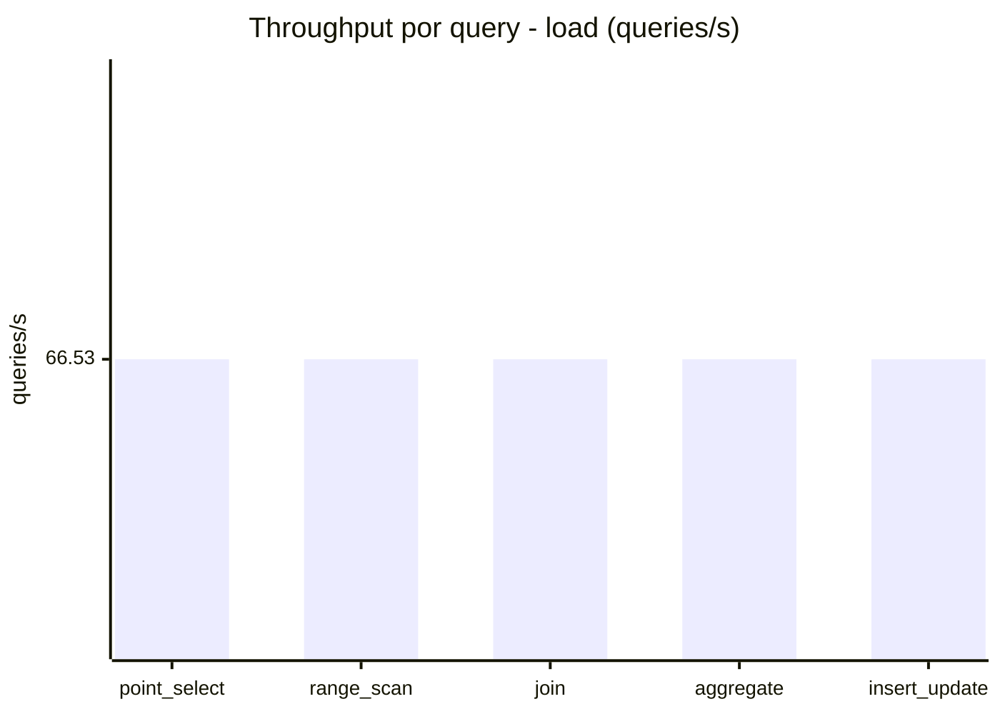
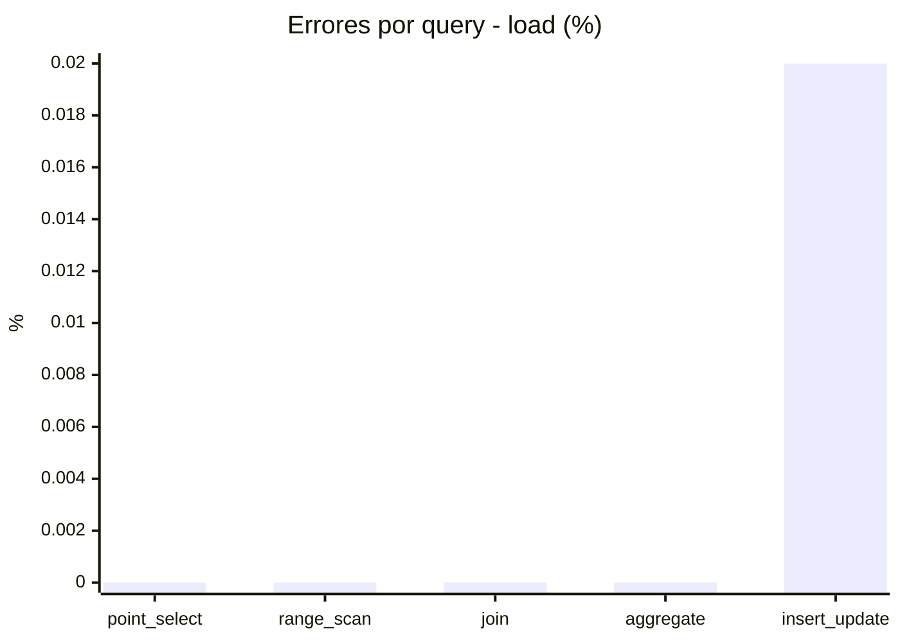
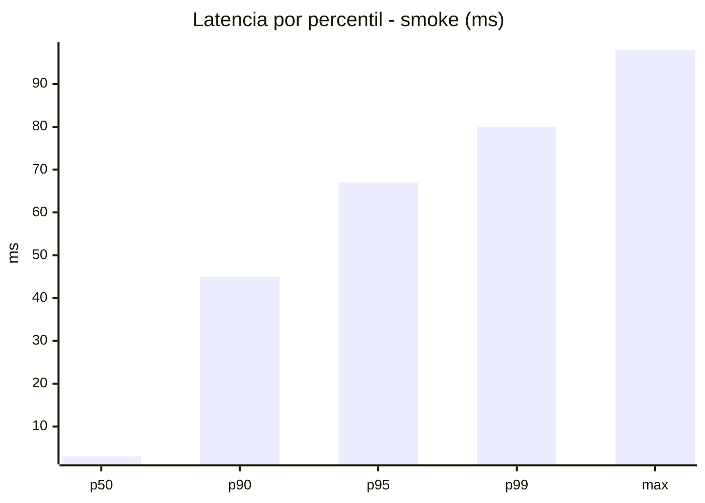
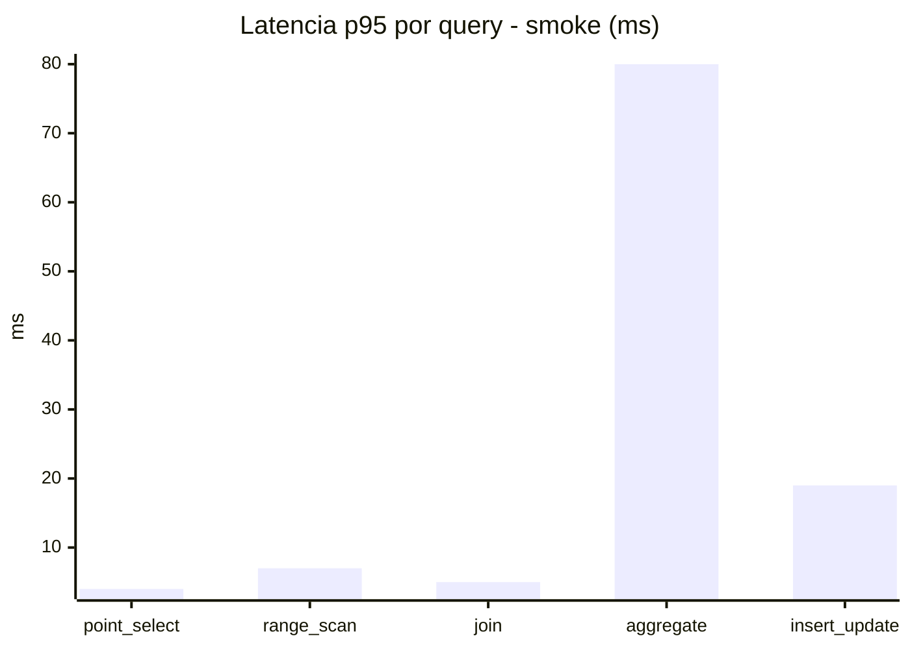
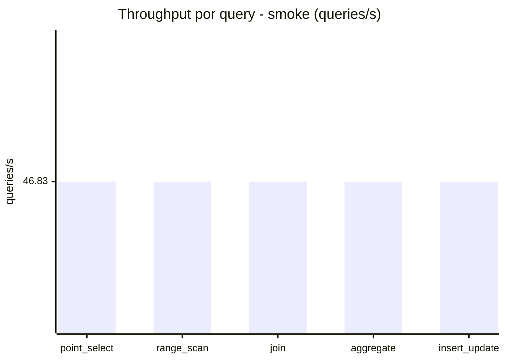
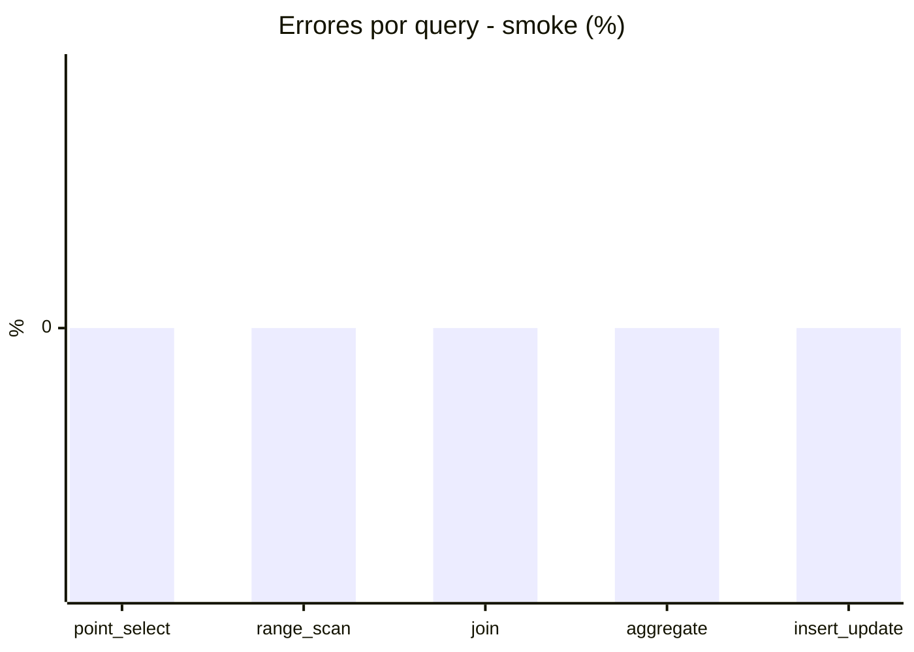

# Reporte de performance - SQL Server (k6)

**Fecha:** 2026-09-08 17:20 UTC  
**Veredicto (SLO):** `WARN`  
**Corrida:** [ver en GitHub Actions](https://github.com/lrbg/k6-sqlserver-lab/actions/runs/34256240658)  

## Analisis del agente de IA

WARN (fallback por umbrales)

- Error maximo: 0%
- p95 maximo: 252 ms

## Resultados

### Escenario: `load`

| Metrica | Valor |
| --- | --- |
| Queries ejecutadas | 20025 |
| Errores | 1 (0%) |
| Latencia media | 60 ms |
| p50 / p90 / p95 / p99 | 18 / 230 / 252 / 289 ms |
| Min / Max | 0 / 358 ms |
| Throughput | 332.64 queries/s |
| Duracion | 60.2 s |

Detalle por query

| Query | Ejecuciones | Error % | avg | p95 | p99 | q/s |
| --- | --- | --- | --- | --- | --- | --- |
| point_select | 4005 | 0% | 6 | 16 | 20 | 66.53 |
| range_scan | 4005 | 0% | 25.6 | 56 | 76 | 66.53 |
| join | 4005 | 0% | 8.7 | 17 | 21 | 66.53 |
| aggregate | 4005 | 0% | 222.8 | 289 | 313 | 66.53 |
| insert_update | 4005 | 0.02% | 37.2 | 74 | 91 | 66.53 |

### Escenario: `smoke`

| Metrica | Valor |
| --- | --- |
| Queries ejecutadas | 7030 |
| Errores | 0 (0%) |
| Latencia media | 12.8 ms |
| p50 / p90 / p95 / p99 | 3 / 45 / 67 / 80 ms |
| Min / Max | 0 / 98 ms |
| Throughput | 234.15 queries/s |
| Duracion | 30 s |

Detalle por query

| Query | Ejecuciones | Error % | avg | p95 | p99 | q/s |
| --- | --- | --- | --- | --- | --- | --- |
| point_select | 1406 | 0% | 1 | 4 | 5 | 46.83 |
| range_scan | 1406 | 0% | 3.4 | 7 | 11 | 46.83 |
| join | 1406 | 0% | 1.8 | 5 | 5 | 46.83 |
| aggregate | 1406 | 0% | 51.9 | 80 | 85 | 46.83 |
| insert_update | 1406 | 0% | 5.8 | 19 | 25 | 46.83 |

