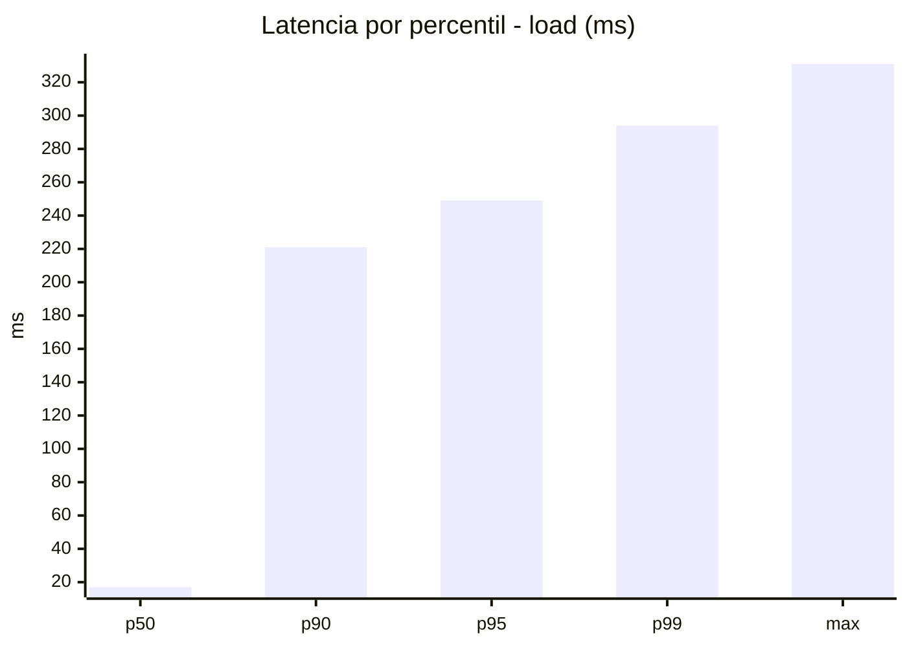
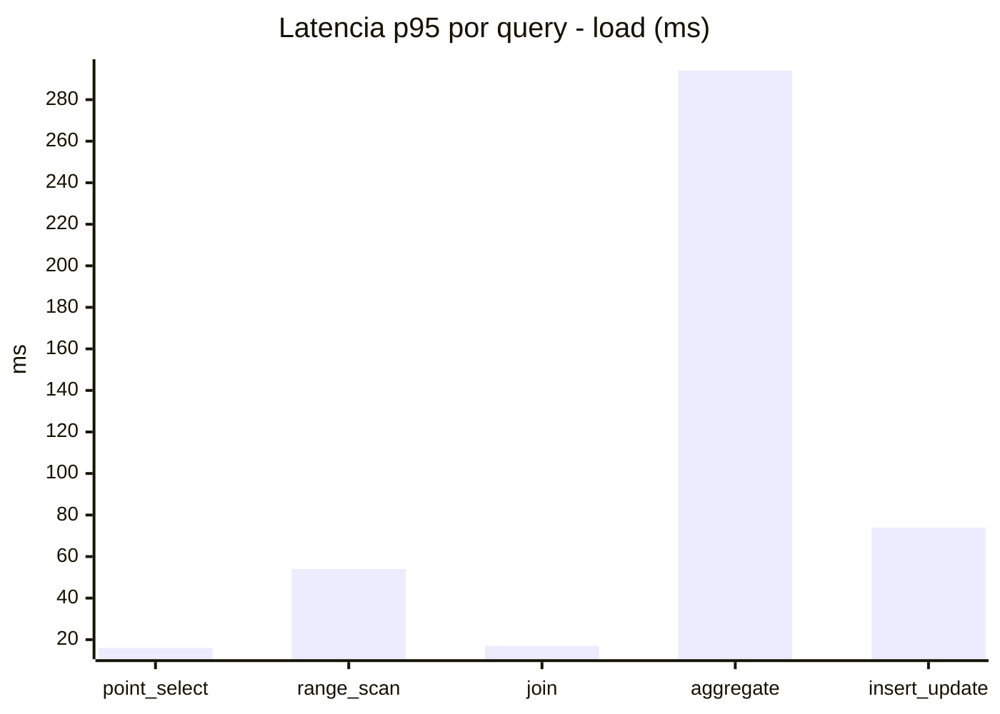
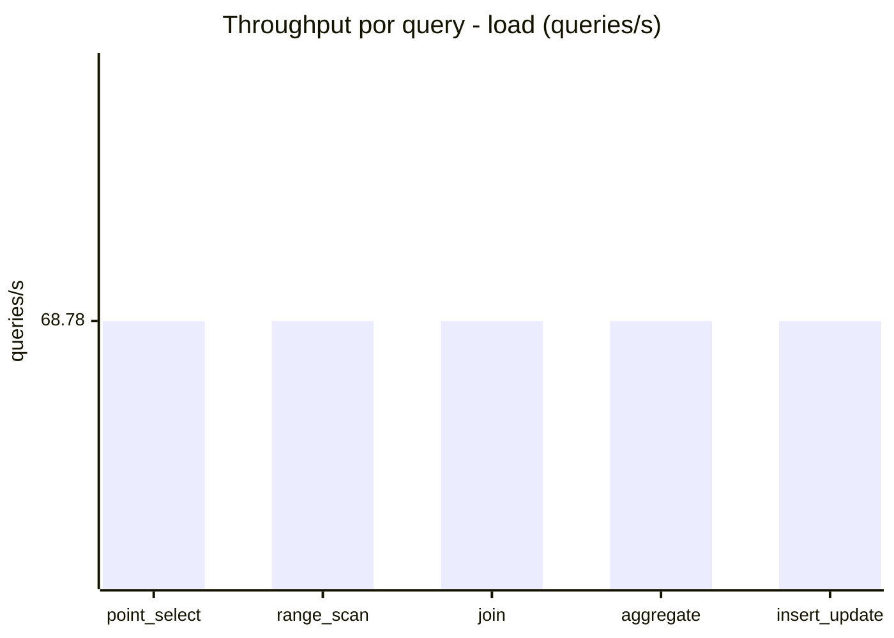
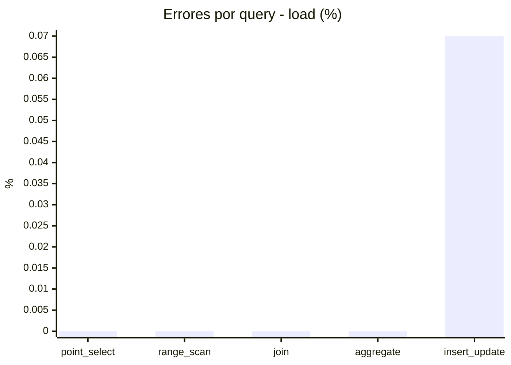
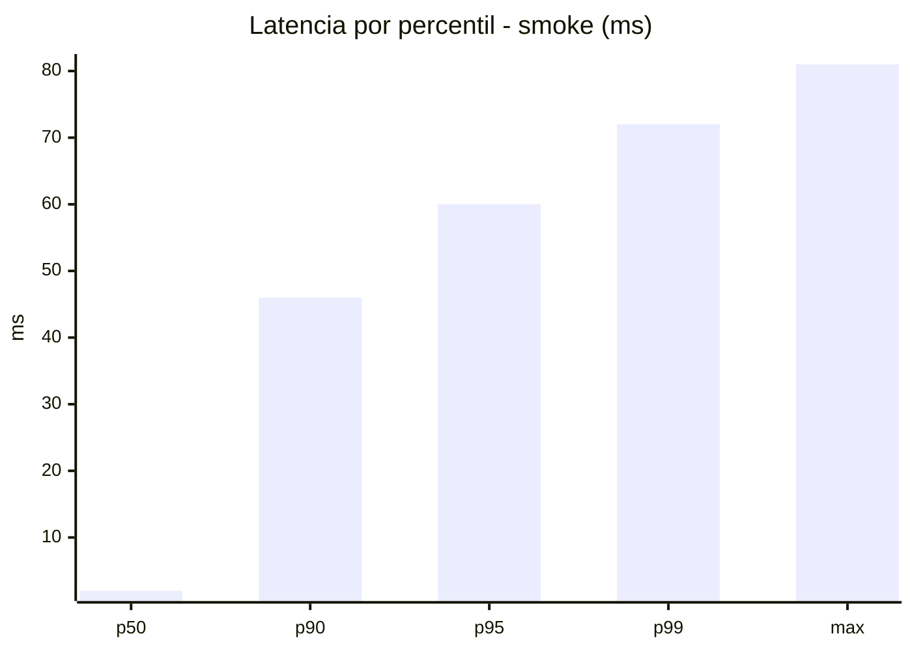
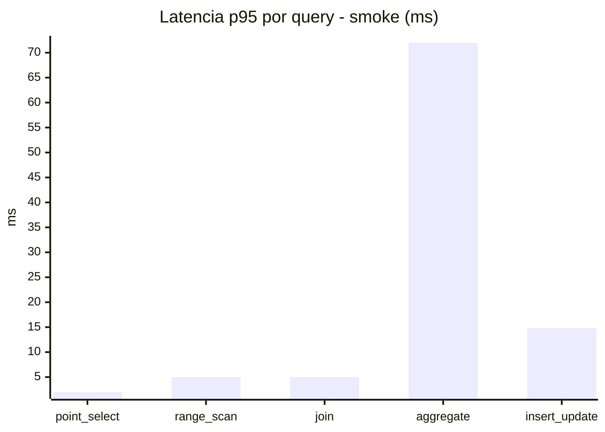
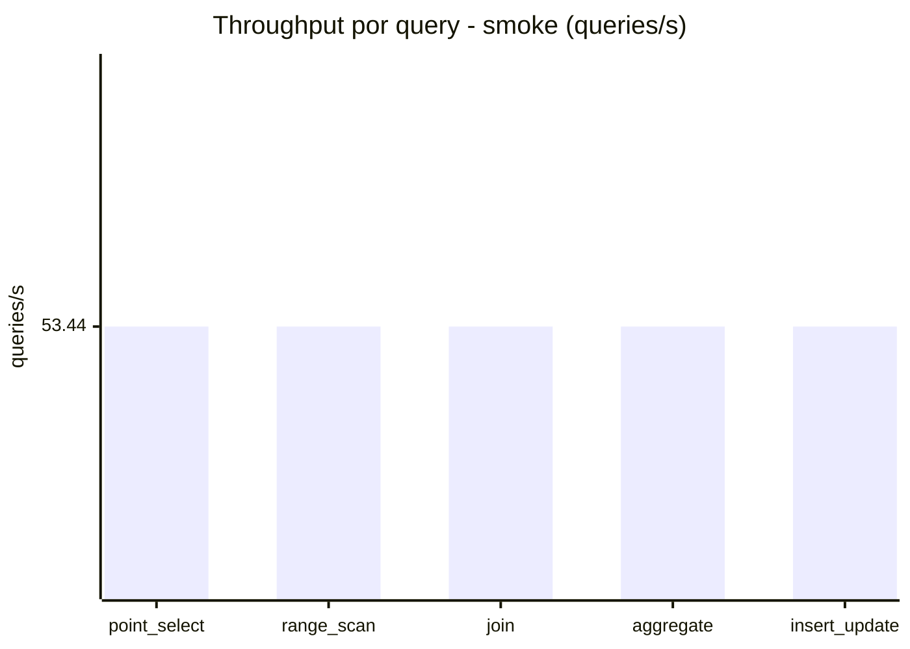
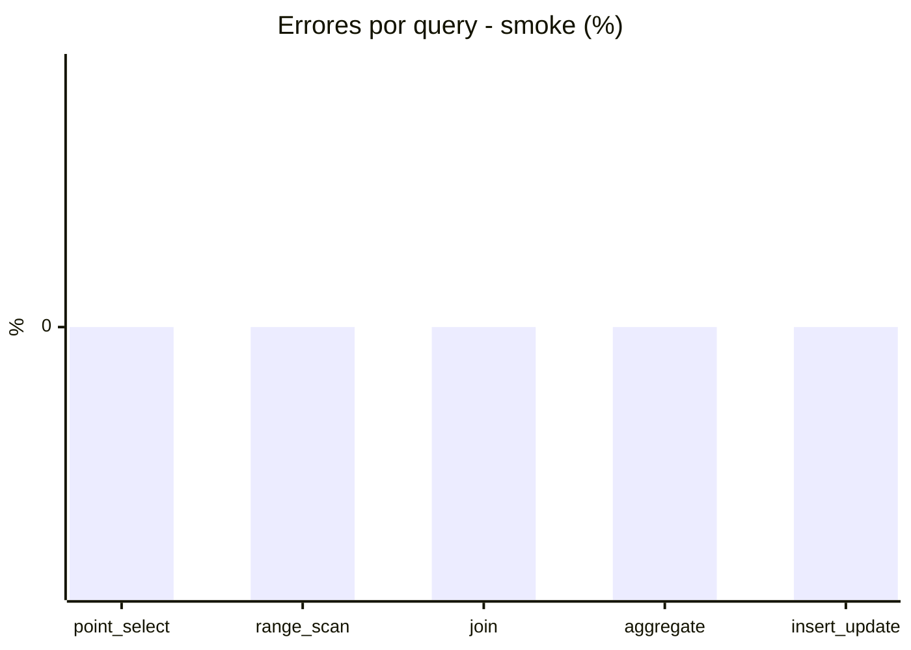

# Reporte de performance - SQL Server (k6)

**Fecha:** 2026-09-09 17:13 UTC  
**Veredicto (SLO):** `WARN`  
**Corrida:** [ver en GitHub Actions](https://github.com/lrbg/k6-sqlserver-lab/actions/runs/34381378993)  

## Analisis del agente de IA

WARN (fallback por umbrales)

- Error maximo: 0.01%
- p95 maximo: 249 ms

## Resultados

### Escenario: `load`

| Metrica | Valor |
| --- | --- |
| Queries ejecutadas | 20695 |
| Errores | 3 (0.01%) |
| Latencia media | 58 ms |
| p50 / p90 / p95 / p99 | 17 / 221 / 249 / 294 ms |
| Min / Max | 0 / 331 ms |
| Throughput | 343.89 queries/s |
| Duracion | 60.2 s |

Detalle por query

| Query | Ejecuciones | Error % | avg | p95 | p99 | q/s |
| --- | --- | --- | --- | --- | --- | --- |
| point_select | 4139 | 0% | 5.6 | 16 | 20 | 68.78 |
| range_scan | 4139 | 0% | 24.1 | 54 | 71 | 68.78 |
| join | 4139 | 0% | 8.4 | 17 | 21 | 68.78 |
| aggregate | 4139 | 0% | 216.3 | 294 | 310 | 68.78 |
| insert_update | 4139 | 0.07% | 35.9 | 74 | 94 | 68.78 |

### Escenario: `smoke`

| Metrica | Valor |
| --- | --- |
| Queries ejecutadas | 8020 |
| Errores | 0 (0%) |
| Latencia media | 11.2 ms |
| p50 / p90 / p95 / p99 | 2 / 46 / 60 / 72 ms |
| Min / Max | 0 / 81 ms |
| Throughput | 267.2 queries/s |
| Duracion | 30 s |

Detalle por query

| Query | Ejecuciones | Error % | avg | p95 | p99 | q/s |
| --- | --- | --- | --- | --- | --- | --- |
| point_select | 1604 | 0% | 0.7 | 2 | 5 | 53.44 |
| range_scan | 1604 | 0% | 2.9 | 5 | 8 | 53.44 |
| join | 1604 | 0% | 1.4 | 5 | 5 | 53.44 |
| aggregate | 1604 | 0% | 46.7 | 72 | 76 | 53.44 |
| insert_update | 1604 | 0% | 4.3 | 14.8 | 23 | 53.44 |

